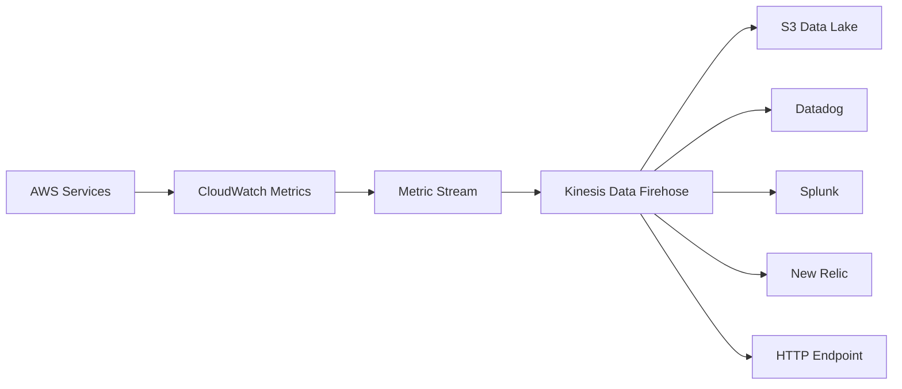

# How to Use CloudWatch Metric Streams for Real-Time Export

Author: [nawazdhandala](https://github.com/nawazdhandala)

Tags: AWS, CloudWatch, Metric Streams, Kinesis, Observability

Description: Learn how to set up CloudWatch Metric Streams to continuously export AWS metrics in real time to third-party monitoring tools and data lakes.

---

CloudWatch is great for viewing metrics inside AWS, but what if you need those metrics somewhere else? Maybe you're running Datadog, Splunk, or New Relic as your primary monitoring platform, or you want to build a metrics data lake in S3. Traditionally, you'd poll the CloudWatch API to pull metrics out, but that approach is slow, expensive at scale, and hard to keep up to date.

CloudWatch Metric Streams flip the model around. Instead of pulling metrics out, Metric Streams push them to you continuously via Amazon Kinesis Data Firehose. Metrics arrive within 2-3 minutes of being published, the setup is declarative, and you don't have to manage any polling infrastructure.

## How Metric Streams Work

The architecture is simple:



CloudWatch publishes metrics from all your AWS services as usual. The Metric Stream filters and formats those metrics, then pushes them to a Kinesis Data Firehose delivery stream. Firehose handles the delivery to your destination - whether that's S3, an HTTP endpoint, or a third-party partner integration.

## Setting Up a Basic Metric Stream

Let's walk through the full setup: Firehose delivery stream first, then the Metric Stream.

### Step 1: Create an S3 Bucket for Failed Records

Firehose needs a backup location for failed deliveries:

```bash
# Create an S3 bucket for Firehose backup
aws s3 mb s3://my-metrics-backup-bucket --region us-east-1
```

### Step 2: Create the IAM Role for Firehose

```json
// Trust policy for Firehose
{
  "Version": "2012-10-17",
  "Statement": [
    {
      "Effect": "Allow",
      "Principal": {
        "Service": "firehose.amazonaws.com"
      },
      "Action": "sts:AssumeRole"
    }
  ]
}
```

```json
// Permissions policy for Firehose to write to S3
{
  "Version": "2012-10-17",
  "Statement": [
    {
      "Effect": "Allow",
      "Action": [
        "s3:PutObject",
        "s3:GetBucketLocation",
        "s3:ListBucket"
      ],
      "Resource": [
        "arn:aws:s3:::my-metrics-backup-bucket",
        "arn:aws:s3:::my-metrics-backup-bucket/*"
      ]
    }
  ]
}
```

### Step 3: Create the Firehose Delivery Stream

For sending to S3 (data lake use case):

```bash
# Create a Firehose delivery stream to S3
aws firehose create-delivery-stream \
  --delivery-stream-name cloudwatch-metrics-stream \
  --delivery-stream-type DirectPut \
  --s3-destination-configuration '{
    "RoleARN": "arn:aws:iam::123456789012:role/FirehoseRole",
    "BucketARN": "arn:aws:s3:::my-metrics-data-lake",
    "Prefix": "metrics/year=!{timestamp:yyyy}/month=!{timestamp:MM}/day=!{timestamp:dd}/",
    "ErrorOutputPrefix": "errors/",
    "BufferingHints": {
      "SizeInMBs": 5,
      "IntervalInSeconds": 300
    },
    "CompressionFormat": "GZIP"
  }'
```

For sending to an HTTP endpoint (third-party tool):

```bash
# Create a Firehose delivery stream to an HTTP endpoint
aws firehose create-delivery-stream \
  --delivery-stream-name cloudwatch-to-datadog \
  --delivery-stream-type DirectPut \
  --http-endpoint-destination-configuration '{
    "EndpointConfiguration": {
      "Url": "https://awsmetrics-intake.datadoghq.com/v1/input",
      "AccessKey": "YOUR_DATADOG_API_KEY",
      "Name": "Datadog"
    },
    "RequestConfiguration": {
      "ContentEncoding": "GZIP"
    },
    "S3Configuration": {
      "RoleARN": "arn:aws:iam::123456789012:role/FirehoseRole",
      "BucketARN": "arn:aws:s3:::my-metrics-backup-bucket"
    },
    "RoleARN": "arn:aws:iam::123456789012:role/FirehoseRole",
    "BufferingHints": {
      "SizeInMBs": 4,
      "IntervalInSeconds": 60
    }
  }'
```

### Step 4: Create the IAM Role for Metric Streams

```json
// Trust policy for CloudWatch Metric Streams
{
  "Version": "2012-10-17",
  "Statement": [
    {
      "Effect": "Allow",
      "Principal": {
        "Service": "streams.metrics.cloudwatch.amazonaws.com"
      },
      "Action": "sts:AssumeRole"
    }
  ]
}
```

```json
// Permissions policy - allow Metric Stream to write to Firehose
{
  "Version": "2012-10-17",
  "Statement": [
    {
      "Effect": "Allow",
      "Action": [
        "firehose:PutRecord",
        "firehose:PutRecordBatch"
      ],
      "Resource": "arn:aws:firehose:us-east-1:123456789012:deliverystream/cloudwatch-metrics-stream"
    }
  ]
}
```

### Step 5: Create the Metric Stream

Stream all metrics:

```bash
# Create a Metric Stream that sends all metrics
aws cloudwatch put-metric-stream \
  --name all-metrics-stream \
  --firehose-arn arn:aws:firehose:us-east-1:123456789012:deliverystream/cloudwatch-metrics-stream \
  --role-arn arn:aws:iam::123456789012:role/MetricStreamRole \
  --output-format json
```

Or stream only specific namespaces:

```bash
# Create a Metric Stream with include filters
aws cloudwatch put-metric-stream \
  --name selected-metrics-stream \
  --firehose-arn arn:aws:firehose:us-east-1:123456789012:deliverystream/cloudwatch-metrics-stream \
  --role-arn arn:aws:iam::123456789012:role/MetricStreamRole \
  --output-format json \
  --include-filters '[
    {"Namespace": "AWS/EC2"},
    {"Namespace": "AWS/RDS"},
    {"Namespace": "AWS/ApplicationELB"},
    {"Namespace": "AWS/Lambda"}
  ]'
```

Or exclude specific namespaces:

```bash
# Create a Metric Stream with exclude filters
aws cloudwatch put-metric-stream \
  --name most-metrics-stream \
  --firehose-arn arn:aws:firehose:us-east-1:123456789012:deliverystream/cloudwatch-metrics-stream \
  --role-arn arn:aws:iam::123456789012:role/MetricStreamRole \
  --output-format json \
  --exclude-filters '[
    {"Namespace": "AWS/CloudWatch"},
    {"Namespace": "AWS/Billing"}
  ]'
```

## Output Formats

Metric Streams support two output formats:

### JSON Format

Easier to read and debug:

```json
// Example JSON output from Metric Stream
{
  "metric_stream_name": "all-metrics-stream",
  "account_id": "123456789012",
  "region": "us-east-1",
  "namespace": "AWS/EC2",
  "metric_name": "CPUUtilization",
  "dimensions": {
    "InstanceId": "i-0123456789abcdef0"
  },
  "timestamp": 1707696000000,
  "value": {
    "max": 87.5,
    "min": 12.3,
    "sum": 245.8,
    "count": 5.0
  },
  "unit": "Percent"
}
```

### OpenTelemetry Format

Better for tools that support OTLP natively. Specify it when creating the stream:

```bash
# Use OpenTelemetry 1.0 format
aws cloudwatch put-metric-stream \
  --name otel-metrics-stream \
  --firehose-arn arn:aws:firehose:us-east-1:123456789012:deliverystream/cloudwatch-metrics-stream \
  --role-arn arn:aws:iam::123456789012:role/MetricStreamRole \
  --output-format opentelemetry1.0
```

## CloudFormation Template

Here's a complete setup in CloudFormation:

```yaml
# CloudFormation for Metric Stream with Firehose to S3
AWSTemplateFormatVersion: '2010-09-09'

Resources:
  MetricsBucket:
    Type: AWS::S3::Bucket
    Properties:
      BucketName: !Sub '${AWS::AccountId}-metrics-lake'

  FirehoseRole:
    Type: AWS::IAM::Role
    Properties:
      AssumeRolePolicyDocument:
        Version: '2012-10-17'
        Statement:
          - Effect: Allow
            Principal:
              Service: firehose.amazonaws.com
            Action: sts:AssumeRole
      Policies:
        - PolicyName: S3Access
          PolicyDocument:
            Version: '2012-10-17'
            Statement:
              - Effect: Allow
                Action: [s3:PutObject, s3:GetBucketLocation]
                Resource:
                  - !GetAtt MetricsBucket.Arn
                  - !Sub '${MetricsBucket.Arn}/*'

  MetricStreamRole:
    Type: AWS::IAM::Role
    Properties:
      AssumeRolePolicyDocument:
        Version: '2012-10-17'
        Statement:
          - Effect: Allow
            Principal:
              Service: streams.metrics.cloudwatch.amazonaws.com
            Action: sts:AssumeRole
      Policies:
        - PolicyName: FirehoseAccess
          PolicyDocument:
            Version: '2012-10-17'
            Statement:
              - Effect: Allow
                Action: [firehose:PutRecord, firehose:PutRecordBatch]
                Resource: !GetAtt DeliveryStream.Arn

  DeliveryStream:
    Type: AWS::KinesisFirehose::DeliveryStream
    Properties:
      DeliveryStreamName: cloudwatch-metric-stream
      DeliveryStreamType: DirectPut
      S3DestinationConfiguration:
        BucketARN: !GetAtt MetricsBucket.Arn
        RoleARN: !GetAtt FirehoseRole.Arn
        Prefix: 'metrics/'
        BufferingHints:
          IntervalInSeconds: 300
          SizeInMBs: 5
        CompressionFormat: GZIP

  MetricStream:
    Type: AWS::CloudWatch::MetricStream
    Properties:
      Name: production-metrics
      FirehoseArn: !GetAtt DeliveryStream.Arn
      RoleArn: !GetAtt MetricStreamRole.Arn
      OutputFormat: json
      IncludeFilters:
        - Namespace: AWS/EC2
        - Namespace: AWS/RDS
        - Namespace: AWS/ApplicationELB
        - Namespace: AWS/Lambda
```

## Metric Stream with Additional Statistics

By default, Metric Streams send min, max, sum, and count. You can request additional statistics like percentiles:

```bash
# Create a stream with additional statistics
aws cloudwatch put-metric-stream \
  --name detailed-metrics-stream \
  --firehose-arn arn:aws:firehose:us-east-1:123456789012:deliverystream/cloudwatch-metrics-stream \
  --role-arn arn:aws:iam::123456789012:role/MetricStreamRole \
  --output-format json \
  --statistics-configurations '[
    {
      "IncludeMetrics": [
        {
          "Namespace": "AWS/ApplicationELB",
          "MetricName": "TargetResponseTime"
        }
      ],
      "AdditionalStatistics": ["p50", "p90", "p99"]
    }
  ]'
```

## Managing Metric Streams

Check your stream status:

```bash
# List all metric streams
aws cloudwatch list-metric-streams

# Get details on a specific stream
aws cloudwatch get-metric-stream --name all-metrics-stream
```

Stop and start a stream:

```bash
# Stop the stream (pauses data flow)
aws cloudwatch stop-metric-streams --names all-metrics-stream

# Start it back up
aws cloudwatch start-metric-streams --names all-metrics-stream
```

Delete a stream:

```bash
# Delete the metric stream
aws cloudwatch delete-metric-streams --names all-metrics-stream
```

## Cost Considerations

Metric Streams pricing is based on the number of metric updates streamed:

- First 1,000 metric updates per month: free
- After that: $0.003 per 1,000 metric updates

For an account with 500 metrics each updating every minute, that's roughly 500 x 60 x 24 x 30 = ~21.6 million updates per month, costing about $65.

You also pay for Kinesis Firehose delivery and whatever destination you're sending to (S3 storage, third-party tool ingestion, etc.).

To control costs:

- Use include filters to stream only the namespaces you need
- Don't stream namespaces with very high cardinality unless necessary
- Consider whether you really need real-time export or if periodic API polling would suffice for some metrics

For broader CloudWatch cost management strategies, check out [reducing CloudWatch costs](https://oneuptime.com/blog/post/reduce-cloudwatch-costs/view).

## When to Use Metric Streams vs. API Polling

**Use Metric Streams when:**
- You need near real-time metrics (2-3 minute latency)
- You're exporting many metrics and don't want to manage polling
- You want a push-based, set-and-forget architecture
- Your third-party tool has a native Firehose integration

**Use API polling when:**
- You only need a few specific metrics
- You can tolerate higher latency
- You want to pull metrics on demand rather than continuously
- You need to transform metrics before they leave your account

## Wrapping Up

Metric Streams are the modern way to get CloudWatch data out of AWS. The push-based model is simpler and more reliable than polling, and the Firehose integration means you don't need to build any infrastructure to handle the data flow. If you're feeding metrics to a third-party monitoring tool, this is the approach AWS recommends - and for good reason. Set up the stream, point it at Firehose, and your metrics flow continuously without any further maintenance.
