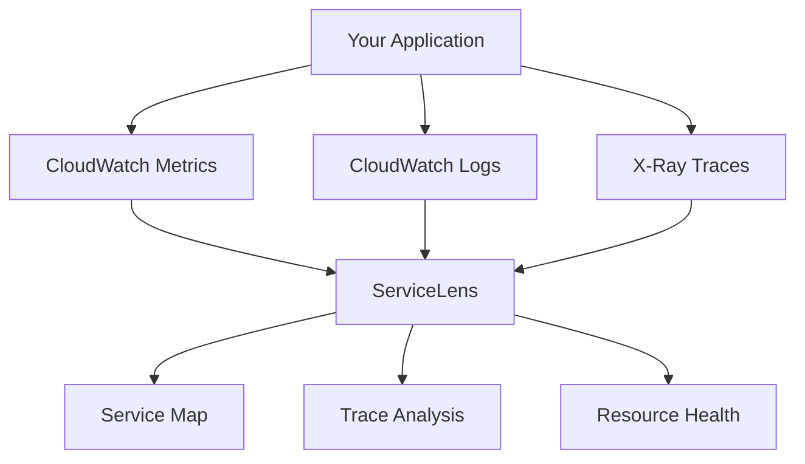

# How to Use CloudWatch ServiceLens for Application Monitoring

Author: [nawazdhandala](https://github.com/nawazdhandala)

Tags: AWS, CloudWatch, ServiceLens, Monitoring, X-Ray

Description: A complete guide to using CloudWatch ServiceLens to unify metrics, logs, and traces into a single view for application monitoring on AWS.

---

When you're monitoring a distributed application on AWS, data lives in three different places: metrics in CloudWatch, logs in CloudWatch Logs, and traces in X-Ray. Jumping between these consoles to investigate an issue gets old fast. That's the problem ServiceLens was built to solve.

CloudWatch ServiceLens pulls metrics, logs, and traces together into a single integrated view. It gives you a service map showing how your components interact, lets you drill into any node to see its health, and correlates traces with the relevant logs and metrics. It's essentially a unified observability layer built on top of tools you're probably already using.

## How ServiceLens Fits Into the Monitoring Stack

ServiceLens isn't a standalone product - it's more like a lens that sits on top of CloudWatch and X-Ray. Here's how the pieces relate:



For ServiceLens to work properly, you need at least X-Ray tracing enabled. Metrics and logs are optional but strongly recommended for the full experience.

## Prerequisites

Before setting up ServiceLens, you need:

- X-Ray tracing instrumented in your application
- CloudWatch agent installed on EC2 instances (if applicable)
- IAM permissions for CloudWatch, X-Ray, and CloudWatch Logs

Here's a minimal IAM policy:

```json
// IAM policy needed for ServiceLens access
{
  "Version": "2012-10-17",
  "Statement": [
    {
      "Effect": "Allow",
      "Action": [
        "xray:GetTraceSummaries",
        "xray:BatchGetTraces",
        "xray:GetServiceGraph",
        "xray:GetGroups",
        "cloudwatch:GetMetricData",
        "cloudwatch:ListMetrics",
        "logs:StartQuery",
        "logs:GetQueryResults",
        "logs:GetLogEvents"
      ],
      "Resource": "*"
    }
  ]
}
```

## Enabling X-Ray Tracing

ServiceLens depends on X-Ray data, so let's make sure that's flowing first.

For a Node.js application, install the AWS X-Ray SDK:

```bash
# Install the X-Ray SDK for Node.js
npm install aws-xray-sdk
```

Then instrument your application:

```javascript
// Initialize X-Ray at the top of your application entry point
const AWSXRay = require('aws-xray-sdk');
const express = require('express');

// Capture all AWS SDK calls automatically
const AWS = AWSXRay.captureAWS(require('aws-sdk'));

// Capture all HTTP/HTTPS requests
AWSXRay.captureHTTPsGlobal(require('http'));
AWSXRay.captureHTTPsGlobal(require('https'));

const app = express();

// Add X-Ray middleware - must be first middleware
app.use(AWSXRay.express.openSegment('my-web-app'));

app.get('/api/users', async (req, res) => {
  // Your route handler - X-Ray traces this automatically
  const dynamodb = new AWS.DynamoDB.DocumentClient();
  const result = await dynamodb.scan({ TableName: 'Users' }).promise();
  res.json(result.Items);
});

// Close X-Ray segment - must be after all routes
app.use(AWSXRay.express.closeSegment());

app.listen(3000);
```

For Python applications using Flask:

```python
# Initialize X-Ray in your Flask application
from aws_xray_sdk.core import xray_recorder
from aws_xray_sdk.ext.flask.middleware import XRayMiddleware
from aws_xray_sdk.core import patch_all
import flask

# Patch all supported libraries (boto3, requests, etc.)
patch_all()

app = flask.Flask(__name__)

# Configure the X-Ray recorder
xray_recorder.configure(service='my-python-app')
XRayMiddleware(app, xray_recorder)

@app.route('/api/orders')
def get_orders():
    # All downstream calls are automatically traced
    return get_orders_from_database()
```

## Navigating the ServiceLens Service Map

Once X-Ray data is flowing, head to CloudWatch in the AWS Console. Under "ServiceLens" in the left navigation, click "Service Map."

The service map shows your application as a graph of interconnected nodes. Each node represents a service or AWS resource, and the edges show how they communicate. The map updates in near real-time and color-codes nodes based on health:

- **Green** means healthy - response times and error rates are normal
- **Yellow** indicates warnings - elevated latency or error rates
- **Red** signals problems - high error rates or significant latency spikes

You can click on any node to see:

- Average latency, request rate, and error rate
- Associated CloudWatch metrics
- Related log groups
- Individual traces passing through that service

## Filtering and Time Ranges

ServiceLens lets you filter the service map by time range, which is invaluable during incident investigation. Say you got paged at 3:00 AM - you can set the time range to 2:45 AM - 3:15 AM and see exactly what the service map looked like during that window.

You can also filter by X-Ray groups if you've set those up. This is handy when you have multiple applications sharing the same AWS account. Check out our guide on [X-Ray groups for filtering traces](https://oneuptime.com/blog/post/2026-02-12-xray-groups-filtering-traces/view) for more details.

## Drilling Into Traces

The trace analysis view in ServiceLens is where investigation really happens. Click on a service node, then select "View traces" to see individual requests flowing through that service.

Each trace shows:

- The full request path through your application
- Time spent in each segment
- Any errors or faults encountered
- Annotations and metadata attached to the trace

You can filter traces by:

- Response time (find the slow ones)
- Status code (find the failures)
- Specific annotations you've added

Here's how to add custom annotations that make trace filtering more useful:

```javascript
// Add custom annotations to X-Ray segments for better filtering
const AWSXRay = require('aws-xray-sdk');

function processOrder(orderId, customerId) {
  // Get the current subsegment
  const segment = AWSXRay.getSegment();
  const subsegment = segment.addNewSubsegment('ProcessOrder');

  // Add annotations - these are indexed and searchable
  subsegment.addAnnotation('orderId', orderId);
  subsegment.addAnnotation('customerId', customerId);
  subsegment.addAnnotation('orderType', 'premium');

  // Add metadata - these are stored but not indexed
  subsegment.addMetadata('orderDetails', {
    items: 5,
    total: 149.99,
    currency: 'USD'
  });

  try {
    // Process the order
    const result = executeOrder(orderId);
    subsegment.close();
    return result;
  } catch (error) {
    subsegment.addError(error);
    subsegment.close();
    throw error;
  }
}
```

## Correlating Logs with Traces

One of ServiceLens' best features is log correlation. When you click on a trace, you can see the associated log entries right there in the same view - no switching consoles.

For this to work, your application needs to include the X-Ray trace ID in log output. Here's how:

```javascript
// Include X-Ray trace ID in your application logs
const AWSXRay = require('aws-xray-sdk');
const winston = require('winston');

const logger = winston.createLogger({
  format: winston.format.combine(
    winston.format.timestamp(),
    winston.format.printf(({ timestamp, level, message }) => {
      // Get current trace ID and inject it into the log line
      const traceId = AWSXRay.getSegment()?.trace_id || 'no-trace';
      return `${timestamp} [${level}] [traceId=${traceId}] ${message}`;
    })
  ),
  transports: [new winston.transports.Console()]
});

// Now every log line includes the trace ID
logger.info('Processing order #12345');
// Output: 2026-02-12T10:30:00Z [info] [traceId=1-abc123-def456] Processing order #12345
```

ServiceLens uses the trace ID in your logs to link them to the corresponding trace. It's a small addition that makes a huge difference during debugging.

## Using ServiceLens with Container Workloads

If you're running containers on ECS or EKS, ServiceLens works great but needs the X-Ray daemon running as a sidecar:

```yaml
# ECS task definition with X-Ray daemon sidecar
{
  "family": "my-app-task",
  "containerDefinitions": [
    {
      "name": "app",
      "image": "my-app:latest",
      "portMappings": [{"containerPort": 3000}],
      "environment": [
        {
          "name": "AWS_XRAY_DAEMON_ADDRESS",
          "value": "xray-daemon:2000"
        }
      ],
      "logConfiguration": {
        "logDriver": "awslogs",
        "options": {
          "awslogs-group": "/ecs/my-app",
          "awslogs-region": "us-east-1",
          "awslogs-stream-prefix": "app"
        }
      }
    },
    {
      "name": "xray-daemon",
      "image": "amazon/aws-xray-daemon:latest",
      "portMappings": [{"containerPort": 2000, "protocol": "udp"}]
    }
  ]
}
```

For EKS, you can deploy the X-Ray daemon as a DaemonSet or use the AWS Distro for OpenTelemetry (ADOT) collector. Either approach will feed data into ServiceLens. We cover EKS monitoring in depth in our [Container Insights for EKS](https://oneuptime.com/blog/post/2026-02-12-cloudwatch-container-insights-eks/view) guide.

## Setting Up Alarms from ServiceLens

ServiceLens integrates with CloudWatch Alarms. From the service map, you can click on a node and create alarms directly:

```bash
# Create a latency alarm for a service identified in ServiceLens
aws cloudwatch put-metric-alarm \
  --alarm-name "HighLatency-OrderService" \
  --metric-name "Latency" \
  --namespace "AWS/X-Ray" \
  --statistic "p99" \
  --period 300 \
  --threshold 2000 \
  --comparison-operator GreaterThanThreshold \
  --evaluation-periods 3 \
  --alarm-actions arn:aws:sns:us-east-1:123456789012:alerts \
  --dimensions Name=ServiceName,Value=OrderService
```

## Best Practices

**Instrument everything.** ServiceLens is only as good as the data flowing into it. If half your services aren't sending X-Ray traces, the service map will have gaps and the correlation won't work well.

**Use meaningful service names.** Whatever you name your X-Ray segments becomes the node label in the service map. Make them descriptive enough that anyone on the team can understand the architecture at a glance.

**Set up log groups correctly.** Each service should log to its own CloudWatch Logs group with a clear naming convention like `/app/service-name/environment`. This makes the log correlation in ServiceLens much cleaner.

**Combine with Application Insights.** ServiceLens shows you the real-time view, while [Application Insights](https://oneuptime.com/blog/post/2026-02-12-cloudwatch-application-insights/view) handles anomaly detection. Together, they cover both proactive and reactive monitoring.

## Wrapping Up

ServiceLens takes the three pillars of observability - metrics, logs, and traces - and puts them in one place. If you're already using CloudWatch and X-Ray, enabling ServiceLens is mostly about navigating to it in the console and making sure your trace IDs show up in your logs.

The service map alone makes it worthwhile. Being able to see your entire application topology, spot the red nodes, and drill straight into traces and logs from one screen cuts investigation time dramatically. Give it a try on your next production issue - you'll wonder how you got by without it.
