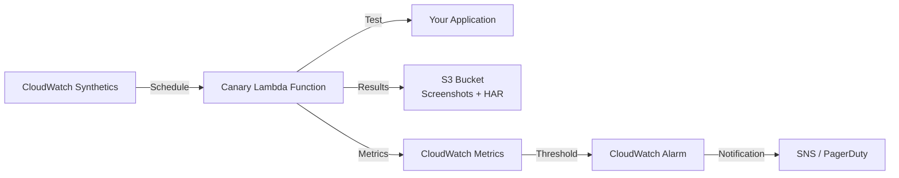

# How to Set Up CloudWatch Synthetics Canaries

Author: [nawazdhandala](https://github.com/nawazdhandala)

Tags: AWS, CloudWatch, Synthetics, Monitoring, Uptime

Description: Learn how to set up CloudWatch Synthetics canaries to proactively monitor your APIs and websites, detecting problems before your users do.

---

Real user monitoring tells you when users are already experiencing problems. Synthetic monitoring flips that around - it proactively tests your application from the outside, simulating user interactions on a schedule, and alerts you when something breaks. You find out about issues before your customers do.

CloudWatch Synthetics is AWS's synthetic monitoring service. It uses "canaries" - scripts that run on a schedule and test your endpoints. Think of them as automated smoke tests that run every few minutes. They can check API responses, navigate through web flows, verify SSL certificates, and more. When a canary fails, it triggers a CloudWatch alarm, and you get notified.

## How Canaries Work

A canary is a Lambda function running on a schedule. AWS provides a managed runtime (based on Node.js with Puppeteer for browser tests, or Node.js/Python for API tests) that handles the boilerplate. You write the test logic, and CloudWatch Synthetics handles scheduling, execution, screenshots, HAR files, and metric publishing.



Each canary run produces:
- A pass/fail status
- Screenshots (for browser canaries)
- HAR (HTTP Archive) files for network timing analysis
- CloudWatch metrics: `SuccessPercent`, `Duration`, and per-step metrics

## Creating a Simple Heartbeat Canary

The simplest canary just checks if a URL returns a successful response. You can create this entirely through the console or CLI.

Via the console:
1. Go to CloudWatch > Synthetics canaries > Create canary
2. Choose "Heartbeat monitoring" blueprint
3. Enter your URL
4. Set the schedule (e.g., every 5 minutes)
5. Configure the S3 bucket for artifacts
6. Create

Via the CLI, create the canary script first:

```javascript
// heartbeat-canary.js
const synthetics = require('Synthetics');
const log = require('SyntheticsLogger');

const canaryConfig = synthetics.getConfiguration();

// Configure screenshot and HTTP settings
canaryConfig.setConfig({
  includeRequestHeaders: true,
  includeResponseHeaders: true,
  restrictedHeaders: ['Authorization', 'Cookie'],
  includeRequestBody: true,
  includeResponseBody: true,
});

const handler = async () => {
  const urls = [
    'https://api.example.com/health',
    'https://api.example.com/v1/status',
    'https://www.example.com/',
  ];

  for (const url of urls) {
    log.info(`Checking URL: ${url}`);
    const response = await synthetics.executeHttpStep(
      `Check ${url}`,
      {
        hostname: new URL(url).hostname,
        path: new URL(url).pathname,
        port: 443,
        protocol: 'https:',
        method: 'GET',
      },
      validateResponse
    );
  }
};

// Validation function - customize based on your needs
const validateResponse = async (response) => {
  if (response.statusCode < 200 || response.statusCode >= 300) {
    throw new Error(`Expected 2xx status code, got ${response.statusCode}`);
  }
  return true;
};

exports.handler = async () => {
  return await handler();
};
```

Deploy the canary:

```bash
# Zip the canary script
zip canary.zip heartbeat-canary.js

# Upload to S3
aws s3 cp canary.zip s3://my-canary-artifacts/scripts/heartbeat-canary.zip

# Create the canary
aws synthetics create-canary \
  --name "api-heartbeat" \
  --artifact-s3-location "s3://my-canary-artifacts/results/" \
  --execution-role-arn "arn:aws:iam::123456789012:role/CloudWatchSyntheticsRole" \
  --schedule '{"Expression": "rate(5 minutes)"}' \
  --runtime-version "syn-nodejs-puppeteer-9.0" \
  --code '{"S3Bucket": "my-canary-artifacts", "S3Key": "scripts/heartbeat-canary.zip", "Handler": "heartbeat-canary.handler"}' \
  --run-config '{"TimeoutInSeconds": 60, "MemoryInMB": 960}'

# Start the canary (it's created in a stopped state by default)
aws synthetics start-canary --name "api-heartbeat"
```

## Creating an API Canary

For testing API endpoints with specific request payloads and response validation:

```javascript
// api-canary.js
const synthetics = require('Synthetics');
const log = require('SyntheticsLogger');
const https = require('https');

const apiTest = async () => {
  // Step 1: Test the health endpoint
  await synthetics.executeHttpStep('Health Check', {
    hostname: 'api.example.com',
    path: '/health',
    port: 443,
    protocol: 'https:',
    method: 'GET',
  }, async (response) => {
    if (response.statusCode !== 200) {
      throw new Error(`Health check failed: ${response.statusCode}`);
    }
    const body = JSON.parse(response.body);
    if (body.status !== 'healthy') {
      throw new Error(`Service unhealthy: ${body.status}`);
    }
  });

  // Step 2: Test authentication
  const authResponse = await synthetics.executeHttpStep('Authenticate', {
    hostname: 'api.example.com',
    path: '/auth/token',
    port: 443,
    protocol: 'https:',
    method: 'POST',
    headers: {
      'Content-Type': 'application/json',
    },
    body: JSON.stringify({
      clientId: process.env.TEST_CLIENT_ID,
      clientSecret: process.env.TEST_CLIENT_SECRET,
    }),
  }, async (response) => {
    if (response.statusCode !== 200) {
      throw new Error(`Auth failed: ${response.statusCode}`);
    }
    const body = JSON.parse(response.body);
    if (!body.accessToken) {
      throw new Error('No access token in response');
    }
    // Store token for next steps
    synthetics.setStepData('authToken', body.accessToken);
  });

  // Step 3: Test a protected endpoint
  const token = synthetics.getStepData('authToken');
  await synthetics.executeHttpStep('Get Orders', {
    hostname: 'api.example.com',
    path: '/v1/orders?limit=5',
    port: 443,
    protocol: 'https:',
    method: 'GET',
    headers: {
      'Authorization': `Bearer ${token}`,
    },
  }, async (response) => {
    if (response.statusCode !== 200) {
      throw new Error(`Get orders failed: ${response.statusCode}`);
    }
    const body = JSON.parse(response.body);
    if (!Array.isArray(body.orders)) {
      throw new Error('Response does not contain orders array');
    }
    log.info(`Retrieved ${body.orders.length} orders`);
  });

  // Step 4: Verify response time is acceptable
  await synthetics.executeHttpStep('Latency Check', {
    hostname: 'api.example.com',
    path: '/v1/orders?limit=1',
    port: 443,
    protocol: 'https:',
    method: 'GET',
    headers: {
      'Authorization': `Bearer ${token}`,
    },
  }, async (response, requestOptions, stepConfig) => {
    const latency = stepConfig.stepDuration;
    if (latency > 3000) {
      throw new Error(`Response too slow: ${latency}ms (threshold: 3000ms)`);
    }
    log.info(`Response time: ${latency}ms`);
  });
};

exports.handler = async () => {
  return await apiTest();
};
```

## Setting Up Alarms on Canaries

Canaries publish metrics to CloudWatch automatically. Create alarms to get notified on failures:

```bash
# Alert when the canary fails (success rate drops below 100%)
aws cloudwatch put-metric-alarm \
  --alarm-name "api-heartbeat-failed" \
  --namespace "CloudWatchSynthetics" \
  --metric-name "SuccessPercent" \
  --dimensions Name=CanaryName,Value=api-heartbeat \
  --statistic Average \
  --period 300 \
  --threshold 100 \
  --comparison-operator LessThanThreshold \
  --evaluation-periods 1 \
  --alarm-actions arn:aws:sns:us-east-1:123456789012:ops-alerts \
  --alarm-description "API heartbeat canary failed"

# Alert on high latency
aws cloudwatch put-metric-alarm \
  --alarm-name "api-heartbeat-slow" \
  --namespace "CloudWatchSynthetics" \
  --metric-name "Duration" \
  --dimensions Name=CanaryName,Value=api-heartbeat \
  --statistic Average \
  --period 300 \
  --threshold 5000 \
  --comparison-operator GreaterThanThreshold \
  --evaluation-periods 2 \
  --alarm-actions arn:aws:sns:us-east-1:123456789012:ops-alerts
```

## CloudFormation Deployment

Deploy canaries as infrastructure as code:

```yaml
Resources:
  CanaryArtifactsBucket:
    Type: AWS::S3::Bucket
    Properties:
      BucketName: !Sub '${AWS::AccountId}-synthetics-artifacts'
      LifecycleConfiguration:
        Rules:
          - ExpirationInDays: 30
            Status: Enabled

  CanaryRole:
    Type: AWS::IAM::Role
    Properties:
      RoleName: CloudWatchSyntheticsRole
      AssumeRolePolicyDocument:
        Version: '2012-10-17'
        Statement:
          - Effect: Allow
            Principal:
              Service: lambda.amazonaws.com
            Action: sts:AssumeRole
      ManagedPolicyArns:
        - arn:aws:iam::aws:policy/CloudWatchSyntheticsFullAccess

  ApiHeartbeatCanary:
    Type: AWS::Synthetics::Canary
    Properties:
      Name: api-heartbeat
      RuntimeVersion: syn-nodejs-puppeteer-9.0
      ArtifactS3Location: !Sub 's3://${CanaryArtifactsBucket}/results'
      ExecutionRoleArn: !GetAtt CanaryRole.Arn
      Schedule:
        Expression: rate(5 minutes)
      RunConfig:
        TimeoutInSeconds: 60
        MemoryInMB: 960
      Code:
        Handler: index.handler
        Script: |
          const synthetics = require('Synthetics');
          exports.handler = async () => {
            await synthetics.executeHttpStep('Health Check', {
              hostname: 'api.example.com',
              path: '/health',
              port: 443,
              protocol: 'https:',
              method: 'GET',
            }, async (res) => {
              if (res.statusCode !== 200) throw new Error('Health check failed');
            });
          };
      StartCanaryAfterCreation: true
```

## IAM Role for Canaries

The canary execution role needs these permissions:

```json
{
  "Version": "2012-10-17",
  "Statement": [
    {
      "Effect": "Allow",
      "Action": [
        "s3:PutObject",
        "s3:GetObject"
      ],
      "Resource": "arn:aws:s3:::my-canary-artifacts/*"
    },
    {
      "Effect": "Allow",
      "Action": [
        "s3:GetBucketLocation",
        "s3:ListBucket"
      ],
      "Resource": "arn:aws:s3:::my-canary-artifacts"
    },
    {
      "Effect": "Allow",
      "Action": [
        "logs:CreateLogGroup",
        "logs:CreateLogStream",
        "logs:PutLogEvents"
      ],
      "Resource": "arn:aws:logs:*:*:log-group:/aws/lambda/cwsyn-*"
    },
    {
      "Effect": "Allow",
      "Action": [
        "cloudwatch:PutMetricData"
      ],
      "Resource": "*",
      "Condition": {
        "StringEquals": {
          "cloudwatch:namespace": "CloudWatchSynthetics"
        }
      }
    }
  ]
}
```

## Canary Scheduling Options

You can set canaries to run at various intervals:

```bash
# Every 5 minutes
"Expression": "rate(5 minutes)"

# Every hour
"Expression": "rate(1 hour)"

# Cron expression: every weekday at 9am UTC
"Expression": "cron(0 9 ? * MON-FRI *)"

# Once (manual trigger only)
# Don't set a schedule, run manually with start-canary
```

For critical production endpoints, 5-minute intervals are common. For less critical checks, 15 minutes or hourly works fine.

## Wrapping Up

CloudWatch Synthetics gives you proactive monitoring that catches problems before users report them. Start with heartbeat canaries for your most critical endpoints, then build up to full API workflow tests and browser-based tests. The key is keeping your canary scripts simple and focused - each canary should test one specific thing and make it obvious what failed when it does. For API-specific testing patterns, see our post on [synthetic monitoring scripts for API endpoints](https://oneuptime.com/blog/post/synthetic-monitoring-scripts-api-endpoints/view). For browser-based flow testing, check out [synthetic monitoring scripts for website flows](https://oneuptime.com/blog/post/synthetic-monitoring-scripts-website-flows/view).
