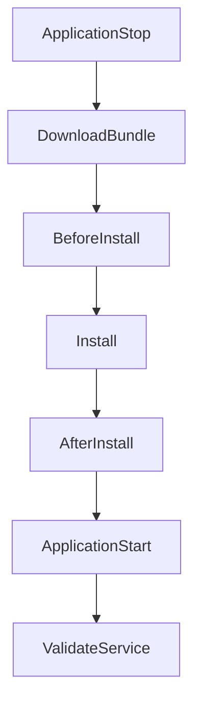

# How to Create CodeDeploy AppSpec Files

Author: [nawazdhandala](https://github.com/nawazdhandala)

Tags: AWS, CodeDeploy, DevOps, CI/CD

Description: A comprehensive guide to writing AppSpec files for AWS CodeDeploy, covering file mappings, permissions, lifecycle hooks, and examples for EC2, ECS, and Lambda.

---

The AppSpec file is the brain of every CodeDeploy deployment. It tells the agent exactly what files to copy, what permissions to set, and what scripts to run at each phase of the deployment. Get it wrong and your deployments will fail in confusing ways. Get it right and you've got a repeatable, reliable deployment process.

This guide covers everything you need to know about AppSpec files - from basic structure to advanced hook configurations across EC2, ECS, and Lambda compute platforms.

## AppSpec File Basics

The AppSpec file must be named `appspec.yml` (or `appspec.json` if you prefer JSON) and placed in the root of your deployment bundle. CodeDeploy won't find it if it's buried in a subdirectory.

The structure varies depending on your compute platform, but the core concept stays the same: define what gets deployed and how.

## EC2/On-Premises AppSpec

For EC2 deployments, the AppSpec file controls file copying and lifecycle hook scripts.

Here's a complete example:

```yaml
# appspec.yml for EC2 deployments
version: 0.0
os: linux

files:
  # Copy application code to the target directory
  - source: /src
    destination: /var/www/myapp/src
  # Copy configuration files
  - source: /config/production.conf
    destination: /etc/myapp
  # Copy the entire bundle to a backup location
  - source: /
    destination: /opt/myapp-releases/current

permissions:
  - object: /var/www/myapp
    owner: www-data
    group: www-data
    mode: "755"
    type:
      - directory
  - object: /var/www/myapp/src
    owner: www-data
    group: www-data
    mode: "644"
    pattern: "*.py"
    type:
      - file

hooks:
  BeforeInstall:
    - location: scripts/before_install.sh
      timeout: 300
      runas: root
  AfterInstall:
    - location: scripts/after_install.sh
      timeout: 600
      runas: root
  ApplicationStart:
    - location: scripts/start.sh
      timeout: 300
      runas: www-data
  ValidateService:
    - location: scripts/validate.sh
      timeout: 120
      runas: root
```

Let's break down each section.

### The `files` Section

This maps source paths (relative to the bundle root) to destination paths on the instance:

```yaml
files:
  # source is relative to bundle root, destination is absolute on the instance
  - source: /app
    destination: /var/www/myapp
  - source: /nginx.conf
    destination: /etc/nginx/sites-available
```

A few rules to remember:

- `source: /` copies the entire bundle
- If the destination directory doesn't exist, CodeDeploy creates it
- Files at the destination get overwritten during the Install phase
- You can have multiple file mappings

### The `permissions` Section

This sets ownership and file modes after files are copied:

```yaml
permissions:
  # Set directory permissions
  - object: /var/www/myapp
    owner: deploy
    group: deploy
    mode: "755"
    type:
      - directory
  # Set file permissions with a pattern filter
  - object: /var/www/myapp/bin
    owner: deploy
    group: deploy
    mode: "755"
    pattern: "*.sh"
    type:
      - file
```

The `pattern` field lets you apply permissions only to files matching a glob pattern. The `type` field specifies whether you're targeting files, directories, or both.

### The `hooks` Section

Hooks are where the real work happens. Each hook runs a script at a specific point in the deployment lifecycle.

Here's the full lifecycle order for an in-place deployment:



The hooks you can define scripts for are:

- **ApplicationStop** - Runs before the new version is downloaded. Use this to gracefully stop your app.
- **BeforeInstall** - Runs after files are downloaded but before they're copied. Good for cleanup tasks.
- **AfterInstall** - Runs after files are in place. Install dependencies here.
- **ApplicationStart** - Start your application.
- **ValidateService** - Verify the deployment worked. If this fails, CodeDeploy marks it as failed.

Each hook script definition takes three parameters:

```yaml
hooks:
  AfterInstall:
    - location: scripts/install_deps.sh  # path relative to bundle root
      timeout: 600                        # seconds before timeout
      runas: root                         # which OS user runs the script
```

## Example Hook Scripts

Here are practical scripts for each lifecycle phase.

Script to stop the running application:

```bash
#!/bin/bash
# scripts/application_stop.sh - Gracefully stop the application
set -e

if systemctl is-active --quiet myapp; then
    echo "Stopping myapp service..."
    systemctl stop myapp
    sleep 5
fi

echo "Application stopped successfully"
```

Script to clean up before installing new files:

```bash
#!/bin/bash
# scripts/before_install.sh - Clean up old artifacts
set -e

# Remove old application files but keep logs
if [ -d /var/www/myapp ]; then
    echo "Cleaning old deployment..."
    rm -rf /var/www/myapp/src
    rm -rf /var/www/myapp/node_modules
fi

# Create required directories
mkdir -p /var/www/myapp/logs
mkdir -p /var/www/myapp/tmp

echo "Pre-install cleanup complete"
```

Script to install dependencies after files are copied:

```bash
#!/bin/bash
# scripts/after_install.sh - Install application dependencies
set -e

cd /var/www/myapp

# Install Node.js dependencies
echo "Installing npm packages..."
npm ci --production

# Run database migrations
echo "Running migrations..."
npm run migrate

# Set correct ownership
chown -R www-data:www-data /var/www/myapp

echo "Post-install tasks complete"
```

Script to validate the deployment:

```bash
#!/bin/bash
# scripts/validate.sh - Verify the application is healthy
set -e

MAX_RETRIES=10
RETRY_INTERVAL=5

for i in $(seq 1 $MAX_RETRIES); do
    HTTP_CODE=$(curl -s -o /dev/null -w "%{http_code}" http://localhost:3000/health || echo "000")

    if [ "$HTTP_CODE" = "200" ]; then
        echo "Health check passed"
        exit 0
    fi

    echo "Attempt $i/$MAX_RETRIES - got HTTP $HTTP_CODE, retrying..."
    sleep $RETRY_INTERVAL
done

echo "Health check failed after $MAX_RETRIES attempts"
exit 1
```

## ECS AppSpec

For ECS deployments, the AppSpec file looks quite different. Instead of file mappings and scripts, you define the task definition and container details:

```yaml
# appspec.yml for ECS blue/green deployments
version: 0.0

Resources:
  - TargetService:
      Type: AWS::ECS::Service
      Properties:
        TaskDefinition: "arn:aws:ecs:us-east-1:123456789:task-definition/myapp:5"
        LoadBalancerInfo:
          ContainerName: "myapp-container"
          ContainerPort: 8080
        PlatformVersion: "LATEST"

Hooks:
  - BeforeInstall: "LambdaFunctionToValidateBeforeInstall"
  - AfterInstall: "LambdaFunctionToValidateAfterInstall"
  - AfterAllowTestTraffic: "LambdaFunctionToRunTests"
  - BeforeAllowTraffic: "LambdaFunctionToValidateBeforeTraffic"
  - AfterAllowTraffic: "LambdaFunctionToValidateAfterTraffic"
```

For more on ECS deployments, see our guide on [setting up CodeDeploy for ECS](https://oneuptime.com/blog/post/2026-02-12-codedeploy-ecs-deployments/view).

## Lambda AppSpec

Lambda AppSpec files define the function to deploy and the traffic shifting strategy:

```yaml
# appspec.yml for Lambda deployments
version: 0.0

Resources:
  - MyFunction:
      Type: AWS::Lambda::Function
      Properties:
        Name: "my-lambda-function"
        Alias: "live"
        CurrentVersion: "1"
        TargetVersion: "2"

Hooks:
  - BeforeAllowTraffic: "CodeDeployHookBeforeTraffic"
  - AfterAllowTraffic: "CodeDeployHookAfterTraffic"
```

Check out our detailed guide on [CodeDeploy for Lambda deployments](https://oneuptime.com/blog/post/2026-02-12-codedeploy-lambda-deployments/view) for more.

## JSON Format

If you prefer JSON over YAML, CodeDeploy supports `appspec.json`:

```json
{
  "version": 0.0,
  "os": "linux",
  "files": [
    {
      "source": "/",
      "destination": "/var/www/myapp"
    }
  ],
  "hooks": {
    "AfterInstall": [
      {
        "location": "scripts/after_install.sh",
        "timeout": 300,
        "runas": "root"
      }
    ]
  }
}
```

## Common Mistakes

I've seen these trip up teams over and over:

1. **Wrong filename** - It must be `appspec.yml`, not `Appspec.yml` or `appspec.yaml`.
2. **Not in the root** - The file must be at the top level of your deployment bundle.
3. **Bad YAML indentation** - YAML is whitespace-sensitive. Use spaces, not tabs.
4. **Missing script permissions** - Hook scripts must be executable. Add `chmod +x` to your build step.
5. **Timeouts too short** - If your `npm install` takes 5 minutes, set the timeout to at least 600 seconds.

## Tips for Production

For a solid production setup, keep these things in mind. Always include a `ValidateService` hook - it's your last line of defense against bad deployments. Set reasonable timeouts based on actual timing, not guesses. Log everything in your hook scripts so you can debug failures quickly. And use `set -e` in bash scripts so they fail fast on errors rather than silently continuing.

When things go wrong, check the CodeDeploy agent logs at `/var/log/aws/codedeploy-agent/codedeploy-agent.log` and your script output at `/opt/codedeploy-agent/deployment-root/<deployment-group>/<deployment-id>/logs/scripts.log`.

For monitoring deployment success rates and application health after deployments, consider integrating with [OneUptime](https://oneuptime.com) to get visibility into how your releases affect system performance.
