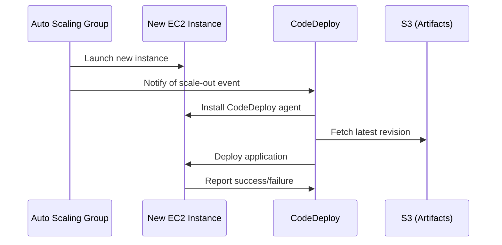

# How to Use CodeDeploy with Auto Scaling Groups

Author: [nawazdhandala](https://github.com/nawazdhandala)

Tags: AWS, CodeDeploy, Auto Scaling, EC2, DevOps

Description: Learn how to integrate AWS CodeDeploy with Auto Scaling Groups so new instances automatically receive your latest application version during scale-out events.

---

When you're running EC2 instances behind an Auto Scaling Group, there's an obvious problem with deployments. You deploy your latest code to all current instances, but when the ASG scales out and launches a new instance, that fresh instance doesn't have your application code. It's running whatever was baked into the AMI.

AWS CodeDeploy solves this by integrating directly with Auto Scaling Groups. When a new instance launches, CodeDeploy automatically deploys the most recent successful revision to it. No manual intervention, no stale code.

Let me show you how to set this up properly.

## How It Works

The integration between CodeDeploy and Auto Scaling is straightforward:



When you associate an ASG with a CodeDeploy deployment group, CodeDeploy creates a lifecycle hook on the ASG. This hook pauses new instances in the "Pending:Wait" state until CodeDeploy finishes deploying to them. If the deployment fails, the instance gets terminated and the ASG launches a replacement.

## Prerequisites

You'll need:

- An existing Auto Scaling Group with instances that have the CodeDeploy agent installed
- A CodeDeploy application with at least one successful deployment
- Proper IAM roles for both CodeDeploy and your EC2 instances

If you haven't set up CodeDeploy yet, start with our guide on [setting up CodeDeploy for EC2 deployments](https://oneuptime.com/blog/post/2026-02-12-aws-codedeploy-ec2-deployments/view).

## Step 1: Prepare Your Launch Template

Your launch template (or launch configuration) needs to include the CodeDeploy agent installation. The cleanest way is to bake it into your AMI, but you can also install it via user data.

Here's a user data script that installs the agent on boot:

```bash
#!/bin/bash
# User data script to install CodeDeploy agent
yum update -y
yum install -y ruby wget

REGION=$(curl -s http://169.254.169.254/latest/meta-data/placement/region)
cd /home/ec2-user
wget "https://aws-codedeploy-${REGION}.s3.${REGION}.amazonaws.com/latest/install"
chmod +x ./install
./install auto

# Verify agent started
service codedeploy-agent status
```

Make sure the launch template also references the correct instance profile with S3 read permissions:

```bash
# Create or update launch template with CodeDeploy-ready configuration
aws ec2 create-launch-template \
  --launch-template-name MyApp-Template \
  --launch-template-data '{
    "ImageId": "ami-0abcdef1234567890",
    "InstanceType": "t3.medium",
    "IamInstanceProfile": {
      "Name": "CodeDeployEC2Profile"
    },
    "UserData": "BASE64_ENCODED_USER_DATA",
    "TagSpecifications": [
      {
        "ResourceType": "instance",
        "Tags": [
          {"Key": "Application", "Value": "MyApp"},
          {"Key": "Environment", "Value": "Production"}
        ]
      }
    ]
  }'
```

## Step 2: Create the Deployment Group with ASG

Instead of using EC2 tag filters, you'll point your deployment group directly at the Auto Scaling Group:

```bash
# Create deployment group associated with an Auto Scaling Group
aws deploy create-deployment-group \
  --application-name MyApp \
  --deployment-group-name MyApp-ASG-Production \
  --auto-scaling-groups MyApp-ASG \
  --deployment-config-name CodeDeployDefault.OneAtATime \
  --service-role-arn arn:aws:iam::123456789012:role/CodeDeployServiceRole \
  --auto-rollback-configuration enabled=true,events=DEPLOYMENT_FAILURE \
  --deployment-style deploymentType=IN_PLACE,deploymentOption=WITH_TRAFFIC_CONTROL \
  --load-balancer-info targetGroupInfoList=[{name=MyApp-TG}]
```

There are some important flags here:

- `--auto-scaling-groups` links the deployment group to your ASG
- `--deployment-style` with `WITH_TRAFFIC_CONTROL` tells CodeDeploy to deregister instances from the load balancer during deployment
- `--load-balancer-info` specifies which target group to use for traffic management

## Step 3: Configure Traffic Management

When deploying to instances behind a load balancer, you want CodeDeploy to gracefully remove instances from the target group before deploying and add them back after. This prevents users from hitting instances mid-deployment.

The deployment style we set above handles this, but you can also enable it on an existing deployment group:

```bash
# Update an existing deployment group to use traffic control
aws deploy update-deployment-group \
  --application-name MyApp \
  --current-deployment-group-name MyApp-ASG-Production \
  --deployment-style deploymentType=IN_PLACE,deploymentOption=WITH_TRAFFIC_CONTROL \
  --load-balancer-info targetGroupInfoList=[{name=MyApp-TG}]
```

## Step 4: Handle Scale-Out Deployments

When the ASG launches a new instance, CodeDeploy automatically deploys the last successful revision. But there are some nuances you should know about.

The deployment to new instances happens independently from regular deployments. If a normal deployment is in progress and a new instance launches, the new instance gets the previous successful revision, not the one currently being deployed.

You can check whether a deployment was triggered by an ASG event:

```bash
# List deployments and check their creator
aws deploy list-deployments \
  --application-name MyApp \
  --deployment-group-name MyApp-ASG-Production \
  --query 'deployments[0:5]'

# Get details including the deployment creator
aws deploy get-deployment \
  --deployment-id d-ABCDEF123 \
  --query 'deploymentInfo.creator'
```

The `creator` field will show `autoscaling` for ASG-triggered deployments and `user` for manual ones.

## Step 5: Blue/Green Deployments with ASG

For zero-downtime deployments, you can use blue/green deployment style with your ASG. CodeDeploy will create a brand new set of instances, deploy to them, switch traffic over, and then terminate the old instances.

```bash
# Create a deployment group for blue/green with ASG
aws deploy create-deployment-group \
  --application-name MyApp \
  --deployment-group-name MyApp-BlueGreen \
  --service-role-arn arn:aws:iam::123456789012:role/CodeDeployServiceRole \
  --auto-scaling-groups MyApp-ASG \
  --deployment-style deploymentType=BLUE_GREEN,deploymentOption=WITH_TRAFFIC_CONTROL \
  --blue-green-deployment-configuration '{
    "terminateBlueInstancesOnDeploymentSuccess": {
      "action": "TERMINATE",
      "terminationWaitTimeInMinutes": 60
    },
    "deploymentReadyOption": {
      "actionOnTimeout": "CONTINUE_DEPLOYMENT",
      "waitTimeInMinutes": 0
    },
    "greenFleetProvisioningOption": {
      "action": "COPY_AUTO_SCALING_GROUP"
    }
  }' \
  --load-balancer-info targetGroupInfoList=[{name=MyApp-TG}]
```

The `COPY_AUTO_SCALING_GROUP` option tells CodeDeploy to create a new ASG with the same configuration as the original. After the deployment succeeds and traffic shifts, the old ASG gets scaled down.

## Handling Deployment Failures During Scale-Out

If a deployment to a newly launched instance fails, the instance gets terminated and the ASG launches another one. This can create a loop if your deployment has a bug. To prevent infinite cycling:

```bash
# Set a maximum number of failed instances before stopping
aws deploy update-deployment-group \
  --application-name MyApp \
  --current-deployment-group-name MyApp-ASG-Production \
  --alarm-configuration enabled=true,alarms=[{name=HighFailedDeployments}]
```

You should also monitor the ASG for instances stuck in the "Pending:Wait" state, which indicates CodeDeploy is having trouble:

```bash
# Check for instances in Pending:Wait state
aws autoscaling describe-auto-scaling-instances \
  --query 'AutoScalingInstances[?LifecycleState==`Pending:Wait`]'
```

## Suspending and Resuming ASG Integration

Sometimes you need to temporarily pause the CodeDeploy-ASG integration - maybe during maintenance or while debugging. You can suspend the launch lifecycle hook:

```bash
# Suspend the CodeDeploy lifecycle hook
aws autoscaling suspend-processes \
  --auto-scaling-group-name MyApp-ASG \
  --scaling-processes Launch
```

Remember to resume it when you're done:

```bash
# Resume the lifecycle hook
aws autoscaling resume-processes \
  --auto-scaling-group-name MyApp-ASG \
  --scaling-processes Launch
```

## Troubleshooting

Common issues with ASG integration:

- **New instances don't get deployed to** - Check that the ASG is associated with the deployment group, not just tagged.
- **Instances stuck in Pending:Wait** - The CodeDeploy agent might not be installed or the deployment is failing. Check agent logs.
- **Deployment loop** - If every new instance fails deployment and gets replaced, you've got a bad revision. Fix the deployment and push a new one.
- **Old revision deployed** - During an active deployment, new instances get the previous revision. This is by design.

For comprehensive deployment monitoring, tools like [OneUptime](https://oneuptime.com) can help you track deployment health across your ASG instances and alert you when scale-out deployments fail.

If you run into persistent deployment failures, check our guide on [handling CodeDeploy deployment failures](https://oneuptime.com/blog/post/2026-02-12-codedeploy-deployment-failures/view) for detailed debugging steps.
