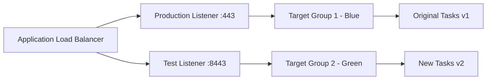

# How to Set Up CodeDeploy for ECS Deployments

Author: [nawazdhandala](https://github.com/nawazdhandala)

Tags: AWS, CodeDeploy, ECS, DevOps, Containers

Description: Step-by-step guide to configuring AWS CodeDeploy for blue/green deployments to Amazon ECS, including task definitions, target groups, and traffic shifting.

---

If you're running containers on Amazon ECS, you've probably already experienced the built-in rolling update deployment. It works fine for simple scenarios, but it doesn't give you much control. There's no easy way to test new versions before shifting traffic, no gradual rollout, and rolling back means deploying the old version again.

CodeDeploy integration with ECS changes all of that. It enables blue/green deployments where a completely new set of tasks runs alongside the old ones. You can test the new version, gradually shift traffic, and instantly roll back if something goes wrong.

Let's set this up from scratch.

## How ECS Blue/Green Deployments Work



During a deployment:

1. CodeDeploy creates new ECS tasks running the updated task definition
2. These tasks register with the "green" target group
3. Test traffic routes to the green target group so you can verify
4. Production traffic gradually shifts from blue to green
5. Old tasks are terminated after a configurable wait period

## Prerequisites

You'll need:

- An ECS cluster with a running service
- An Application Load Balancer with two target groups
- Two listeners on the ALB (production and test)
- IAM roles for CodeDeploy and ECS

## Step 1: Set Up the Load Balancer

You need two target groups and two listeners. The production listener handles real traffic, and the test listener lets you validate the new deployment before going live.

```bash
# Create the two target groups
aws elbv2 create-target-group \
  --name myapp-tg-blue \
  --protocol HTTP \
  --port 80 \
  --vpc-id vpc-0abc123 \
  --target-type ip \
  --health-check-path /health

aws elbv2 create-target-group \
  --name myapp-tg-green \
  --protocol HTTP \
  --port 80 \
  --vpc-id vpc-0abc123 \
  --target-type ip \
  --health-check-path /health
```

Create the listeners:

```bash
# Production listener on port 443
aws elbv2 create-listener \
  --load-balancer-arn arn:aws:elasticloadbalancing:us-east-1:123456789:loadbalancer/app/myapp-alb/abc123 \
  --protocol HTTPS \
  --port 443 \
  --certificates CertificateArn=arn:aws:acm:us-east-1:123456789:certificate/abc123 \
  --default-actions Type=forward,TargetGroupArn=arn:aws:elasticloadbalancing:us-east-1:123456789:targetgroup/myapp-tg-blue/abc123

# Test listener on port 8443
aws elbv2 create-listener \
  --load-balancer-arn arn:aws:elasticloadbalancing:us-east-1:123456789:loadbalancer/app/myapp-alb/abc123 \
  --protocol HTTPS \
  --port 8443 \
  --certificates CertificateArn=arn:aws:acm:us-east-1:123456789:certificate/abc123 \
  --default-actions Type=forward,TargetGroupArn=arn:aws:elasticloadbalancing:us-east-1:123456789:targetgroup/myapp-tg-green/abc123
```

## Step 2: Configure the ECS Service

Your ECS service needs to be configured for CodeDeploy-managed deployments:

```bash
# Create an ECS service with CODE_DEPLOY deployment controller
aws ecs create-service \
  --cluster myapp-cluster \
  --service-name myapp-service \
  --task-definition myapp:1 \
  --desired-count 3 \
  --deployment-controller type=CODE_DEPLOY \
  --load-balancers "targetGroupArn=arn:aws:elasticloadbalancing:us-east-1:123456789:targetgroup/myapp-tg-blue/abc123,containerName=myapp,containerPort=8080" \
  --network-configuration "awsvpcConfiguration={subnets=[subnet-abc,subnet-def],securityGroups=[sg-123],assignPublicIp=ENABLED}"
```

The key here is `--deployment-controller type=CODE_DEPLOY`. Once you set this, you can't use the standard ECS rolling update anymore - all deployments go through CodeDeploy.

## Step 3: Create the CodeDeploy Application

```bash
# Create a CodeDeploy application for ECS
aws deploy create-application \
  --application-name myapp-ecs \
  --compute-platform ECS
```

## Step 4: Create the Deployment Group

```bash
# Create the deployment group for ECS blue/green
aws deploy create-deployment-group \
  --application-name myapp-ecs \
  --deployment-group-name myapp-ecs-dg \
  --service-role-arn arn:aws:iam::123456789012:role/CodeDeployECSRole \
  --deployment-config-name CodeDeployDefault.ECSAllAtOnce \
  --ecs-services clusterName=myapp-cluster,serviceName=myapp-service \
  --load-balancer-info '{
    "targetGroupPairInfoList": [
      {
        "targetGroups": [
          {"name": "myapp-tg-blue"},
          {"name": "myapp-tg-green"}
        ],
        "prodTrafficRoute": {
          "listenerArns": ["arn:aws:elasticloadbalancing:us-east-1:123456789:listener/app/myapp-alb/abc123/prod123"]
        },
        "testTrafficRoute": {
          "listenerArns": ["arn:aws:elasticloadbalancing:us-east-1:123456789:listener/app/myapp-alb/abc123/test123"]
        }
      }
    ]
  }' \
  --blue-green-deployment-configuration '{
    "terminateBlueInstancesOnDeploymentSuccess": {
      "action": "TERMINATE",
      "terminationWaitTimeInMinutes": 60
    },
    "deploymentReadyOption": {
      "actionOnTimeout": "CONTINUE_DEPLOYMENT",
      "waitTimeInMinutes": 0
    }
  }' \
  --auto-rollback-configuration enabled=true,events=DEPLOYMENT_FAILURE
```

The `terminationWaitTimeInMinutes` gives you a buffer after traffic shifts. If something goes wrong during those 60 minutes, you can roll back instantly because the old tasks are still running.

## Step 5: Create the AppSpec File

The ECS AppSpec file is different from the EC2 version. It references the task definition and container details:

```yaml
# appspec.yml for ECS blue/green deployment
version: 0.0

Resources:
  - TargetService:
      Type: AWS::ECS::Service
      Properties:
        TaskDefinition: "arn:aws:ecs:us-east-1:123456789:task-definition/myapp:2"
        LoadBalancerInfo:
          ContainerName: "myapp"
          ContainerPort: 8080
        PlatformVersion: "LATEST"
```

For a deeper dive into AppSpec files, check our guide on [creating CodeDeploy AppSpec files](https://oneuptime.com/blog/post/2026-02-12-codedeploy-appspec-files/view).

## Step 6: Trigger a Deployment

Register a new task definition first, then deploy:

```bash
# Register updated task definition
aws ecs register-task-definition --cli-input-json file://task-definition.json

# Create the deployment
aws deploy create-deployment \
  --application-name myapp-ecs \
  --deployment-group-name myapp-ecs-dg \
  --revision '{
    "revisionType": "AppSpecContent",
    "appSpecContent": {
      "content": "{\"version\":0.0,\"Resources\":[{\"TargetService\":{\"Type\":\"AWS::ECS::Service\",\"Properties\":{\"TaskDefinition\":\"arn:aws:ecs:us-east-1:123456789:task-definition/myapp:2\",\"LoadBalancerInfo\":{\"ContainerName\":\"myapp\",\"ContainerPort\":8080},\"PlatformVersion\":\"LATEST\"}}}]}"
    }
  }'
```

## Traffic Shifting Strategies

CodeDeploy offers several deployment configurations for ECS:

- **CodeDeployDefault.ECSAllAtOnce** - Shifts all traffic at once after replacement tasks are healthy
- **CodeDeployDefault.ECSLinear10PercentEvery1Minutes** - Shifts 10% of traffic every minute
- **CodeDeployDefault.ECSLinear10PercentEvery3Minutes** - Shifts 10% every 3 minutes
- **CodeDeployDefault.ECSCanary10Percent5Minutes** - Shifts 10% first, waits 5 minutes, then shifts the rest

You can also create custom configurations:

```bash
# Create a custom canary configuration: 25% first, then the rest after 15 min
aws deploy create-deployment-config \
  --deployment-config-name ECSCanary25Percent15Minutes \
  --compute-platform ECS \
  --traffic-routing-config '{
    "type": "TimeBasedCanary",
    "timeBasedCanary": {
      "canaryPercentage": 25,
      "canaryInterval": 15
    }
  }'
```

## Adding Lifecycle Hooks

You can run Lambda functions at various points during the ECS deployment. These are great for running integration tests or notifying teams:

```yaml
# appspec.yml with Lambda lifecycle hooks
version: 0.0

Resources:
  - TargetService:
      Type: AWS::ECS::Service
      Properties:
        TaskDefinition: "arn:aws:ecs:us-east-1:123456789:task-definition/myapp:2"
        LoadBalancerInfo:
          ContainerName: "myapp"
          ContainerPort: 8080

Hooks:
  - BeforeInstall: "arn:aws:lambda:us-east-1:123456789:function:validate-before-deploy"
  - AfterInstall: "arn:aws:lambda:us-east-1:123456789:function:smoke-test"
  - AfterAllowTestTraffic: "arn:aws:lambda:us-east-1:123456789:function:integration-tests"
  - BeforeAllowTraffic: "arn:aws:lambda:us-east-1:123456789:function:final-validation"
  - AfterAllowTraffic: "arn:aws:lambda:us-east-1:123456789:function:post-deploy-checks"
```

## Rolling Back

One of the biggest advantages of blue/green deployments is instant rollbacks. If something's wrong, CodeDeploy reroutes traffic back to the original tasks:

```bash
# Stop the current deployment and roll back
aws deploy stop-deployment \
  --deployment-id d-ABCDEF123 \
  --auto-rollback-enabled
```

Since the old tasks are still running during the termination wait period, the rollback is nearly instantaneous - it's just a target group switch on the ALB.

## Monitoring

Keep an eye on your deployments with CloudWatch and consider using [OneUptime](https://oneuptime.com) for comprehensive monitoring of your ECS services. Track response times, error rates, and container health during traffic shifts to catch issues early.

For integrating this into a full CI/CD pipeline, check our guide on [using CodePipeline with ECS](https://oneuptime.com/blog/post/2026-02-12-codepipeline-ecs/view).
