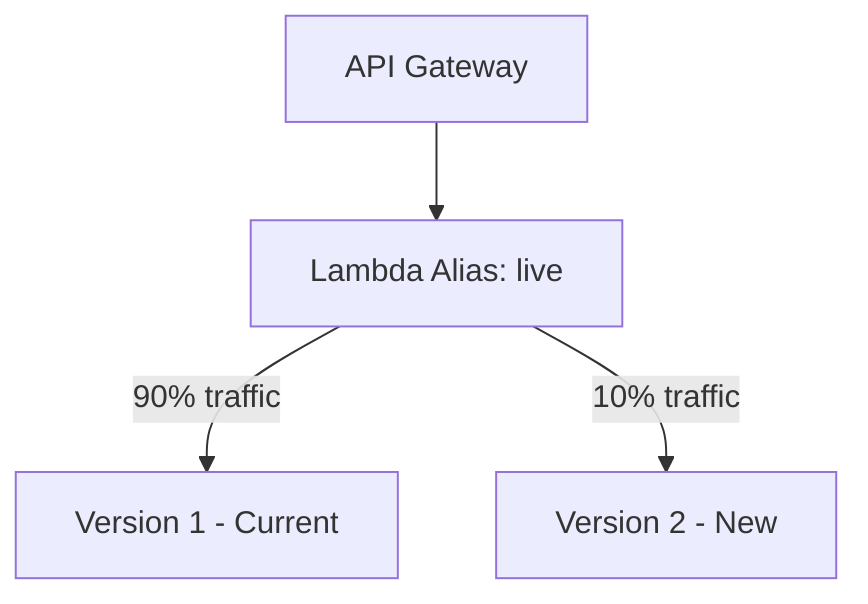

# How to Set Up CodeDeploy for Lambda Deployments

Author: [nawazdhandala](https://github.com/nawazdhandala)

Tags: AWS, CodeDeploy, Lambda, Serverless, DevOps

Description: Learn how to use AWS CodeDeploy to safely deploy Lambda functions with traffic shifting, canary deployments, and automatic rollbacks.

---

Deploying Lambda functions with a simple `aws lambda update-function-code` is quick but risky. The moment you update, 100% of traffic hits the new version. If there's a bug, every invocation fails until you push a fix. There's no gradual rollout, no testing in production, and no instant rollback.

AWS CodeDeploy brings blue/green deployment capabilities to Lambda. You can shift traffic incrementally between Lambda versions, run validation hooks, and automatically roll back if CloudWatch alarms fire. It's a much safer way to release serverless code.

## How Lambda Deployments Work with CodeDeploy

CodeDeploy uses Lambda aliases and versions to manage traffic shifting:



During a deployment:

1. You publish a new Lambda version
2. CodeDeploy updates the alias to route a percentage of traffic to the new version
3. Validation hooks run to check if the new version is healthy
4. Traffic gradually shifts from old to new
5. If alarms trigger, CodeDeploy reverts the alias to point 100% at the old version

## Step 1: Set Up Your Lambda Function with an Alias

First, your Lambda function needs a published version and an alias:

```bash
# Publish a version of your function
aws lambda publish-version \
  --function-name my-function \
  --description "Version 1 - initial release"

# Create an alias pointing to that version
aws lambda create-alias \
  --function-name my-function \
  --name live \
  --function-version 1
```

Your API Gateway (or whatever triggers the function) should point to the alias, not the function directly. This is what allows CodeDeploy to shift traffic between versions.

## Step 2: Create IAM Roles

CodeDeploy needs a service role with Lambda permissions:

```json
{
  "Version": "2012-10-17",
  "Statement": [
    {
      "Effect": "Allow",
      "Principal": {
        "Service": "codedeploy.amazonaws.com"
      },
      "Action": "sts:AssumeRole"
    }
  ]
}
```

Attach the required policies:

```bash
# Create the service role
aws iam create-role \
  --role-name CodeDeployLambdaRole \
  --assume-role-policy-document file://trust-policy.json

# Attach the managed policy
aws iam attach-role-policy \
  --role-name CodeDeployLambdaRole \
  --policy-arn arn:aws:iam::aws:policy/AWSCodeDeployRoleForLambda
```

## Step 3: Create the CodeDeploy Application

```bash
# Create a CodeDeploy application for Lambda
aws deploy create-application \
  --application-name my-function-deploy \
  --compute-platform Lambda
```

## Step 4: Choose a Deployment Configuration

This is where you decide how fast traffic shifts to the new version. AWS provides several built-in options:

| Configuration | Behavior |
|---|---|
| CodeDeployDefault.LambdaCanary10Percent5Minutes | 10% first, rest after 5 min |
| CodeDeployDefault.LambdaCanary10Percent10Minutes | 10% first, rest after 10 min |
| CodeDeployDefault.LambdaCanary10Percent15Minutes | 10% first, rest after 15 min |
| CodeDeployDefault.LambdaCanary10Percent30Minutes | 10% first, rest after 30 min |
| CodeDeployDefault.LambdaLinear10PercentEvery1Minute | 10% added every minute |
| CodeDeployDefault.LambdaLinear10PercentEvery2Minutes | 10% added every 2 minutes |
| CodeDeployDefault.LambdaLinear10PercentEvery3Minutes | 10% added every 3 minutes |
| CodeDeployDefault.LambdaLinear10PercentEvery10Minutes | 10% added every 10 minutes |
| CodeDeployDefault.LambdaAllAtOnce | All traffic shifts immediately |

You can also create custom configurations:

```bash
# Custom canary: 5% for 10 minutes, then the rest
aws deploy create-deployment-config \
  --deployment-config-name LambdaCanary5Percent10Minutes \
  --compute-platform Lambda \
  --traffic-routing-config '{
    "type": "TimeBasedCanary",
    "timeBasedCanary": {
      "canaryPercentage": 5,
      "canaryInterval": 10
    }
  }'

# Custom linear: 20% every 5 minutes
aws deploy create-deployment-config \
  --deployment-config-name LambdaLinear20PercentEvery5Minutes \
  --compute-platform Lambda \
  --traffic-routing-config '{
    "type": "TimeBasedLinear",
    "timeBasedLinear": {
      "linearPercentage": 20,
      "linearInterval": 5
    }
  }'
```

## Step 5: Create the Deployment Group

```bash
# Create the deployment group with CloudWatch alarms
aws deploy create-deployment-group \
  --application-name my-function-deploy \
  --deployment-group-name my-function-dg \
  --service-role-arn arn:aws:iam::123456789012:role/CodeDeployLambdaRole \
  --deployment-config-name CodeDeployDefault.LambdaCanary10Percent5Minutes \
  --auto-rollback-configuration enabled=true,events=DEPLOYMENT_FAILURE,DEPLOYMENT_STOP_ON_ALARM \
  --alarm-configuration enabled=true,alarms=[{name=my-function-errors},{name=my-function-duration}]
```

The alarm configuration is crucial. Create CloudWatch alarms on your Lambda error rate and duration, and CodeDeploy will automatically roll back if they breach thresholds.

## Step 6: Create CloudWatch Alarms

Set up alarms that CodeDeploy monitors during deployment:

```bash
# Alarm for Lambda errors
aws cloudwatch put-metric-alarm \
  --alarm-name my-function-errors \
  --metric-name Errors \
  --namespace AWS/Lambda \
  --statistic Sum \
  --period 60 \
  --evaluation-periods 1 \
  --threshold 5 \
  --comparison-operator GreaterThanThreshold \
  --dimensions Name=FunctionName,Value=my-function Name=Resource,Value=my-function:live

# Alarm for high duration
aws cloudwatch put-metric-alarm \
  --alarm-name my-function-duration \
  --metric-name Duration \
  --namespace AWS/Lambda \
  --statistic Average \
  --period 60 \
  --evaluation-periods 2 \
  --threshold 3000 \
  --comparison-operator GreaterThanThreshold \
  --dimensions Name=FunctionName,Value=my-function Name=Resource,Value=my-function:live
```

## Step 7: Write Validation Hooks

Validation hooks are Lambda functions that CodeDeploy calls during the deployment. They let you run tests against the new version before and after traffic shifts.

Here's a pre-traffic hook that invokes the new version and checks the response:

```python
# pre_traffic_hook.py - Validates the new Lambda version before traffic shifts
import json
import boto3

codedeploy = boto3.client('codedeploy')
lambda_client = boto3.client('lambda')

def handler(event, context):
    deployment_id = event['DeploymentId']
    lifecycle_event_hook_execution_id = event['LifecycleEventHookExecutionId']

    status = 'Succeeded'

    try:
        # Invoke the new version directly to test it
        response = lambda_client.invoke(
            FunctionName='my-function',
            Qualifier='live',  # This will hit the weighted alias
            Payload=json.dumps({
                'test': True,
                'path': '/health'
            })
        )

        payload = json.loads(response['Payload'].read())

        # Check for errors in the response
        if response.get('FunctionError'):
            print(f"Function returned error: {payload}")
            status = 'Failed'
        elif payload.get('statusCode') != 200:
            print(f"Unexpected status code: {payload.get('statusCode')}")
            status = 'Failed'
        else:
            print("Validation passed successfully")

    except Exception as e:
        print(f"Validation failed with exception: {str(e)}")
        status = 'Failed'

    # Report the result back to CodeDeploy
    codedeploy.put_lifecycle_event_hook_execution_status(
        deploymentId=deployment_id,
        lifecycleEventHookExecutionId=lifecycle_event_hook_execution_id,
        status=status
    )

    return {'statusCode': 200}
```

## Step 8: Create the AppSpec File and Deploy

The Lambda AppSpec file specifies the function, alias, and version details:

```yaml
# appspec.yml for Lambda deployment
version: 0.0

Resources:
  - MyFunction:
      Type: AWS::Lambda::Function
      Properties:
        Name: "my-function"
        Alias: "live"
        CurrentVersion: "1"
        TargetVersion: "2"

Hooks:
  - BeforeAllowTraffic: "arn:aws:lambda:us-east-1:123456789:function:pre-traffic-hook"
  - AfterAllowTraffic: "arn:aws:lambda:us-east-1:123456789:function:post-traffic-hook"
```

Now trigger the deployment:

```bash
# Publish a new version first
NEW_VERSION=$(aws lambda publish-version \
  --function-name my-function \
  --query 'Version' --output text)

echo "Published version: $NEW_VERSION"

# Create the deployment
aws deploy create-deployment \
  --application-name my-function-deploy \
  --deployment-group-name my-function-dg \
  --revision '{
    "revisionType": "AppSpecContent",
    "appSpecContent": {
      "content": "{\"version\":0.0,\"Resources\":[{\"MyFunction\":{\"Type\":\"AWS::Lambda::Function\",\"Properties\":{\"Name\":\"my-function\",\"Alias\":\"live\",\"CurrentVersion\":\"1\",\"TargetVersion\":\"'$NEW_VERSION'\"}}}]}"
    }
  }'
```

## Using SAM for Easier Setup

If you're using AWS SAM, you can define all of this in your template:

```yaml
# template.yml - SAM template with CodeDeploy traffic shifting
AWSTemplateFormatVersion: '2010-09-09'
Transform: AWS::Serverless-2016-10-31

Resources:
  MyFunction:
    Type: AWS::Serverless::Function
    Properties:
      Handler: index.handler
      Runtime: nodejs18.x
      CodeUri: ./src
      AutoPublishAlias: live
      DeploymentPreference:
        Type: Canary10Percent5Minutes
        Alarms:
          - !Ref MyFunctionErrorsAlarm
        Hooks:
          PreTraffic: !Ref PreTrafficHook
          PostTraffic: !Ref PostTrafficHook
```

SAM handles the CodeDeploy application, deployment group, and all the wiring automatically.

## Monitoring and Rollback

During a deployment, you can watch the traffic shifting in real time:

```bash
# Check deployment status
aws deploy get-deployment \
  --deployment-id d-ABCDEF123 \
  --query 'deploymentInfo.{status:status,rollbackInfo:rollbackInfo}'
```

If you need to manually trigger a rollback:

```bash
# Stop deployment and roll back
aws deploy stop-deployment \
  --deployment-id d-ABCDEF123 \
  --auto-rollback-enabled
```

For ongoing monitoring of your Lambda functions, [OneUptime](https://oneuptime.com) can track invocation errors, latency, and throttling across all your serverless functions.

To automate the entire process, check out our guide on [using CodePipeline with Lambda](https://oneuptime.com/blog/post/2026-02-12-codepipeline-lambda/view).
