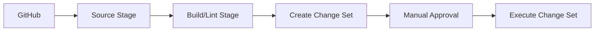

# How to Use CodePipeline with CloudFormation

Author: [nawazdhandala](https://github.com/nawazdhandala)

Tags: AWS, CodePipeline, CloudFormation, Infrastructure as Code, DevOps

Description: Learn how to automate infrastructure deployments using AWS CodePipeline with CloudFormation, including change sets, stack updates, and multi-stage pipelines.

---

Infrastructure as Code is great in theory, but running `aws cloudformation deploy` from your laptop isn't exactly a scalable workflow. You forget which parameters you used, someone else deploys over your changes, and there's no audit trail of who changed what.

CodePipeline fixes this by automating CloudFormation deployments through a proper CI/CD pipeline. Push a template change to your repo, and the pipeline creates a change set, optionally waits for approval, then executes the stack update. You get version control, peer review, and automated rollbacks all in one workflow.

## Pipeline Architecture

Here's what a typical CloudFormation pipeline looks like:



The pipeline pulls your CloudFormation templates from source control, validates them, creates a change set so you can review what'll change, waits for approval, then applies the changes.

## Step 1: Prepare Your Repository

Organize your CloudFormation templates in a clean structure:

```
infrastructure/
  templates/
    main.yml          # Root stack
    vpc.yml           # VPC resources
    database.yml      # RDS resources
    compute.yml       # EC2/ECS resources
  parameters/
    dev.json          # Dev environment parameters
    staging.json      # Staging parameters
    production.json   # Production parameters
  buildspec.yml       # CodeBuild spec for validation
```

Here's a simple CloudFormation template to work with:

```yaml
# templates/main.yml - Example CloudFormation template
AWSTemplateFormatVersion: '2010-09-09'
Description: Application infrastructure

Parameters:
  Environment:
    Type: String
    AllowedValues: [dev, staging, production]
  InstanceType:
    Type: String
    Default: t3.medium

Resources:
  AppSecurityGroup:
    Type: AWS::EC2::SecurityGroup
    Properties:
      GroupDescription: !Sub "${Environment} application security group"
      VpcId: !ImportValue VPC-ID

  AppInstance:
    Type: AWS::EC2::Instance
    Properties:
      InstanceType: !Ref InstanceType
      SecurityGroupIds:
        - !Ref AppSecurityGroup
      Tags:
        - Key: Environment
          Value: !Ref Environment

Outputs:
  InstanceId:
    Value: !Ref AppInstance
    Export:
      Name: !Sub "${Environment}-InstanceId"
```

And a parameter file:

```json
{
  "Parameters": {
    "Environment": "production",
    "InstanceType": "t3.large"
  }
}
```

## Step 2: Add Template Validation

Create a CodeBuild project that validates your templates before deployment:

```yaml
# buildspec.yml - Validate CloudFormation templates
version: 0.2

phases:
  install:
    commands:
      - pip install cfn-lint
  pre_build:
    commands:
      # Lint all templates
      - echo "Linting CloudFormation templates..."
      - cfn-lint templates/*.yml
      # Validate with AWS API
      - |
        for template in templates/*.yml; do
          echo "Validating $template..."
          aws cloudformation validate-template --template-body file://$template
        done
  build:
    commands:
      - echo "All templates valid"

artifacts:
  files:
    - templates/**/*
    - parameters/**/*
```

## Step 3: Create the Pipeline IAM Role

The pipeline role needs CloudFormation permissions:

```json
{
  "Version": "2012-10-17",
  "Statement": [
    {
      "Effect": "Allow",
      "Action": [
        "cloudformation:CreateStack",
        "cloudformation:UpdateStack",
        "cloudformation:DeleteStack",
        "cloudformation:DescribeStacks",
        "cloudformation:CreateChangeSet",
        "cloudformation:ExecuteChangeSet",
        "cloudformation:DeleteChangeSet",
        "cloudformation:DescribeChangeSet",
        "cloudformation:SetStackPolicy"
      ],
      "Resource": "*"
    },
    {
      "Effect": "Allow",
      "Action": "iam:PassRole",
      "Resource": "arn:aws:iam::123456789012:role/CloudFormationExecutionRole"
    },
    {
      "Effect": "Allow",
      "Action": [
        "s3:GetObject",
        "s3:PutObject",
        "s3:GetBucketVersioning"
      ],
      "Resource": [
        "arn:aws:s3:::my-pipeline-artifacts/*",
        "arn:aws:s3:::my-pipeline-artifacts"
      ]
    },
    {
      "Effect": "Allow",
      "Action": [
        "codebuild:BatchGetBuilds",
        "codebuild:StartBuild"
      ],
      "Resource": "*"
    }
  ]
}
```

You also need a CloudFormation execution role - this is what CloudFormation itself uses to create resources:

```bash
# Create the CloudFormation execution role
aws iam create-role \
  --role-name CloudFormationExecutionRole \
  --assume-role-policy-document '{
    "Version": "2012-10-17",
    "Statement": [{
      "Effect": "Allow",
      "Principal": {"Service": "cloudformation.amazonaws.com"},
      "Action": "sts:AssumeRole"
    }]
  }'

# Give it permissions to create the resources in your templates
aws iam attach-role-policy \
  --role-name CloudFormationExecutionRole \
  --policy-arn arn:aws:iam::aws:policy/AdministratorAccess
```

In production, you should scope the execution role's permissions down to only what your templates need instead of using AdministratorAccess.

## Step 4: Build the Pipeline

Here's the full pipeline definition with change set review:

```json
{
  "pipeline": {
    "name": "infrastructure-pipeline",
    "roleArn": "arn:aws:iam::123456789012:role/CodePipelineServiceRole",
    "artifactStore": {
      "type": "S3",
      "location": "my-pipeline-artifacts"
    },
    "stages": [
      {
        "name": "Source",
        "actions": [{
          "name": "GitHub",
          "actionTypeId": {
            "category": "Source",
            "owner": "AWS",
            "provider": "CodeStarSourceConnection",
            "version": "1"
          },
          "configuration": {
            "ConnectionArn": "arn:aws:codestar-connections:us-east-1:123456789:connection/abc-123",
            "FullRepositoryId": "my-org/infrastructure",
            "BranchName": "main"
          },
          "outputArtifacts": [{"name": "SourceOutput"}]
        }]
      },
      {
        "name": "Validate",
        "actions": [{
          "name": "LintTemplates",
          "actionTypeId": {
            "category": "Build",
            "owner": "AWS",
            "provider": "CodeBuild",
            "version": "1"
          },
          "configuration": {"ProjectName": "cfn-validate"},
          "inputArtifacts": [{"name": "SourceOutput"}],
          "outputArtifacts": [{"name": "ValidatedTemplates"}]
        }]
      },
      {
        "name": "CreateChangeSet",
        "actions": [{
          "name": "CreateChangeSet",
          "actionTypeId": {
            "category": "Deploy",
            "owner": "AWS",
            "provider": "CloudFormation",
            "version": "1"
          },
          "configuration": {
            "ActionMode": "CHANGE_SET_REPLACE",
            "StackName": "my-app-stack",
            "ChangeSetName": "pipeline-changeset",
            "TemplatePath": "ValidatedTemplates::templates/main.yml",
            "TemplateConfiguration": "ValidatedTemplates::parameters/production.json",
            "RoleArn": "arn:aws:iam::123456789012:role/CloudFormationExecutionRole",
            "Capabilities": "CAPABILITY_NAMED_IAM"
          },
          "inputArtifacts": [{"name": "ValidatedTemplates"}]
        }]
      },
      {
        "name": "Approval",
        "actions": [{
          "name": "ReviewChangeSet",
          "actionTypeId": {
            "category": "Approval",
            "owner": "AWS",
            "provider": "Manual",
            "version": "1"
          },
          "configuration": {
            "CustomData": "Review the CloudFormation change set before executing.",
            "ExternalEntityLink": "https://console.aws.amazon.com/cloudformation"
          }
        }]
      },
      {
        "name": "ExecuteChangeSet",
        "actions": [{
          "name": "ExecuteChangeSet",
          "actionTypeId": {
            "category": "Deploy",
            "owner": "AWS",
            "provider": "CloudFormation",
            "version": "1"
          },
          "configuration": {
            "ActionMode": "CHANGE_SET_EXECUTE",
            "StackName": "my-app-stack",
            "ChangeSetName": "pipeline-changeset"
          }
        }]
      }
    ]
  }
}
```

The key is the two-step process: `CHANGE_SET_REPLACE` creates the change set, and `CHANGE_SET_EXECUTE` applies it. The manual approval in between gives you time to review what will change.

## CloudFormation Action Modes

CodePipeline supports several CloudFormation action modes:

| Mode | Behavior |
|---|---|
| CREATE_UPDATE | Creates or updates the stack directly |
| CHANGE_SET_REPLACE | Creates a change set for review |
| CHANGE_SET_EXECUTE | Executes a previously created change set |
| DELETE_ONLY | Deletes the stack |
| REPLACE_ON_FAILURE | Creates or replaces a failed stack |

For production, always use the change set approach. Direct `CREATE_UPDATE` is fine for dev environments where you want faster iteration.

## Multi-Environment Pipeline

Deploy the same templates to multiple environments:

```json
{
  "stages": [
    {"name": "Source"},
    {"name": "Validate"},
    {
      "name": "Deploy-Dev",
      "actions": [{
        "configuration": {
          "ActionMode": "CREATE_UPDATE",
          "StackName": "myapp-dev",
          "TemplatePath": "ValidatedTemplates::templates/main.yml",
          "TemplateConfiguration": "ValidatedTemplates::parameters/dev.json",
          "RoleArn": "arn:aws:iam::123456789012:role/CloudFormationExecutionRole"
        }
      }]
    },
    {"name": "Approve-Staging"},
    {
      "name": "Deploy-Staging",
      "actions": [{
        "configuration": {
          "ActionMode": "CHANGE_SET_REPLACE",
          "StackName": "myapp-staging",
          "TemplateConfiguration": "ValidatedTemplates::parameters/staging.json"
        }
      }]
    },
    {"name": "Execute-Staging"},
    {"name": "Approve-Production"},
    {
      "name": "Deploy-Production",
      "actions": [{
        "configuration": {
          "ActionMode": "CHANGE_SET_REPLACE",
          "StackName": "myapp-production",
          "TemplateConfiguration": "ValidatedTemplates::parameters/production.json"
        }
      }]
    },
    {"name": "Execute-Production"}
  ]
}
```

## Passing Stack Outputs to Other Stages

You can capture stack outputs and use them in later stages:

```json
{
  "configuration": {
    "ActionMode": "CREATE_UPDATE",
    "StackName": "my-app-stack",
    "OutputFileName": "stack-outputs.json"
  },
  "outputArtifacts": [{"name": "StackOutputs"}]
}
```

The `stack-outputs.json` file will contain all stack outputs, which can be used as input to subsequent stages.

## Handling Failures

CloudFormation stack updates can fail for many reasons - resource limits, permission issues, or invalid configurations. When a stack update fails, CloudFormation automatically rolls back to the previous state.

However, if a stack gets stuck in `UPDATE_ROLLBACK_FAILED`, you'll need to manually fix it. Keep an eye on stack events and consider using [OneUptime](https://oneuptime.com) to monitor your infrastructure health after deployments.

For general pipeline debugging, see our guide on [troubleshooting CodePipeline failures](https://oneuptime.com/blog/post/2026-02-12-troubleshoot-codepipeline-failures/view).
