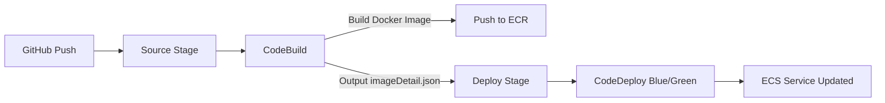

# How to Use CodePipeline with ECS

Author: [nawazdhandala](https://github.com/nawazdhandala)

Tags: AWS, CodePipeline, ECS, CI/CD, Containers

Description: Build a complete CI/CD pipeline for Amazon ECS using CodePipeline, from building Docker images in CodeBuild to blue/green deployments with CodeDeploy.

---

Running containers on ECS is one thing. Automating the entire workflow from code push to production deployment is another. With CodePipeline, you can build a pipeline that automatically builds your Docker image, pushes it to ECR, updates the task definition, and triggers a blue/green deployment through CodeDeploy - all from a single git push.

This guide walks through building that complete pipeline.

## The Full Pipeline



## Prerequisites

Before starting, make sure you have:

- An ECS cluster with a running service (configured for CodeDeploy deployment controller)
- An ECR repository for your Docker images
- An Application Load Balancer with two target groups
- CodeDeploy application and deployment group for ECS

If you haven't set up CodeDeploy for ECS yet, check our guide on [setting up CodeDeploy for ECS deployments](https://oneuptime.com/blog/post/2026-02-12-codedeploy-ecs-deployments/view).

## Step 1: Create the Dockerfile and Application

Start with a simple application and Dockerfile:

```dockerfile
# Dockerfile
FROM node:18-alpine

WORKDIR /app
COPY package*.json ./
RUN npm ci --production
COPY . .

EXPOSE 8080
HEALTHCHECK --interval=30s --timeout=5s CMD curl -f http://localhost:8080/health || exit 1

CMD ["node", "server.js"]
```

## Step 2: Create the BuildSpec

The CodeBuild project needs to build the Docker image, push it to ECR, and output a file that tells CodeDeploy which image to deploy:

```yaml
# buildspec.yml - Build Docker image and push to ECR
version: 0.2

env:
  variables:
    ECR_REPO: "123456789012.dkr.ecr.us-east-1.amazonaws.com/myapp"
    CONTAINER_NAME: "myapp"

phases:
  pre_build:
    commands:
      # Log in to ECR
      - echo "Logging in to ECR..."
      - aws ecr get-login-password --region us-east-1 | docker login --username AWS --password-stdin 123456789012.dkr.ecr.us-east-1.amazonaws.com
      # Set the image tag to the commit hash
      - IMAGE_TAG=$(echo $CODEBUILD_RESOLVED_SOURCE_VERSION | cut -c 1-7)
      - echo "Building image with tag $IMAGE_TAG"
  build:
    commands:
      - echo "Building Docker image..."
      - docker build -t $ECR_REPO:$IMAGE_TAG .
      - docker tag $ECR_REPO:$IMAGE_TAG $ECR_REPO:latest
  post_build:
    commands:
      # Push both tags
      - echo "Pushing image to ECR..."
      - docker push $ECR_REPO:$IMAGE_TAG
      - docker push $ECR_REPO:latest
      # Create the imageDetail.json that CodeDeploy needs
      - printf '{"ImageURI":"%s"}' $ECR_REPO:$IMAGE_TAG > imageDetail.json
      # Create the task definition with the new image
      - echo "Generating task definition..."
      - |
        cat > taskdef.json << TASKDEF
        {
          "family": "myapp",
          "networkMode": "awsvpc",
          "requiresCompatibilities": ["FARGATE"],
          "cpu": "256",
          "memory": "512",
          "executionRoleArn": "arn:aws:iam::123456789012:role/ecsTaskExecutionRole",
          "containerDefinitions": [
            {
              "name": "$CONTAINER_NAME",
              "image": "<IMAGE1_NAME>",
              "portMappings": [
                {
                  "containerPort": 8080,
                  "protocol": "tcp"
                }
              ],
              "essential": true,
              "logConfiguration": {
                "logDriver": "awslogs",
                "options": {
                  "awslogs-group": "/ecs/myapp",
                  "awslogs-region": "us-east-1",
                  "awslogs-stream-prefix": "ecs"
                }
              }
            }
          ]
        }
        TASKDEF
      # Create the AppSpec for CodeDeploy ECS deployment
      - |
        cat > appspec.yml << APPSPEC
        version: 0.0
        Resources:
          - TargetService:
              Type: AWS::ECS::Service
              Properties:
                TaskDefinition: <TASK_DEFINITION>
                LoadBalancerInfo:
                  ContainerName: "$CONTAINER_NAME"
                  ContainerPort: 8080
                PlatformVersion: "LATEST"
        APPSPEC

artifacts:
  files:
    - imageDetail.json
    - taskdef.json
    - appspec.yml
```

Notice the placeholders `<IMAGE1_NAME>` and `<TASK_DEFINITION>`. CodePipeline automatically replaces these with the actual image URI and registered task definition ARN during the deploy stage.

## Step 3: Create the CodeBuild Project

```bash
# Create CodeBuild project with Docker support
aws codebuild create-project \
  --name myapp-build \
  --source type=CODEPIPELINE \
  --artifacts type=CODEPIPELINE \
  --environment '{
    "type": "LINUX_CONTAINER",
    "computeType": "BUILD_GENERAL1_SMALL",
    "image": "aws/codebuild/amazonlinux2-x86_64-standard:4.0",
    "privilegedMode": true,
    "environmentVariables": [
      {"name": "AWS_DEFAULT_REGION", "value": "us-east-1"},
      {"name": "AWS_ACCOUNT_ID", "value": "123456789012"}
    ]
  }' \
  --service-role arn:aws:iam::123456789012:role/CodeBuildServiceRole
```

The `privilegedMode: true` is required for building Docker images.

The CodeBuild role needs ECR permissions:

```json
{
  "Version": "2012-10-17",
  "Statement": [
    {
      "Effect": "Allow",
      "Action": [
        "ecr:BatchCheckLayerAvailability",
        "ecr:CompleteLayerUpload",
        "ecr:GetAuthorizationToken",
        "ecr:InitiateLayerUpload",
        "ecr:PutImage",
        "ecr:UploadLayerPart"
      ],
      "Resource": "*"
    }
  ]
}
```

## Step 4: Create the Pipeline

Here's the full pipeline definition:

```json
{
  "pipeline": {
    "name": "myapp-ecs-pipeline",
    "roleArn": "arn:aws:iam::123456789012:role/CodePipelineServiceRole",
    "artifactStore": {
      "type": "S3",
      "location": "my-pipeline-artifacts"
    },
    "stages": [
      {
        "name": "Source",
        "actions": [{
          "name": "GitHub",
          "actionTypeId": {
            "category": "Source",
            "owner": "AWS",
            "provider": "CodeStarSourceConnection",
            "version": "1"
          },
          "configuration": {
            "ConnectionArn": "arn:aws:codestar-connections:us-east-1:123456789:connection/abc-123",
            "FullRepositoryId": "my-org/myapp",
            "BranchName": "main"
          },
          "outputArtifacts": [{"name": "SourceOutput"}]
        }]
      },
      {
        "name": "Build",
        "actions": [{
          "name": "BuildImage",
          "actionTypeId": {
            "category": "Build",
            "owner": "AWS",
            "provider": "CodeBuild",
            "version": "1"
          },
          "configuration": {"ProjectName": "myapp-build"},
          "inputArtifacts": [{"name": "SourceOutput"}],
          "outputArtifacts": [{"name": "BuildOutput"}]
        }]
      },
      {
        "name": "Deploy",
        "actions": [{
          "name": "ECS-BlueGreen",
          "actionTypeId": {
            "category": "Deploy",
            "owner": "AWS",
            "provider": "CodeDeployToECS",
            "version": "1"
          },
          "configuration": {
            "ApplicationName": "myapp-ecs",
            "DeploymentGroupName": "myapp-ecs-dg",
            "TaskDefinitionTemplateArtifact": "BuildOutput",
            "TaskDefinitionTemplatePath": "taskdef.json",
            "AppSpecTemplateArtifact": "BuildOutput",
            "AppSpecTemplatePath": "appspec.yml",
            "Image1ArtifactName": "BuildOutput",
            "Image1ContainerName": "IMAGE1_NAME"
          },
          "inputArtifacts": [{"name": "BuildOutput"}]
        }]
      }
    ]
  }
}
```

The deploy stage uses `CodeDeployToECS` as the provider, not plain `CodeDeploy`. The configuration maps the build artifacts to the task definition template and AppSpec file.

```bash
# Create the pipeline
aws codepipeline create-pipeline \
  --cli-input-json file://pipeline.json
```

## Step 5: Test the Pipeline

Push a change to your repository and watch the pipeline:

```bash
# Monitor pipeline execution
aws codepipeline get-pipeline-state \
  --name myapp-ecs-pipeline \
  --query 'stageStates[*].{Stage:stageName,Status:latestExecution.status}'
```

## Adding a Staging Environment

For a more robust setup, add a staging deployment before production:

```json
{
  "name": "Deploy-Staging",
  "actions": [{
    "name": "ECS-Staging",
    "actionTypeId": {
      "category": "Deploy",
      "owner": "AWS",
      "provider": "CodeDeployToECS",
      "version": "1"
    },
    "configuration": {
      "ApplicationName": "myapp-ecs-staging",
      "DeploymentGroupName": "myapp-staging-dg",
      "TaskDefinitionTemplateArtifact": "BuildOutput",
      "TaskDefinitionTemplatePath": "taskdef.json",
      "AppSpecTemplateArtifact": "BuildOutput",
      "AppSpecTemplatePath": "appspec.yml",
      "Image1ArtifactName": "BuildOutput",
      "Image1ContainerName": "IMAGE1_NAME"
    },
    "inputArtifacts": [{"name": "BuildOutput"}]
  }]
}
```

Add a manual approval stage between staging and production. See our guide on [adding manual approval steps](https://oneuptime.com/blog/post/2026-02-12-codepipeline-manual-approval/view) for details.

## Troubleshooting

Common issues with ECS pipelines:

- **Build fails with Docker permission error** - Make sure `privilegedMode` is enabled on the CodeBuild project.
- **Deploy fails with "task definition not compatible"** - Your task definition must match the ECS service's launch type and network mode.
- **Image not found** - Verify the ECR repository exists and the CodeBuild role has push permissions.
- **Health check failures** - The new tasks might be failing health checks. Check the ECS service events and task logs.

For monitoring your ECS deployments end-to-end, [OneUptime](https://oneuptime.com) can track container health, response times, and deployment status across all your services.
