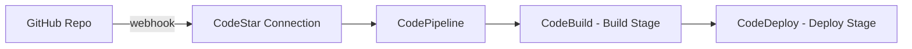

# How to Set Up CodePipeline with GitHub as Source

Author: [nawazdhandala](https://github.com/nawazdhandala)

Tags: AWS, CodePipeline, GitHub, CI/CD, DevOps

Description: Complete guide to connecting AWS CodePipeline with GitHub repositories using CodeStar Connections, including webhook setup and pipeline configuration.

---

AWS CodePipeline is a solid CI/CD service, but setting up the GitHub integration can be confusing. AWS has changed the recommended approach multiple times - from OAuth tokens to GitHub Apps via CodeStar Connections. The current best practice uses CodeStar Connections (also called AWS Connector for GitHub), which is more secure and gives better visibility into what AWS can access in your repos.

This guide walks through setting up a CodePipeline that triggers automatically when you push to a GitHub repository.

## The Architecture



When you push to GitHub, the CodeStar Connection detects the change and triggers CodePipeline. The pipeline then runs through whatever stages you've configured - typically build and deploy.

## Step 1: Create a CodeStar Connection

The CodeStar Connection is a one-time setup that authorizes AWS to access your GitHub account or organization.

```bash
# Create the connection
aws codestar-connections create-connection \
  --provider-type GitHub \
  --connection-name my-github-connection
```

This creates the connection in a "Pending" state. You need to complete the handshake in the AWS Console:

1. Go to **Settings > Connections** in the CodePipeline console (or Developer Tools settings)
2. Find your pending connection
3. Click **Update pending connection**
4. Authorize the AWS Connector for GitHub app
5. Choose which repositories to grant access to

After authorization, the connection status changes to "Available."

```bash
# Verify the connection is available
aws codestar-connections get-connection \
  --connection-arn arn:aws:codestar-connections:us-east-1:123456789:connection/abc-123 \
  --query 'Connection.ConnectionStatus'
```

## Step 2: Create an S3 Artifact Bucket

CodePipeline stores artifacts between stages in S3:

```bash
# Create the artifact bucket
aws s3 mb s3://my-pipeline-artifacts-123456789

# Enable versioning (required for CodePipeline)
aws s3api put-bucket-versioning \
  --bucket my-pipeline-artifacts-123456789 \
  --versioning-configuration Status=Enabled
```

## Step 3: Create the Pipeline IAM Role

CodePipeline needs an IAM role with permissions for all the services it orchestrates:

```json
{
  "Version": "2012-10-17",
  "Statement": [
    {
      "Effect": "Allow",
      "Action": [
        "s3:GetObject",
        "s3:PutObject",
        "s3:GetBucketVersioning"
      ],
      "Resource": [
        "arn:aws:s3:::my-pipeline-artifacts-123456789",
        "arn:aws:s3:::my-pipeline-artifacts-123456789/*"
      ]
    },
    {
      "Effect": "Allow",
      "Action": [
        "codestar-connections:UseConnection"
      ],
      "Resource": "arn:aws:codestar-connections:us-east-1:123456789:connection/abc-123"
    },
    {
      "Effect": "Allow",
      "Action": [
        "codebuild:BatchGetBuilds",
        "codebuild:StartBuild"
      ],
      "Resource": "*"
    },
    {
      "Effect": "Allow",
      "Action": [
        "codedeploy:CreateDeployment",
        "codedeploy:GetApplication",
        "codedeploy:GetApplicationRevision",
        "codedeploy:GetDeployment",
        "codedeploy:GetDeploymentConfig",
        "codedeploy:RegisterApplicationRevision"
      ],
      "Resource": "*"
    }
  ]
}
```

Create the role:

```bash
# Create the pipeline role
aws iam create-role \
  --role-name CodePipelineServiceRole \
  --assume-role-policy-document '{
    "Version": "2012-10-17",
    "Statement": [{
      "Effect": "Allow",
      "Principal": {"Service": "codepipeline.amazonaws.com"},
      "Action": "sts:AssumeRole"
    }]
  }'

# Attach the policy
aws iam put-role-policy \
  --role-name CodePipelineServiceRole \
  --policy-name CodePipelinePolicy \
  --policy-document file://pipeline-policy.json
```

## Step 4: Create the Pipeline

Now put it all together. Here's a pipeline definition with a GitHub source stage, a CodeBuild build stage, and a CodeDeploy deploy stage:

```json
{
  "pipeline": {
    "name": "my-app-pipeline",
    "roleArn": "arn:aws:iam::123456789012:role/CodePipelineServiceRole",
    "artifactStore": {
      "type": "S3",
      "location": "my-pipeline-artifacts-123456789"
    },
    "stages": [
      {
        "name": "Source",
        "actions": [
          {
            "name": "GitHub-Source",
            "actionTypeId": {
              "category": "Source",
              "owner": "AWS",
              "provider": "CodeStarSourceConnection",
              "version": "1"
            },
            "configuration": {
              "ConnectionArn": "arn:aws:codestar-connections:us-east-1:123456789:connection/abc-123",
              "FullRepositoryId": "my-org/my-repo",
              "BranchName": "main",
              "OutputArtifactFormat": "CODE_ZIP"
            },
            "outputArtifacts": [
              {"name": "SourceOutput"}
            ]
          }
        ]
      },
      {
        "name": "Build",
        "actions": [
          {
            "name": "CodeBuild",
            "actionTypeId": {
              "category": "Build",
              "owner": "AWS",
              "provider": "CodeBuild",
              "version": "1"
            },
            "configuration": {
              "ProjectName": "my-app-build"
            },
            "inputArtifacts": [
              {"name": "SourceOutput"}
            ],
            "outputArtifacts": [
              {"name": "BuildOutput"}
            ]
          }
        ]
      },
      {
        "name": "Deploy",
        "actions": [
          {
            "name": "CodeDeploy",
            "actionTypeId": {
              "category": "Deploy",
              "owner": "AWS",
              "provider": "CodeDeploy",
              "version": "1"
            },
            "configuration": {
              "ApplicationName": "MyApp",
              "DeploymentGroupName": "Production"
            },
            "inputArtifacts": [
              {"name": "BuildOutput"}
            ]
          }
        ]
      }
    ]
  }
}
```

Create the pipeline:

```bash
# Create the pipeline from the JSON definition
aws codepipeline create-pipeline \
  --cli-input-json file://pipeline.json
```

## Step 5: Set Up the CodeBuild Project

If you don't have a CodeBuild project yet, create one:

```bash
# Create a CodeBuild project
aws codebuild create-project \
  --name my-app-build \
  --source type=CODEPIPELINE \
  --artifacts type=CODEPIPELINE \
  --environment type=LINUX_CONTAINER,computeType=BUILD_GENERAL1_SMALL,image=aws/codebuild/amazonlinux2-x86_64-standard:4.0 \
  --service-role arn:aws:iam::123456789012:role/CodeBuildServiceRole
```

And a buildspec file in your repository:

```yaml
# buildspec.yml - Build specification for CodeBuild
version: 0.2

phases:
  install:
    runtime-versions:
      nodejs: 18
    commands:
      - npm ci
  pre_build:
    commands:
      - echo "Running tests..."
      - npm test
  build:
    commands:
      - echo "Building application..."
      - npm run build
  post_build:
    commands:
      - echo "Build completed on $(date)"

artifacts:
  files:
    - '**/*'
  base-directory: dist
```

## Triggering on Specific Branches

By default, the pipeline triggers on pushes to the branch you specified. To trigger on multiple branches, you'll need separate pipelines or use the trigger configuration:

```json
{
  "name": "GitHub-Source",
  "actionTypeId": {
    "category": "Source",
    "owner": "AWS",
    "provider": "CodeStarSourceConnection",
    "version": "1"
  },
  "configuration": {
    "ConnectionArn": "arn:aws:codestar-connections:us-east-1:123456789:connection/abc-123",
    "FullRepositoryId": "my-org/my-repo",
    "BranchName": "main",
    "DetectChanges": "true"
  }
}
```

Set `DetectChanges` to `false` if you want manual-only triggers.

## Triggering on Pull Requests

CodePipeline V2 supports triggering on pull request events:

```bash
# Update pipeline to V2 type with PR triggers
aws codepipeline update-pipeline \
  --pipeline '{
    "name": "my-app-pipeline",
    "pipelineType": "V2",
    "triggers": [
      {
        "providerType": "CodeStarSourceConnection",
        "gitConfiguration": {
          "sourceActionName": "GitHub-Source",
          "push": [
            {
              "branches": {
                "includes": ["main", "release/*"]
              }
            }
          ],
          "pullRequest": [
            {
              "events": ["OPEN", "UPDATED"],
              "branches": {
                "includes": ["main"]
              }
            }
          ]
        }
      }
    ]
  }'
```

## Monitoring Pipeline Execution

Watch your pipeline run:

```bash
# Get pipeline state
aws codepipeline get-pipeline-state \
  --name my-app-pipeline

# Get execution details
aws codepipeline get-pipeline-execution \
  --pipeline-name my-app-pipeline \
  --pipeline-execution-id abc-123-def
```

For setting up notifications when pipelines fail or succeed, check out our guide on [CodePipeline notifications](https://oneuptime.com/blog/post/2026-02-12-codepipeline-notifications/view).

## Troubleshooting

If your pipeline doesn't trigger on pushes:

1. Verify the CodeStar Connection is in "Available" status
2. Check that `DetectChanges` is set to `true` (or not set, since it defaults to true)
3. Make sure the branch name matches exactly
4. Verify the IAM role has `codestar-connections:UseConnection` permission

If the source stage fails, it's almost always a connection or permission issue. The CodeStar Connection needs to be authorized for the specific repository you're pulling from.

For more advanced pipeline configurations, check our guides on [adding manual approval steps](https://oneuptime.com/blog/post/2026-02-12-codepipeline-manual-approval/view) and [cross-account deployments](https://oneuptime.com/blog/post/2026-02-12-cross-account-codepipeline/view). And for comprehensive CI/CD monitoring, [OneUptime](https://oneuptime.com) can help you track pipeline execution times, failure rates, and deployment frequency across all your projects.
