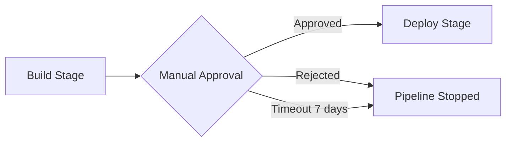

# How to Add Manual Approval Steps to CodePipeline

Author: [nawazdhandala](https://github.com/nawazdhandala)

Tags: AWS, CodePipeline, CI/CD, DevOps

Description: Learn how to add manual approval actions to AWS CodePipeline for gated deployments, including SNS notifications and IAM permissions for approvers.

---

Not every deployment should be fully automated. Sometimes you need a human to review changes before they hit production. Maybe it's a compliance requirement, maybe you want a product manager to sign off on a release, or maybe you just don't trust your test suite enough to let things auto-deploy on a Friday afternoon.

AWS CodePipeline supports manual approval actions that pause the pipeline and wait for someone to approve or reject the deployment. You can attach SNS notifications to alert the right people, and IAM policies to control who can approve.

## How Manual Approval Works

When a pipeline hits a manual approval action, it pauses and sends a notification. The pipeline stays in an "InProgress" state until someone either approves or rejects it. If nobody acts within the timeout period (up to 7 days), the approval is automatically rejected.



## Step 1: Create an SNS Topic for Notifications

First, set up an SNS topic so approvers get notified:

```bash
# Create SNS topic for approval notifications
aws sns create-topic \
  --name pipeline-approval-notifications

# Subscribe an email address
aws sns subscribe \
  --topic-arn arn:aws:sns:us-east-1:123456789:pipeline-approval-notifications \
  --protocol email \
  --notification-endpoint team-leads@example.com
```

You can subscribe multiple email addresses, a Slack webhook via Lambda, or any other SNS-supported endpoint.

For Slack integration, you'd create a Lambda function subscribed to the topic:

```python
# lambda_function.py - Forward SNS approval notifications to Slack
import json
import urllib3

SLACK_WEBHOOK_URL = "https://hooks.slack.com/services/T00/B00/xxxx"

def handler(event, context):
    message = json.loads(event['Records'][0]['Sns']['Message'])

    approval = message.get('approval', {})
    pipeline_name = approval.get('pipelineName', 'Unknown')
    stage_name = approval.get('stageName', 'Unknown')
    action_name = approval.get('actionName', 'Unknown')
    review_link = approval.get('approvalReviewLink', '#')
    custom_data = approval.get('customData', 'No details provided')

    slack_message = {
        "text": f"Pipeline approval needed for *{pipeline_name}*",
        "blocks": [
            {
                "type": "section",
                "text": {
                    "type": "mrkdwn",
                    "text": f"*Pipeline:* {pipeline_name}\n*Stage:* {stage_name}\n*Action:* {action_name}\n*Details:* {custom_data}"
                }
            },
            {
                "type": "actions",
                "elements": [
                    {
                        "type": "button",
                        "text": {"type": "plain_text", "text": "Review in AWS Console"},
                        "url": review_link
                    }
                ]
            }
        ]
    }

    http = urllib3.PoolManager()
    http.request('POST', SLACK_WEBHOOK_URL,
                 body=json.dumps(slack_message),
                 headers={'Content-Type': 'application/json'})
```

## Step 2: Add the Approval Action to Your Pipeline

You can add the approval action when creating a new pipeline or update an existing one. Here's the stage definition:

```json
{
  "name": "Approval",
  "actions": [
    {
      "name": "ManualApproval",
      "actionTypeId": {
        "category": "Approval",
        "owner": "AWS",
        "provider": "Manual",
        "version": "1"
      },
      "configuration": {
        "NotificationArn": "arn:aws:sns:us-east-1:123456789:pipeline-approval-notifications",
        "CustomData": "Please review the staging deployment at https://staging.example.com before approving production deployment.",
        "ExternalEntityLink": "https://staging.example.com"
      },
      "runOrder": 1
    }
  ]
}
```

The `CustomData` field shows up in the notification and in the console. Use it to give approvers context about what they're approving. The `ExternalEntityLink` provides a clickable URL - perfect for linking to your staging environment.

To add this to an existing pipeline:

```bash
# Get the current pipeline definition
aws codepipeline get-pipeline \
  --name my-app-pipeline > pipeline.json

# Edit pipeline.json to add the approval stage between Build and Deploy
# Then update the pipeline
aws codepipeline update-pipeline \
  --cli-input-json file://pipeline.json
```

A complete pipeline with an approval gate looks like this:

```json
{
  "pipeline": {
    "name": "my-app-pipeline",
    "roleArn": "arn:aws:iam::123456789012:role/CodePipelineServiceRole",
    "stages": [
      {
        "name": "Source",
        "actions": [
          {
            "name": "GitHub",
            "actionTypeId": {
              "category": "Source",
              "owner": "AWS",
              "provider": "CodeStarSourceConnection",
              "version": "1"
            },
            "configuration": {
              "ConnectionArn": "arn:aws:codestar-connections:us-east-1:123456789:connection/abc-123",
              "FullRepositoryId": "my-org/my-repo",
              "BranchName": "main"
            },
            "outputArtifacts": [{"name": "SourceOutput"}]
          }
        ]
      },
      {
        "name": "Build",
        "actions": [
          {
            "name": "Build",
            "actionTypeId": {
              "category": "Build",
              "owner": "AWS",
              "provider": "CodeBuild",
              "version": "1"
            },
            "configuration": {"ProjectName": "my-app-build"},
            "inputArtifacts": [{"name": "SourceOutput"}],
            "outputArtifacts": [{"name": "BuildOutput"}]
          }
        ]
      },
      {
        "name": "Staging-Deploy",
        "actions": [
          {
            "name": "DeployToStaging",
            "actionTypeId": {
              "category": "Deploy",
              "owner": "AWS",
              "provider": "CodeDeploy",
              "version": "1"
            },
            "configuration": {
              "ApplicationName": "MyApp",
              "DeploymentGroupName": "Staging"
            },
            "inputArtifacts": [{"name": "BuildOutput"}]
          }
        ]
      },
      {
        "name": "Production-Approval",
        "actions": [
          {
            "name": "ApproveProduction",
            "actionTypeId": {
              "category": "Approval",
              "owner": "AWS",
              "provider": "Manual",
              "version": "1"
            },
            "configuration": {
              "NotificationArn": "arn:aws:sns:us-east-1:123456789:pipeline-approval-notifications",
              "CustomData": "Staging deployment complete. Review at https://staging.example.com",
              "ExternalEntityLink": "https://staging.example.com"
            }
          }
        ]
      },
      {
        "name": "Production-Deploy",
        "actions": [
          {
            "name": "DeployToProduction",
            "actionTypeId": {
              "category": "Deploy",
              "owner": "AWS",
              "provider": "CodeDeploy",
              "version": "1"
            },
            "configuration": {
              "ApplicationName": "MyApp",
              "DeploymentGroupName": "Production"
            },
            "inputArtifacts": [{"name": "BuildOutput"}]
          }
        ]
      }
    ]
  }
}
```

## Step 3: Set Up IAM for Approvers

Control who can approve deployments with IAM:

```json
{
  "Version": "2012-10-17",
  "Statement": [
    {
      "Effect": "Allow",
      "Action": [
        "codepipeline:PutApprovalResult"
      ],
      "Resource": "arn:aws:codepipeline:us-east-1:123456789:my-app-pipeline/Production-Approval/ApproveProduction"
    },
    {
      "Effect": "Allow",
      "Action": [
        "codepipeline:GetPipelineState",
        "codepipeline:GetPipeline"
      ],
      "Resource": "arn:aws:codepipeline:us-east-1:123456789:my-app-pipeline"
    }
  ]
}
```

Attach this policy to an IAM group for your release managers:

```bash
# Create the approvers group
aws iam create-group --group-name PipelineApprovers

# Attach the policy
aws iam put-group-policy \
  --group-name PipelineApprovers \
  --policy-name PipelineApprovalPolicy \
  --policy-document file://approver-policy.json
```

## Step 4: Approving or Rejecting via CLI

Approvers can use the console or the CLI:

```bash
# Approve the deployment
aws codepipeline put-approval-result \
  --pipeline-name my-app-pipeline \
  --stage-name Production-Approval \
  --action-name ApproveProduction \
  --result summary="Verified staging looks good",status=Approved \
  --token "approval-token-from-notification"
```

The token comes from the SNS notification or can be retrieved from the pipeline state:

```bash
# Get the approval token
aws codepipeline get-pipeline-state \
  --name my-app-pipeline \
  --query 'stageStates[?stageName==`Production-Approval`].actionStates[0].latestExecution.token' \
  --output text
```

To reject:

```bash
# Reject the deployment
aws codepipeline put-approval-result \
  --pipeline-name my-app-pipeline \
  --stage-name Production-Approval \
  --action-name ApproveProduction \
  --result summary="Found bug in staging - rejecting",status=Rejected \
  --token "approval-token"
```

## Multiple Approval Gates

For high-risk deployments, you might want multiple approval gates. Just add more approval actions with different `runOrder` values:

```json
{
  "name": "Multi-Approval",
  "actions": [
    {
      "name": "TechLeadApproval",
      "actionTypeId": {
        "category": "Approval",
        "owner": "AWS",
        "provider": "Manual",
        "version": "1"
      },
      "configuration": {
        "CustomData": "Tech lead review needed"
      },
      "runOrder": 1
    },
    {
      "name": "PMApproval",
      "actionTypeId": {
        "category": "Approval",
        "owner": "AWS",
        "provider": "Manual",
        "version": "1"
      },
      "configuration": {
        "CustomData": "Product manager sign-off needed"
      },
      "runOrder": 1
    }
  ]
}
```

When both actions have the same `runOrder`, they run in parallel - both must be approved for the pipeline to continue.

## Best Practices

A few things I've learned about approval gates:

- Keep the timeout reasonable. Seven days is the max, but if nobody approves within 24 hours, something's probably wrong with your process.
- Always include context in `CustomData`. "Please approve" tells the approver nothing. "v2.3.1 deployed to staging, includes ticket PROJ-456" is much better.
- Don't put approvals before every stage. One gate between staging and production is usually enough. Too many gates slow everything down.
- Monitor pending approvals. If deployments are sitting waiting for approval for hours, you've got a bottleneck.

For pipeline monitoring and alerting on stuck approvals, check out [OneUptime](https://oneuptime.com). And for handling pipeline failures, see our guide on [troubleshooting CodePipeline failures](https://oneuptime.com/blog/post/troubleshoot-codepipeline-failures/view).
