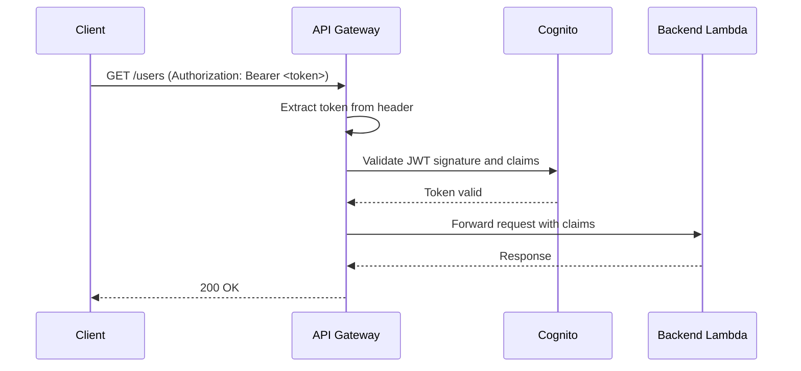

# How to Integrate Cognito with API Gateway for Authorization

Author: [nawazdhandala](https://github.com/nawazdhandala)

Tags: AWS, Cognito, API Gateway, Authorization

Description: Learn how to integrate AWS Cognito with API Gateway to secure your REST APIs with JWT-based authorization, including setup, token validation, and access control patterns.

---

If you're building APIs on AWS, there's a good chance you're using API Gateway. And if your users authenticate through Cognito, connecting the two is one of the most natural ways to secure your endpoints. Instead of writing authorization code in every Lambda function, you let API Gateway handle token validation before the request even reaches your backend.

There are a few ways to set this up, each with different tradeoffs. Let's walk through the options and build a working integration.

## Authorization Options in API Gateway

API Gateway offers three types of authorizers:

1. **Cognito User Pool Authorizer** - the simplest option. API Gateway validates the JWT token directly against your Cognito User Pool. No custom code needed.
2. **Lambda Authorizer (Token-based)** - your own Lambda function validates the token and returns an IAM policy. More flexible but more work.
3. **IAM Authorization** - uses IAM credentials (often from Cognito Identity Pools). Best for AWS SDK-based access patterns.

For most REST APIs, the Cognito User Pool Authorizer is the way to go. It handles JWT validation automatically and requires zero custom code.

## Setting Up a Cognito Authorizer

Let's create a Cognito authorizer on your API Gateway REST API.

First, create the authorizer:

```bash
# Get your API Gateway REST API ID
API_ID=$(aws apigateway get-rest-apis --query "items[?name=='MyAPI'].id" --output text)

# Create a Cognito authorizer
aws apigateway create-authorizer \
    --rest-api-id $API_ID \
    --name CognitoAuth \
    --type COGNITO_USER_POOLS \
    --provider-arns arn:aws:cognito-idp:us-east-1:123456789:userpool/us-east-1_XXXXXXXXX \
    --identity-source method.request.header.Authorization
```

The `identity-source` tells API Gateway where to find the token - in this case, the standard Authorization header.

Now attach it to your API methods:

```bash
# Get the authorizer ID
AUTH_ID=$(aws apigateway get-authorizers --rest-api-id $API_ID \
    --query "items[?name=='CognitoAuth'].id" --output text)

# Get the resource ID for your endpoint
RESOURCE_ID=$(aws apigateway get-resources --rest-api-id $API_ID \
    --query "items[?path=='/users'].id" --output text)

# Apply the authorizer to a GET method
aws apigateway update-method \
    --rest-api-id $API_ID \
    --resource-id $RESOURCE_ID \
    --http-method GET \
    --patch-operations \
        op=replace,path=/authorizationType,value=COGNITO_USER_POOLS \
        op=replace,path=/authorizerId,value=$AUTH_ID
```

After making changes, don't forget to deploy:

```bash
aws apigateway create-deployment \
    --rest-api-id $API_ID \
    --stage-name prod
```

## How Token Validation Works

When a request hits your API with a Cognito authorizer, here's what happens behind the scenes:



API Gateway checks:
- The JWT signature against Cognito's public keys
- The token hasn't expired
- The `iss` claim matches the configured User Pool
- The `token_use` is either "id" or "access"

If validation fails, the client gets a 401 response before your backend code even runs.

## Accessing User Information in Lambda

When the token is valid, API Gateway passes the decoded claims to your Lambda function through the request context.

Here's how to access user claims in your Lambda backend:

```javascript
// Lambda handler behind API Gateway with Cognito authorizer
exports.handler = async (event) => {
    // User claims are in the request context
    const claims = event.requestContext.authorizer.claims;

    const userId = claims.sub;
    const email = claims.email;
    const username = claims['cognito:username'];
    const groups = claims['cognito:groups'];

    console.log(`Request from user: ${username} (${email})`);

    // Use claims for application logic
    return {
        statusCode: 200,
        body: JSON.stringify({
            message: `Hello ${username}`,
            userId: userId,
            groups: groups
        }),
        headers: {
            'Content-Type': 'application/json'
        }
    };
};
```

## Requiring Specific Scopes

If your app client defines custom scopes through a Cognito resource server, you can require specific scopes on your API methods. This gives you finer-grained access control.

Set up a resource server in Cognito first:

```bash
# Create a resource server with custom scopes
aws cognito-idp create-resource-server \
    --user-pool-id us-east-1_XXXXXXXXX \
    --identifier "myapi" \
    --name "My API" \
    --scopes ScopeName=read,ScopeDescription="Read access" \
             ScopeName=write,ScopeDescription="Write access" \
             ScopeName=admin,ScopeDescription="Admin access"

# Update the app client to allow these scopes
aws cognito-idp update-user-pool-client \
    --user-pool-id us-east-1_XXXXXXXXX \
    --client-id your-app-client-id \
    --allowed-o-auth-scopes "myapi/read" "myapi/write" "openid" "email"
```

Then configure your API method to require specific scopes:

```bash
# Require the 'myapi/write' scope for POST /users
aws apigateway update-method \
    --rest-api-id $API_ID \
    --resource-id $RESOURCE_ID \
    --http-method POST \
    --patch-operations \
        op=replace,path=/authorizationType,value=COGNITO_USER_POOLS \
        op=replace,path=/authorizerId,value=$AUTH_ID \
        op=replace,path=/authorizationScopes,value='myapi/write'
```

## Lambda Authorizer for Advanced Cases

The built-in Cognito authorizer is convenient but limited. If you need to check group membership, verify custom claims, or add request context based on database lookups, you'll want a Lambda authorizer.

Here's a Lambda authorizer that checks Cognito groups:

```javascript
const jwt = require('jsonwebtoken');
const jwksClient = require('jwks-rsa');

const client = jwksClient({
    jwksUri: 'https://cognito-idp.us-east-1.amazonaws.com/us-east-1_XXXXXXXXX/.well-known/jwks.json',
    cache: true
});

exports.handler = async (event) => {
    const token = event.authorizationToken.replace('Bearer ', '');

    try {
        // Decode header to get kid
        const decoded = jwt.decode(token, { complete: true });
        const kid = decoded.header.kid;

        // Get the signing key
        const key = await new Promise((resolve, reject) => {
            client.getSigningKey(kid, (err, k) => {
                if (err) reject(err);
                else resolve(k.getPublicKey());
            });
        });

        // Verify the token
        const payload = jwt.verify(token, key, {
            issuer: 'https://cognito-idp.us-east-1.amazonaws.com/us-east-1_XXXXXXXXX',
            algorithms: ['RS256']
        });

        // Check group membership for admin endpoints
        const groups = payload['cognito:groups'] || [];
        const resource = event.methodArn;

        // Build the IAM policy
        const effect = 'Allow';

        return {
            principalId: payload.sub,
            policyDocument: {
                Version: '2012-10-17',
                Statement: [{
                    Action: 'execute-api:Invoke',
                    Effect: effect,
                    Resource: event.methodArn
                }]
            },
            context: {
                userId: payload.sub,
                email: payload.email || '',
                groups: JSON.stringify(groups)
            }
        };
    } catch (error) {
        console.error('Authorization failed:', error);
        throw new Error('Unauthorized');
    }
};
```

## Making API Calls from the Client

On the client side, attach the Cognito token to every API request.

Here's the client-side code for calling your secured API:

```javascript
async function callSecuredAPI(endpoint, method = 'GET', body = null) {
    // Get a fresh access token
    const session = await Auth.currentSession();
    const token = session.getIdToken().getJwtToken();

    const options = {
        method,
        headers: {
            'Authorization': `Bearer ${token}`,
            'Content-Type': 'application/json'
        }
    };

    if (body) {
        options.body = JSON.stringify(body);
    }

    const response = await fetch(
        `https://your-api-id.execute-api.us-east-1.amazonaws.com/prod${endpoint}`,
        options
    );

    if (response.status === 401) {
        // Token might be expired - trigger refresh and retry
        console.log('Token expired, refreshing...');
        throw new Error('TOKEN_EXPIRED');
    }

    return response.json();
}
```

For details on how Cognito authorizers specifically work and additional configuration options, see [using Cognito authorizers with API Gateway](https://oneuptime.com/blog/post/cognito-authorizers-api-gateway/view). And if you need to handle token refresh on the client side, check out [handling Cognito token refresh in applications](https://oneuptime.com/blog/post/cognito-token-refresh-applications/view).

## CORS Configuration

When calling API Gateway from a browser, you'll need CORS headers. Make sure your API returns the right headers and allows the Authorization header:

```bash
# Enable CORS on the resource
aws apigateway put-method \
    --rest-api-id $API_ID \
    --resource-id $RESOURCE_ID \
    --http-method OPTIONS \
    --authorization-type NONE

# Set up the OPTIONS response with CORS headers
aws apigateway put-integration \
    --rest-api-id $API_ID \
    --resource-id $RESOURCE_ID \
    --http-method OPTIONS \
    --type MOCK \
    --request-templates '{"application/json": "{\"statusCode\": 200}"}'
```

## Wrapping Up

Integrating Cognito with API Gateway is the standard approach for securing AWS-based APIs. The built-in Cognito authorizer handles JWT validation without any code, and Lambda authorizers give you the flexibility to implement custom logic when you need it. Start with the Cognito authorizer for simplicity, and move to a Lambda authorizer when you need group-based access control or external data lookups. Either way, your backend Lambda functions get clean, pre-validated user claims in the request context.
