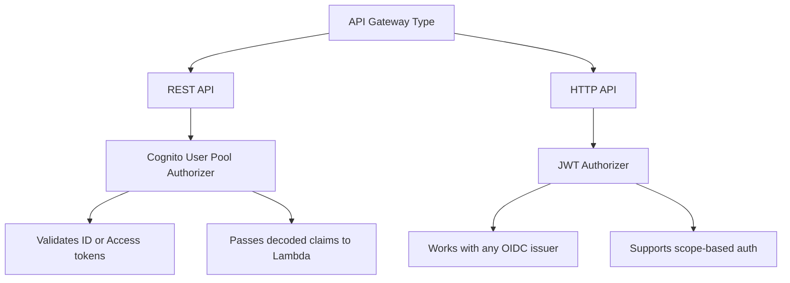

# How to Use Cognito Authorizers with API Gateway

Author: [nawazdhandala](https://github.com/nawazdhandala)

Tags: AWS, Cognito, API Gateway, Serverless

Description: A detailed guide to configuring and using Cognito authorizers with AWS API Gateway, covering both REST and HTTP APIs, token types, caching, and troubleshooting common issues.

---

Cognito authorizers are the fastest way to add authentication to an API Gateway endpoint. You point API Gateway at your Cognito User Pool, and it handles JWT validation automatically. No Lambda function, no custom code, no JWKS fetching. Requests with valid tokens get through; everything else gets a 401.

But there are nuances you need to understand - differences between REST and HTTP APIs, ID tokens vs access tokens, authorizer caching, and what happens when things go wrong. Let's dig into all of it.

## REST API vs HTTP API Authorizers

API Gateway has two flavors: REST APIs and HTTP APIs. They handle Cognito authorization differently.

**REST API** uses a "Cognito User Pool Authorizer" that validates tokens and passes decoded claims to your backend.

**HTTP API** uses a "JWT Authorizer" that works with any OIDC provider, including Cognito. It's more flexible but slightly different to configure.



## Setting Up a REST API Cognito Authorizer

For REST APIs, the Cognito authorizer is purpose-built for Cognito User Pools.

Create the authorizer using CloudFormation or SAM:

```yaml
# template.yaml (SAM)
Resources:
  MyApi:
    Type: AWS::Serverless::Api
    Properties:
      StageName: prod
      Auth:
        DefaultAuthorizer: CognitoAuthorizer
        Authorizers:
          CognitoAuthorizer:
            UserPoolArn: !GetAtt UserPool.Arn
            AuthorizationScopes:
              - openid
              - email

  GetUsersFunction:
    Type: AWS::Serverless::Function
    Properties:
      Handler: index.handler
      Runtime: nodejs20.x
      Events:
        GetUsers:
          Type: Api
          Properties:
            Path: /users
            Method: GET
            RestApiId: !Ref MyApi
            Auth:
              Authorizer: CognitoAuthorizer
```

Or create it via the CLI:

```bash
# Create the Cognito authorizer for a REST API
AUTHORIZER_ID=$(aws apigateway create-authorizer \
    --rest-api-id $API_ID \
    --name MyCognitoAuth \
    --type COGNITO_USER_POOLS \
    --provider-arns arn:aws:cognito-idp:us-east-1:123456789:userpool/us-east-1_XXXXXXXXX \
    --identity-source "method.request.header.Authorization" \
    --query 'id' --output text)

echo "Authorizer created: $AUTHORIZER_ID"
```

## Setting Up an HTTP API JWT Authorizer

HTTP APIs use the more generic JWT authorizer. You configure the issuer URL and audience.

Create a JWT authorizer for an HTTP API:

```bash
# Create the JWT authorizer
aws apigatewayv2 create-authorizer \
    --api-id $HTTP_API_ID \
    --name CognitoJWTAuth \
    --authorizer-type JWT \
    --identity-source '$request.header.Authorization' \
    --jwt-configuration \
        Issuer=https://cognito-idp.us-east-1.amazonaws.com/us-east-1_XXXXXXXXX,Audience=your-app-client-id

# Attach it to a route
aws apigatewayv2 update-route \
    --api-id $HTTP_API_ID \
    --route-id $ROUTE_ID \
    --authorization-type JWT \
    --authorizer-id $JWT_AUTHORIZER_ID \
    --authorization-scopes "openid" "email"
```

The HTTP API JWT authorizer is actually more capable in one key way: it can enforce OAuth scopes directly on routes. This makes it easy to have read-only routes that require one scope and write routes that require another.

## ID Token vs Access Token

This is a common source of confusion. Both tokens are JWTs, but they serve different purposes and contain different claims.

**ID Token:**
- Contains user profile information (email, name, phone)
- Has the `aud` claim set to your app client ID
- `token_use` is "id"
- Best for: getting user info on the frontend

**Access Token:**
- Contains authorization information (scopes, groups)
- Has the `client_id` claim (not `aud`)
- `token_use` is "access"
- Best for: API authorization

Here's which token to use for each authorizer type:

```javascript
// For REST API Cognito Authorizer - either token works
// ID token gives you user attributes in claims
const headers = {
    Authorization: `Bearer ${idToken}`
};

// For HTTP API JWT Authorizer - access token required for scope checks
// The authorizer validates against the configured audience
const headers = {
    Authorization: `Bearer ${accessToken}`
};
```

If your HTTP API authorizer checks scopes, you must use the access token because only the access token contains the `scope` claim.

## Reading Claims in Your Lambda Function

The way claims appear in your Lambda depends on the API type.

For REST API, claims are in `event.requestContext.authorizer.claims`:

```javascript
// REST API Lambda handler
exports.handler = async (event) => {
    const claims = event.requestContext.authorizer.claims;

    // Claims from the token
    const userId = claims.sub;
    const email = claims.email;
    const groups = claims['cognito:groups']; // Comma-separated string in REST API

    // Note: groups come as a string, not an array
    const groupArray = groups ? groups.split(',') : [];

    return {
        statusCode: 200,
        body: JSON.stringify({
            userId,
            email,
            isAdmin: groupArray.includes('Admins')
        })
    };
};
```

For HTTP API, claims are in `event.requestContext.authorizer.jwt.claims`:

```javascript
// HTTP API Lambda handler
exports.handler = async (event) => {
    const claims = event.requestContext.authorizer.jwt.claims;

    // Claims from the token
    const userId = claims.sub;
    const email = claims.email;
    const scopes = event.requestContext.authorizer.jwt.scopes;

    return {
        statusCode: 200,
        body: JSON.stringify({
            userId,
            email,
            scopes
        })
    };
};
```

## Authorizer Caching

REST API Cognito authorizers support response caching. When enabled, API Gateway caches the authorization result for a configurable TTL, so it doesn't validate the token on every single request.

Configure caching on the authorizer:

```bash
# Set a 5-minute cache TTL
aws apigateway update-authorizer \
    --rest-api-id $API_ID \
    --authorizer-id $AUTHORIZER_ID \
    --patch-operations \
        op=replace,path=/authorizerResultTtlInSeconds,value=300
```

Caching is good for performance but has a gotcha: if you revoke a user's access or change their groups, the cached authorization result won't reflect that until the TTL expires. For sensitive operations, consider shorter TTLs or disabling caching entirely (set TTL to 0).

HTTP API JWT authorizers don't have configurable caching - AWS handles the optimization internally.

## Handling Public and Protected Routes

Most APIs have a mix of public and protected endpoints. With API Gateway, you can set a default authorizer and override it on specific routes.

Here's a SAM template with mixed authorization:

```yaml
Resources:
  MyApi:
    Type: AWS::Serverless::Api
    Properties:
      StageName: prod
      Auth:
        DefaultAuthorizer: CognitoAuth
        Authorizers:
          CognitoAuth:
            UserPoolArn: !GetAtt UserPool.Arn

  # This endpoint requires authentication (uses default authorizer)
  GetProfileFunction:
    Type: AWS::Serverless::Function
    Properties:
      Handler: profile.handler
      Runtime: nodejs20.x
      Events:
        GetProfile:
          Type: Api
          Properties:
            Path: /profile
            Method: GET
            RestApiId: !Ref MyApi

  # This endpoint is public (overrides the default authorizer)
  HealthCheckFunction:
    Type: AWS::Serverless::Function
    Properties:
      Handler: health.handler
      Runtime: nodejs20.x
      Events:
        HealthCheck:
          Type: Api
          Properties:
            Path: /health
            Method: GET
            RestApiId: !Ref MyApi
            Auth:
              Authorizer: NONE
```

## Testing Your Authorizer

You can test the authorizer directly through the API Gateway console or with curl.

Test with a valid token:

```bash
# Get a token first (using the admin CLI for testing)
TOKEN=$(aws cognito-idp admin-initiate-auth \
    --user-pool-id us-east-1_XXXXXXXXX \
    --client-id your-app-client-id \
    --auth-flow ADMIN_USER_PASSWORD_AUTH \
    --auth-parameters USERNAME=testuser,PASSWORD=TestPassword123! \
    --query 'AuthenticationResult.IdToken' --output text)

# Call your API with the token
curl -H "Authorization: Bearer $TOKEN" \
    https://your-api-id.execute-api.us-east-1.amazonaws.com/prod/users

# Call without a token - should get 401
curl https://your-api-id.execute-api.us-east-1.amazonaws.com/prod/users
```

## Troubleshooting Common Issues

**"Unauthorized" with a valid token**: Check that you're using the right token type. REST API authorizers accept both ID and access tokens, but HTTP API authorizers need the audience to match. Also verify the token hasn't expired.

**Claims are empty or missing**: Make sure you're reading from the correct path in the event object. REST and HTTP APIs put claims in different locations.

**CORS preflight fails**: OPTIONS requests shouldn't require authorization. Make sure your CORS configuration sends OPTIONS requests through without the authorizer.

For a broader look at integrating Cognito with API Gateway, see [integrating Cognito with API Gateway for authorization](https://oneuptime.com/blog/post/2026-02-12-cognito-api-gateway-authorization/view). And for understanding how the tokens themselves work, check out [decoding and validating Cognito JWT tokens](https://oneuptime.com/blog/post/2026-02-12-decode-validate-cognito-jwt-tokens/view).

## Wrapping Up

Cognito authorizers give you authentication at the infrastructure level. API Gateway validates tokens before your code runs, which means cleaner Lambda functions and consistent security across all your endpoints. Choose the REST API Cognito authorizer for simplicity and claim access, or the HTTP API JWT authorizer for scope-based authorization. Either way, you're getting managed token validation with no custom code required.
