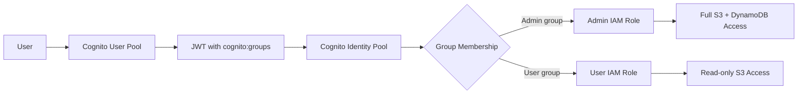

# How to Map Cognito Groups to IAM Roles

Author: [nawazdhandala](https://github.com/nawazdhandala)

Tags: AWS, Cognito, IAM, Security

Description: Learn how to map AWS Cognito user pool groups to IAM roles so authenticated users can access AWS resources like S3, DynamoDB, and Lambda with group-specific permissions.

---

When you're building applications on AWS, there's a common pattern: users log in through Cognito, and then they need to access AWS resources directly. Maybe they need to upload files to S3, read records from DynamoDB, or invoke a Lambda function. The challenge is giving each user the right level of access based on their role. Cognito group-to-IAM-role mapping solves this cleanly.

By associating an IAM role with each Cognito group, you can ensure that admins get admin-level AWS permissions while regular users get a more restricted set. The mapping happens through Cognito Identity Pools (also called Federated Identities), which exchange Cognito tokens for temporary AWS credentials.

## The Architecture

Here's how the pieces fit together:



The flow is: user authenticates with the User Pool, gets a token containing their groups, presents that token to the Identity Pool, and the Identity Pool maps their group to an IAM role and returns temporary AWS credentials.

## Step 1: Create IAM Roles

First, you need IAM roles that your Cognito groups will map to. Each role needs a trust policy that allows Cognito Identity Pool to assume it.

Create the admin role with a trust policy for the identity pool:

```json
{
    "Version": "2012-10-17",
    "Statement": [
        {
            "Effect": "Allow",
            "Principal": {
                "Federated": "cognito-identity.amazonaws.com"
            },
            "Action": "sts:AssumeRoleWithWebIdentity",
            "Condition": {
                "StringEquals": {
                    "cognito-identity.amazonaws.com:aud": "us-east-1:identity-pool-id"
                },
                "ForAnyValue:StringLike": {
                    "cognito-identity.amazonaws.com:amr": "authenticated"
                }
            }
        }
    ]
}
```

Now create the roles with their permission policies:

```bash
# Create the admin role
aws iam create-role \
    --role-name CognitoAdminRole \
    --assume-role-policy-document file://trust-policy.json

# Attach admin permissions - full access to app resources
aws iam put-role-policy \
    --role-name CognitoAdminRole \
    --policy-name AdminAccess \
    --policy-document '{
        "Version": "2012-10-17",
        "Statement": [
            {
                "Effect": "Allow",
                "Action": [
                    "s3:*",
                    "dynamodb:*"
                ],
                "Resource": [
                    "arn:aws:s3:::my-app-bucket/*",
                    "arn:aws:dynamodb:us-east-1:123456789:table/my-app-*"
                ]
            }
        ]
    }'

# Create the regular user role
aws iam create-role \
    --role-name CognitoUserRole \
    --assume-role-policy-document file://trust-policy.json

# Attach limited permissions - read-only access
aws iam put-role-policy \
    --role-name CognitoUserRole \
    --policy-name UserAccess \
    --policy-document '{
        "Version": "2012-10-17",
        "Statement": [
            {
                "Effect": "Allow",
                "Action": [
                    "s3:GetObject",
                    "s3:ListBucket",
                    "dynamodb:GetItem",
                    "dynamodb:Query"
                ],
                "Resource": [
                    "arn:aws:s3:::my-app-bucket/*",
                    "arn:aws:dynamodb:us-east-1:123456789:table/my-app-*"
                ]
            }
        ]
    }'
```

## Step 2: Associate Roles with Cognito Groups

Now link each IAM role to a Cognito group in your user pool. For background on setting up groups, see [using Cognito groups for role-based access control](https://oneuptime.com/blog/post/2026-02-12-cognito-groups-role-based-access-control/view).

Attach IAM roles to your Cognito groups:

```bash
# Associate the admin IAM role with the Admins group
aws cognito-idp update-group \
    --user-pool-id us-east-1_XXXXXXXXX \
    --group-name Admins \
    --role-arn arn:aws:iam::123456789:role/CognitoAdminRole

# Associate the user IAM role with the Users group
aws cognito-idp update-group \
    --user-pool-id us-east-1_XXXXXXXXX \
    --group-name Users \
    --role-arn arn:aws:iam::123456789:role/CognitoUserRole
```

## Step 3: Configure the Identity Pool

The Identity Pool is what actually performs the token-to-credentials exchange. You need to configure it to use your User Pool as an authentication provider and to use group roles.

Create an identity pool with the correct settings:

```bash
# Create the identity pool
aws cognito-identity create-identity-pool \
    --identity-pool-name MyAppIdentityPool \
    --allow-unauthenticated-identities false \
    --cognito-identity-providers \
        ProviderName=cognito-idp.us-east-1.amazonaws.com/us-east-1_XXXXXXXXX,ClientId=your-app-client-id,ServerSideTokenCheck=true
```

Configure the role mapping to use token-based role selection:

```bash
# Set role mappings - use Token for group-based role selection
aws cognito-identity set-identity-pool-roles \
    --identity-pool-id us-east-1:identity-pool-id \
    --roles authenticated=arn:aws:iam::123456789:role/CognitoUserRole \
    --role-mappings '{
        "cognito-idp.us-east-1.amazonaws.com/us-east-1_XXXXXXXXX:your-app-client-id": {
            "Type": "Token",
            "AmbiguousRoleResolution": "AuthenticatedRole"
        }
    }'
```

The `Type: Token` setting tells the Identity Pool to look at the `cognito:roles` and `cognito:preferred_role` claims in the token. These are automatically populated based on the user's group membership and group precedence.

The `AmbiguousRoleResolution` setting handles the case where the Identity Pool can't determine which role to use - it falls back to the default authenticated role.

## Step 4: Get AWS Credentials in Your Application

With everything configured, your application can now exchange Cognito tokens for AWS credentials.

Here's how to get credentials using the JavaScript SDK:

```javascript
const {
    CognitoIdentityClient,
    GetIdCommand,
    GetCredentialsForIdentityCommand
} = require('@aws-sdk/client-cognito-identity');

const identityClient = new CognitoIdentityClient({ region: 'us-east-1' });

async function getAWSCredentials(idToken) {
    const IDENTITY_POOL_ID = 'us-east-1:your-identity-pool-id';
    const USER_POOL_URI = 'cognito-idp.us-east-1.amazonaws.com/us-east-1_XXXXXXXXX';

    // Step 1: Get an identity ID
    const identityResponse = await identityClient.send(new GetIdCommand({
        IdentityPoolId: IDENTITY_POOL_ID,
        Logins: {
            [USER_POOL_URI]: idToken
        }
    }));

    // Step 2: Get temporary AWS credentials
    const credentialsResponse = await identityClient.send(
        new GetCredentialsForIdentityCommand({
            IdentityId: identityResponse.IdentityId,
            Logins: {
                [USER_POOL_URI]: idToken
            }
        })
    );

    const { AccessKeyId, SecretKey, SessionToken, Expiration } =
        credentialsResponse.Credentials;

    return {
        accessKeyId: AccessKeyId,
        secretAccessKey: SecretKey,
        sessionToken: SessionToken,
        expiration: Expiration
    };
}
```

Now use those credentials to access AWS services:

```javascript
const { S3Client, PutObjectCommand } = require('@aws-sdk/client-s3');

async function uploadFile(idToken, fileContent, fileName) {
    const credentials = await getAWSCredentials(idToken);

    // Create S3 client with the temporary credentials
    const s3 = new S3Client({
        region: 'us-east-1',
        credentials: {
            accessKeyId: credentials.accessKeyId,
            secretAccessKey: credentials.secretAccessKey,
            sessionToken: credentials.sessionToken
        }
    });

    // This will succeed for Admins but fail for Users (read-only)
    await s3.send(new PutObjectCommand({
        Bucket: 'my-app-bucket',
        Key: `uploads/${fileName}`,
        Body: fileContent
    }));
}
```

## Precedence and Multiple Groups

When a user belongs to multiple groups, Cognito uses the group precedence to determine the preferred role. The group with the lowest precedence number wins.

If a user is in both Admins (precedence 1) and Users (precedence 10), the token will contain:

```json
{
    "cognito:groups": ["Admins", "Users"],
    "cognito:roles": [
        "arn:aws:iam::123456789:role/CognitoAdminRole",
        "arn:aws:iam::123456789:role/CognitoUserRole"
    ],
    "cognito:preferred_role": "arn:aws:iam::123456789:role/CognitoAdminRole"
}
```

The Identity Pool will use the `preferred_role` claim to determine which credentials to issue, assuming you've set the role mapping type to `Token`.

## Scoping Permissions with Session Tags

For even finer-grained control, you can use session tags based on the user's identity. This lets you create IAM policies that restrict access to resources that belong to the specific user.

Here's an IAM policy that uses the Cognito identity ID as a path prefix:

```json
{
    "Version": "2012-10-17",
    "Statement": [
        {
            "Effect": "Allow",
            "Action": ["s3:GetObject", "s3:PutObject"],
            "Resource": "arn:aws:s3:::my-app-bucket/private/${cognito-identity.amazonaws.com:sub}/*"
        }
    ]
}
```

This way, even users with the same IAM role can only access their own files in S3.

## Credential Expiration

The temporary credentials from the Identity Pool expire after a default period (usually 1 hour). Your application needs to handle credential refresh. The simplest approach is to re-request credentials when you detect an expired session, which is a similar pattern to [handling Cognito token refresh](https://oneuptime.com/blog/post/2026-02-12-cognito-token-refresh-applications/view).

## Wrapping Up

Mapping Cognito groups to IAM roles bridges the gap between your application's user management and AWS's resource permissions. Users get temporary, scoped AWS credentials that match their role, and you don't have to manage long-lived access keys or build custom authorization layers. The combination of Cognito User Pools for authentication, groups for role assignment, and Identity Pools for credential exchange gives you a complete, managed access control pipeline.
