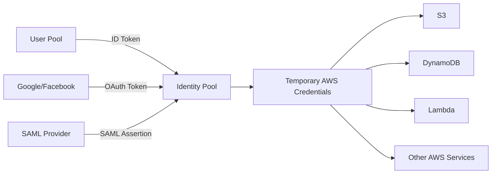

# How to Use Cognito Identity Pools for AWS Resource Access

Author: [nawazdhandala](https://github.com/nawazdhandala)

Tags: AWS, Cognito, IAM, Security

Description: A complete guide to using AWS Cognito Identity Pools (Federated Identities) to grant authenticated and unauthenticated users temporary AWS credentials for accessing S3, DynamoDB, and other services.

---

Cognito User Pools handle authentication - they verify who a user is. But when those users need to interact directly with AWS services like S3, DynamoDB, or API Gateway, they need AWS credentials. That's what Cognito Identity Pools provide. They take a user's identity from a User Pool (or other identity providers) and exchange it for temporary, scoped AWS credentials.

This setup is common in mobile apps and single-page applications where the client needs to talk directly to AWS services without going through your backend for every operation.

## Identity Pools vs User Pools

This is a source of confusion, so let's clear it up:

- **User Pool** = authentication. It manages user registration, login, and token issuance. Think of it as your user directory.
- **Identity Pool** = authorization for AWS resources. It takes authenticated identities and hands out temporary IAM credentials.



They work together but solve different problems. You can use an Identity Pool without a User Pool (with social login or SAML instead), but the most common pattern is User Pool + Identity Pool.

## Creating an Identity Pool

Let's set up an Identity Pool that accepts tokens from your Cognito User Pool.

Create the identity pool and link it to your user pool:

```bash
# Create the identity pool
aws cognito-identity create-identity-pool \
    --identity-pool-name MyAppIdentityPool \
    --allow-unauthenticated-identities true \
    --cognito-identity-providers \
        ProviderName=cognito-idp.us-east-1.amazonaws.com/us-east-1_XXXXXXXXX,ClientId=your-app-client-id,ServerSideTokenCheck=true
```

Note the `allow-unauthenticated-identities` flag. When set to true, even users who haven't logged in can get (very limited) AWS credentials. This is useful for things like letting anonymous users upload profile photos during registration.

## Setting Up IAM Roles

You need two IAM roles: one for authenticated users and one for unauthenticated users. Each role gets a trust policy that allows the Identity Pool to assume it.

Create the trust policy file for authenticated users:

```json
{
    "Version": "2012-10-17",
    "Statement": [
        {
            "Effect": "Allow",
            "Principal": {
                "Federated": "cognito-identity.amazonaws.com"
            },
            "Action": "sts:AssumeRoleWithWebIdentity",
            "Condition": {
                "StringEquals": {
                    "cognito-identity.amazonaws.com:aud": "us-east-1:your-identity-pool-id"
                },
                "ForAnyValue:StringLike": {
                    "cognito-identity.amazonaws.com:amr": "authenticated"
                }
            }
        }
    ]
}
```

Create both roles with appropriate permissions:

```bash
# Authenticated role - more permissions
aws iam create-role \
    --role-name CognitoAuthRole \
    --assume-role-policy-document file://auth-trust-policy.json

aws iam put-role-policy \
    --role-name CognitoAuthRole \
    --policy-name AuthenticatedAccess \
    --policy-document '{
        "Version": "2012-10-17",
        "Statement": [
            {
                "Effect": "Allow",
                "Action": [
                    "s3:GetObject",
                    "s3:PutObject",
                    "s3:DeleteObject"
                ],
                "Resource": "arn:aws:s3:::my-app-bucket/private/${cognito-identity.amazonaws.com:sub}/*"
            },
            {
                "Effect": "Allow",
                "Action": [
                    "dynamodb:GetItem",
                    "dynamodb:PutItem",
                    "dynamodb:UpdateItem",
                    "dynamodb:Query"
                ],
                "Resource": "arn:aws:dynamodb:us-east-1:123456789:table/UserData",
                "Condition": {
                    "ForAllValues:StringEquals": {
                        "dynamodb:LeadingKeys": ["${cognito-identity.amazonaws.com:sub}"]
                    }
                }
            }
        ]
    }'

# Unauthenticated role - very limited
aws iam create-role \
    --role-name CognitoUnauthRole \
    --assume-role-policy-document file://unauth-trust-policy.json

aws iam put-role-policy \
    --role-name CognitoUnauthRole \
    --policy-name UnauthenticatedAccess \
    --policy-document '{
        "Version": "2012-10-17",
        "Statement": [
            {
                "Effect": "Allow",
                "Action": ["s3:GetObject"],
                "Resource": "arn:aws:s3:::my-app-bucket/public/*"
            }
        ]
    }'
```

Notice the `${cognito-identity.amazonaws.com:sub}` variable in the IAM policy. This is a powerful feature - it scopes the user's access to only their own data in S3 and DynamoDB. Each user can only read and write their own files and records.

## Linking Roles to the Identity Pool

Associate both roles with the identity pool:

```bash
aws cognito-identity set-identity-pool-roles \
    --identity-pool-id us-east-1:your-identity-pool-id \
    --roles \
        authenticated=arn:aws:iam::123456789:role/CognitoAuthRole,unauthenticated=arn:aws:iam::123456789:role/CognitoUnauthRole
```

If you're using Cognito groups and want group-specific IAM roles, see [mapping Cognito groups to IAM roles](https://oneuptime.com/blog/post/2026-02-12-cognito-groups-iam-roles/view) for the Token-based role mapping approach.

## Getting Credentials in JavaScript

With everything set up, here's how your application exchanges a Cognito token for AWS credentials.

This function gets temporary AWS credentials from the Identity Pool:

```javascript
const {
    CognitoIdentityClient,
    GetIdCommand,
    GetCredentialsForIdentityCommand
} = require('@aws-sdk/client-cognito-identity');

const identityClient = new CognitoIdentityClient({ region: 'us-east-1' });

const IDENTITY_POOL_ID = 'us-east-1:your-identity-pool-id';
const USER_POOL_PROVIDER = 'cognito-idp.us-east-1.amazonaws.com/us-east-1_XXXXXXXXX';

// Get credentials for an authenticated user
async function getAuthenticatedCredentials(idToken) {
    // Step 1: Get the Identity ID
    const { IdentityId } = await identityClient.send(new GetIdCommand({
        IdentityPoolId: IDENTITY_POOL_ID,
        Logins: {
            [USER_POOL_PROVIDER]: idToken
        }
    }));

    // Step 2: Get temporary credentials
    const { Credentials } = await identityClient.send(
        new GetCredentialsForIdentityCommand({
            IdentityId,
            Logins: {
                [USER_POOL_PROVIDER]: idToken
            }
        })
    );

    return {
        accessKeyId: Credentials.AccessKeyId,
        secretAccessKey: Credentials.SecretKey,
        sessionToken: Credentials.SessionToken,
        expiration: Credentials.Expiration
    };
}

// Get credentials for an unauthenticated user
async function getUnauthenticatedCredentials() {
    const { IdentityId } = await identityClient.send(new GetIdCommand({
        IdentityPoolId: IDENTITY_POOL_ID
    }));

    const { Credentials } = await identityClient.send(
        new GetCredentialsForIdentityCommand({
            IdentityId
        })
    );

    return {
        identityId: IdentityId,
        accessKeyId: Credentials.AccessKeyId,
        secretAccessKey: Credentials.SecretKey,
        sessionToken: Credentials.SessionToken,
        expiration: Credentials.Expiration
    };
}
```

## Using Credentials with AWS Services

Once you have credentials, pass them to any AWS SDK client.

Here's how to use the credentials to upload a file to S3:

```javascript
const { S3Client, PutObjectCommand, GetObjectCommand } = require('@aws-sdk/client-s3');

async function uploadUserFile(idToken, fileName, fileContent) {
    const creds = await getAuthenticatedCredentials(idToken);

    const s3 = new S3Client({
        region: 'us-east-1',
        credentials: {
            accessKeyId: creds.accessKeyId,
            secretAccessKey: creds.secretAccessKey,
            sessionToken: creds.sessionToken
        }
    });

    // The IAM policy restricts this to the user's own prefix
    await s3.send(new PutObjectCommand({
        Bucket: 'my-app-bucket',
        Key: `private/${creds.identityId}/${fileName}`,
        Body: fileContent,
        ContentType: 'application/octet-stream'
    }));

    console.log(`Uploaded ${fileName} for user`);
}
```

## Credential Caching and Refresh

The temporary credentials expire (default 1 hour). Your application should cache them and request new ones before they expire.

Here's a credential manager with automatic refresh:

```javascript
class CredentialManager {
    constructor() {
        this.credentials = null;
        this.refreshBuffer = 5 * 60 * 1000; // Refresh 5 minutes before expiry
    }

    async getCredentials(idToken) {
        if (this.credentials && !this.isExpiring()) {
            return this.credentials;
        }

        this.credentials = await getAuthenticatedCredentials(idToken);
        return this.credentials;
    }

    isExpiring() {
        if (!this.credentials?.expiration) return true;
        return new Date(this.credentials.expiration).getTime() - Date.now() < this.refreshBuffer;
    }

    clear() {
        this.credentials = null;
    }
}
```

For more on handling token refresh at the Cognito level, see [handling Cognito token refresh in applications](https://oneuptime.com/blog/post/2026-02-12-cognito-token-refresh-applications/view).

## Identity ID Consistency

One important detail: each user gets a consistent Identity ID across sessions. The first time a user authenticates through the Identity Pool, Cognito creates an identity and returns an ID like `us-east-1:abc123-def456`. Subsequent authentications return the same ID. This is why you can safely use it as a partition key for user data.

If a user starts as unauthenticated and later logs in, you can merge their identities so they keep access to any data they created before logging in. This requires calling the `MergeDeveloperProviderIdentities` API.

## Wrapping Up

Cognito Identity Pools bridge the gap between authentication and AWS resource access. Instead of routing every S3 upload or DynamoDB query through your backend, clients can interact with AWS services directly using temporary, scoped credentials. The IAM policy variables let you lock down each user's access to just their own data, which is both secure and performant. Just remember to handle credential expiration, scope your IAM policies tightly, and be cautious with unauthenticated access.
