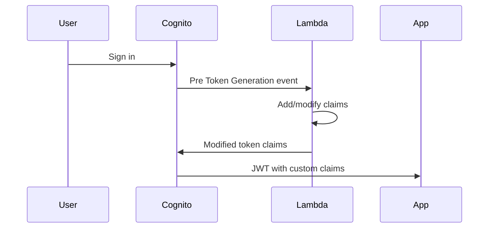

# How to Use Cognito Lambda Triggers (Pre Token Generation)

Author: [nawazdhandala](https://github.com/nawazdhandala)

Tags: AWS, Cognito, Lambda, Authentication, Serverless

Description: Learn how to use AWS Cognito Pre Token Generation Lambda triggers to customize JWT tokens with additional claims, roles, and permissions before they're issued to users.

---

AWS Cognito gives you a solid authentication system out of the box, but sometimes you need more control over what goes into those JWT tokens. That's where the Pre Token Generation Lambda trigger comes in. It lets you intercept the token generation process and inject custom claims, suppress existing ones, or modify the token's structure before it reaches your application.

If you've ever needed to add user roles, permission flags, or tenant-specific data to your tokens without hitting a database on every API call, this trigger is exactly what you're looking for.

## What Is the Pre Token Generation Trigger?

The Pre Token Generation trigger fires right before Cognito issues ID and access tokens to a user. Your Lambda function receives the token payload, gets a chance to modify it, and returns the updated version. Cognito then signs and delivers the modified token.

This is different from other Cognito triggers like Pre Authentication or Post Confirmation. Those handle events earlier in the flow. Pre Token Generation is the last stop before the token leaves Cognito's hands.



## Setting Up the Lambda Trigger

First, you need a Lambda function that Cognito can call. Here's a basic setup using Node.js.

Create the Lambda function with the proper handler signature:

```javascript
// index.js - Pre Token Generation Lambda trigger
exports.handler = async (event) => {
    console.log('Pre Token Generation event:', JSON.stringify(event, null, 2));

    // The event contains user attributes, group info, and token claims
    const { userName, request, response } = event;
    const userAttributes = request.userAttributes;
    const groupConfiguration = request.groupConfiguration;

    // Initialize the claims override structure
    response.claimsOverrideDetails = {
        claimsToAddOrOverride: {},
        claimsToSuppress: [],
        groupOverrideDetails: null
    };

    return event;
};
```

## Adding Custom Claims to the ID Token

The most common use case is adding custom claims. Maybe you want to embed a user's subscription tier or their organization ID directly in the token.

Here's how to add custom claims based on user attributes:

```javascript
exports.handler = async (event) => {
    const userAttributes = event.request.userAttributes;

    // Pull the tenant ID from a custom attribute
    const tenantId = userAttributes['custom:tenant_id'] || 'default';
    const subscriptionTier = userAttributes['custom:subscription_tier'] || 'free';

    // Add custom claims to the ID token
    event.response.claimsOverrideDetails = {
        claimsToAddOrOverride: {
            'custom:tenant_id': tenantId,
            'custom:subscription_tier': subscriptionTier,
            'custom:token_version': '2'
        },
        claimsToSuppress: []
    };

    return event;
};
```

One thing to watch out for: claim names that start with `custom:` are treated as custom claims by Cognito. You can't override standard OIDC claims like `sub`, `iss`, or `aud` - Cognito will ignore those.

## Dynamic Claims Based on External Data

Sometimes the data you need isn't stored in Cognito at all. You might need to fetch permissions from a database or call another service.

This example fetches user roles from DynamoDB and adds them to the token:

```javascript
const { DynamoDBClient, GetItemCommand } = require('@aws-sdk/client-dynamodb');
const dynamodb = new DynamoDBClient({ region: 'us-east-1' });

exports.handler = async (event) => {
    const userId = event.request.userAttributes.sub;

    // Fetch user permissions from DynamoDB
    const params = {
        TableName: 'UserPermissions',
        Key: {
            userId: { S: userId }
        }
    };

    try {
        const result = await dynamodb.send(new GetItemCommand(params));

        if (result.Item) {
            const permissions = result.Item.permissions?.SS || [];
            const role = result.Item.role?.S || 'viewer';

            event.response.claimsOverrideDetails = {
                claimsToAddOrOverride: {
                    'custom:role': role,
                    'custom:permissions': JSON.stringify(permissions),
                    'custom:last_synced': new Date().toISOString()
                },
                claimsToSuppress: []
            };
        }
    } catch (error) {
        console.error('Failed to fetch permissions:', error);
        // Return the event without modifications on error
        // Don't block authentication over a permissions lookup failure
    }

    return event;
};
```

Keep in mind that this Lambda runs on every token generation, including refreshes. If your external data source is slow, it'll add latency to every sign-in. Cache aggressively if you can.

## Suppressing Claims

You might also want to remove certain claims from the token. For example, if you don't want the user's email showing up in the ID token for privacy reasons, you can suppress it.

Here's how to suppress claims:

```javascript
exports.handler = async (event) => {
    event.response.claimsOverrideDetails = {
        claimsToAddOrOverride: {
            'custom:app_version': '3.1'
        },
        // Suppress these claims from the ID token
        claimsToSuppress: [
            'email',
            'phone_number',
            'custom:internal_flag'
        ]
    };

    return event;
};
```

Note that you can't suppress the `sub` claim - Cognito requires it in every token. Also, suppressing claims only affects the ID token, not the access token.

## Working with Groups

Cognito groups can be mapped to IAM roles, and the Pre Token Generation trigger gives you control over which groups appear in the token. For more on Cognito groups, check out [this post on role-based access control with Cognito groups](https://oneuptime.com/blog/post/2026-02-12-cognito-groups-role-based-access-control/view).

Here's how to override group information in the token:

```javascript
exports.handler = async (event) => {
    const groups = event.request.groupConfiguration.groupsToOverride || [];

    // Filter out internal-only groups from the token
    const publicGroups = groups.filter(g => !g.startsWith('internal-'));

    event.response.claimsOverrideDetails = {
        groupOverrideDetails: {
            groupsToOverride: publicGroups
        }
    };

    return event;
};
```

## Attaching the Trigger to Your User Pool

You can attach the trigger through the AWS Console, CLI, or infrastructure-as-code. Here's the CLI approach.

Run this command to set the Lambda trigger on your user pool:

```bash
aws cognito-idp update-user-pool \
    --user-pool-id us-east-1_XXXXXXXXX \
    --lambda-config PreTokenGeneration=arn:aws:lambda:us-east-1:123456789012:function:pre-token-generation
```

Don't forget to grant Cognito permission to invoke the Lambda:

```bash
aws lambda add-permission \
    --function-name pre-token-generation \
    --statement-id cognito-invoke \
    --action lambda:InvokeFunction \
    --principal cognito-idp.amazonaws.com \
    --source-arn arn:aws:cognito-idp:us-east-1:123456789012:userpool/us-east-1_XXXXXXXXX
```

If you're managing infrastructure with Terraform, check out the [Cognito Terraform setup guide](https://oneuptime.com/blog/post/2026-02-12-cognito-terraform/view) for a more structured approach.

## Token Size Limits

There's a practical limit to keep in mind. JWTs aren't meant to carry huge amounts of data. Cognito enforces a 10,000-character limit on token claims, but even before hitting that, large tokens can cause issues with HTTP headers and browser cookies.

Stick to essential claims. If you need to store complex permission structures, consider storing a permissions hash or version number in the token and keeping the full permission set server-side.

## Error Handling and Monitoring

Lambda trigger failures can block authentication entirely. If your function throws an unhandled error, Cognito will return a generic error to the user and they won't be able to sign in.

Always wrap your logic in try-catch blocks and return the event even when something goes wrong. You should also set up monitoring - CloudWatch alarms on Lambda errors and duration are a good start. For broader application monitoring, tools like [OneUptime](https://oneuptime.com/blog/post/2026-02-12-aws-amplify-getting-started/view) can help you keep track of authentication health across your stack.

## Testing the Trigger Locally

You can test the Lambda locally by simulating the event structure that Cognito sends.

Use this test event to validate your function logic:

```javascript
// test-event.json
{
    "version": "1",
    "triggerSource": "TokenGeneration_HostedAuth",
    "region": "us-east-1",
    "userPoolId": "us-east-1_XXXXXXXXX",
    "userName": "testuser",
    "callerContext": {
        "awsSdkVersion": "aws-sdk-js-3.0",
        "clientId": "abcdef123456"
    },
    "request": {
        "userAttributes": {
            "sub": "abc-123-def",
            "email": "test@example.com",
            "custom:tenant_id": "tenant-001"
        },
        "groupConfiguration": {
            "groupsToOverride": ["admin", "users"],
            "iamRolesToOverride": [],
            "preferredRole": null
        }
    },
    "response": {
        "claimsOverrideDetails": null
    }
}
```

Then invoke it locally:

```bash
# Test the Lambda function with the sample event
aws lambda invoke \
    --function-name pre-token-generation \
    --payload file://test-event.json \
    output.json && cat output.json | jq .
```

## Wrapping Up

The Pre Token Generation trigger is one of the most useful customization points in Cognito. It gives you the ability to embed application-specific data directly into your JWTs, which means fewer round trips to your backend and simpler authorization logic in your APIs. Just remember to keep your claims lean, handle errors gracefully, and monitor your Lambda's performance. A slow or failing trigger will directly impact your users' login experience.
