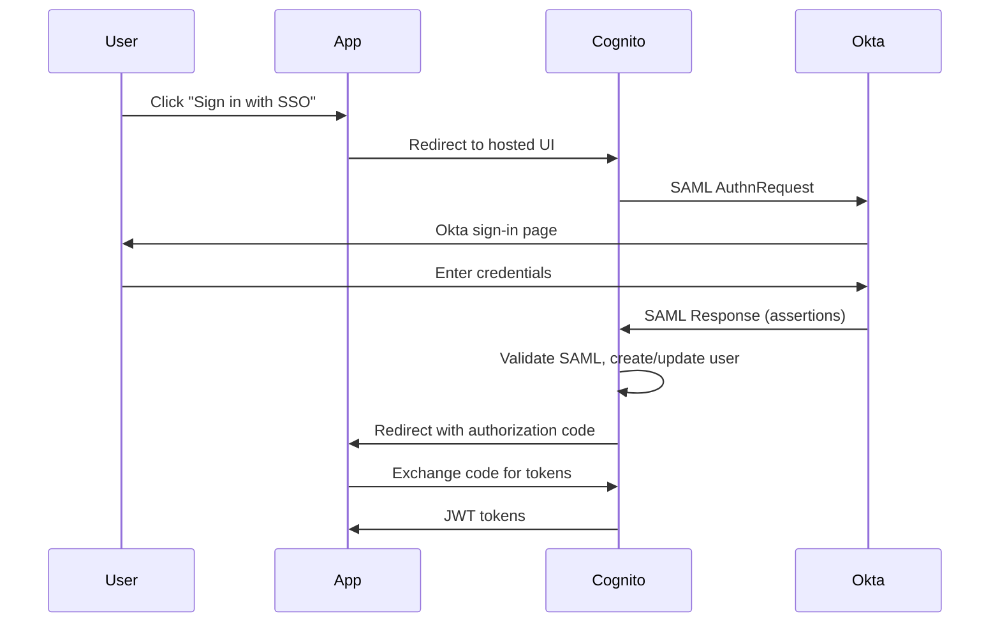

# How to Set Up Cognito SAML Federation with Okta

Author: [nawazdhandala](https://github.com/nawazdhandala)

Tags: AWS, Cognito, SAML, Okta, SSO

Description: Configure SAML-based single sign-on between Okta and Amazon Cognito User Pools for enterprise authentication in your applications.

---

Enterprise customers expect single sign-on. They don't want separate credentials for every SaaS app - they want to sign in through their company's identity provider. Okta is one of the most popular enterprise identity providers, and Cognito supports SAML federation out of the box.

This post walks through the complete SAML setup between Okta and Cognito, from both sides of the configuration.

## How SAML Federation Works

SAML (Security Assertion Markup Language) is a protocol for exchanging authentication data between an identity provider (Okta) and a service provider (your app via Cognito).



## Step 1: Get Cognito SAML Metadata

Before configuring Okta, you need the Cognito SAML endpoint information. The metadata URL is:

```
https://cognito-idp.{region}.amazonaws.com/{userPoolId}/.well-known/saml-metadata.xml
```

For example:

```
https://cognito-idp.us-east-1.amazonaws.com/us-east-1_XXXXXXXXX/.well-known/saml-metadata.xml
```

You'll also need the Assertion Consumer Service (ACS) URL:

```
https://your-domain.auth.us-east-1.amazoncognito.com/saml2/idpresponse
```

And the Audience URI (SP Entity ID):

```
urn:amazon:cognito:sp:{userPoolId}
```

## Step 2: Configure Okta

In the Okta admin console:

1. Go to Applications and click "Create App Integration"
2. Select "SAML 2.0" and click Next
3. Name your application (e.g., "MyApp - AWS Cognito")

In the SAML Settings, configure:

```
Single sign-on URL: https://your-domain.auth.us-east-1.amazoncognito.com/saml2/idpresponse
Audience URI (SP Entity ID): urn:amazon:cognito:sp:us-east-1_XXXXXXXXX
Name ID format: EmailAddress
Application username: Email
```

**Attribute Statements** map Okta user attributes to SAML claims:

| Name | Name format | Value |
|---|---|---|
| email | URI Reference | user.email |
| name | URI Reference | user.firstName + " " + user.lastName |
| given_name | URI Reference | user.firstName |
| family_name | URI Reference | user.lastName |

After creating the app, download the Okta metadata XML. You'll find it in the "Sign On" tab under "SAML Signing Certificates" - click "Identity Provider metadata."

## Step 3: Configure Cognito

Using Terraform:

```hcl
# Okta SAML identity provider
resource "aws_cognito_identity_provider" "okta" {
  user_pool_id  = aws_cognito_user_pool.main.id
  provider_name = "Okta"
  provider_type = "SAML"

  provider_details = {
    # Option 1: Use the metadata URL
    MetadataURL = "https://your-okta-domain.okta.com/app/xxxxxxxxxx/sso/saml/metadata"

    # Option 2: Use the metadata file content
    # MetadataFile = file("okta-metadata.xml")

    # Enable IdP-initiated sign-out
    IDPSignout = "true"
    SLORedirectBindingURI = "https://your-okta-domain.okta.com/app/xxxxxxxxxx/slo/saml"
  }

  # Map SAML attributes to Cognito attributes
  attribute_mapping = {
    email       = "email"
    name        = "name"
    given_name  = "given_name"
    family_name = "family_name"
  }

  # Identifiers for this IdP (optional, used for IdP discovery)
  idp_identifiers = ["okta"]
}
```

Using the AWS CLI:

```bash
# Create the Okta SAML provider
aws cognito-idp create-identity-provider \
  --user-pool-id us-east-1_XXXXXXXXX \
  --provider-name Okta \
  --provider-type SAML \
  --provider-details '{
    "MetadataURL": "https://your-okta-domain.okta.com/app/xxxxxxxxxx/sso/saml/metadata",
    "IDPSignout": "true"
  }' \
  --attribute-mapping '{
    "email": "email",
    "name": "name",
    "given_name": "given_name",
    "family_name": "family_name"
  }'
```

## Step 4: Update the App Client

```hcl
resource "aws_cognito_user_pool_client" "app" {
  name         = "my-app-client"
  user_pool_id = aws_cognito_user_pool.main.id

  # Include Okta SAML provider
  supported_identity_providers = ["Okta", "COGNITO"]

  # OAuth settings
  allowed_oauth_flows                  = ["code"]
  allowed_oauth_flows_user_pool_client = true
  allowed_oauth_scopes                 = ["openid", "email", "profile"]

  callback_urls = ["https://myapp.com/auth/callback"]
  logout_urls   = ["https://myapp.com/"]
}
```

## Step 5: Implement SSO Sign-In

The sign-in flow redirects through Cognito's hosted UI to Okta:

```javascript
// sso-sign-in.js - Redirect to Okta via Cognito
import { signInWithRedirect } from 'aws-amplify/auth';

async function signInWithOkta() {
  await signInWithRedirect({
    provider: {
      custom: 'Okta'  // Matches the provider name in Cognito
    }
  });
}
```

Or construct the URL manually:

```javascript
// Manual SSO redirect
function getOktaSSOUrl() {
  const domain = 'your-domain.auth.us-east-1.amazoncognito.com';
  const clientId = 'your-cognito-app-client-id';
  const redirectUri = encodeURIComponent('https://myapp.com/auth/callback');

  return `https://${domain}/oauth2/authorize?` +
    `client_id=${clientId}&` +
    `response_type=code&` +
    `scope=openid+email+profile&` +
    `redirect_uri=${redirectUri}&` +
    `identity_provider=Okta`;
}
```

## IdP Discovery by Email Domain

For apps serving multiple organizations, you can route users to the right identity provider based on their email domain:

```javascript
// idp-discovery.js
const domainToIdP = {
  'acme.com': 'Okta-Acme',
  'bigcorp.com': 'Okta-BigCorp',
  'startup.io': 'AzureAD-Startup'
};

function getIdPForEmail(email) {
  const domain = email.split('@')[1];
  return domainToIdP[domain] || null;
}

async function signInWithSSO(email) {
  const idp = getIdPForEmail(email);

  if (idp) {
    // Redirect to the organization's IdP
    await signInWithRedirect({
      provider: { custom: idp }
    });
  } else {
    // Fall back to Cognito's hosted UI
    console.log('No SSO configured for this domain');
  }
}
```

## Handling SAML Attribute Mapping

SAML attribute names in Okta responses need to match what Cognito expects. Common issues arise from mismatched attribute names.

Debug attribute mapping by checking the SAML response. In Okta, you can view the SAML assertion in the app's "Troubleshooting" section.

The SAML assertion should contain elements like:

```xml
<saml:Attribute Name="email">
  <saml:AttributeValue>user@acme.com</saml:AttributeValue>
</saml:Attribute>
<saml:Attribute Name="name">
  <saml:AttributeValue>John Doe</saml:AttributeValue>
</saml:Attribute>
```

The `Name` field in each attribute must match the key in your Cognito `attribute_mapping`.

## Multi-Tenant SAML Setup

For SaaS apps where each customer has their own Okta instance:

```hcl
# Create a SAML provider per tenant
resource "aws_cognito_identity_provider" "tenant" {
  for_each = var.tenant_saml_configs

  user_pool_id  = aws_cognito_user_pool.main.id
  provider_name = "SAML-${each.key}"
  provider_type = "SAML"

  provider_details = {
    MetadataURL = each.value.metadata_url
    IDPSignout  = "true"
  }

  attribute_mapping = {
    email = "email"
    name  = "name"
  }

  idp_identifiers = [each.value.domain]
}

variable "tenant_saml_configs" {
  type = map(object({
    metadata_url = string
    domain       = string
  }))
  default = {
    acme = {
      metadata_url = "https://acme.okta.com/app/xxx/sso/saml/metadata"
      domain       = "acme.com"
    }
    bigcorp = {
      metadata_url = "https://bigcorp.okta.com/app/yyy/sso/saml/metadata"
      domain       = "bigcorp.com"
    }
  }
}
```

## Sign-Out with SAML

For single logout (SLO), configure both Cognito and Okta:

```javascript
// sso-sign-out.js
import { signOut } from 'aws-amplify/auth';

async function signOutSSO() {
  // This signs out from Cognito and redirects to Okta for logout
  await signOut({ global: true });
}
```

The logout URL in your app client should point to your app's post-logout page. Cognito will redirect through Okta's SLO endpoint first.

## Troubleshooting

**"Invalid SAML response"** - Check that the ACS URL in Okta exactly matches Cognito's SAML endpoint. Even a trailing slash can cause issues.

**"User not found"** - The SAML response isn't mapping to a valid email. Check attribute mapping in both Okta and Cognito.

**"Metadata fetch failed"** - Cognito can't reach Okta's metadata URL. Try uploading the metadata file directly instead.

For SAML federation with Azure AD, see [Cognito SAML federation with Azure AD](https://oneuptime.com/blog/post/cognito-saml-federation-azure-ad/view). For OIDC-based federation, check out [Cognito OIDC federation](https://oneuptime.com/blog/post/cognito-oidc-federation/view).

## Summary

SAML federation between Okta and Cognito lets your enterprise customers use their existing identity infrastructure. The setup requires configuration on both sides - Okta needs your Cognito SAML endpoints, and Cognito needs Okta's metadata. Once it's working, the user experience is seamless - they click one button and authenticate through their company's Okta portal. For multi-tenant SaaS, plan your IdP naming and discovery strategy early.
