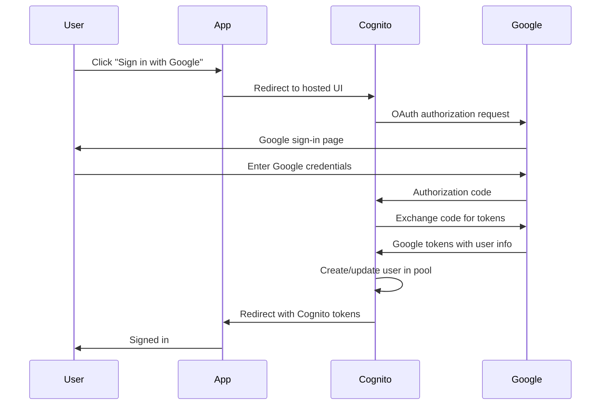

# How to Set Up Cognito Social Sign-In with Google

Author: [nawazdhandala](https://github.com/nawazdhandala)

Tags: AWS, Cognito, Google, OAuth, Authentication

Description: Configure Google as a social identity provider in Amazon Cognito for seamless sign-in with Google accounts in your web and mobile apps.

---

Social sign-in removes friction from the registration process. Instead of creating yet another account with a new password, users tap "Sign in with Google" and they're done. Cognito handles the OAuth flow with Google, creates a user in your pool, and returns tokens just like a regular sign-in.

This post covers the complete setup from Google Cloud Console to a working sign-in button.

## Overview of the Flow

When a user clicks "Sign in with Google," here's what happens:



## Step 1: Create Google OAuth Credentials

First, set up a project in the Google Cloud Console:

1. Go to console.cloud.google.com
2. Create a new project or select an existing one
3. Navigate to APIs & Services, then Credentials
4. Click "Create Credentials" and select "OAuth 2.0 Client ID"
5. Choose "Web application" as the type

For the OAuth client configuration, you'll need the authorized redirect URI from Cognito. It follows this format:

```
https://<your-domain>.auth.<region>.amazoncognito.com/oauth2/idpresponse
```

If you're using a custom domain:

```
https://auth.yourapp.com/oauth2/idpresponse
```

Save the Client ID and Client Secret - you'll need them for the Cognito configuration.

## Step 2: Configure Google as an Identity Provider

Using Terraform:

```hcl
# Google identity provider
resource "aws_cognito_identity_provider" "google" {
  user_pool_id  = aws_cognito_user_pool.main.id
  provider_name = "Google"
  provider_type = "Google"

  provider_details = {
    client_id                     = "your-google-client-id.apps.googleusercontent.com"
    client_secret                 = "your-google-client-secret"
    authorize_scopes              = "openid email profile"
    attributes_url                = "https://people.googleapis.com/v1/people/me?personFields="
    attributes_url_add_attributes = "true"
    authorize_url                 = "https://accounts.google.com/o/oauth2/v2/auth"
    oidc_issuer                   = "https://accounts.google.com"
    token_request_method          = "POST"
    token_url                     = "https://www.googleapis.com/oauth2/v4/token"
  }

  # Map Google attributes to Cognito attributes
  attribute_mapping = {
    email    = "email"
    username = "sub"
    name     = "name"
    picture  = "picture"
  }
}
```

Via the AWS CLI:

```bash
# Create the Google identity provider
aws cognito-idp create-identity-provider \
  --user-pool-id us-east-1_XXXXXXXXX \
  --provider-name Google \
  --provider-type Google \
  --provider-details '{
    "client_id": "your-google-client-id.apps.googleusercontent.com",
    "client_secret": "your-google-client-secret",
    "authorize_scopes": "openid email profile"
  }' \
  --attribute-mapping '{
    "email": "email",
    "username": "sub",
    "name": "name"
  }'
```

## Step 3: Configure the App Client

The app client needs to support the Google provider:

```hcl
resource "aws_cognito_user_pool_client" "app" {
  name         = "my-app-client"
  user_pool_id = aws_cognito_user_pool.main.id

  # Enable Google sign-in
  supported_identity_providers = ["Google", "COGNITO"]

  # OAuth configuration
  allowed_oauth_flows                  = ["code"]
  allowed_oauth_flows_user_pool_client = true
  allowed_oauth_scopes                 = ["openid", "email", "profile"]

  # Callback URLs
  callback_urls = [
    "https://myapp.com/auth/callback",
    "http://localhost:3000/auth/callback"  # For local development
  ]

  logout_urls = [
    "https://myapp.com/",
    "http://localhost:3000/"
  ]

  # Token settings
  access_token_validity  = 1
  id_token_validity      = 1
  refresh_token_validity = 30

  token_validity_units {
    access_token  = "hours"
    id_token      = "hours"
    refresh_token = "days"
  }
}
```

## Step 4: Set Up the User Pool Domain

You need a domain for the hosted UI OAuth flow:

```hcl
# Cognito-provided domain
resource "aws_cognito_user_pool_domain" "main" {
  domain       = "my-app-auth"
  user_pool_id = aws_cognito_user_pool.main.id
}
```

The hosted UI URL becomes: `https://my-app-auth.auth.us-east-1.amazoncognito.com`

## Step 5: Implement Sign-In in Your App

Using Amplify for the simplest integration:

```javascript
// google-sign-in.js - Sign in with Google using Amplify
import { signInWithRedirect, getCurrentUser } from 'aws-amplify/auth';
import { Amplify } from 'aws-amplify';

// Configure Amplify
Amplify.configure({
  Auth: {
    Cognito: {
      userPoolId: 'us-east-1_XXXXXXXXX',
      userPoolClientId: 'your-app-client-id',
      loginWith: {
        oauth: {
          domain: 'my-app-auth.auth.us-east-1.amazoncognito.com',
          scopes: ['openid', 'email', 'profile'],
          redirectSignIn: ['http://localhost:3000/auth/callback'],
          redirectSignOut: ['http://localhost:3000/'],
          responseType: 'code'
        }
      }
    }
  }
});

// Trigger Google sign-in
async function signInWithGoogle() {
  await signInWithRedirect({
    provider: 'Google'
  });
}

// Handle the callback - check for user after redirect
async function handleAuthCallback() {
  try {
    const user = await getCurrentUser();
    console.log('Signed in user:', user.username);
    return user;
  } catch (error) {
    console.log('Not signed in');
    return null;
  }
}
```

For a React implementation:

```jsx
// GoogleSignIn.jsx - React component
import { signInWithRedirect } from 'aws-amplify/auth';

function GoogleSignInButton() {
  const handleGoogleSignIn = async () => {
    try {
      await signInWithRedirect({ provider: 'Google' });
    } catch (error) {
      console.error('Google sign-in error:', error);
    }
  };

  return (
    <button onClick={handleGoogleSignIn} className="google-btn">
      
      Sign in with Google
    </button>
  );
}

export default GoogleSignInButton;
```

## Attribute Mapping Details

Google provides several user attributes you can map to Cognito:

| Google Attribute | Cognito Attribute | Description |
|---|---|---|
| sub | username | Google's unique user ID |
| email | email | User's email address |
| name | name | Full name |
| picture | picture | Profile photo URL |
| given_name | given_name | First name |
| family_name | family_name | Last name |

```hcl
# Extended attribute mapping
attribute_mapping = {
  email       = "email"
  username    = "sub"
  name        = "name"
  given_name  = "given_name"
  family_name = "family_name"
  picture     = "picture"
}
```

## Linking Google Accounts to Existing Users

When a user who already has a password-based account signs in with Google, Cognito creates a separate user by default. To link them, use a Pre Sign-Up Lambda trigger:

```javascript
// link-accounts-lambda.js
export const handler = async (event) => {
  // Auto-link federated users to existing accounts
  if (event.triggerSource === 'PreSignUp_ExternalProvider') {
    event.response.autoConfirmUser = true;
    event.response.autoVerifyEmail = true;
  }

  return event;
};
```

For full account linking, you'll need admin API calls to merge the accounts. This is covered in [Cognito Lambda triggers for pre sign-up](https://oneuptime.com/blog/post/cognito-lambda-triggers-pre-sign-up/view).

## Testing the Integration

Verify the setup by constructing the authorization URL manually:

```
https://my-app-auth.auth.us-east-1.amazoncognito.com/oauth2/authorize?
  client_id=your-app-client-id&
  response_type=code&
  scope=openid+email+profile&
  redirect_uri=http://localhost:3000/auth/callback&
  identity_provider=Google
```

Open this URL in a browser. It should redirect to Google's sign-in page, then back to your callback URL with an authorization code.

## Summary

Setting up Google sign-in with Cognito takes about 15 minutes once you know the steps. The OAuth flow is handled entirely by Cognito - you just need the Google credentials, attribute mapping, and a sign-in button. For a complete social sign-in experience, you might also want to add [Facebook sign-in](https://oneuptime.com/blog/post/cognito-social-sign-in-facebook/view) and [Apple sign-in](https://oneuptime.com/blog/post/cognito-social-sign-in-apple/view).
