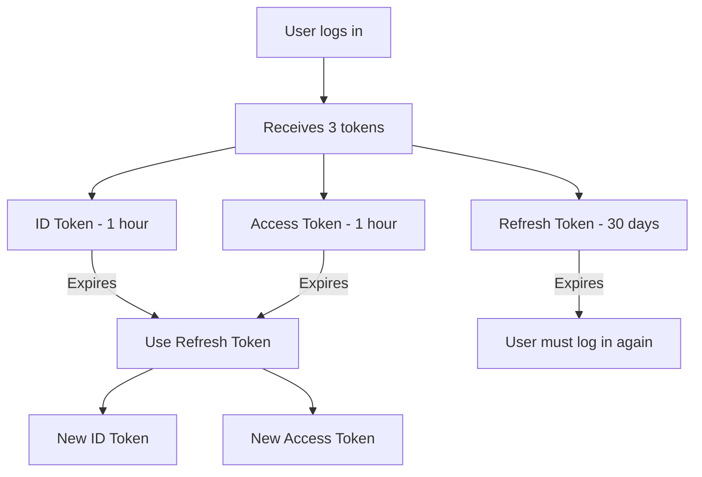

# How to Handle Cognito Token Refresh in Applications

Author: [nawazdhandala](https://github.com/nawazdhandala)

Tags: AWS, Cognito, Authentication, JWT

Description: Learn how to properly handle AWS Cognito token refresh in web and mobile applications, including automatic refresh strategies, error handling, and session management patterns.

---

Cognito tokens don't last forever. ID and access tokens expire after one hour by default, and when they do, your users shouldn't have to log in again. That's what the refresh token is for. It lets your application silently get new ID and access tokens without involving the user. But getting token refresh right involves more than just calling an API - you need to handle race conditions, network failures, and expired refresh tokens gracefully.

This post covers the mechanics of Cognito token refresh and practical patterns for implementing it in your applications.

## How Cognito Tokens Work

When a user authenticates, Cognito returns three tokens:

- **ID Token** - contains user profile claims (email, name, groups). Expires in 1 hour.
- **Access Token** - used for API authorization. Expires in 1 hour (configurable from 5 minutes to 1 day).
- **Refresh Token** - used to get new ID and access tokens. Expires in 30 days by default (configurable from 1 hour to 10 years).



The refresh token is special because it's opaque - it's not a JWT and you can't decode it. You just send it to Cognito and get fresh tokens back.

## Basic Token Refresh

The simplest way to refresh tokens is using the Cognito `InitiateAuth` API with the `REFRESH_TOKEN_AUTH` flow.

Here's the basic refresh call:

```javascript
const {
    CognitoIdentityProviderClient,
    InitiateAuthCommand
} = require('@aws-sdk/client-cognito-identity-provider');

const client = new CognitoIdentityProviderClient({ region: 'us-east-1' });
const CLIENT_ID = 'your-app-client-id';

async function refreshTokens(refreshToken) {
    try {
        const response = await client.send(new InitiateAuthCommand({
            AuthFlow: 'REFRESH_TOKEN_AUTH',
            ClientId: CLIENT_ID,
            AuthParameters: {
                REFRESH_TOKEN: refreshToken
            }
        }));

        // Note: refresh token itself is NOT returned
        // You keep using the same refresh token
        return {
            idToken: response.AuthenticationResult.IdToken,
            accessToken: response.AuthenticationResult.AccessToken,
            expiresIn: response.AuthenticationResult.ExpiresIn
        };
    } catch (error) {
        if (error.name === 'NotAuthorizedException') {
            // Refresh token is expired or revoked - user must log in again
            console.error('Refresh token expired');
            throw new Error('SESSION_EXPIRED');
        }
        throw error;
    }
}
```

Notice that the refresh call doesn't return a new refresh token - you keep using the original one until it expires.

## Proactive Refresh Strategy

Don't wait for a 401 response to trigger a refresh. Instead, check token expiration before making API calls and refresh proactively.

Here's a token manager that refreshes tokens before they expire:

```javascript
class TokenManager {
    constructor(clientId) {
        this.clientId = clientId;
        this.tokens = null;
        this.refreshPromise = null;
    }

    // Store tokens after initial login
    setTokens(authResult) {
        this.tokens = {
            idToken: authResult.IdToken,
            accessToken: authResult.AccessToken,
            refreshToken: authResult.RefreshToken,
            // Calculate absolute expiry time
            expiresAt: Date.now() + (authResult.ExpiresIn * 1000)
        };
    }

    // Check if the access token is about to expire (within 5 minutes)
    isTokenExpiring() {
        if (!this.tokens) return true;
        const bufferMs = 5 * 60 * 1000; // 5 minute buffer
        return Date.now() >= (this.tokens.expiresAt - bufferMs);
    }

    // Get a valid access token, refreshing if necessary
    async getAccessToken() {
        if (!this.tokens) {
            throw new Error('No tokens available - user must log in');
        }

        if (this.isTokenExpiring()) {
            await this.refresh();
        }

        return this.tokens.accessToken;
    }

    // Refresh tokens with deduplication
    async refresh() {
        // If a refresh is already in progress, wait for it
        // This prevents multiple simultaneous refresh calls
        if (this.refreshPromise) {
            return this.refreshPromise;
        }

        this.refreshPromise = this._doRefresh();

        try {
            await this.refreshPromise;
        } finally {
            this.refreshPromise = null;
        }
    }

    async _doRefresh() {
        try {
            const result = await refreshTokens(this.tokens.refreshToken);
            this.tokens.idToken = result.idToken;
            this.tokens.accessToken = result.accessToken;
            this.tokens.expiresAt = Date.now() + (result.expiresIn * 1000);
        } catch (error) {
            if (error.message === 'SESSION_EXPIRED') {
                this.tokens = null;
                // Redirect to login or emit a session expired event
                window.dispatchEvent(new Event('session-expired'));
            }
            throw error;
        }
    }
}
```

## Interceptor Pattern for HTTP Clients

The most practical approach in web apps is to use an HTTP interceptor that automatically attaches fresh tokens to every request.

Here's an Axios interceptor that handles token refresh:

```javascript
const axios = require('axios');

const tokenManager = new TokenManager('your-client-id');

// Create an API client with automatic token refresh
const api = axios.create({
    baseURL: 'https://api.yourapp.com'
});

// Request interceptor - attach the access token
api.interceptors.request.use(async (config) => {
    try {
        const token = await tokenManager.getAccessToken();
        config.headers.Authorization = `Bearer ${token}`;
    } catch (error) {
        // If we can't get a token, let the request go through
        // and handle the 401 in the response interceptor
    }
    return config;
});

// Response interceptor - handle 401s as a fallback
api.interceptors.response.use(
    (response) => response,
    async (error) => {
        const originalRequest = error.config;

        // If we get a 401 and haven't retried yet
        if (error.response?.status === 401 && !originalRequest._retry) {
            originalRequest._retry = true;

            try {
                await tokenManager.refresh();
                const newToken = await tokenManager.getAccessToken();
                originalRequest.headers.Authorization = `Bearer ${newToken}`;
                return api(originalRequest);
            } catch (refreshError) {
                // Refresh failed - session is truly expired
                return Promise.reject(refreshError);
            }
        }

        return Promise.reject(error);
    }
);
```

## React Hook for Token Management

In React apps, you'll want a hook that provides token state and handles refresh.

Here's a custom React hook for Cognito token management:

```javascript
import { useState, useEffect, useCallback, useRef } from 'react';

function useCognitoAuth() {
    const [isAuthenticated, setIsAuthenticated] = useState(false);
    const [isLoading, setIsLoading] = useState(true);
    const tokenManagerRef = useRef(new TokenManager('your-client-id'));

    // Check for stored tokens on mount
    useEffect(() => {
        const stored = localStorage.getItem('cognito_tokens');
        if (stored) {
            const tokens = JSON.parse(stored);
            tokenManagerRef.current.setTokens(tokens);
            setIsAuthenticated(true);
        }
        setIsLoading(false);
    }, []);

    // Listen for session expiry events
    useEffect(() => {
        const handleExpiry = () => {
            setIsAuthenticated(false);
            localStorage.removeItem('cognito_tokens');
        };

        window.addEventListener('session-expired', handleExpiry);
        return () => window.removeEventListener('session-expired', handleExpiry);
    }, []);

    // Set up a refresh timer
    useEffect(() => {
        if (!isAuthenticated) return;

        const checkInterval = setInterval(async () => {
            if (tokenManagerRef.current.isTokenExpiring()) {
                try {
                    await tokenManagerRef.current.refresh();
                } catch (err) {
                    console.error('Background refresh failed:', err);
                }
            }
        }, 60000); // Check every minute

        return () => clearInterval(checkInterval);
    }, [isAuthenticated]);

    const getToken = useCallback(async () => {
        return tokenManagerRef.current.getAccessToken();
    }, []);

    return { isAuthenticated, isLoading, getToken };
}
```

## Server-Side Token Refresh

For backend applications that store refresh tokens (like a BFF pattern), the approach is similar but you need to be more careful about token storage.

Here's a server-side refresh handler:

```javascript
const express = require('express');
const router = express.Router();

// Refresh endpoint that the frontend calls
router.post('/auth/refresh', async (req, res) => {
    // Get the refresh token from an HTTP-only cookie
    const refreshToken = req.cookies.refresh_token;

    if (!refreshToken) {
        return res.status(401).json({ error: 'No refresh token' });
    }

    try {
        const tokens = await refreshTokens(refreshToken);

        // Set the new access token as an HTTP-only cookie
        res.cookie('access_token', tokens.accessToken, {
            httpOnly: true,
            secure: true,
            sameSite: 'strict',
            maxAge: tokens.expiresIn * 1000
        });

        res.json({ expiresIn: tokens.expiresIn });
    } catch (error) {
        // Clear cookies on refresh failure
        res.clearCookie('access_token');
        res.clearCookie('refresh_token');
        res.status(401).json({ error: 'Session expired' });
    }
});
```

## Refresh Token Rotation and Revocation

Cognito supports refresh token rotation for added security. When enabled, each refresh call returns a new refresh token and invalidates the previous one.

Enable it through the user pool client settings:

```bash
aws cognito-idp update-user-pool-client \
    --user-pool-id us-east-1_XXXXXXXXX \
    --client-id your-app-client-id \
    --token-validity-units RefreshToken=days \
    --refresh-token-validity 30 \
    --enable-token-revocation
```

You can also explicitly revoke a refresh token during logout:

```javascript
const { RevokeTokenCommand } = require('@aws-sdk/client-cognito-identity-provider');

async function logout(refreshToken) {
    await client.send(new RevokeTokenCommand({
        Token: refreshToken,
        ClientId: CLIENT_ID
    }));
}
```

For a deeper understanding of how Cognito tokens are structured and validated, see [decoding and validating Cognito JWT tokens](https://oneuptime.com/blog/post/2026-02-12-decode-validate-cognito-jwt-tokens/view).

## Wrapping Up

Token refresh is one of those things that seems simple on the surface but has real implications for user experience and security. The key principles are: refresh proactively before tokens expire, deduplicate concurrent refresh requests, handle refresh failures gracefully by redirecting to login, and store refresh tokens securely. Get these right and your users will enjoy seamless sessions without ever noticing the token machinery running behind the scenes.
