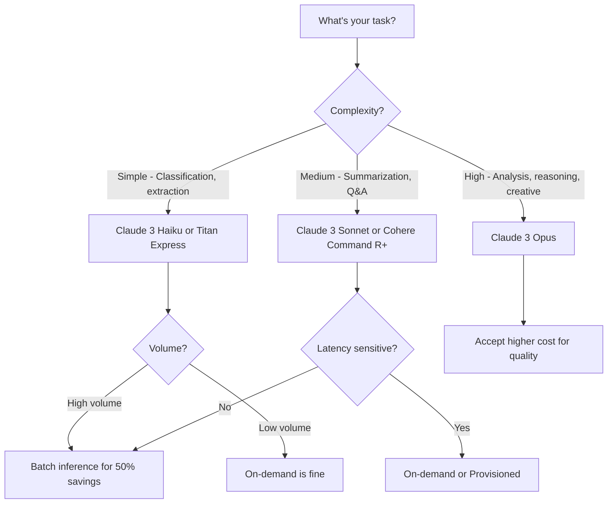

# How to Compare Amazon Bedrock Model Pricing

Author: [nawazdhandala](https://github.com/nawazdhandala)

Tags: AWS, Amazon Bedrock, Pricing, Cost Optimization

Description: A detailed comparison of Amazon Bedrock model pricing across providers, with strategies for choosing the right model and optimizing costs in production.

---

Picking the right foundation model on Amazon Bedrock isn't just about quality - it's about finding the sweet spot between performance and cost. The pricing gap between models is massive. You might be spending 10x more than you need to if you're using a top-tier model for a task that a cheaper one handles just fine.

This guide breaks down Bedrock pricing, compares the major models, and gives you practical strategies for keeping costs under control without sacrificing quality where it matters.

## How Bedrock Pricing Works

Bedrock uses token-based pricing for on-demand inference. You pay separately for input tokens (what you send to the model) and output tokens (what the model generates). Input tokens are always cheaper than output tokens, usually by a factor of 3-5x.

There are three pricing models:

**On-demand** - Pay per token with no commitment. Best for variable workloads and getting started.

**Provisioned throughput** - Reserve dedicated capacity for a fixed hourly rate. Best for consistent, high-volume workloads where you need guaranteed performance.

**Batch inference** - Submit jobs asynchronously at roughly 50% of on-demand prices. Best for bulk processing that doesn't need real-time responses.

## Model-by-Model Price Comparison

Here's a comparison of the key models available on Bedrock. Prices are per 1,000 tokens and reflect on-demand pricing (always check the current AWS pricing page for the latest numbers, as they change).

```python
# Model pricing comparison (approximate, check current AWS pricing)
models = {
    "Claude 3 Opus": {
        "input_per_1k": 0.015,
        "output_per_1k": 0.075,
        "context_window": 200000,
        "best_for": "Complex reasoning, analysis, creative tasks"
    },
    "Claude 3 Sonnet": {
        "input_per_1k": 0.003,
        "output_per_1k": 0.015,
        "context_window": 200000,
        "best_for": "Balanced quality/cost for most tasks"
    },
    "Claude 3 Haiku": {
        "input_per_1k": 0.00025,
        "output_per_1k": 0.00125,
        "context_window": 200000,
        "best_for": "High volume, simple tasks, classification"
    },
    "Llama 3 70B": {
        "input_per_1k": 0.00265,
        "output_per_1k": 0.0035,
        "context_window": 8000,
        "best_for": "Open source, code generation"
    },
    "Llama 3 8B": {
        "input_per_1k": 0.0003,
        "output_per_1k": 0.0006,
        "context_window": 8000,
        "best_for": "Budget-friendly, simple tasks"
    },
    "Amazon Titan Text Express": {
        "input_per_1k": 0.0002,
        "output_per_1k": 0.0006,
        "context_window": 8000,
        "best_for": "Basic generation, classification, AWS integration"
    },
    "Cohere Command R+": {
        "input_per_1k": 0.003,
        "output_per_1k": 0.015,
        "context_window": 128000,
        "best_for": "RAG, multi-step reasoning, long context"
    }
}
```

## Cost Calculator

Build a simple calculator to estimate costs for your specific workload.

```python
def estimate_monthly_cost(
    model_name,
    requests_per_day,
    avg_input_tokens,
    avg_output_tokens,
    days=30
):
    """Estimate monthly cost for a specific model and workload."""
    if model_name not in models:
        print(f"Unknown model: {model_name}")
        return None

    pricing = models[model_name]
    total_requests = requests_per_day * days

    input_cost = (total_requests * avg_input_tokens / 1000) * pricing['input_per_1k']
    output_cost = (total_requests * avg_output_tokens / 1000) * pricing['output_per_1k']
    total_cost = input_cost + output_cost

    print(f"Model: {model_name}")
    print(f"Requests: {total_requests:,} per month")
    print(f"Input cost:  ${input_cost:,.2f}")
    print(f"Output cost: ${output_cost:,.2f}")
    print(f"Total cost:  ${total_cost:,.2f}")
    print(f"Cost per request: ${total_cost/total_requests:.4f}")

    return total_cost

# Compare costs for a typical chatbot workload
print("=== Chatbot Workload (1000 requests/day, 500 input, 300 output tokens) ===\n")
for model in models:
    estimate_monthly_cost(model, 1000, 500, 300)
    print()
```

## Choosing the Right Model for Your Task

Different tasks have different quality requirements. Here's a practical guide.



## Multi-Model Strategy

The smartest approach is using different models for different tasks within the same application. Route simple queries to cheap models and complex ones to expensive models.

```python
def smart_route(query, context_length=0):
    """Route queries to the most cost-effective model based on complexity."""

    # Simple classification or yes/no questions
    simple_patterns = [
        'is this', 'does it', 'what category',
        'classify', 'true or false'
    ]
    if any(p in query.lower() for p in simple_patterns) and context_length < 1000:
        return 'anthropic.claude-3-haiku-20240307-v1:0'

    # Medium complexity - most general tasks
    if context_length < 50000:
        return 'anthropic.claude-3-sonnet-20240229-v1:0'

    # Long context or complex reasoning
    return 'anthropic.claude-3-opus-20240229-v1:0'


def invoke_smart(query, context=""):
    """Invoke the best model for the task."""
    model_id = smart_route(query, len(context))

    response = bedrock_runtime.invoke_model(
        modelId=model_id,
        body=json.dumps({
            'anthropic_version': 'bedrock-2023-05-31',
            'max_tokens': 1024,
            'messages': [{
                'role': 'user',
                'content': f"{context}\n\n{query}" if context else query
            }]
        })
    )

    result = json.loads(response['body'].read())
    return result['content'][0]['text'], model_id
```

## Reducing Token Usage

Beyond model selection, you can cut costs by reducing how many tokens you use per request.

**Shorter prompts**: Every word in your prompt costs money. Remove filler words, be concise, and use system prompts to set context once instead of repeating instructions in every message.

**Truncate inputs**: If you're processing long documents, consider summarizing or extracting relevant sections first with a cheaper model.

**Cache responses**: If you're getting similar queries, cache the responses. A simple Redis or DynamoDB cache can save thousands of dollars.

```python
import hashlib

def cached_invoke(prompt, cache_table='bedrock-cache'):
    """Check cache before invoking the model."""
    cache_key = hashlib.sha256(prompt.encode()).hexdigest()

    # Check cache first
    try:
        cached = dynamodb.Table(cache_table).get_item(Key={'prompt_hash': cache_key})
        if 'Item' in cached:
            return cached['Item']['response']
    except Exception:
        pass

    # Cache miss - invoke the model
    response = invoke_smart(prompt)

    # Store in cache
    try:
        dynamodb.Table(cache_table).put_item(Item={
            'prompt_hash': cache_key,
            'response': response[0],
            'ttl': int(time.time()) + 3600  # 1 hour cache
        })
    except Exception:
        pass

    return response[0]
```

## Provisioned Throughput Economics

If you're making more than a certain number of requests per hour consistently, provisioned throughput becomes cheaper than on-demand. The break-even point depends on the model and your traffic patterns.

```python
def should_use_provisioned(
    requests_per_hour,
    avg_input_tokens,
    avg_output_tokens,
    provisioned_hourly_rate,
    on_demand_input_rate,
    on_demand_output_rate
):
    """Calculate whether provisioned throughput is more cost-effective."""
    on_demand_hourly = (
        requests_per_hour * avg_input_tokens / 1000 * on_demand_input_rate +
        requests_per_hour * avg_output_tokens / 1000 * on_demand_output_rate
    )

    print(f"On-demand hourly:   ${on_demand_hourly:.2f}")
    print(f"Provisioned hourly: ${provisioned_hourly_rate:.2f}")

    if on_demand_hourly > provisioned_hourly_rate:
        savings = (on_demand_hourly - provisioned_hourly_rate) * 24 * 30
        print(f"Provisioned saves: ${savings:,.2f}/month")
        return True
    else:
        extra_cost = (provisioned_hourly_rate - on_demand_hourly) * 24 * 30
        print(f"On-demand saves: ${extra_cost:,.2f}/month")
        return False
```

## Monitoring Costs

Track your spending with CloudWatch metrics and set up billing alerts so there are no surprises.

```python
# Set up a CloudWatch alarm for Bedrock spending
cloudwatch = boto3.client('cloudwatch', region_name='us-east-1')

cloudwatch.put_metric_alarm(
    AlarmName='bedrock-daily-spend-alert',
    MetricName='InvocationModelInputTokens',
    Namespace='AWS/Bedrock',
    Statistic='Sum',
    Period=86400,  # 24 hours
    EvaluationPeriods=1,
    Threshold=10000000,  # Alert at 10M input tokens/day
    ComparisonOperator='GreaterThanThreshold',
    AlarmActions=['arn:aws:sns:us-east-1:123456789012:billing-alerts']
)
```

The bottom line: don't default to the most expensive model. Profile your tasks, measure quality across different models, and route accordingly. Most workloads can run on mid-tier models with no noticeable quality drop, saving 60-80% on inference costs. For bulk workloads, [batch inference](https://oneuptime.com/blog/post/amazon-bedrock-batch-inference/view) cuts that cost in half again.
