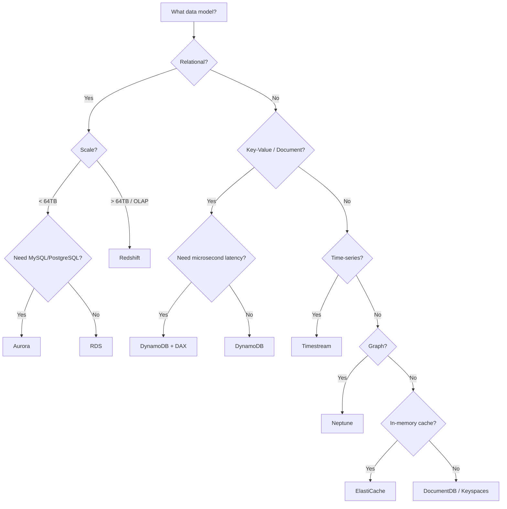

# How to Compare Amazon Database Service Options (Decision Guide)

Author: [nawazdhandala](https://github.com/nawazdhandala)

Tags: AWS, Databases, RDS, DynamoDB, Aurora, Redshift, Decision Guide

Description: A practical decision guide for choosing the right AWS database service for your workload and requirements

---

AWS has over 15 managed database services. That is both a blessing and a curse. Having options means you can pick the right tool for the job. But having too many options means you can easily pick the wrong one and spend months regretting it.

This guide cuts through the marketing and gives you a practical framework for choosing the right AWS database service based on your actual workload requirements.

## The Decision Framework

Before diving into individual services, answer these questions about your workload:

1. What is your data model? (Relational, key-value, document, graph, time-series, ledger)
2. What are your access patterns? (OLTP, OLAP, mixed)
3. What scale do you need? (Gigabytes, terabytes, petabytes)
4. What latency do you need? (Microseconds, milliseconds, seconds)
5. Do you need ACID transactions?
6. What is your budget?



## Relational Databases

### Amazon RDS

RDS is the default choice for traditional relational workloads. It supports MySQL, PostgreSQL, MariaDB, Oracle, and SQL Server.

**Best for:** Lift-and-shift of existing relational applications, small to medium workloads, teams that want managed infrastructure without code changes.

**Limits:** Maximum storage of 64TB (varies by engine), single-region primary, read replicas up to 15 (Aurora) or 5 (standard RDS).

**Pricing model:** Instance-hours plus storage. A `db.r6g.large` with 100GB costs roughly $200-300/month depending on region and engine.

### Amazon Aurora

Aurora is AWS's re-engineered MySQL and PostgreSQL compatible database. The storage layer is distributed across 3 availability zones with 6 copies of your data.

**Best for:** Production workloads that need high availability, read-heavy applications that benefit from up to 15 read replicas, teams that want better performance without leaving MySQL/PostgreSQL.

**Key differentiator:** Aurora's storage auto-scales up to 128TB. You never need to provision storage upfront. Failover takes around 30 seconds compared to several minutes with standard RDS.

**Aurora Serverless v2** is worth considering if your traffic is highly variable. It scales from 0.5 ACUs to 256 ACUs based on demand. Great for dev/test environments and applications with unpredictable traffic.

```
Comparison: Standard RDS vs Aurora

| Feature              | RDS              | Aurora           |
|---------------------|------------------|------------------|
| Max Storage         | 64 TB            | 128 TB           |
| Replication         | Async            | Sync (storage)   |
| Read Replicas       | 5                | 15               |
| Failover Time       | 1-2 minutes      | ~30 seconds      |
| Storage Auto-scale  | Manual           | Automatic        |
| Cost                | Lower base       | ~20% more        |
```

### Amazon Redshift

Redshift is a data warehouse, not a transactional database. It is optimized for analytical queries over large datasets.

**Best for:** OLAP workloads, business intelligence, data analytics, querying terabytes to petabytes of data.

**Not for:** OLTP workloads, high-concurrency transactional applications, anything that needs single-digit millisecond latency for individual queries.

Redshift Serverless removes the need to manage clusters. You set a base capacity in RPUs (Redshift Processing Units) and it scales automatically.

## NoSQL Databases

### Amazon DynamoDB

DynamoDB is a key-value and document database that delivers single-digit millisecond performance at any scale. It is fully serverless - no instances to manage.

**Best for:** High-scale applications, gaming leaderboards, session stores, IoT data, shopping carts, any workload with known access patterns.

**Key consideration:** DynamoDB requires you to think about access patterns upfront. You design your table and indexes around how you query, not how you model entities. Get this wrong and you will either have bad performance or pay through the nose for scans.

**Pricing model:** On-demand mode charges per read/write request. Provisioned mode charges for reserved capacity. On-demand is simpler but more expensive at scale.

For microsecond latency, add DAX (DynamoDB Accelerator) as an in-memory caching layer:

```python
# Using DAX for microsecond reads from DynamoDB
import amazondax

dax_client = amazondax.AmazonDaxClient(
    endpoints=['my-dax-cluster.abc123.dax-clusters.us-east-1.amazonaws.com:8111']
)

# This read goes through DAX cache first
response = dax_client.get_item(
    TableName='users',
    Key={'user_id': {'S': 'user-123'}}
)
```

### Amazon DocumentDB

DocumentDB is MongoDB-compatible. If you have an existing MongoDB application and want managed infrastructure on AWS, this is your path.

**Best for:** Teams with existing MongoDB applications, document-oriented data models, workloads that use MongoDB drivers and tools.

**Honest take:** If you are starting fresh and considering a document database, DynamoDB is usually a better choice on AWS. DocumentDB makes most sense as a migration target for existing MongoDB workloads.

### Amazon Keyspaces

Keyspaces is a managed Apache Cassandra-compatible service.

**Best for:** Teams with existing Cassandra workloads, wide-column data models, write-heavy workloads at massive scale.

## Specialized Databases

### Amazon Neptune

Neptune is a graph database that supports both Gremlin (property graph) and SPARQL (RDF) query languages.

**Best for:** Social networks, recommendation engines, fraud detection, knowledge graphs, anything where relationships between entities are the primary query pattern.

```
Example use cases:
- "Find all users who are friends of friends of User X"
- "What products were purchased by people who also bought Product Y"
- "Detect circular payment patterns that may indicate fraud"
```

### Amazon Timestream

Timestream is purpose-built for time-series data.

**Best for:** IoT sensor data, application metrics, DevOps monitoring data, financial tick data.

**Key feature:** Automatic data lifecycle management. Recent data stays in a memory store for fast queries. Older data moves to a magnetic store for cheaper storage. You configure the transition rules and Timestream handles the rest.

### Amazon ElastiCache

ElastiCache provides managed Redis or Memcached.

**Best for:** Caching layer in front of a primary database, session stores, real-time leaderboards, pub/sub messaging, rate limiting.

ElastiCache is not a standalone database - it is almost always used alongside another database to improve read performance. A typical architecture puts ElastiCache between your application and RDS/Aurora.

### Amazon MemoryDB for Redis

MemoryDB is a durable, Redis-compatible database. Unlike ElastiCache, it provides data durability with multi-AZ transaction logging.

**Best for:** Use cases where you want Redis as a primary database (not just a cache), applications that need both the speed of Redis and the durability of a traditional database.

### Amazon QLDB

Quantum Ledger Database provides an immutable, cryptographically verifiable transaction log.

**Best for:** Audit trails, supply chain tracking, financial transaction histories, any system where you need to prove data has not been tampered with.

## Cost Comparison

Here is a rough monthly cost comparison for a moderate workload (assuming us-east-1):

```
| Service          | Config                    | Approximate Monthly Cost |
|-----------------|---------------------------|-------------------------|
| RDS MySQL       | db.r6g.large, 100GB       | $250                    |
| Aurora MySQL    | db.r6g.large, 100GB       | $300                    |
| Aurora Srvless  | 4 ACU average, 100GB      | $350                    |
| DynamoDB        | 100 WCU, 400 RCU, 25GB   | $100                    |
| DynamoDB On-Dem | 10M writes, 50M reads     | $75                     |
| Redshift        | 2x ra3.xlplus             | $500                    |
| ElastiCache     | cache.r6g.large           | $200                    |
| Neptune         | db.r5.large               | $280                    |
| Timestream      | 10GB memory, 100GB mag    | $350                    |
```

These numbers are ballpark figures. Your actual costs depend heavily on data volume, query patterns, and how well you optimize your usage.

## Making the Decision

For most teams building a new application, the decision comes down to:

- **Web applications with relational data:** Aurora (PostgreSQL or MySQL)
- **APIs with known access patterns at scale:** DynamoDB
- **Analytics and reporting:** Redshift
- **Caching layer:** ElastiCache (Redis)

Do not over-engineer your database selection. Start with what your team knows. A well-operated PostgreSQL database on Aurora will serve 95% of applications just fine. You can always add specialized databases later for specific use cases.

If you are migrating from one database engine to another, check out our guide on [setting up DMS Serverless](https://oneuptime.com/blog/post/2026-02-12-set-up-dms-serverless-for-database-migration/view). For cross-engine migrations, the [Schema Conversion Tool guide](https://oneuptime.com/blog/post/2026-02-12-use-schema-conversion-tool-for-heterogeneous-migrations/view) covers the schema translation process.

## Wrapping Up

Choosing the right AWS database service is about matching your workload characteristics to the service that handles them best. Use the decision framework above to narrow down your options, consider cost and operational complexity, and start simple. The best database is the one your team can operate confidently, not the one with the most impressive spec sheet.
