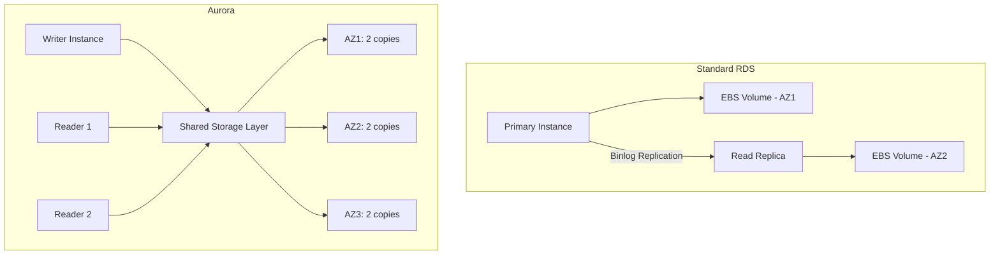
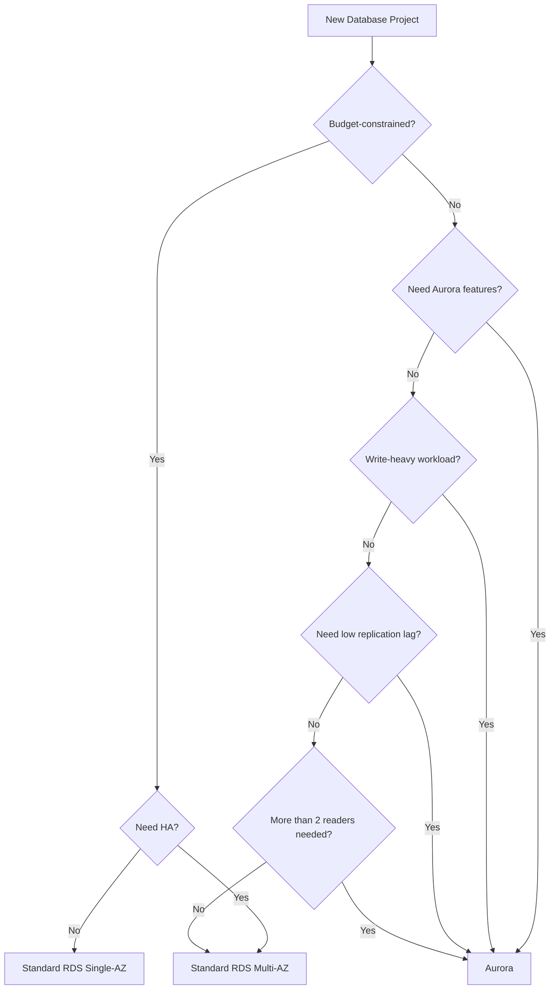

# How to Compare Aurora vs Standard RDS

Author: [nawazdhandala](https://github.com/nawazdhandala)

Tags: AWS, Aurora, RDS, Database, Comparison

Description: A detailed comparison of Amazon Aurora and standard RDS for MySQL and PostgreSQL, covering performance, pricing, features, and guidance on when to choose each option.

---

"Should I use Aurora or regular RDS?" It's one of the most common questions teams face when setting up a database on AWS. The marketing says Aurora is "up to 5x faster than MySQL" - but marketing numbers and real-world performance aren't always the same thing. Let's do an honest comparison.

## Architecture Differences

This is where the fundamental difference lies. Standard RDS and Aurora use completely different storage architectures.

**Standard RDS** attaches an EBS volume to a single instance. Data is written to the EBS volume, and replication to read replicas happens via the MySQL/PostgreSQL built-in replication mechanism (binary log or WAL streaming). If the instance fails, RDS creates a new instance and attaches the same EBS volume.

**Aurora** uses a distributed, fault-tolerant storage layer shared across all instances in the cluster. Data is automatically replicated 6 ways across 3 Availability Zones. The storage layer and compute layer are decoupled.



This architecture difference drives almost every other difference between the two.

## Performance Comparison

### Write Performance

Aurora's write path is fundamentally different. Instead of writing full pages to disk, Aurora only writes redo log records to the storage layer. This reduces write amplification significantly, especially for random write workloads.

In practice, you'll see the biggest improvement on write-heavy workloads:

| Workload Type | Standard RDS | Aurora | Improvement |
|---------------|-------------|--------|-------------|
| Random writes (OLTP) | Baseline | 2-3x faster | Significant |
| Sequential writes | Baseline | 1.2-1.5x faster | Moderate |
| Read-heavy (cached) | Baseline | Similar | Negligible |
| Read-heavy (disk) | Baseline | 1.5-2x faster | Moderate |

The "5x faster" claim? It's achievable on specific benchmarks with heavy random write patterns. For typical application workloads, expect 1.5-3x improvement.

### Read Performance

For reads that hit the buffer pool cache, performance is similar. The difference shows up when reads go to disk (cache misses). Aurora's storage layer can serve reads faster than EBS because of its distributed nature and the fact that reads are served from the closest copy of the data.

### Replication Lag

This is where Aurora absolutely shines. Standard RDS replication uses logical replication (binlog or WAL), which can lag seconds or even minutes behind during heavy write loads. Aurora replication uses the shared storage layer - readers see new data as soon as it's written to storage, typically within 10-20 milliseconds.

```bash
# Compare replication lag between RDS and Aurora
# RDS MySQL - check replica lag
mysql -h rds-replica.abc123.us-east-1.rds.amazonaws.com -u admin -p \
  -e "SHOW SLAVE STATUS\G" | grep "Seconds_Behind_Master"
# Typical: 0-30 seconds, can spike to minutes

# Aurora - check replica lag
aws cloudwatch get-metric-statistics \
  --namespace AWS/RDS \
  --metric-name AuroraReplicaLag \
  --dimensions Name=DBInstanceIdentifier,Value=my-aurora-reader-1 \
  --start-time $(date -u -d '1 hour ago' +%Y-%m-%dT%H:%M:%S) \
  --end-time $(date -u +%Y-%m-%dT%H:%M:%S) \
  --period 60 \
  --statistics Average
# Typical: 10-20 milliseconds
```

## Storage Comparison

| Feature | Standard RDS | Aurora |
|---------|-------------|--------|
| Max storage | 64 TB | 128 TB |
| Auto-scaling | Manual or limited auto-growth | Automatic, 10 GB increments |
| Storage type | GP2, GP3, IO1, IO2 | Distributed, SSD-based |
| Provisioning | Must provision in advance | Pay for what you use |
| Replication storage | Each replica has its own volume | Shared storage layer |

Aurora's storage model is a clear win for most scenarios. You never have to worry about running out of disk space or over-provisioning. Standard RDS requires you to choose a storage type and size up front.

## High Availability and Failover

### Standard RDS Multi-AZ

Standard RDS Multi-AZ maintains a synchronous standby replica in a different AZ. Failover takes 1-2 minutes. During failover, there's a brief outage while DNS updates and the standby becomes primary.

### Aurora Failover

Aurora can fail over to any reader in any AZ. Because readers share the same storage, there's no need to replay transaction logs. Failover typically completes in under 30 seconds, and often under 15 seconds.

```bash
# Test Aurora failover
aws rds failover-db-cluster \
  --db-cluster-identifier my-aurora-cluster

# Monitor failover events
aws rds describe-events \
  --source-identifier my-aurora-cluster \
  --source-type db-cluster \
  --duration 30
```

## Feature Comparison

### Aurora-Only Features

These features aren't available on standard RDS:

- **Backtrack** - Rewind the database to a previous point in time in seconds. See the guide on [Aurora Backtrack](https://oneuptime.com/blog/post/2026-02-12-aurora-backtrack-to-rewind-a-database/view).
- **Cloning** - Create instant copies of your database using copy-on-write. See the guide on [Aurora Cloning](https://oneuptime.com/blog/post/2026-02-12-aurora-cloning-for-fast-database-copies/view).
- **Global Databases** - Sub-second cross-region replication. See the guide on [Aurora Global Databases](https://oneuptime.com/blog/post/2026-02-12-set-up-aurora-global-databases-for-multi-region/view).
- **Parallel Query** - Push query processing to the storage layer. See the guide on [Aurora Parallel Query](https://oneuptime.com/blog/post/2026-02-12-aurora-parallel-query-for-analytics/view).
- **Machine Learning Integration** - Call ML services from SQL. See the guide on [Aurora ML](https://oneuptime.com/blog/post/2026-02-12-aurora-machine-learning-ml-integration/view).

### Standard RDS Advantages

Standard RDS has a few things going for it:

- **Lower cost for small workloads** - No minimum instance requirement beyond what you provision
- **Simpler architecture** - Easier to understand and troubleshoot
- **More engine options** - MariaDB, Oracle, SQL Server in addition to MySQL and PostgreSQL
- **Read replica in different region** - Available without Global Database pricing

## Pricing Comparison

This is where things get nuanced. Aurora isn't always more expensive, and it isn't always cheaper.

### Compute Costs

Aurora instance pricing is about 20-30% higher than equivalent RDS instances for the same instance class. However, because Aurora is more efficient, you can often use a smaller instance class and get the same performance.

### Storage Costs

Aurora storage is billed per GB-month for actual usage. Standard RDS bills for provisioned storage whether you use it or not. For databases that grow unpredictably or have a lot of free space, Aurora is often cheaper.

### I/O Costs

Aurora charges per I/O request. Standard RDS with GP3 or IO1/IO2 provisioned IOPS bundles I/O into the storage cost. For very I/O-intensive workloads, this can make Aurora more expensive. Aurora I/O-Optimized is an option to eliminate per-I/O charges in exchange for a higher storage rate.

Here's a rough monthly cost comparison for a typical 500 GB database:

```
Standard RDS (db.r5.large, Multi-AZ, GP3):
  Instance: $245/mo (Multi-AZ)
  Storage:  $57.50/mo (500 GB GP3)
  Total:    ~$302/mo

Aurora (db.r5.large, 1 reader):
  Writer:   $175/mo
  Reader:   $175/mo
  Storage:  $50/mo (500 GB actual usage)
  I/O:      ~$20-50/mo (varies with workload)
  Total:    ~$420-450/mo

Aurora (db.r5.large, no reader, writer-only):
  Writer:   $175/mo
  Storage:  $50/mo
  I/O:      ~$20-50/mo
  Total:    ~$245-275/mo
```

Aurora looks more expensive with a reader, but consider that you're getting much better replication, instant failover, and all the Aurora-exclusive features.

## Decision Framework

Here's a simple decision tree to help you choose:



### Choose Aurora When:

- You need very low replication lag (sub-100ms)
- You need more than 2 read replicas
- You want features like Backtrack, Cloning, or Global Databases
- Your workload is write-heavy
- You need fast failover (under 30 seconds)
- Your database storage grows unpredictably

### Choose Standard RDS When:

- You're on a tight budget and don't need Aurora features
- Your database is small and read-light
- You're using an engine that Aurora doesn't support (MariaDB, Oracle, SQL Server)
- Your workload is extremely I/O-heavy and cost-sensitive
- You need something simple and well-understood

## Migration Path

If you start with standard RDS and later decide you need Aurora, the migration is straightforward. Check out the guide on [migrating from RDS MySQL to Aurora MySQL](https://oneuptime.com/blog/post/2026-02-12-migrate-from-rds-mysql-to-aurora-mysql/view) for the step-by-step process. The read-replica promotion method gives you near-zero downtime.

## Wrapping Up

Aurora is the better database for most production workloads. The architecture advantages - shared storage, millisecond replication lag, fast failover, and exclusive features - make it worth the slightly higher price for any application that cares about performance and availability. Standard RDS still has its place for smaller workloads, tight budgets, and engines that Aurora doesn't support.

Don't overthink it. If you're running MySQL or PostgreSQL at any meaningful scale on AWS, start with Aurora. You can always scale down if it turns out you don't need it, but you can't easily add Aurora's architectural advantages to standard RDS later.
