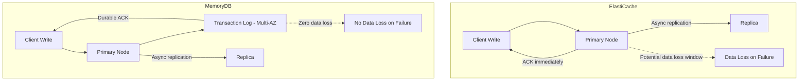
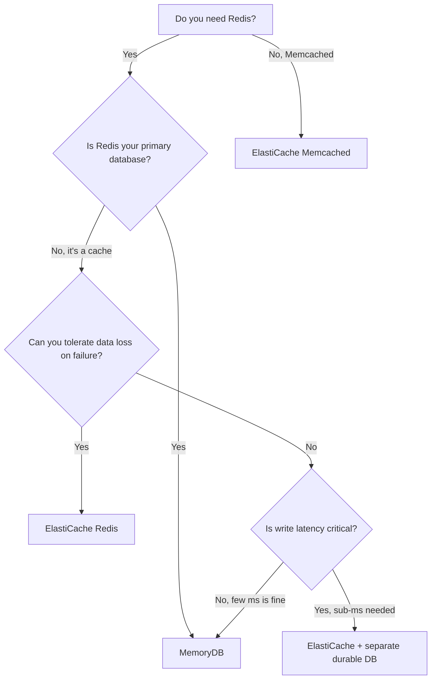

# How to Compare MemoryDB vs ElastiCache

Author: [nawazdhandala](https://github.com/nawazdhandala)

Tags: AWS, MemoryDB, ElastiCache, Redis, Comparison

Description: An in-depth comparison of Amazon MemoryDB for Redis and Amazon ElastiCache for Redis, covering durability, performance, pricing, and guidance on when to choose each service.

---

AWS gives you two managed Redis services: ElastiCache for Redis and MemoryDB for Redis. On the surface, they look similar - both run Redis, both are managed, and both are fast. But underneath, they're built for fundamentally different use cases. Choosing the wrong one means either paying too much or not getting the guarantees you need.

Let's break down the differences in a way that actually helps you make the right decision.

## The Core Difference: Durability

This is the one thing that matters most, and everything else flows from it.

**ElastiCache for Redis** uses standard Redis replication. Writes go to the primary node, which asynchronously replicates to replicas. If the primary fails before a write is replicated, that write is lost. This is fine for a cache (you can always refetch from the database), but it's not okay for a primary data store.

**MemoryDB for Redis** uses a Multi-AZ distributed transaction log. Every write is durably stored in the transaction log across multiple AZs before it's acknowledged to the client. If the primary fails, no writes are lost. Period.



## Feature Comparison

| Feature | ElastiCache for Redis | MemoryDB for Redis |
|---------|----------------------|-------------------|
| Redis compatibility | Full | Full |
| Write durability | Async (potential data loss) | Durable (zero data loss) |
| Read latency | Microseconds | Microseconds |
| Write latency | Microseconds | Single-digit milliseconds |
| Cluster mode | Optional | Always enabled |
| TLS | Optional | Always enabled |
| Authentication | Optional (AUTH token) | Required (ACL) |
| Max shards | 500 | 500 |
| Max replicas per shard | 5 | 5 |
| Backup/snapshots | Yes | Yes |
| Multi-AZ | Optional | Always enabled |
| Global Datastore | Yes | Yes |
| Engine versions | Redis 5.0-7.x | Redis 6.2-7.x |

## Performance Comparison

### Read Performance

Both services deliver microsecond read latency because reads come from in-memory data structures on the local node. There's essentially no difference in read performance.

```
Read latency comparison (p99):
  ElastiCache: ~100-300 microseconds
  MemoryDB:    ~100-300 microseconds
  Winner:      Tie
```

### Write Performance

Here's where they diverge. ElastiCache acknowledges writes as soon as the primary node processes them. MemoryDB waits for the transaction log to durably store the write across AZs.

```
Write latency comparison (p99):
  ElastiCache: ~200-500 microseconds
  MemoryDB:    ~3-5 milliseconds
  Winner:      ElastiCache (for latency)
                MemoryDB (for durability)
```

For most applications, the difference between 0.5ms and 5ms is irrelevant. But for ultra-low-latency write paths (like high-frequency trading), it matters.

### Throughput

Both services can handle millions of operations per second at scale. The throughput is primarily determined by the node type and number of shards.

## Cost Comparison

MemoryDB costs more than ElastiCache because of the transaction log infrastructure. Here's a rough comparison for the same node type:

```
Monthly cost for cache.r6g.large / db.r6g.large (us-east-1):

ElastiCache (3-node replication group):
  Primary:    ~$175/mo
  Replica 1:  ~$175/mo
  Replica 2:  ~$175/mo
  Total:      ~$525/mo

MemoryDB (3-shard cluster, 1 replica each):
  6 nodes:    ~$780/mo
  Total:      ~$780/mo
```

However, if you're currently running ElastiCache Redis AND a separate database (like RDS) because you need durability, the total cost comparison changes:

```
Architecture comparison:

Option A: ElastiCache + RDS (cache + durable storage)
  ElastiCache: ~$525/mo
  RDS:         ~$350/mo
  Total:       ~$875/mo

Option B: MemoryDB only (durable cache/database)
  MemoryDB:    ~$780/mo
  Total:       ~$780/mo
```

In this scenario, MemoryDB is actually cheaper AND simpler because you've eliminated an entire component.

## Security Comparison

MemoryDB takes a more opinionated security stance:

**ElastiCache:**
- TLS is optional
- Authentication is optional (AUTH token)
- Can run without encryption

**MemoryDB:**
- TLS is always enabled
- ACL-based authentication is required
- At-rest encryption is always enabled

If you're in a regulated environment, MemoryDB's security defaults save you from accidentally deploying an insecure cache.

## Use Case Decision Guide

### Choose ElastiCache When:

**You need a cache.** This is the classic use case. You have a database (RDS, DynamoDB, etc.) and want to speed up reads by caching frequently accessed data in memory.

```python
# Typical ElastiCache pattern - cache-aside
def get_user(user_id):
    # Check cache
    cached = redis.get(f"user:{user_id}")
    if cached:
        return json.loads(cached)

    # Cache miss - fetch from primary database
    user = database.query("SELECT * FROM users WHERE id = %s", user_id)

    # Store in cache
    redis.setex(f"user:{user_id}", 300, json.dumps(user))
    return user
```

**Write latency is critical.** If you need sub-millisecond write acknowledgment and can tolerate potential data loss on failure.

**Cost is the primary concern.** ElastiCache is 20-30% cheaper for the same node type.

**You need Memcached.** MemoryDB only supports Redis. If you specifically need Memcached, ElastiCache is your only option.

### Choose MemoryDB When:

**Redis is your primary data store.** If data in Redis isn't just a cached copy of something else, you need MemoryDB's durability guarantees.

```python
# Typical MemoryDB pattern - primary database
def create_order(order_id, order_data):
    # Write directly to MemoryDB - this is the system of record
    memorydb.hset(f"order:{order_id}", mapping=order_data)
    memorydb.zadd(f"user:{order_data['user_id']}:orders", {
        f"order:{order_id}": time.time()
    })
    # No need for a separate database - the write is durable
```

**You're building a real-time application.** Gaming leaderboards, real-time analytics, session stores where data loss is unacceptable.

**You want to simplify your architecture.** Replace ElastiCache + RDS with just MemoryDB for Redis-centric workloads.

**Compliance requires encryption everywhere.** MemoryDB's mandatory TLS and encryption simplify compliance.

### Quick Decision Matrix



## Migration Between Services

### ElastiCache to MemoryDB

If you decide to move from ElastiCache to MemoryDB:

1. Create a snapshot of your ElastiCache cluster
2. Create a new MemoryDB cluster from that snapshot
3. Update your application connection strings
4. Enable ACL authentication in your application code

```bash
# Create a snapshot from ElastiCache
aws elasticache create-snapshot \
  --replication-group-id my-elasticache-cluster \
  --snapshot-name migration-snapshot

# Export to S3
aws elasticache copy-snapshot \
  --source-snapshot-name migration-snapshot \
  --target-snapshot-name s3-export \
  --target-bucket my-redis-snapshots

# Create MemoryDB cluster from the S3 snapshot
aws memorydb create-cluster \
  --cluster-name my-memorydb-cluster \
  --node-type db.r6g.large \
  --num-shards 3 \
  --num-replicas-per-shard 1 \
  --snapshot-arns arn:aws:s3:::my-redis-snapshots/s3-export.rdb \
  --acl-name my-app-acl \
  --subnet-group-name my-memorydb-subnets \
  --security-group-ids sg-memorydb123 \
  --tls-enabled
```

### Application Code Changes

The main code changes when moving to MemoryDB:

```python
# ElastiCache connection (optional auth, optional TLS)
elasticache = redis.Redis(
    host='my-elasticache.abc123.ng.0001.use1.cache.amazonaws.com',
    port=6379,
)

# MemoryDB connection (required auth, required TLS)
from redis.cluster import RedisCluster
memorydb = RedisCluster(
    host='clustercfg.my-memorydb.abc123.memorydb.us-east-1.amazonaws.com',
    port=6379,
    username='app-user',
    password='YourPassword123!',
    ssl=True,
    ssl_cert_reqs='required',
    decode_responses=True,
    skip_full_coverage_check=True,
)
```

## Real-World Architecture Patterns

### Pattern 1: MemoryDB as Session Store (Replacing ElastiCache + DynamoDB)

Before:
- ElastiCache for fast session reads
- DynamoDB for durable session storage
- Application code to sync between them

After:
- MemoryDB for both fast reads AND durable storage
- Simpler application code, fewer failure modes

### Pattern 2: ElastiCache as API Cache + RDS as Database

This is the classic pattern and it still makes sense when:
- Your data model is relational
- You need SQL queries
- Redis is purely a performance optimization

### Pattern 3: MemoryDB as Real-Time Database + S3 for Analytics

Use MemoryDB for real-time operations and periodically export data to S3 for analytics:
- MemoryDB handles all real-time reads and writes
- A scheduled job exports data to S3 for batch analytics
- No traditional database needed

## Wrapping Up

The choice between ElastiCache and MemoryDB comes down to one question: is Redis your cache or your database? If it's a cache, use ElastiCache - it's cheaper and faster for writes. If it's a database (or if you can't afford to lose data), use MemoryDB - it's durable, secure by default, and can simplify your architecture by eliminating the need for a separate database.

For more on working with these services, check out the guides on [connecting to ElastiCache Redis from an application](https://oneuptime.com/blog/post/2026-02-12-connect-to-elasticache-redis-from-an-application/view) and [using Amazon MemoryDB for Redis](https://oneuptime.com/blog/post/2026-02-12-amazon-memorydb-for-redis/view).
