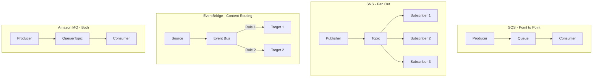

# How to Compare SQS vs SNS vs EventBridge vs MQ

Author: [nawazdhandala](https://github.com/nawazdhandala)

Tags: AWS, SQS, SNS, EventBridge, Amazon MQ, Messaging

Description: A detailed comparison of AWS messaging services - SQS, SNS, EventBridge, and Amazon MQ - covering use cases, pricing, and when to pick each one.

---

AWS gives you four major messaging services, and honestly, it can be confusing to figure out which one to use. SQS, SNS, EventBridge, and Amazon MQ all move messages between services, but they do it in very different ways and for different reasons.

Let's break down each one, compare them head-to-head, and figure out when you should reach for each.

## Quick Overview

Before diving into details, here's the 30-second summary of each service.

**Amazon SQS** is a message queue. Producers put messages in, consumers pull them out. Messages sit in the queue until someone processes them. It's the simplest of the four.

**Amazon SNS** is a pub/sub notification service. Publishers send a message to a topic, and SNS delivers it to all subscribers - which can be HTTP endpoints, Lambda functions, SQS queues, email addresses, or mobile push notifications.

**Amazon EventBridge** is an event bus. It's like SNS on steroids - it can route events based on their content, transform them, and integrate with dozens of AWS services and third-party SaaS applications.

**Amazon MQ** is a managed message broker running ActiveMQ or RabbitMQ. It speaks standard protocols like AMQP, STOMP, and JMS, making it ideal for migrating existing messaging workloads.

## Communication Patterns

The fundamental difference comes down to how messages flow.



**SQS** is strictly one-to-one. Each message is processed by exactly one consumer. If you need multiple consumers, you need multiple queues.

**SNS** is one-to-many. Every subscriber gets every message (unless you use filtering). It doesn't store messages - if a subscriber is down, the message is lost unless the subscriber is an SQS queue.

**EventBridge** is also one-to-many, but with content-based routing. You define rules that match specific patterns in the event payload, and only matching targets receive the event.

**Amazon MQ** supports both patterns. ActiveMQ and RabbitMQ handle both queues (point-to-point) and topics (pub/sub) natively.

## Feature Comparison

Here's a detailed breakdown of the features that matter most.

| Feature | SQS | SNS | EventBridge | Amazon MQ |
|---|---|---|---|---|
| Max message size | 256 KB | 256 KB | 256 KB | Varies (broker dependent) |
| Message retention | Up to 14 days | No retention | 24 hours (replay) | Configurable |
| Ordering | FIFO queues only | FIFO topics only | No ordering guarantee | Yes |
| Deduplication | FIFO queues | FIFO topics | No built-in | Yes |
| Dead letter queue | Yes | Yes (via SQS) | Yes | Yes |
| Message filtering | No (client-side) | Attribute filtering | Content-based rules | Selectors |
| Protocol support | AWS SDK/HTTP | AWS SDK/HTTP | AWS SDK/HTTP | AMQP, STOMP, MQTT, JMS |
| Max throughput | Nearly unlimited | Varies by region | Varies by region | Instance-dependent |
| Pricing model | Per request | Per publish + delivery | Per event | Per hour + storage |

## When to Use SQS

SQS is your default choice for decoupling two services. It's simple, reliable, and scales automatically.

**Best for:**
- Work queues where each task should be processed once
- Buffering writes to a database
- Smoothing out traffic spikes
- Any producer-consumer pattern

Here's a typical SQS setup with a Lambda consumer.

```python
import boto3
import json

sqs = boto3.client("sqs")

# Producer sends a message
sqs.send_message(
    QueueUrl="https://sqs.us-east-1.amazonaws.com/123456789/orders",
    MessageBody=json.dumps({
        "order_id": "ORD-123",
        "customer": "jane@example.com",
        "total": 59.99
    })
)

# Consumer (Lambda handler) processes it
def handler(event, context):
    for record in event["Records"]:
        order = json.loads(record["body"])
        print(f"Processing order {order['order_id']}")
        # Process the order...
```

For more on processing SQS messages efficiently, see our guide on [processing SQS messages in batch with Lambda](https://oneuptime.com/blog/post/2026-02-12-process-sqs-messages-batch-lambda/view).

## When to Use SNS

SNS shines when a single event needs to trigger multiple downstream actions. The classic pattern is SNS + SQS fan-out.

**Best for:**
- Sending notifications to multiple subscribers
- Fan-out patterns (one event triggers many workflows)
- Mobile push notifications
- Email/SMS alerts

This example publishes an order event to an SNS topic that fans out to multiple SQS queues.

```python
import boto3
import json

sns = boto3.client("sns")

# Publish to a topic - all subscribers get the message
sns.publish(
    TopicArn="arn:aws:sns:us-east-1:123456789:order-events",
    Message=json.dumps({
        "order_id": "ORD-123",
        "event": "order_placed",
        "total": 59.99
    }),
    # Message attributes enable filtering
    MessageAttributes={
        "event_type": {
            "DataType": "String",
            "StringValue": "order_placed"
        },
        "order_value": {
            "DataType": "Number",
            "StringValue": "59.99"
        }
    }
)
```

Subscribers can use filter policies to only receive messages they care about. The inventory service might subscribe to all order events, while the fraud detection service only wants orders over $500.

## When to Use EventBridge

EventBridge is the most powerful of the four for event routing. Its content-based filtering, schema registry, and built-in integrations make it ideal for complex event-driven architectures.

**Best for:**
- Event-driven architectures with complex routing
- Cross-account event routing
- SaaS integration (Shopify, Zendesk, PagerDuty, etc.)
- Scheduled events (cron)
- When you need to route based on event content

This EventBridge rule routes high-value orders to a specific Lambda function.

```json
{
  "source": ["com.myapp.orders"],
  "detail-type": ["Order Placed"],
  "detail": {
    "total": [{
      "numeric": [">", 500]
    }],
    "country": ["US", "CA"]
  }
}
```

The filtering is much more expressive than SNS. You can match on nested fields, numeric comparisons, prefixes, and more.

For a deeper look at combining these services, check out our post on [event-driven architecture with SQS, SNS, and EventBridge](https://oneuptime.com/blog/post/2026-02-12-event-driven-architecture-sqs-sns-eventbridge/view).

## When to Use Amazon MQ

Amazon MQ exists for one primary reason: protocol compatibility. If your applications already speak JMS, AMQP, STOMP, or MQTT, Amazon MQ lets you move to a managed service without rewriting your messaging code.

**Best for:**
- Migrating existing message broker workloads to AWS
- Applications that need standard messaging protocols
- When you need both queuing and pub/sub in one broker
- IoT workloads using MQTT

If you're building something new from scratch on AWS, the native services (SQS, SNS, EventBridge) are usually the better choice. They scale more easily, cost less at scale, and integrate more deeply with other AWS services.

For migration guidance, see [migrating from self-managed RabbitMQ to Amazon MQ](https://oneuptime.com/blog/post/2026-02-12-migrate-rabbitmq-to-amazon-mq/view).

## Pricing Comparison

Pricing is often the deciding factor, so let's compare.

**SQS**: $0.40 per million requests (Standard), $0.50 per million (FIFO). First million requests per month are free.

**SNS**: $0.50 per million publishes. Delivery costs vary by protocol - SQS delivery is free, HTTP is $0.60/million, SMS varies by country.

**EventBridge**: $1.00 per million events published. No charge for rules evaluation.

**Amazon MQ**: Hourly broker instance cost ($0.13-$1.04/hour depending on instance) plus storage ($0.10/GB/month). No per-message cost, which makes it cheaper at very high throughput.

For low to moderate throughput, SQS and SNS are cheapest. For very high throughput with a steady baseline, Amazon MQ can actually be more economical since you pay per hour, not per message.

## Combining Services

In practice, you'll often use multiple services together. Here are common combinations:

- **SNS + SQS**: Fan-out pattern. SNS distributes to multiple SQS queues, each with its own consumer.
- **EventBridge + SQS**: Route events by content, then buffer in SQS for reliable processing.
- **SNS + SQS + Lambda**: The classic serverless event processing pipeline.

## Decision Tree

If you're still not sure, ask yourself these questions in order:

1. Do you need standard protocol support (AMQP, JMS, MQTT)? Use **Amazon MQ**.
2. Do you need content-based routing or SaaS integrations? Use **EventBridge**.
3. Do you need to fan out to multiple consumers? Use **SNS** (often with SQS subscribers).
4. Do you just need to decouple two services? Use **SQS**.

## Wrapping Up

There's no single "best" messaging service on AWS. SQS is the simplest and most cost-effective for basic queuing. SNS handles fan-out and notifications. EventBridge provides sophisticated routing and integration. Amazon MQ offers protocol compatibility for existing workloads. Pick based on your specific communication pattern, protocol requirements, and throughput profile.
