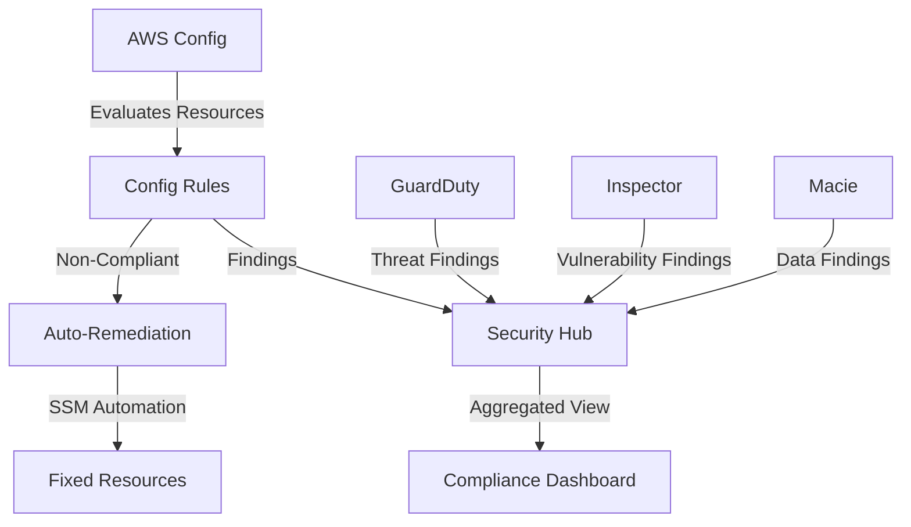

# How to Implement Compliance Automation on AWS

Author: [nawazdhandala](https://github.com/nawazdhandala)

Tags: AWS, Compliance, Security Hub, Config, Automation

Description: A hands-on guide to automating compliance checks on AWS using AWS Config, Security Hub, and custom rules for continuous compliance monitoring and remediation.

---

Manual compliance is a losing game. You can spend weeks preparing for an audit, get everything into shape, and watch it all drift back to non-compliance within days. Someone spins up an unencrypted database. A developer opens a security group too wide. A new account gets created without the required baseline. If you're checking compliance quarterly, you've got three months of exposure between checks.

Compliance automation means your environment is continuously evaluated against your compliance requirements, and violations are caught - or even fixed - in real time.

## The Compliance Automation Stack

AWS provides several services that work together for compliance automation.



## AWS Config Rules - The Foundation

AWS Config continuously records resource configurations and evaluates them against rules. Start with the managed rules that map to your compliance framework.

This Terraform configuration sets up Config rules for common compliance requirements.

```hcl
# Enable AWS Config
resource "aws_config_configuration_recorder" "main" {
  name     = "config-recorder"
  role_arn = aws_iam_role.config.arn

  recording_group {
    all_supported                 = true
    include_global_resource_types = true
  }
}

resource "aws_config_delivery_channel" "main" {
  name           = "config-delivery"
  s3_bucket_name = aws_s3_bucket.config_logs.id

  snapshot_delivery_properties {
    delivery_frequency = "Six_Hours"
  }

  depends_on = [aws_config_configuration_recorder.main]
}

# CIS Benchmark Rules
resource "aws_config_config_rule" "root_mfa" {
  name = "root-account-mfa-enabled"
  source {
    owner             = "AWS"
    source_identifier = "ROOT_ACCOUNT_MFA_ENABLED"
  }
}

resource "aws_config_config_rule" "ebs_encryption" {
  name = "encrypted-volumes"
  source {
    owner             = "AWS"
    source_identifier = "ENCRYPTED_VOLUMES"
  }
}

resource "aws_config_config_rule" "s3_encryption" {
  name = "s3-bucket-encryption"
  source {
    owner             = "AWS"
    source_identifier = "S3_BUCKET_SERVER_SIDE_ENCRYPTION_ENABLED"
  }
}

resource "aws_config_config_rule" "rds_encryption" {
  name = "rds-storage-encrypted"
  source {
    owner             = "AWS"
    source_identifier = "RDS_STORAGE_ENCRYPTED"
  }
}

resource "aws_config_config_rule" "restricted_ssh" {
  name = "restricted-ssh"
  source {
    owner             = "AWS"
    source_identifier = "INCOMING_SSH_DISABLED"
  }
}

resource "aws_config_config_rule" "cloudtrail_enabled" {
  name = "cloudtrail-enabled"
  source {
    owner             = "AWS"
    source_identifier = "CLOUD_TRAIL_ENABLED"
  }
}

resource "aws_config_config_rule" "iam_password_policy" {
  name = "iam-password-policy"
  source {
    owner             = "AWS"
    source_identifier = "IAM_PASSWORD_POLICY"
  }
  input_parameters = jsonencode({
    RequireUppercaseCharacters = "true"
    RequireLowercaseCharacters = "true"
    RequireSymbols             = "true"
    RequireNumbers             = "true"
    MinimumPasswordLength      = "14"
    PasswordReusePrevention    = "24"
    MaxPasswordAge             = "90"
  })
}
```

## Custom Config Rules

When managed rules don't cover your specific requirements, write custom rules.

This Lambda function checks whether all EC2 instances have required tags.

```python
import boto3
import json

REQUIRED_TAGS = ['Environment', 'Team', 'CostCenter', 'DataClassification']

def evaluate_compliance(event, context):
    """Custom Config rule: Check for required tags on EC2 instances."""
    config = boto3.client('config')
    invoking_event = json.loads(event['invokingEvent'])

    # Get the configuration item
    config_item = invoking_event['configurationItem']

    if config_item['resourceType'] != 'AWS::EC2::Instance':
        return

    resource_id = config_item['resourceId']
    tags = config_item.get('tags', {})

    # Check for required tags
    missing_tags = [tag for tag in REQUIRED_TAGS if tag not in tags]

    if missing_tags:
        compliance_type = 'NON_COMPLIANT'
        annotation = f"Missing required tags: {', '.join(missing_tags)}"
    else:
        compliance_type = 'COMPLIANT'
        annotation = "All required tags present"

    # Report evaluation result
    config.put_evaluations(
        Evaluations=[
            {
                'ComplianceResourceType': config_item['resourceType'],
                'ComplianceResourceId': resource_id,
                'ComplianceType': compliance_type,
                'Annotation': annotation,
                'OrderingTimestamp': config_item['configurationItemCaptureTime']
            }
        ],
        ResultToken=event['resultToken']
    )

    return {
        'compliance_type': compliance_type,
        'resource_id': resource_id,
        'annotation': annotation
    }
```

## Automatic Remediation

Detecting violations is good. Fixing them automatically is better. Use AWS Config remediation actions with SSM Automation documents.

```hcl
# Auto-remediation for public S3 buckets
resource "aws_config_remediation_configuration" "s3_public_access" {
  config_rule_name = aws_config_config_rule.s3_public_access.name

  target_type    = "SSM_DOCUMENT"
  target_id      = "AWS-DisableS3BucketPublicReadWrite"
  target_version = "1"

  parameter {
    name           = "S3BucketName"
    resource_value = "RESOURCE_ID"
  }

  parameter {
    name         = "AutomationAssumeRole"
    static_value = aws_iam_role.remediation.arn
  }

  automatic                  = true
  maximum_automatic_attempts = 3
  retry_attempt_seconds      = 60
}

# Auto-remediation for security groups with 0.0.0.0/0 SSH
resource "aws_config_remediation_configuration" "restricted_ssh" {
  config_rule_name = aws_config_config_rule.restricted_ssh.name

  target_type = "SSM_DOCUMENT"
  target_id   = aws_ssm_document.revoke_ssh.name

  parameter {
    name           = "SecurityGroupId"
    resource_value = "RESOURCE_ID"
  }

  automatic                  = true
  maximum_automatic_attempts = 3
  retry_attempt_seconds      = 60
}
```

Here's the SSM document that removes SSH access from security groups.

```yaml
# SSM Automation document to revoke public SSH access
schemaVersion: '0.3'
description: Remove public SSH access from a security group
assumeRole: '{{AutomationAssumeRole}}'
parameters:
  SecurityGroupId:
    type: String
    description: The ID of the security group to remediate
  AutomationAssumeRole:
    type: String
    description: The ARN of the role to assume
mainSteps:
  - name: RevokePublicSSH
    action: aws:executeScript
    inputs:
      Runtime: python3.11
      Handler: handler
      Script: |
        import boto3
        def handler(events, context):
            ec2 = boto3.client('ec2')
            sg_id = events['SecurityGroupId']

            # Get current rules
            sg = ec2.describe_security_groups(GroupIds=[sg_id])['SecurityGroups'][0]

            for rule in sg['IpPermissions']:
                if rule.get('FromPort') == 22 and rule.get('ToPort') == 22:
                    for ip_range in rule.get('IpRanges', []):
                        if ip_range.get('CidrIp') == '0.0.0.0/0':
                            ec2.revoke_security_group_ingress(
                                GroupId=sg_id,
                                IpPermissions=[{
                                    'IpProtocol': 'tcp',
                                    'FromPort': 22,
                                    'ToPort': 22,
                                    'IpRanges': [{'CidrIp': '0.0.0.0/0'}]
                                }]
                            )
                            return {'status': 'remediated', 'sg': sg_id}

            return {'status': 'no_action_needed', 'sg': sg_id}
      InputPayload:
        SecurityGroupId: '{{SecurityGroupId}}'
```

## Security Hub - Centralized Compliance View

Security Hub aggregates findings from Config, GuardDuty, Inspector, and Macie into a single pane of glass with compliance scores against standard frameworks.

```hcl
# Enable Security Hub with compliance standards
resource "aws_securityhub_account" "main" {}

# Enable CIS AWS Foundations Benchmark
resource "aws_securityhub_standards_subscription" "cis" {
  depends_on    = [aws_securityhub_account.main]
  standards_arn = "arn:aws:securityhub:::ruleset/cis-aws-foundations-benchmark/v/1.4.0"
}

# Enable AWS Foundational Security Best Practices
resource "aws_securityhub_standards_subscription" "aws_best_practices" {
  depends_on    = [aws_securityhub_account.main]
  standards_arn = "arn:aws:securityhub:${var.region}::standards/aws-foundational-security-best-practices/v/1.0.0"
}

# Enable PCI DSS if applicable
resource "aws_securityhub_standards_subscription" "pci" {
  depends_on    = [aws_securityhub_account.main]
  standards_arn = "arn:aws:securityhub:${var.region}::standards/pci-dss/v/3.2.1"
}
```

## Compliance Reporting

Generate compliance reports automatically for audit preparation.

```python
import boto3
import json
from datetime import datetime

def generate_compliance_report():
    """Generate a compliance report from Security Hub findings."""
    securityhub = boto3.client('securityhub')

    # Get compliance status for each standard
    standards = securityhub.get_enabled_standards()['StandardsSubscriptions']

    report = {
        'generated_at': datetime.now().isoformat(),
        'standards': []
    }

    for standard in standards:
        standard_arn = standard['StandardsSubscriptionArn']

        # Get control results
        controls = []
        paginator = securityhub.get_paginator('describe_standards_controls')
        for page in paginator.paginate(StandardsSubscriptionArn=standard_arn):
            controls.extend(page['Controls'])

        passed = sum(1 for c in controls if c['ComplianceStatus'] == 'PASSED')
        failed = sum(1 for c in controls if c['ComplianceStatus'] == 'FAILED')
        total = len(controls)

        standard_report = {
            'name': standard_arn.split('/')[-2],
            'total_controls': total,
            'passed': passed,
            'failed': failed,
            'score': f"{(passed/total*100):.1f}%" if total > 0 else "N/A",
            'failed_controls': [
                {
                    'id': c['ControlId'],
                    'title': c['Title'],
                    'severity': c['SeverityRating'],
                    'remediation': c.get('RemediationUrl', 'N/A')
                }
                for c in controls
                if c['ComplianceStatus'] == 'FAILED'
            ]
        }

        report['standards'].append(standard_report)

    # Output summary
    print("\n=== Compliance Report ===")
    print(f"Generated: {report['generated_at']}\n")

    for std in report['standards']:
        print(f"Standard: {std['name']}")
        print(f"  Score: {std['score']} ({std['passed']}/{std['total_controls']} passed)")
        if std['failed_controls']:
            print(f"  Failed Controls:")
            for ctrl in std['failed_controls']:
                print(f"    [{ctrl['severity']}] {ctrl['id']}: {ctrl['title']}")
        print()

    return report

generate_compliance_report()
```

## Wrapping Up

Compliance automation transforms compliance from a periodic scramble into a continuous, measurable process. With AWS Config rules evaluating every resource change, automatic remediation fixing violations in real time, and Security Hub providing a unified compliance dashboard, you always know where you stand.

The investment pays off not just in audit readiness, but in actual security. Every compliance rule you enforce automatically is one less vulnerability in your environment.

For related topics, check out [logging and monitoring best practices on AWS](https://oneuptime.com/blog/post/2026-02-12-logging-monitoring-best-practices-aws/view) and [the shared responsibility model on AWS](https://oneuptime.com/blog/post/2026-02-12-shared-responsibility-model-aws/view).
