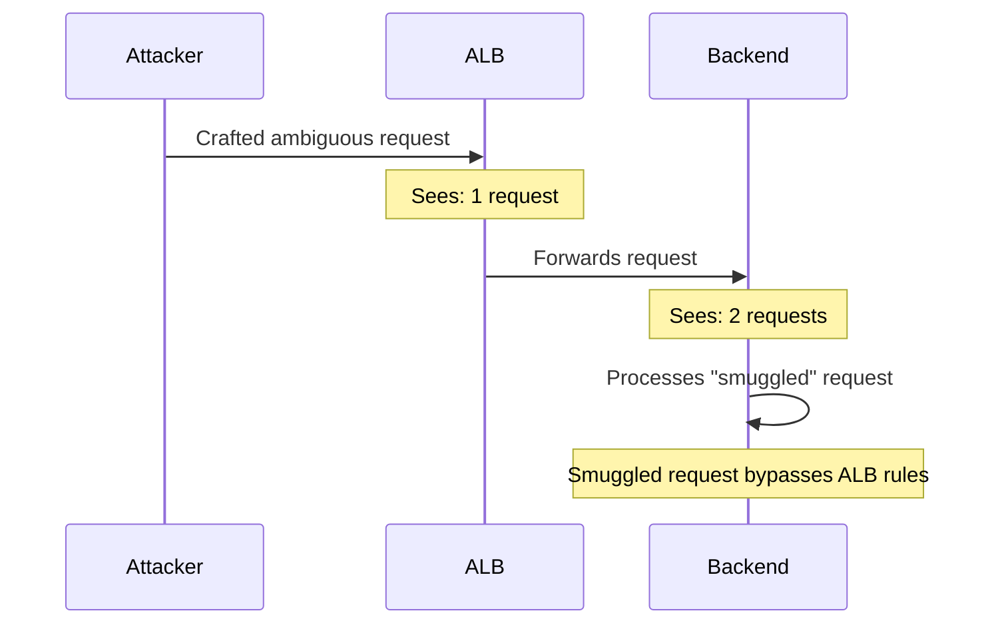
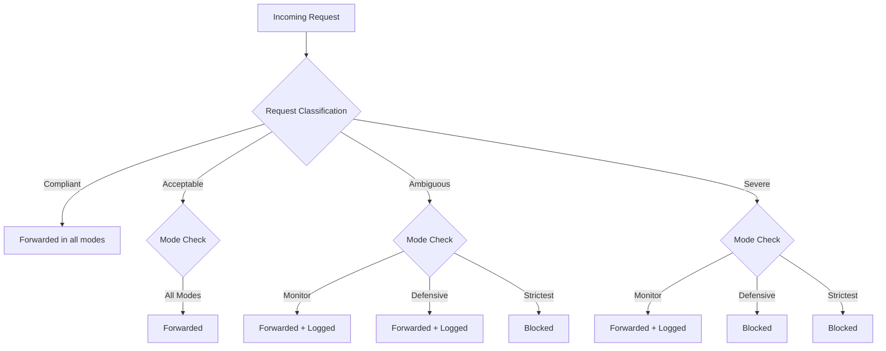

# How to Configure ALB Desync Mitigation Mode

Author: [nawazdhandala](https://github.com/nawazdhandala)

Tags: AWS, ALB, Security, HTTP Desync, Load Balancing, Web Security

Description: Learn how to configure ALB desync mitigation mode to protect your applications from HTTP desync attacks including request smuggling and splitting.

---

HTTP desync attacks exploit differences in how front-end and back-end systems parse HTTP requests. When your ALB and your application server disagree about where one request ends and the next begins, attackers can smuggle malicious requests past your security controls. ALB desync mitigation mode helps prevent this.

## What is HTTP Desync?

HTTP desync (also called HTTP request smuggling) happens when two HTTP processors - like an ALB and an application server - interpret the boundaries of HTTP requests differently. An attacker crafts a request that the ALB sees as one request but the backend sees as two.



This can lead to:
- Bypassing security controls (WAF rules, authentication)
- Cache poisoning
- Session hijacking
- Unauthorized access to other users' responses

## Desync Mitigation Modes

ALB offers three desync mitigation modes:

### Defensive Mode (Default)

This is the default setting. The ALB allows requests that are not RFC-compliant but are not known attack patterns. It classifies requests as:

- **Compliant**: Fully RFC-compliant requests. Always forwarded.
- **Acceptable**: Not fully compliant but not known to cause desync. Forwarded.
- **Ambiguous**: Could potentially cause desync. Forwarded but monitored.
- **Severe**: Known desync attack patterns. Blocked.

### Strictest Mode

The most secure option. Only allows fully RFC-compliant requests. Blocks anything that deviates from the HTTP specification, even if it is not a known attack pattern.

### Monitor Mode

The least restrictive. Allows all requests through but logs classification data. Use this to understand your traffic patterns before enabling stricter modes.



## Checking Your Current Mode

```bash
# Check the current desync mitigation mode
aws elbv2 describe-load-balancer-attributes \
    --load-balancer-arn arn:aws:elasticloadbalancing:us-east-1:123456789012:loadbalancer/app/my-alb/abc123 \
    --query 'Attributes[?Key==`routing.http.desync_mitigation_mode`].Value' \
    --output text
```

## Configuring Desync Mitigation Mode

### Using the AWS CLI

```bash
# Set to strictest mode for maximum protection
aws elbv2 modify-load-balancer-attributes \
    --load-balancer-arn arn:aws:elasticloadbalancing:us-east-1:123456789012:loadbalancer/app/my-alb/abc123 \
    --attributes 'Key=routing.http.desync_mitigation_mode,Value=strictest'
```

```bash
# Set to monitor mode for traffic analysis
aws elbv2 modify-load-balancer-attributes \
    --load-balancer-arn arn:aws:elasticloadbalancing:us-east-1:123456789012:loadbalancer/app/my-alb/abc123 \
    --attributes 'Key=routing.http.desync_mitigation_mode,Value=monitor'
```

```bash
# Set to defensive mode (default)
aws elbv2 modify-load-balancer-attributes \
    --load-balancer-arn arn:aws:elasticloadbalancing:us-east-1:123456789012:loadbalancer/app/my-alb/abc123 \
    --attributes 'Key=routing.http.desync_mitigation_mode,Value=defensive'
```

### Using Terraform

```hcl
resource "aws_lb" "app" {
  name               = "my-alb"
  internal           = false
  load_balancer_type = "application"
  security_groups    = [aws_security_group.alb.id]
  subnets            = [aws_subnet.public_1a.id, aws_subnet.public_1b.id]

  # Set desync mitigation mode
  desync_mitigation_mode = "strictest"

  tags = {
    Name = "my-alb"
  }
}
```

### Using CloudFormation

```yaml
ApplicationLoadBalancer:
  Type: AWS::ElasticLoadBalancingV2::LoadBalancer
  Properties:
    Name: my-alb
    Scheme: internet-facing
    Type: application
    Subnets:
      - !Ref PublicSubnet1
      - !Ref PublicSubnet2
    SecurityGroups:
      - !Ref ALBSecurityGroup
    LoadBalancerAttributes:
      - Key: routing.http.desync_mitigation_mode
        Value: strictest
```

## Migration Strategy: Monitor First, Then Enforce

Jumping straight to strictest mode can break legitimate traffic if your clients send non-compliant HTTP requests. Here is the recommended approach:

### Step 1: Enable Monitor Mode

```bash
# Start with monitor mode
aws elbv2 modify-load-balancer-attributes \
    --load-balancer-arn arn:aws:elasticloadbalancing:us-east-1:123456789012:loadbalancer/app/my-alb/abc123 \
    --attributes 'Key=routing.http.desync_mitigation_mode,Value=monitor'
```

### Step 2: Analyze Access Logs

Enable ALB access logs and look for the `classification` field. This tells you how each request was classified.

```bash
# Enable access logs
aws elbv2 modify-load-balancer-attributes \
    --load-balancer-arn arn:aws:elasticloadbalancing:us-east-1:123456789012:loadbalancer/app/my-alb/abc123 \
    --attributes \
        'Key=access_logs.s3.enabled,Value=true' \
        'Key=access_logs.s3.bucket,Value=my-alb-logs' \
        'Key=access_logs.s3.prefix,Value=alb-logs'
```

Then query the logs to understand your traffic:

```python
import gzip
import csv
from collections import Counter

def analyze_desync_classifications(log_file):
    """
    Analyze ALB access logs for desync classifications.
    The classification field is the last field in the log entry.
    """
    classifications = Counter()
    ambiguous_requests = []

    with gzip.open(log_file, 'rt') as f:
        for line in f:
            fields = line.strip().split(' ')
            # Classification is one of the last fields
            # Look for: Compliant, Acceptable, Ambiguous, Severe
            for field in fields:
                if field in ('Compliant', 'Acceptable', 'Ambiguous', 'Severe'):
                    classifications[field] += 1
                    if field in ('Ambiguous', 'Severe'):
                        ambiguous_requests.append(line.strip())

    print("Request Classifications:")
    for classification, count in classifications.most_common():
        print(f"  {classification}: {count}")

    if ambiguous_requests:
        print(f"\nSample ambiguous/severe requests ({len(ambiguous_requests)} total):")
        for req in ambiguous_requests[:5]:
            print(f"  {req[:200]}...")

    return classifications

# Analyze a day's worth of logs
analyze_desync_classifications('/tmp/alb-log-2026-02-12.gz')
```

### Step 3: Fix Non-Compliant Clients

If you find Ambiguous or Acceptable requests from legitimate clients, fix the clients before tightening the mode. Common issues include:

- Missing or duplicate Content-Length headers
- Transfer-Encoding with Content-Length in the same request
- Non-standard line endings in headers
- Malformed chunk sizes in chunked transfer encoding

### Step 4: Switch to Strictest Mode

Once you have confirmed that all legitimate traffic is classified as Compliant, switch to strictest mode:

```bash
aws elbv2 modify-load-balancer-attributes \
    --load-balancer-arn arn:aws:elasticloadbalancing:us-east-1:123456789012:loadbalancer/app/my-alb/abc123 \
    --attributes 'Key=routing.http.desync_mitigation_mode,Value=strictest'
```

## Monitoring Desync Events

Set up CloudWatch metrics to track desync-related events:

```bash
# Create CloudWatch alarm for desync events
aws cloudwatch put-metric-alarm \
    --alarm-name "alb-desync-detected" \
    --metric-name DesyncMitigationMode_NonCompliant_Request_Count \
    --namespace AWS/ApplicationELB \
    --statistic Sum \
    --period 300 \
    --threshold 0 \
    --comparison-operator GreaterThanThreshold \
    --dimensions \
        "Name=LoadBalancer,Value=app/my-alb/abc123" \
    --evaluation-periods 1 \
    --alarm-actions arn:aws:sns:us-east-1:123456789012:security-alerts \
    --alarm-description "Non-compliant HTTP requests detected - possible desync attack"
```

The ALB also publishes these CloudWatch metrics related to desync:
- `DesyncMitigationMode_NonCompliant_Request_Count`: Requests that were not fully RFC-compliant
- `HTTPCode_ELB_4XX_Count`: Increase may indicate blocked requests in strictest mode

## Combining with WAF

For defense in depth, use ALB desync mitigation alongside AWS WAF:

```bash
# Associate a WAF WebACL with your ALB for additional protection
aws wafv2 associate-web-acl \
    --web-acl-arn arn:aws:wafv2:us-east-1:123456789012:regional/webacl/my-web-acl/abc123 \
    --resource-arn arn:aws:elasticloadbalancing:us-east-1:123456789012:loadbalancer/app/my-alb/abc123
```

WAF catches known attack patterns at the application layer, while desync mitigation prevents protocol-level attacks. Together, they provide comprehensive HTTP security.

## What About HTTP/2?

HTTP/2 uses a different framing mechanism (binary frames instead of text-based headers), which eliminates the ambiguity that makes desync attacks possible. However, the connection between your ALB and your backend is typically HTTP/1.1, so desync protection is still relevant for the backend connection.

If your clients all support HTTP/2 and your ALB is configured for it, the front-end connection is safe from desync. But the back-end connection still benefits from desync mitigation.

## Performance Impact

The performance impact of desync mitigation is negligible. The ALB already parses HTTP headers for routing purposes. The desync classification adds minimal overhead to this existing parsing. Even in strictest mode, the latency impact is typically less than 1 millisecond per request.

## Best Practices

- Start with monitor mode, analyze traffic, then tighten
- Enable access logs to track request classifications
- Set up CloudWatch alarms for non-compliant requests
- Use strictest mode for internet-facing ALBs handling sensitive data
- Combine with AWS WAF for defense in depth
- For other ALB security configurations, see our guide on [configuring CloudFront response headers policy](https://oneuptime.com/blog/post/2026-02-12-configure-cloudfront-response-headers-policy/view)

## Conclusion

HTTP desync attacks are subtle and dangerous. They bypass security controls by exploiting protocol-level ambiguity rather than application-level vulnerabilities. ALB desync mitigation mode gives you a straightforward way to protect against these attacks. Start in monitor mode, understand your traffic, and then move to strictest mode for the strongest protection. The performance cost is negligible, and the security benefit is significant.
