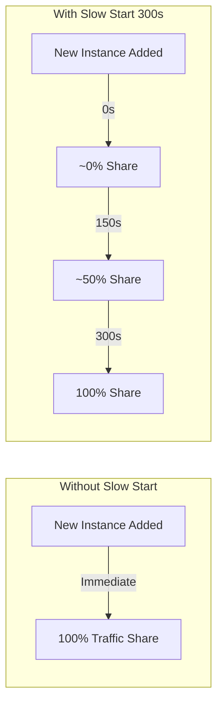
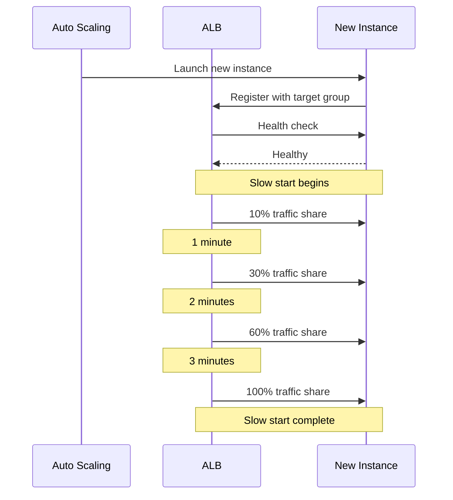

# How to Configure ALB Slow Start Mode

Author: [nawazdhandala](https://github.com/nawazdhandala)

Tags: AWS, ALB, Load Balancing, Performance, Slow Start, Target Groups

Description: Learn how to configure Application Load Balancer slow start mode to gradually ramp up traffic to new targets and avoid overwhelming fresh instances.

---

You add a new instance to your target group, and it immediately gets hit with full production traffic. If the application needs time to warm up - loading caches, establishing connection pools, JIT-compiling code - that initial burst can cause request failures and high latency. ALB slow start mode solves this by gradually increasing the traffic sent to new targets.

## What is Slow Start Mode?

When slow start is enabled on a target group, new targets do not immediately receive their full share of traffic. Instead, the ALB linearly ramps up the traffic over a configurable duration. During the ramp-up period, the new target starts with a small fraction of traffic and reaches its normal share at the end of the slow start window.



## When to Use Slow Start

Slow start is valuable when your application needs warm-up time for any of these reasons:

**JVM warm-up**: Java applications need time for JIT compilation. Cold JVMs can have 2-5x higher latency than warm ones.

**Cache warming**: Applications that rely on in-memory caches need time to populate those caches from the database.

**Connection pool initialization**: Database connection pools, HTTP client pools, and other connection resources take time to establish.

**Dependency initialization**: Applications that load configuration, establish gRPC channels, or connect to external services at startup.

## Configuring Slow Start

### Using the AWS CLI

```bash
# Enable slow start with a 300-second (5-minute) ramp-up period
aws elbv2 modify-target-group-attributes \
    --target-group-arn arn:aws:elasticloadbalancing:us-east-1:123456789012:targetgroup/my-app-tg/abc123 \
    --attributes 'Key=slow_start.duration_seconds,Value=300'
```

The `slow_start.duration_seconds` value can be set between 30 and 900 seconds (30 seconds to 15 minutes). Setting it to 0 disables slow start.

### Using Terraform

```hcl
resource "aws_lb_target_group" "app" {
  name     = "my-app-tg"
  port     = 80
  protocol = "HTTP"
  vpc_id   = aws_vpc.main.id

  # Enable slow start with 5-minute ramp-up
  slow_start = 300

  health_check {
    path                = "/health"
    protocol            = "HTTP"
    port                = "traffic-port"
    interval            = 15
    timeout             = 5
    healthy_threshold   = 2
    unhealthy_threshold = 3
    matcher             = "200"
  }

  tags = {
    Name = "my-app-tg"
  }
}
```

### Using CloudFormation

```yaml
AppTargetGroup:
  Type: AWS::ElasticLoadBalancingV2::TargetGroup
  Properties:
    Name: my-app-tg
    Protocol: HTTP
    Port: 80
    VpcId: !Ref VPC
    TargetGroupAttributes:
      - Key: slow_start.duration_seconds
        Value: "300"
    HealthCheckPath: /health
    HealthCheckIntervalSeconds: 15
    HealthyThresholdCount: 2
    UnhealthyThresholdCount: 3
```

## Choosing the Right Duration

The right slow start duration depends on your application's warm-up characteristics. Here is a guide:

| Application Type | Suggested Duration | Reason |
|-----------------|-------------------|--------|
| Java/JVM apps | 300-600s | JIT compilation needs multiple request cycles |
| Apps with large caches | 180-300s | Cache population from database |
| Simple HTTP services | 30-60s | Connection pool establishment |
| Pre-warmed containers | 30s (or disabled) | Already warm from pre-deployment scripts |
| Machine learning models | 300-900s | Model loading and first inference |

### How to Measure Warm-Up Time

The best way to determine your slow start duration is to measure actual warm-up behavior:

```python
import requests
import time
import statistics

def measure_warmup(url, total_duration=600, interval=5):
    """
    Send requests to a freshly launched instance and track latency over time.
    This helps determine how long the instance needs to warm up.
    """
    results = []
    start = time.time()

    while time.time() - start < total_duration:
        elapsed = time.time() - start
        try:
            req_start = time.time()
            response = requests.get(url, timeout=10)
            latency = (time.time() - req_start) * 1000

            results.append({
                'elapsed_seconds': round(elapsed),
                'latency_ms': round(latency, 1),
                'status': response.status_code
            })
        except Exception as e:
            results.append({
                'elapsed_seconds': round(elapsed),
                'latency_ms': None,
                'status': 'error'
            })

        time.sleep(interval)

    # Analyze warm-up pattern
    # Group by 30-second windows
    windows = {}
    for r in results:
        window = (r['elapsed_seconds'] // 30) * 30
        if window not in windows:
            windows[window] = []
        if r['latency_ms']:
            windows[window].append(r['latency_ms'])

    print("Time Window | Avg Latency | P95 Latency")
    print("-" * 45)

    for window in sorted(windows.keys()):
        latencies = windows[window]
        if latencies:
            avg = statistics.mean(latencies)
            p95 = sorted(latencies)[int(len(latencies) * 0.95)] if len(latencies) > 1 else latencies[0]
            print(f"{window:>4}s-{window+30}s  | {avg:>8.1f}ms  | {p95:>8.1f}ms")

# Run this against a freshly launched instance (bypass the ALB)
measure_warmup("http://new-instance-ip:80/api/endpoint")
```

When you see latency stabilize, that is your warm-up time. Add a buffer of 30-60 seconds and use that as your slow start duration.

## How Slow Start Interacts with Auto Scaling

When Auto Scaling launches new instances, they go through the slow start ramp-up period before receiving full traffic. This is exactly the behavior you want during scale-out events.

However, be aware of this interaction: if you have aggressive scaling policies and a long slow start duration, you might trigger additional scale-out events because the new instances are not yet carrying their full share of traffic.



To avoid cascading scale-outs, make sure your scaling cooldown period accounts for the slow start duration:

```bash
# Set scaling cooldown to be at least as long as slow start duration
aws autoscaling put-scaling-policy \
    --auto-scaling-group-name my-app-asg \
    --policy-name cpu-scaling \
    --policy-type TargetTrackingScaling \
    --target-tracking-configuration '{
        "PredefinedMetricSpecification": {
            "PredefinedMetricType": "ASGAverageCPUUtilization"
        },
        "TargetValue": 60.0,
        "ScaleInCooldown": 300,
        "ScaleOutCooldown": 300
    }'
```

## Monitoring Slow Start Behavior

Track the behavior of targets during slow start using CloudWatch metrics:

```bash
# Watch the request count per target during slow start
aws cloudwatch get-metric-statistics \
    --namespace AWS/ApplicationELB \
    --metric-name RequestCountPerTarget \
    --dimensions \
        Name=TargetGroup,Value=targetgroup/my-app-tg/abc123 \
    --start-time "2026-02-12T00:00:00Z" \
    --end-time "2026-02-12T01:00:00Z" \
    --period 60 \
    --statistics Average
```

Also monitor target response time to confirm that warm-up is complete before full traffic hits:

```bash
# Check target response time during slow start
aws cloudwatch get-metric-statistics \
    --namespace AWS/ApplicationELB \
    --metric-name TargetResponseTime \
    --dimensions \
        Name=TargetGroup,Value=targetgroup/my-app-tg/abc123 \
    --start-time "2026-02-12T00:00:00Z" \
    --end-time "2026-02-12T01:00:00Z" \
    --period 60 \
    --statistics 'p99'
```

## Limitations

- Slow start only applies when new targets are added to the target group. It does not apply when targets recover from a failed health check.
- All targets in a target group share the same slow start duration. You cannot set different durations for different targets.
- Slow start does not work with the least outstanding requests routing algorithm. If you enable slow start, the ALB uses round-robin during the slow start period.
- Slow start applies per target group, not per listener. If a target group is used by multiple listeners, the slow start setting affects all of them.

## Best Practices

- Start with a generous slow start duration and reduce it based on monitoring data
- Combine slow start with pre-warming scripts in your deployment pipeline for the best results
- Monitor p99 latency per target group during deployments to validate your slow start duration
- Consider using weighted target groups alongside slow start for canary deployments - see our guide on [using weighted target groups with ALB](https://oneuptime.com/blog/post/2026-02-12-use-weighted-target-groups-with-alb/view)

## Conclusion

ALB slow start is a simple configuration that prevents a common production issue: overwhelming freshly launched instances with traffic before they are ready. Set it to match your application's warm-up time, monitor the behavior, and adjust as needed. It is one of those settings that costs nothing to enable and can prevent significant latency spikes during deployments and scale-out events.
