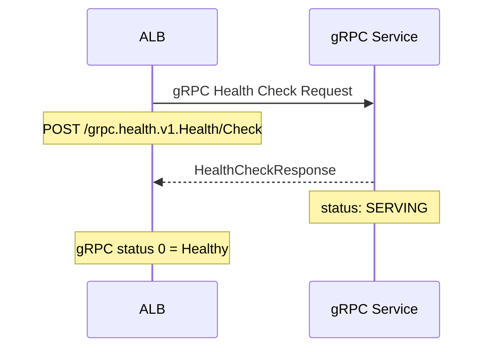

# How to Configure ALB Target Group Health Checks for gRPC

Author: [nawazdhandala](https://github.com/nawazdhandala)

Tags: AWS, ALB, gRPC, Health Checks, Load Balancing, Microservices

Description: Complete guide to configuring ALB target group health checks for gRPC services including the gRPC health checking protocol and troubleshooting common issues.

---

gRPC services need different health checks than traditional HTTP services. A standard HTTP health check that expects a 200 OK response will not work with a gRPC backend that speaks Protocol Buffers over HTTP/2. ALB supports native gRPC health checks, but the configuration has some nuances that trip people up.

## How gRPC Health Checking Works

The gRPC ecosystem defines a standard health checking protocol (grpc.health.v1.Health). Your gRPC service implements this protocol, and the ALB queries it to determine if the target is healthy.



The health check response includes a gRPC status code. Status code 0 (OK) means the target is healthy. Any other status code means unhealthy.

## Prerequisites

Before configuring gRPC health checks, your service needs:

1. HTTP/2 support (gRPC requires it)
2. The gRPC health checking protocol implemented
3. TLS configured (ALB requires HTTPS for gRPC backends)

### Implementing the Health Check in Your Service

If your gRPC service does not already implement the health checking protocol, add it.

**Go example:**

```go
package main

import (
    "log"
    "net"

    "google.golang.org/grpc"
    "google.golang.org/grpc/health"
    healthpb "google.golang.org/grpc/health/grpc_health_v1"
    "google.golang.org/grpc/reflection"
)

func main() {
    lis, err := net.Listen("tcp", ":50051")
    if err != nil {
        log.Fatalf("Failed to listen: %v", err)
    }

    // Create the gRPC server
    grpcServer := grpc.NewServer()

    // Register the health check service
    healthServer := health.NewServer()
    healthpb.RegisterHealthServer(grpcServer, healthServer)

    // Set the service status to SERVING
    // Use empty string for the overall server health
    healthServer.SetServingStatus("", healthpb.HealthCheckResponse_SERVING)

    // You can also set per-service health status
    healthServer.SetServingStatus(
        "mypackage.MyService",
        healthpb.HealthCheckResponse_SERVING,
    )

    // Enable reflection for debugging
    reflection.Register(grpcServer)

    log.Println("gRPC server starting on :50051")
    if err := grpcServer.Serve(lis); err != nil {
        log.Fatalf("Failed to serve: %v", err)
    }
}
```

**Python example:**

```python
import grpc
from concurrent import futures
from grpc_health.v1 import health
from grpc_health.v1 import health_pb2
from grpc_health.v1 import health_pb2_grpc

def serve():
    server = grpc.server(futures.ThreadPoolExecutor(max_workers=10))

    # Register your service
    # my_service_pb2_grpc.add_MyServiceServicer_to_server(MyServicer(), server)

    # Register the health check service
    health_servicer = health.HealthServicer()
    health_pb2_grpc.add_HealthServicer_to_server(health_servicer, server)

    # Set overall server health to SERVING
    health_servicer.set("", health_pb2.HealthCheckResponse.SERVING)

    # Set per-service health
    health_servicer.set(
        "mypackage.MyService",
        health_pb2.HealthCheckResponse.SERVING
    )

    # Start server with TLS (required for ALB gRPC)
    server_credentials = grpc.ssl_server_credentials(
        [(open('server.key', 'rb').read(), open('server.crt', 'rb').read())]
    )
    server.add_secure_port('[::]:50051', server_credentials)
    server.start()
    print("gRPC server started on port 50051")
    server.wait_for_termination()

if __name__ == '__main__':
    serve()
```

## Step 1: Create a gRPC Target Group

```bash
# Create a target group with gRPC protocol version
aws elbv2 create-target-group \
    --name grpc-service-tg \
    --protocol HTTP \
    --protocol-version GRPC \
    --port 50051 \
    --vpc-id vpc-0123456789abcdef0 \
    --target-type instance \
    --health-check-enabled \
    --health-check-protocol HTTP \
    --health-check-path "/grpc.health.v1.Health/Check" \
    --health-check-interval-seconds 30 \
    --healthy-threshold-count 2 \
    --unhealthy-threshold-count 3 \
    --matcher '{"GrpcCode": "0"}' \
    --tags 'Key=Service,Value=my-grpc-service'
```

Key parameters explained:

| Parameter | Value | Why |
|-----------|-------|-----|
| `--protocol` | HTTP | ALB uses HTTP protocol for target groups |
| `--protocol-version` | GRPC | Tells ALB to use HTTP/2 and gRPC framing |
| `--health-check-path` | /grpc.health.v1.Health/Check | Standard gRPC health endpoint |
| `--matcher` | GrpcCode: 0 | gRPC status 0 means OK/healthy |

## Step 2: Register Targets

```bash
# Register gRPC service instances
aws elbv2 register-targets \
    --target-group-arn arn:aws:elasticloadbalancing:us-east-1:123456789012:targetgroup/grpc-service-tg/abc123 \
    --targets Id=i-grpc-instance-1,Port=50051 Id=i-grpc-instance-2,Port=50051
```

## Step 3: Configure the ALB Listener

gRPC over ALB requires an HTTPS listener (HTTP/2 requires TLS on the ALB side):

```bash
# Create an HTTPS listener for gRPC
aws elbv2 create-listener \
    --load-balancer-arn arn:aws:elasticloadbalancing:us-east-1:123456789012:loadbalancer/app/my-grpc-alb/abc123 \
    --protocol HTTPS \
    --port 443 \
    --certificates CertificateArn=arn:aws:acm:us-east-1:123456789012:certificate/abc123 \
    --default-actions Type=forward,TargetGroupArn=arn:aws:elasticloadbalancing:us-east-1:123456789012:targetgroup/grpc-service-tg/abc123
```

## Step 4: Verify Health Check Configuration

```bash
# Check target health status
aws elbv2 describe-target-health \
    --target-group-arn arn:aws:elasticloadbalancing:us-east-1:123456789012:targetgroup/grpc-service-tg/abc123 \
    --query 'TargetHealthDescriptions[].{
        Target: Target.Id,
        Port: Target.Port,
        State: TargetHealth.State,
        Reason: TargetHealth.Reason,
        Description: TargetHealth.Description
    }' \
    --output table
```

## Custom Health Check Paths

You can check the health of a specific gRPC service rather than the overall server health:

```bash
# Health check for a specific service
aws elbv2 modify-target-group \
    --target-group-arn arn:aws:elasticloadbalancing:us-east-1:123456789012:targetgroup/grpc-service-tg/abc123 \
    --health-check-path "/grpc.health.v1.Health/Check" \
    --matcher '{"GrpcCode": "0"}'
```

The health check request includes a service name parameter. When you use the standard path `/grpc.health.v1.Health/Check`, the ALB checks the overall server health (empty service name). To check a specific service, your health checking implementation needs to respond based on the service name in the request.

## Using gRPC Status Codes for Health

You can match on different gRPC status codes:

```bash
# Accept both 0 (OK) and specific codes as healthy
aws elbv2 modify-target-group \
    --target-group-arn arn:aws:elasticloadbalancing:us-east-1:123456789012:targetgroup/grpc-service-tg/abc123 \
    --matcher '{"GrpcCode": "0-5"}'
```

Common gRPC status codes:

| Code | Name | Meaning |
|------|------|---------|
| 0 | OK | Success |
| 1 | CANCELLED | Operation cancelled |
| 2 | UNKNOWN | Unknown error |
| 3 | INVALID_ARGUMENT | Bad request |
| 12 | UNIMPLEMENTED | Method not found |
| 14 | UNAVAILABLE | Service temporarily unavailable |

For health checks, you almost always want to match only on code 0.

## Terraform Configuration

```hcl
resource "aws_lb_target_group" "grpc" {
  name             = "grpc-service-tg"
  port             = 50051
  protocol         = "HTTP"
  protocol_version = "GRPC"
  vpc_id           = aws_vpc.main.id
  target_type      = "instance"

  health_check {
    enabled             = true
    protocol            = "HTTP"
    path                = "/grpc.health.v1.Health/Check"
    interval            = 30
    timeout             = 5
    healthy_threshold   = 2
    unhealthy_threshold = 3
    matcher             = "0"  # gRPC status OK
  }

  tags = {
    Service = "my-grpc-service"
  }
}

resource "aws_lb_listener" "grpc" {
  load_balancer_arn = aws_lb.grpc.arn
  port              = 443
  protocol          = "HTTPS"
  certificate_arn   = aws_acm_certificate.grpc.arn

  default_action {
    type             = "forward"
    target_group_arn = aws_lb_target_group.grpc.arn
  }
}
```

## Troubleshooting Common Issues

### Targets Stuck in "unhealthy" State

**Check 1: Is your service implementing the health check protocol?**

```bash
# Test the health check directly using grpcurl
grpcurl -plaintext localhost:50051 grpc.health.v1.Health/Check

# Expected output:
# {
#   "status": "SERVING"
# }
```

**Check 2: Is TLS configured correctly?**

The ALB backend connection to gRPC targets uses HTTP/2 which requires proper TLS on the target. Self-signed certificates are fine for the backend connection.

**Check 3: Security group rules?**

```bash
# Verify the target security group allows health checks from the ALB
aws ec2 describe-security-groups \
    --group-ids sg-grpc-instances \
    --query 'SecurityGroups[0].IpPermissions[?FromPort==`50051`]'
```

**Check 4: Is HTTP/2 enabled on your server?**

Some gRPC server configurations default to HTTP/2 with prior knowledge (h2c) rather than TLS-based HTTP/2. The ALB expects TLS-based HTTP/2 for gRPC backends.

### Health Check Timeout

gRPC health checks can be slower than HTTP if the service is loading data or warming up. Increase the timeout if needed:

```bash
aws elbv2 modify-target-group \
    --target-group-arn arn:aws:elasticloadbalancing:us-east-1:123456789012:targetgroup/grpc-service-tg/abc123 \
    --health-check-timeout-seconds 10
```

For combining gRPC health checks with gradual traffic shifting during deployments, see our guide on [using weighted target groups with ALB](https://oneuptime.com/blog/post/use-weighted-target-groups-with-alb/view).

## Conclusion

gRPC health checks on ALB work reliably once you get three things right: implement the standard gRPC health checking protocol in your service, configure the target group with GRPC protocol version and the correct health check path, and ensure TLS is properly configured on your backends. The most common issue teams face is targets showing as unhealthy because the health check protocol is not implemented or TLS is not configured. Start with a working health check locally using grpcurl, then move to ALB configuration.
