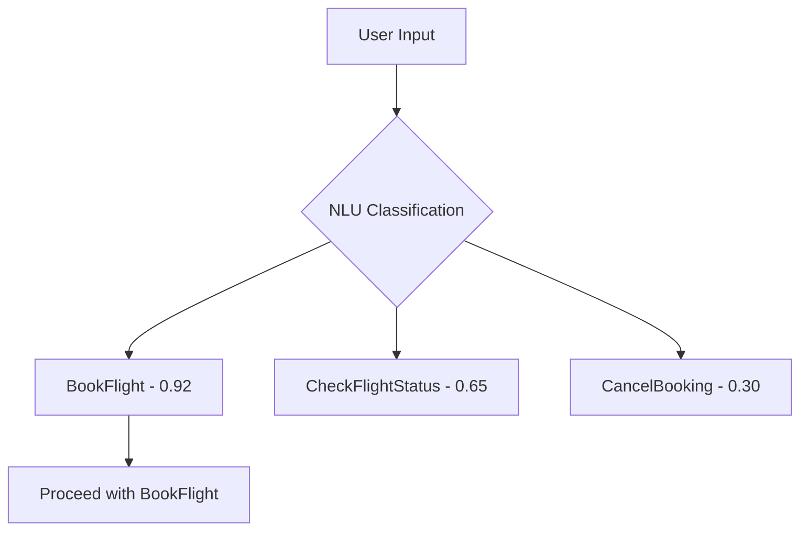

# How to Configure Amazon Lex Intents and Slots

Author: [nawazdhandala](https://github.com/nawazdhandala)

Tags: AWS, Amazon Lex, Chatbot, NLU

Description: A detailed guide to configuring intents, slots, and utterances in Amazon Lex V2 to build smarter and more accurate conversational bots.

---

Getting a chatbot to understand what users actually want comes down to how well you configure your intents and slots. These are the building blocks of any Amazon Lex bot, and getting them right is the difference between a bot that's helpful and one that constantly says "Sorry, I didn't understand that."

This guide dives deep into intent and slot configuration in Amazon Lex V2. If you're just getting started with Lex, check out our [introductory guide to building chatbots with Amazon Lex](https://oneuptime.com/blog/post/build-chatbot-with-amazon-lex/view) first.

## Understanding Intents

An intent represents a goal the user is trying to accomplish. When someone types "I need to book a flight," the intent is flight booking. When they type "What's the weather like?" the intent is weather inquiry. Each intent in your bot captures one distinct action.

A well-designed bot usually has somewhere between 5 and 30 intents. Go too few and you can't handle enough use cases. Go too many and intents start overlapping, which confuses the NLU model.

## Creating Intents with the Console

In the Lex V2 console, navigate to your bot and click "Add intent." You'll need to provide:

1. A name (like `BookFlight` or `CheckOrderStatus`)
2. Sample utterances
3. Slots for data collection
4. Confirmation and fulfillment settings

Let's build a `BookFlight` intent step by step.

## Sample Utterances - The Foundation

Sample utterances tell Lex what phrases should trigger this intent. This is where the NLU training starts. You want variety here.

Good utterances for a flight booking intent:

- I want to book a flight
- Book a flight from {DepartureCity} to {ArrivalCity}
- I need to fly to {ArrivalCity}
- Can you book me a flight on {TravelDate}
- I'd like to fly from {DepartureCity} to {ArrivalCity} on {TravelDate}
- Flight to {ArrivalCity} please
- Book flight

Notice how some utterances include slot references (wrapped in curly braces) and some don't. This is important. Including slots in utterances tells Lex that users might provide this information upfront. Utterances without slots handle the case where a user just says "book a flight" and expects the bot to ask for details.

**Aim for at least 10-15 utterances per intent.** More is better, but quality matters more than quantity. Cover different phrasings, levels of formality, and varying amounts of information provided.

## Configuring Slots

Slots are the variables your bot needs to collect. For flight booking, you might need:

| Slot Name | Slot Type | Required | Prompt |
|-----------|-----------|----------|--------|
| DepartureCity | AMAZON.City | Yes | Where are you flying from? |
| ArrivalCity | AMAZON.City | Yes | Where are you flying to? |
| TravelDate | AMAZON.Date | Yes | What date do you want to travel? |
| SeatClass | Custom: SeatClassType | No | Would you like economy, business, or first class? |

### Built-in Slot Types

Amazon Lex provides dozens of built-in slot types that handle common data formats:

- `AMAZON.Date` - Handles dates including relative references like "tomorrow" or "next Friday"
- `AMAZON.Time` - Parses time expressions
- `AMAZON.Number` - Numeric values
- `AMAZON.City` - City names
- `AMAZON.PhoneNumber` - Phone numbers
- `AMAZON.EmailAddress` - Email addresses

Always prefer built-in types when they fit your use case. They're pre-trained and handle edge cases you probably haven't thought of.

### Custom Slot Types

When built-in types don't cut it, create custom slot types. For our `SeatClassType`:

```json
// Custom slot type definition for seat classes
{
  "slotTypeName": "SeatClassType",
  "valueSelectionSetting": {
    "resolutionStrategy": "OriginalValue"
  },
  "slotTypeValues": [
    {
      "sampleValue": { "value": "economy" },
      "synonyms": [
        { "value": "coach" },
        { "value": "standard" },
        { "value": "basic" }
      ]
    },
    {
      "sampleValue": { "value": "business" },
      "synonyms": [
        { "value": "business class" },
        { "value": "premium" }
      ]
    },
    {
      "sampleValue": { "value": "first" },
      "synonyms": [
        { "value": "first class" },
        { "value": "luxury" }
      ]
    }
  ]
}
```

The `resolutionStrategy` matters:
- `OriginalValue` - Returns exactly what the user typed
- `TopResolution` - Returns the canonical value (e.g., "coach" becomes "economy")

Most of the time, you want `TopResolution` so your fulfillment logic doesn't have to handle synonyms.

## Slot Elicitation and Prompts

For each required slot, you define an elicitation prompt - the question the bot asks when it needs that slot's value.

You can also set up:

- **Wait and continue responses**: What the bot says while waiting for user input
- **Capture responses**: Acknowledgment when a slot is filled ("Got it, flying from New York.")
- **Default values**: Pre-fill slots when appropriate

Here's how to configure slots programmatically using the AWS CLI:

```bash
# Update a slot configuration with prompts and elicitation settings
aws lexv2-models update-slot \
  --bot-id YOUR_BOT_ID \
  --bot-version DRAFT \
  --locale-id en_US \
  --intent-id YOUR_INTENT_ID \
  --slot-id YOUR_SLOT_ID \
  --slot-name "DepartureCity" \
  --value-elicitation-setting '{
    "slotConstraint": "Required",
    "promptSpecification": {
      "messageGroups": [
        {
          "message": {
            "plainTextMessage": {
              "value": "Where are you flying from?"
            }
          }
        }
      ],
      "maxRetries": 3,
      "allowInterrupt": true
    }
  }'
```

The `maxRetries` setting controls how many times the bot will re-prompt before giving up. Three retries is a reasonable default. Setting `allowInterrupt` to true lets users change the subject mid-slot-elicitation, which feels more natural.

## Slot Priority

The order in which Lex prompts for slots matters. You set this with slot priorities. If the user says "Book a flight" without providing any details, Lex will ask for slots in priority order.

Think about the most natural conversation flow. For flights, asking the destination first usually makes more sense than asking the date first.

## Confirmation Prompts

After collecting all required slots, you can add a confirmation step:

```
"Just to confirm - you want to fly from {DepartureCity} to {ArrivalCity} on {TravelDate} in {SeatClass}. Is that correct?"
```

If the user says no, you can configure the bot to either:
- Start over and re-elicit all slots
- Ask which value they want to change
- Close the conversation

## Handling Multiple Intents

When your bot has multiple intents, Lex needs to figure out which one the user means. This is where things can get tricky.



Lex assigns a confidence score to each intent. The highest-scoring intent wins, as long as it meets the confidence threshold.

**Common pitfall**: Two intents with overlapping utterances. If "check my flight" could mean either "check flight status" or "check my booking," Lex will struggle. Make your utterances distinct across intents.

## Using Contexts for Intent Chaining

Lex V2 supports input and output contexts, which let you chain intents together. After a user books a flight, you might want to offer related intents like "add hotel" or "rent a car."

Set an output context on the `BookFlight` intent:

```json
// Output context that activates after a flight is booked
{
  "name": "BookingComplete",
  "timeToLiveInSeconds": 300,
  "turnsToLive": 5
}
```

Then set `BookingComplete` as an input context on the `AddHotel` intent. Now `AddHotel` only becomes available after a flight has been booked, reducing false matches.

## Slot Validation with Lambda

Sometimes you need to validate slot values before accepting them. You can hook up a Lambda function for dialog code hooks:

```python
# Lambda function for validating slot values during the conversation
def lambda_handler(event, context):
    intent_name = event['sessionState']['intent']['name']
    slots = event['sessionState']['intent']['slots']

    if intent_name == 'BookFlight':
        departure = slots.get('DepartureCity')
        arrival = slots.get('ArrivalCity')

        # Check if departure and arrival are the same city
        if departure and arrival:
            dep_value = departure['value']['interpretedValue']
            arr_value = arrival['value']['interpretedValue']

            if dep_value.lower() == arr_value.lower():
                return {
                    'sessionState': {
                        'dialogAction': {
                            'type': 'ElicitSlot',
                            'slotToElicit': 'ArrivalCity'
                        },
                        'intent': event['sessionState']['intent']
                    },
                    'messages': [{
                        'contentType': 'PlainText',
                        'content': "Your departure and arrival cities can't be the same. Where would you like to fly to?"
                    }]
                }

    # If validation passes, delegate back to Lex
    return {
        'sessionState': {
            'dialogAction': {
                'type': 'Delegate'
            },
            'intent': event['sessionState']['intent']
        }
    }
```

This function checks if the user entered the same city for both departure and arrival, and re-elicits the arrival city if they did.

## Testing and Iteration

After configuring your intents and slots, build the bot and test thoroughly. Pay attention to:

1. **Does the bot correctly identify the intent?** Try variations of your utterances.
2. **Are slots filled accurately?** Test with different date formats, city name spellings, and so on.
3. **Is the conversation flow natural?** Walk through the full flow as if you were a real user.
4. **What happens with unexpected input?** Type something completely unrelated and make sure the fallback intent handles it gracefully.

Check your CloudWatch metrics to monitor intent match rates over time. A `MissedUtteranceCount` that keeps climbing means you need more utterance examples. For comprehensive monitoring across all your AWS services, take a look at [Amazon DevOps Guru for operational insights](https://oneuptime.com/blog/post/use-amazon-devops-guru-for-operational-insights/view).

## Wrapping Up

Good intent and slot configuration is the backbone of a useful chatbot. Spend time getting your utterances diverse, your slot types precise, and your conversation flow logical. The NLU model is only as good as the training data you give it.

Once your intents and slots are solid, the next step is connecting fulfillment logic. Head over to our guide on [integrating Lex with Lambda for fulfillment](https://oneuptime.com/blog/post/integrate-amazon-lex-with-lambda-for-fulfillment/view) to make your bot actually do things.
