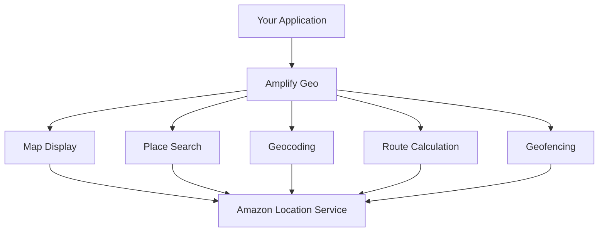

# How to Configure Amplify Geo for Maps and Location

Author: [nawazdhandala](https://github.com/nawazdhandala)

Tags: AWS, Amplify, Geo, Maps, Location, Amazon Location Service

Description: Add interactive maps, geocoding, and location search to your application using Amplify Geo backed by Amazon Location Service.

---

Adding maps and location features to a web or mobile app used to mean reaching for Google Maps or Mapbox, dealing with API keys, and worrying about per-request pricing at scale. Amplify Geo offers an alternative backed by Amazon Location Service. You get interactive maps, place search (geocoding), reverse geocoding, and route calculation, all integrated with the Amplify ecosystem and your existing Cognito authentication.

This guide shows how to set up Amplify Geo, render maps, search for places, and add location-based features to your application.

## What Amplify Geo Provides

Amplify Geo wraps Amazon Location Service and gives you:

- **Maps**: Render interactive maps with multiple styles (streets, satellite, navigation)
- **Place search**: Search for addresses, businesses, and points of interest
- **Geocoding**: Convert addresses to coordinates and coordinates to addresses
- **Geofencing**: Define geographic boundaries and detect when devices enter or leave them
- **Route calculation**: Calculate routes between two points



## Prerequisites

- An Amplify project with authentication configured
- Node.js 16 or later
- A React (or similar) frontend project

## Step 1: Add Geo Resources

If you are using the Amplify CLI:

```bash
# Add geo resources to your Amplify project
amplify add geo

# Follow the prompts:
# ? Select which capability you want to add: Map (Visualize geospatial data)
# ? Provide a name for the Map: myAppMap
# ? Who can access this Map? Authorized users only
# ? Select a default map style: VectorEsriStreets
# ? Do you want to configure advanced settings? No
```

Add a place index for search:

```bash
# Add a search index
amplify add geo

# ? Select which capability you want to add: Location search (Geocoding)
# ? Provide a name for the location search index: myAppSearch
# ? Who can access this search index? Authorized users only
```

Then push the changes:

```bash
amplify push
```

## Step 2: Install Map Dependencies

For React applications, install the MapLibre GL library that Amplify Geo uses for rendering:

```bash
# Install Amplify Geo and MapLibre GL
npm install aws-amplify @aws-amplify/geo maplibre-gl-js-amplify maplibre-gl

# If using React, also install the React wrapper
npm install react-map-gl
```

## Step 3: Configure Amplify Geo

```typescript
// src/amplify-config.ts
import { Amplify } from 'aws-amplify';

Amplify.configure({
  Auth: {
    Cognito: {
      userPoolId: 'us-east-1_XXXXX',
      userPoolClientId: 'xxxxxxxx',
      identityPoolId: 'us-east-1:xxxxxxxx-xxxx-xxxx-xxxx-xxxxxxxxxxxx',
    },
  },
  Geo: {
    AmazonLocationService: {
      maps: {
        items: {
          myAppMap: {
            style: 'VectorEsriStreets',
          },
        },
        default: 'myAppMap',
      },
      search_indices: {
        items: ['myAppSearch'],
        default: 'myAppSearch',
      },
      region: 'us-east-1',
    },
  },
});
```

## Step 4: Render a Map

Here is a React component that renders an interactive map:

```tsx
// components/MapView.tsx
import React, { useEffect, useRef } from 'react';
import { createMap } from 'maplibre-gl-js-amplify';
import 'maplibre-gl/dist/maplibre-gl.css';

function MapView() {
  const mapRef = useRef<HTMLDivElement>(null);

  useEffect(() => {
    let map: any;

    async function initMap() {
      if (!mapRef.current) return;

      // Create the map using Amplify's helper
      map = await createMap({
        container: mapRef.current,
        center: [-122.4194, 37.7749], // San Francisco
        zoom: 12,
      });
    }

    initMap();

    // Cleanup on unmount
    return () => {
      if (map) map.remove();
    };
  }, []);

  return (
    <div
      ref={mapRef}
      style={{ width: '100%', height: '500px' }}
    />
  );
}

export default MapView;
```

## Step 5: Add Place Search

Let users search for places and see results on the map:

```tsx
// components/PlaceSearch.tsx
import React, { useState } from 'react';
import { Geo } from '@aws-amplify/geo';

interface SearchResult {
  label: string;
  geometry: {
    point: [number, number];
  };
}

function PlaceSearch({ onResultSelect }: { onResultSelect: (coords: [number, number]) => void }) {
  const [query, setQuery] = useState('');
  const [results, setResults] = useState<SearchResult[]>([]);
  const [loading, setLoading] = useState(false);

  async function handleSearch() {
    if (!query.trim()) return;

    setLoading(true);
    try {
      // Search for places using Amplify Geo
      const searchResults = await Geo.searchByText(query, {
        maxResults: 5,
      });

      setResults(searchResults as SearchResult[]);
    } catch (error) {
      console.error('Search failed:', error);
    }
    setLoading(false);
  }

  return (
    <div style={{ padding: '10px' }}>
      <div style={{ display: 'flex', gap: '8px' }}>
        <input
          type="text"
          value={query}
          onChange={(e) => setQuery(e.target.value)}
          onKeyPress={(e) => e.key === 'Enter' && handleSearch()}
          placeholder="Search for a place..."
          style={{ flex: 1, padding: '8px' }}
        />
        <button onClick={handleSearch} disabled={loading}>
          {loading ? 'Searching...' : 'Search'}
        </button>
      </div>

      {results.length > 0 && (
        <ul style={{ listStyle: 'none', padding: 0 }}>
          {results.map((result, i) => (
            <li
              key={i}
              onClick={() => onResultSelect(result.geometry.point)}
              style={{
                padding: '8px',
                cursor: 'pointer',
                borderBottom: '1px solid #eee',
              }}
            >
              {result.label}
            </li>
          ))}
        </ul>
      )}
    </div>
  );
}

export default PlaceSearch;
```

## Step 6: Reverse Geocoding

Convert coordinates to addresses. This is useful when users tap on the map and you want to show what is at that location.

```typescript
// Reverse geocode coordinates to an address
import { Geo } from '@aws-amplify/geo';

async function reverseGeocode(latitude: number, longitude: number) {
  const results = await Geo.searchByCoordinates([longitude, latitude], {
    maxResults: 1,
  });

  if (results.length > 0) {
    console.log('Address:', results[0].label);
    return results[0].label;
  }

  return null;
}

// Example: What is at the Statue of Liberty?
const address = await reverseGeocode(40.6892, -74.0445);
// Output: "Statue of Liberty, New York, NY 10004, United States"
```

## Step 7: Add Markers to the Map

Display search results or points of interest as markers on the map:

```tsx
// components/MapWithMarkers.tsx
import React, { useEffect, useRef, useState } from 'react';
import { createMap, drawPoints } from 'maplibre-gl-js-amplify';
import { Geo } from '@aws-amplify/geo';
import 'maplibre-gl/dist/maplibre-gl.css';

function MapWithMarkers() {
  const mapRef = useRef<HTMLDivElement>(null);
  const [map, setMap] = useState<any>(null);

  useEffect(() => {
    async function initMap() {
      if (!mapRef.current) return;

      const newMap = await createMap({
        container: mapRef.current,
        center: [-122.4194, 37.7749],
        zoom: 12,
      });

      setMap(newMap);
    }

    initMap();
  }, []);

  async function searchAndMark(query: string) {
    if (!map) return;

    const results = await Geo.searchByText(query, { maxResults: 10 });

    // Convert results to GeoJSON format for drawPoints
    const points = results.map((result: any, i: number) => ({
      type: 'Feature' as const,
      geometry: {
        type: 'Point' as const,
        coordinates: result.geometry.point,
      },
      properties: {
        title: result.label,
        id: i,
      },
    }));

    // Draw markers on the map
    drawPoints('searchResults', points, map, {
      showCluster: true,
      unclusteredOptions: {
        showMarkerPopup: true,
      },
      clusterOptions: {
        showCount: true,
      },
    });
  }

  return (
    <div>
      <button onClick={() => searchAndMark('coffee shops near San Francisco')}>
        Find Coffee Shops
      </button>
      <div ref={mapRef} style={{ width: '100%', height: '500px' }} />
    </div>
  );
}

export default MapWithMarkers;
```

## Step 8: Track User Location

Combine the browser's Geolocation API with Amplify Geo to show the user's position on the map:

```typescript
// Track and display the user's current location
function trackUserLocation(map: any) {
  if (!navigator.geolocation) {
    console.error('Geolocation is not supported by this browser');
    return;
  }

  // Watch the user's position
  const watchId = navigator.geolocation.watchPosition(
    (position) => {
      const { latitude, longitude } = position.coords;

      // Update marker on map
      const point = {
        type: 'Feature',
        geometry: {
          type: 'Point',
          coordinates: [longitude, latitude],
        },
        properties: {
          title: 'Your Location',
        },
      };

      drawPoints('userLocation', [point], map, {
        unclusteredOptions: {
          markerColor: '#0000FF',
        },
      });

      // Center map on user
      map.flyTo({
        center: [longitude, latitude],
        zoom: 14,
      });
    },
    (error) => {
      console.error('Geolocation error:', error);
    },
    {
      enableHighAccuracy: true,
      maximumAge: 30000,
      timeout: 27000,
    }
  );

  // Return cleanup function
  return () => navigator.geolocation.clearWatch(watchId);
}
```

## Map Styles

Amazon Location Service offers several map styles:

| Style Name | Provider | Description |
|---|---|---|
| VectorEsriStreets | Esri | Standard street map |
| VectorEsriNavigation | Esri | Optimized for navigation |
| VectorEsriDarkGrayCanvas | Esri | Dark theme for dashboards |
| VectorHereExplore | HERE | Detailed street map |
| VectorHereBerlin | HERE | Clean, modern style |

Switch styles by updating the map configuration or creating multiple map resources.

## Cost Considerations

Amazon Location Service pricing is based on usage:

- Map tiles: Per 1,000 tiles requested
- Geocoding: Per request
- Reverse geocoding: Per request
- Route calculation: Per request

For most applications, costs are lower than comparable Google Maps pricing, especially at scale. The first 3 months include a generous free tier.

## Wrapping Up

Amplify Geo makes it straightforward to add maps and location features to your application. The integration with Amazon Location Service means you get enterprise-grade mapping without the complexity of managing map infrastructure. The MapLibre GL rendering engine is open-source and performant.

For other real-time features to combine with your map, check out [Amplify PubSub for real-time data](https://oneuptime.com/blog/post/use-amplify-pubsub-for-real-time-data/view). And for backend infrastructure, see [setting up Amplify backend with CDK](https://oneuptime.com/blog/post/set-up-amplify-backend-with-cdk/view).
