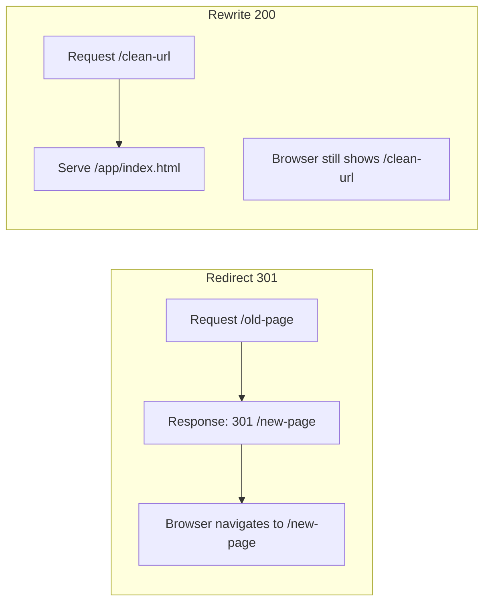

# How to Configure Amplify Redirects and Rewrites

Author: [nawazdhandala](https://github.com/nawazdhandala)

Tags: AWS, Amplify, Redirects, Rewrites, Routing, SEO, Frontend

Description: Complete guide to setting up redirects and rewrites in AWS Amplify for clean URLs, SEO migrations, and SPA routing

---

Redirects and rewrites are essential for any web application. Whether you are migrating from an old URL structure, setting up clean URLs for a single-page app, or handling SEO requirements, AWS Amplify gives you a flexible system for managing these rules. But the configuration has some quirks that are not immediately obvious, and getting the rule order wrong can break your entire app.

This guide covers everything you need to know about Amplify redirects and rewrites, from basic 301 redirects to complex rewrite patterns with wildcards.

## Redirects vs. Rewrites

Before diving in, let us clarify the difference:

- **Redirect (301/302)**: The browser navigates to a new URL. The user sees the new URL in their address bar. Search engines update their index.
- **Rewrite (200)**: The server serves content from a different path, but the browser's URL does not change. The user has no idea the content came from somewhere else.



## Where to Configure Rules

Amplify redirects and rewrites can be configured in two places:

1. **The Amplify console**: Go to "Hosting" then "Rewrites and redirects"
2. **A JSON file in your project**: Create a `customHttp.yml` or use the `redirects` section in `amplify.yml`

For version-controlled, reproducible configurations, use the file-based approach.

## Basic Redirect Rules

Here is how to set up common redirect patterns.

**Simple 301 redirect (permanent)**:

```json
[
  {
    "source": "/old-page",
    "target": "/new-page",
    "status": "301",
    "condition": null
  }
]
```

**302 redirect (temporary)**:

```json
[
  {
    "source": "/maintenance",
    "target": "/coming-soon",
    "status": "302",
    "condition": null
  }
]
```

**Redirect with path parameters**:

```json
[
  {
    "source": "/blog/<year>/<slug>",
    "target": "/posts/<year>/<slug>",
    "status": "301",
    "condition": null
  }
]
```

The angle bracket syntax `<name>` captures a path segment and makes it available in the target URL.

## Wildcard Redirects

Wildcards let you match entire path segments. This is useful for bulk migrations:

```json
[
  {
    "source": "/docs/<*>",
    "target": "/documentation/<*>",
    "status": "301",
    "condition": null
  }
]
```

The `<*>` wildcard matches everything after the prefix. So `/docs/getting-started/install` redirects to `/documentation/getting-started/install`.

**Redirect an entire subdirectory**:

```json
[
  {
    "source": "/v1/<*>",
    "target": "/v2/<*>",
    "status": "301",
    "condition": null
  }
]
```

## SPA (Single Page Application) Rewrites

This is probably the most common rewrite rule. Single-page applications need all routes to serve `index.html` so the client-side router can handle the path:

```json
[
  {
    "source": "</^[^.]+$|.(?!(css|gif|ico|jpg|js|png|txt|svg|woff|woff2|ttf|map|json|webp)$)([^.]+$)/>",
    "target": "/index.html",
    "status": "200",
    "condition": null
  }
]
```

This regex matches any URL that does not end with a common file extension. Requests for `/about`, `/dashboard`, or `/users/123` all serve `index.html`, while requests for `/style.css` or `/logo.png` serve the actual files.

A simpler version if you prefer readability over completeness:

```json
[
  {
    "source": "/<*>",
    "target": "/index.html",
    "status": "200",
    "condition": null
  }
]
```

Be careful with the simple version. It will also rewrite requests for static files, which can break your app if files are not served before the rewrite rule is evaluated.

## Rule Order Matters

Amplify evaluates redirect and rewrite rules from top to bottom. The first matching rule wins. This means you must put specific rules before general ones:

```json
[
  {
    "source": "/api/<*>",
    "target": "https://api.example.com/<*>",
    "status": "200",
    "condition": null
  },
  {
    "source": "/blog/<*>",
    "target": "/posts/<*>",
    "status": "301",
    "condition": null
  },
  {
    "source": "</^[^.]+$|.(?!(css|gif|ico|jpg|js|png|txt|svg|woff|woff2|ttf|map|json|webp)$)([^.]+$)/>",
    "target": "/index.html",
    "status": "200",
    "condition": null
  }
]
```

In this example:
1. API requests are proxied to an external API
2. Blog URLs are redirected to a new path
3. Everything else falls through to the SPA rewrite

If you put the SPA rewrite first, it would catch everything and the other rules would never fire.

## Proxy Rewrites

Amplify can proxy requests to external services using a 200 rewrite. This is useful for avoiding CORS issues:

```json
[
  {
    "source": "/api/<*>",
    "target": "https://api.example.com/<*>",
    "status": "200",
    "condition": null
  }
]
```

When a user requests `/api/users`, Amplify fetches `https://api.example.com/users` and returns the response as if it came from your domain. The browser never sees the external URL.

**Limitations of proxy rewrites**:
- Maximum response size is 15MB
- Timeout is 30 seconds
- WebSocket connections are not supported through proxy rewrites
- The proxy adds latency since the request goes through Amplify's infrastructure

## Conditional Redirects

You can apply redirects based on HTTP headers, which enables country-based or device-based routing:

```json
[
  {
    "source": "/",
    "target": "/eu/home",
    "status": "302",
    "condition": {
      "key": "CloudFront-Viewer-Country",
      "value": "DE"
    }
  },
  {
    "source": "/",
    "target": "/us/home",
    "status": "302",
    "condition": null
  }
]
```

This redirects German visitors to `/eu/home` and everyone else to `/us/home`. Amplify evaluates conditions through CloudFront headers.

## Trailing Slash Handling

Inconsistent trailing slashes cause duplicate content issues for SEO. Here is how to standardize:

**Remove trailing slashes**:

```json
[
  {
    "source": "/<*>/",
    "target": "/<*>",
    "status": "301",
    "condition": null
  }
]
```

**Add trailing slashes**:

```json
[
  {
    "source": "</^[^.]+[^/]$/>",
    "target": "/<*>/",
    "status": "301",
    "condition": null
  }
]
```

Pick one approach and be consistent across your app.

## File-Based Configuration

Instead of configuring rules in the console, you can define them in your `amplify.yml`:

```yaml
# amplify.yml - Redirects section
customHeaders:
  - pattern: '**/*'
    headers:
      - key: 'X-Frame-Options'
        value: 'DENY'

redirects:
  - source: /old-blog/<*>
    target: /blog/<*>
    status: '301'
  - source: </^[^.]+$|\.(?!(css|gif|ico|jpg|js|png|txt|svg|woff|woff2|ttf|map|json|webp)$)([^.]+$)/>
    target: /index.html
    status: '200'
```

This approach is preferable because:
- Rules are version-controlled alongside your code
- They are consistent across environments
- You can review changes in pull requests

## Testing Your Rules

Always test redirect rules before deploying to production. You can use curl to verify:

```bash
# Test a redirect - follow redirects and show headers
curl -I -L https://your-app.amplifyapp.com/old-page

# Expected output for a 301 redirect:
# HTTP/2 301
# location: /new-page

# Test a rewrite - should return 200 with HTML content
curl -I https://your-app.amplifyapp.com/some-spa-route

# Expected output for a 200 rewrite:
# HTTP/2 200
# content-type: text/html
```

## Common Pitfalls

**Redirect loops**: Rule A redirects /a to /b, and Rule B redirects /b to /a. Always trace your rules manually to check for cycles.

**Broken static assets**: Your SPA rewrite catches requests for CSS and JS files. Make sure the regex excludes common file extensions.

**Case sensitivity**: Amplify redirect rules are case-sensitive. `/About` and `/about` are treated as different paths.

**Maximum rules**: Amplify supports up to 200 redirect and rewrite rules. If you need more, consider handling redirects in your application code or using CloudFront functions.

For related Amplify configurations, check out our guide on [setting up custom headers and cache control](https://oneuptime.com/blog/post/set-up-amplify-custom-headers-and-cache-control/view).

## Wrapping Up

Redirects and rewrites in Amplify are powerful but require careful ordering and testing. Start with specific rules, put catch-all rules at the end, and always test with curl or a browser before rolling out to production. Whether you are handling SPA routing, SEO migrations, or API proxying, Amplify's rule system can handle it. Just remember that rule order is everything.
