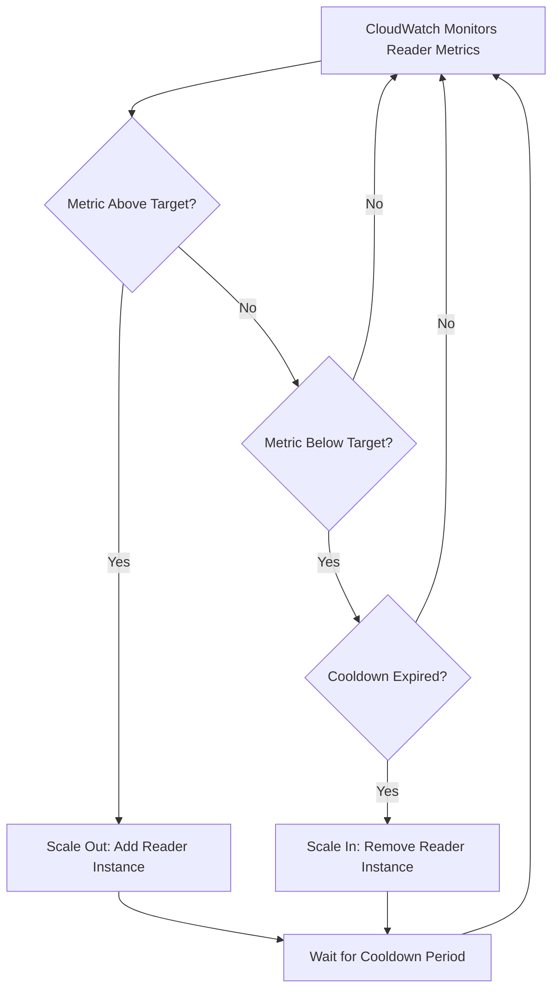

# How to Configure Aurora Auto Scaling for Read Replicas

Author: [nawazdhandala](https://github.com/nawazdhandala)

Tags: AWS, Aurora, Auto Scaling, RDS, Database

Description: Learn how to configure Aurora Auto Scaling to automatically add or remove read replicas based on workload demand, keeping your database performant and cost-effective.

---

If you've ever had your Aurora cluster buckle under a traffic spike because you didn't have enough read replicas, you know how frustrating that can be. Manually adding instances when traffic ramps up and removing them when it dies down is a painful, error-prone process. That's exactly why Aurora Auto Scaling exists - it handles the whole thing for you.

In this guide, we'll walk through setting up Aurora Auto Scaling for read replicas so your database cluster can grow and shrink automatically based on real demand.

## What Aurora Auto Scaling Actually Does

Aurora Auto Scaling monitors a specific metric - usually CPU utilization or the number of connections on your reader instances - and then adds or removes Aurora Replicas to keep that metric at a target value you set. It's built on top of AWS Application Auto Scaling, which means it follows the same target-tracking pattern you might already know from EC2 or ECS auto scaling.

The key thing to understand: auto scaling only manages **reader** instances. Your writer instance is always there, and auto scaling won't touch it. It's purely about scaling read capacity.

## Prerequisites

Before you start, you'll need:

- An existing Aurora cluster (MySQL-compatible or PostgreSQL-compatible)
- At least one reader instance already running
- Appropriate IAM permissions for auto scaling
- The AWS CLI installed and configured, or access to the AWS Console

## Setting Up Auto Scaling via the AWS Console

The console approach is the fastest way to get started.

1. Open the RDS console and navigate to your Aurora cluster
2. Click on the cluster, then go to the **Logs & events** tab or the cluster detail page
3. Under **Actions**, select **Add Auto Scaling Policy**
4. Choose your target metric (CPU utilization is the most common)
5. Set the target value (e.g., 70% CPU utilization)
6. Set the minimum and maximum number of replicas
7. Save the policy

That's it for the console. But the CLI gives you more control, so let's look at that.

## Setting Up Auto Scaling via the AWS CLI

First, you need to register your Aurora cluster as a scalable target. This tells Application Auto Scaling that it's allowed to manage your cluster's reader count.

This command registers your cluster with a minimum of 1 and maximum of 5 replicas:

```bash
# Register the Aurora cluster as a scalable target
aws application-autoscaling register-scalable-target \
  --service-namespace rds \
  --resource-id cluster:my-aurora-cluster \
  --scalable-dimension rds:cluster:ReadReplicaCount \
  --min-capacity 1 \
  --max-capacity 5
```

Next, you create the scaling policy itself. Here's a target-tracking policy that aims to keep average CPU utilization at 70%:

```bash
# Create a target-tracking scaling policy for CPU utilization
aws application-autoscaling put-scaling-policy \
  --service-namespace rds \
  --resource-id cluster:my-aurora-cluster \
  --scalable-dimension rds:cluster:ReadReplicaCount \
  --policy-name aurora-cpu-scaling-policy \
  --policy-type TargetTrackingScaling \
  --target-tracking-scaling-policy-configuration '{
    "TargetValue": 70.0,
    "PredefinedMetricSpecification": {
      "PredefinedMetricType": "RDSReaderAverageCPUUtilization"
    },
    "ScaleInCooldown": 300,
    "ScaleOutCooldown": 300
  }'
```

The cooldown periods (in seconds) prevent the system from thrashing - adding and removing instances too rapidly. Five minutes (300 seconds) is a reasonable default.

## Using a Custom Metric

Sometimes CPU utilization isn't the right metric. Maybe your workload is connection-heavy rather than compute-heavy. You can use a custom CloudWatch metric instead.

This example uses the average number of database connections as the scaling trigger:

```bash
# Create a scaling policy based on average database connections
aws application-autoscaling put-scaling-policy \
  --service-namespace rds \
  --resource-id cluster:my-aurora-cluster \
  --scalable-dimension rds:cluster:ReadReplicaCount \
  --policy-name aurora-connections-scaling-policy \
  --policy-type TargetTrackingScaling \
  --target-tracking-scaling-policy-configuration '{
    "TargetValue": 500.0,
    "CustomizedMetricSpecification": {
      "MetricName": "DatabaseConnections",
      "Namespace": "AWS/RDS",
      "Statistic": "Average",
      "Dimensions": [
        {
          "Name": "DBClusterIdentifier",
          "Value": "my-aurora-cluster"
        }
      ]
    },
    "ScaleInCooldown": 300,
    "ScaleOutCooldown": 180
  }'
```

Notice the scale-out cooldown is shorter here (180 seconds). That's intentional - when connections are piling up, you typically want to react faster than when they're dropping.

## Setting It Up with CloudFormation

If you're managing infrastructure as code (and you should be), here's how to define Aurora Auto Scaling in a CloudFormation template.

This template snippet defines both the scalable target and the scaling policy:

```yaml
# CloudFormation resources for Aurora Auto Scaling
Resources:
  AuroraScalableTarget:
    Type: AWS::ApplicationAutoScaling::ScalableTarget
    Properties:
      ServiceNamespace: rds
      ResourceId: !Sub cluster:${AuroraCluster}
      ScalableDimension: rds:cluster:ReadReplicaCount
      MinCapacity: 1
      MaxCapacity: 8
      RoleARN: !GetAtt AutoScalingRole.Arn

  AuroraScalingPolicy:
    Type: AWS::ApplicationAutoScaling::ScalingPolicy
    Properties:
      PolicyName: aurora-cpu-target-tracking
      PolicyType: TargetTrackingScaling
      ScalingTargetId: !Ref AuroraScalableTarget
      TargetTrackingScalingPolicyConfiguration:
        TargetValue: 70.0
        PredefinedMetricSpecification:
          PredefinedMetricType: RDSReaderAverageCPUUtilization
        ScaleInCooldown: 300
        ScaleOutCooldown: 300

  AutoScalingRole:
    Type: AWS::IAM::Role
    Properties:
      AssumeRolePolicyDocument:
        Version: '2012-10-17'
        Statement:
          - Effect: Allow
            Principal:
              Service: application-autoscaling.amazonaws.com
            Action: sts:AssumeRole
      ManagedPolicyArns:
        - arn:aws:iam::aws:policy/service-role/AmazonRDSFullAccess
```

## Terraform Configuration

For those using Terraform, here's the equivalent setup:

```hcl
# Terraform resources for Aurora Auto Scaling
resource "aws_appautoscaling_target" "aurora_replicas" {
  service_namespace  = "rds"
  resource_id        = "cluster:${aws_rds_cluster.main.cluster_identifier}"
  scalable_dimension = "rds:cluster:ReadReplicaCount"
  min_capacity       = 1
  max_capacity       = 5
}

resource "aws_appautoscaling_policy" "aurora_cpu_policy" {
  name               = "aurora-cpu-target-tracking"
  service_namespace  = "rds"
  resource_id        = aws_appautoscaling_target.aurora_replicas.resource_id
  scalable_dimension = aws_appautoscaling_target.aurora_replicas.scalable_dimension
  policy_type        = "TargetTrackingScaling"

  target_tracking_scaling_policy_configuration {
    target_value       = 70.0
    scale_in_cooldown  = 300
    scale_out_cooldown = 300

    predefined_metric_specification {
      predefined_metric_type = "RDSReaderAverageCPUUtilization"
    }
  }
}
```

## How Scaling Decisions Actually Work

Here's the flow of what happens when auto scaling kicks in:



It's worth noting that scale-out happens faster than scale-in by design. Aurora won't aggressively remove instances - it waits for the cooldown period and checks again before removing anything.

## Tuning Tips

Getting auto scaling right takes some iteration. Here are a few things I've learned the hard way:

**Start conservative with max capacity.** Each Aurora replica costs money even when it's idle. Start with a max of 3-5 and increase if needed.

**Don't set the target too low.** A target of 30% CPU means Aurora will constantly try to keep utilization at 30%, which means you'll have way more instances than necessary. 60-75% is usually the sweet spot.

**Watch for uneven read distribution.** If your application doesn't use the reader endpoint properly, some replicas might be overloaded while others sit idle. Auto scaling won't fix a bad connection strategy. Check out how to [configure Aurora endpoints](https://oneuptime.com/blog/post/2026-02-12-configure-aurora-endpoints-writer-reader-custom/view) to make sure reads are distributed evenly.

**Monitor scaling events.** Check CloudWatch for `SuccessfulScaleOut` and `SuccessfulScaleIn` events to understand how often scaling happens. If it's thrashing (scaling up and down constantly), increase your cooldown periods.

## Verifying Your Configuration

After setting everything up, verify it's working with these commands.

Check the registered scalable target:

```bash
# Verify the scalable target is registered
aws application-autoscaling describe-scalable-targets \
  --service-namespace rds \
  --resource-ids cluster:my-aurora-cluster
```

Check the scaling policies:

```bash
# Verify the scaling policies are in place
aws application-autoscaling describe-scaling-policies \
  --service-namespace rds \
  --resource-id cluster:my-aurora-cluster
```

Review scaling activity history:

```bash
# Check recent scaling activities
aws application-autoscaling describe-scaling-activities \
  --service-namespace rds \
  --resource-id cluster:my-aurora-cluster
```

## Wrapping Up

Aurora Auto Scaling takes the guesswork out of managing read replica counts. Set a target metric, define your min and max boundaries, and let AWS handle the rest. The biggest mistake people make is either setting it and forgetting it (never reviewing whether the target value is right) or not using it at all and manually managing replicas.

Start with CPU-based target tracking at around 70%, monitor how it behaves for a week or two, and adjust from there. If you're also looking at scaling your overall database architecture, check out the guide on [setting up Aurora Global Databases](https://oneuptime.com/blog/post/2026-02-12-set-up-aurora-global-databases-for-multi-region/view) for multi-region deployments.
