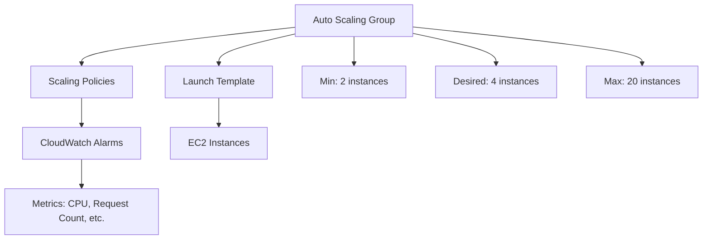

# How to Configure Auto Scaling Policies (Target Tracking vs Step Scaling)

Author: [nawazdhandala](https://github.com/nawazdhandala)

Tags: AWS, EC2, Auto Scaling, Scaling Policies, Cost Optimization, Performance

Description: A practical comparison of target tracking and step scaling policies for EC2 Auto Scaling, with configuration examples and guidance on which to use when.

---

Auto Scaling is one of the most powerful features of AWS. Instead of guessing how many servers you need, you let AWS add or remove instances based on actual demand. But the magic is in the scaling policy - the rules that determine when and how much to scale. AWS offers three types of scaling policies: target tracking, step scaling, and simple scaling. Each works differently, and choosing the right one has a big impact on responsiveness and cost.

This guide focuses on the two you'll actually use: target tracking and step scaling. Simple scaling is the oldest type and is generally inferior to both.

## How Auto Scaling Works

Before diving into policies, let's recap the architecture:



An Auto Scaling Group (ASG) manages a fleet of EC2 instances. You define:
- **Minimum**: The floor - never fewer than this many instances
- **Maximum**: The ceiling - never more than this many
- **Desired**: The current target number (adjusted by scaling policies)

Scaling policies modify the "desired" count based on metrics.

## Setting Up an Auto Scaling Group

Before configuring policies, you need an ASG. Here's a basic setup:

```bash
# Create an Auto Scaling group with a launch template
aws autoscaling create-auto-scaling-group \
    --auto-scaling-group-name webapp-asg \
    --launch-template LaunchTemplateName=webapp-template,Version='$Latest' \
    --min-size 2 \
    --max-size 20 \
    --desired-capacity 4 \
    --vpc-zone-identifier "subnet-abc123,subnet-def456" \
    --target-group-arns "arn:aws:elasticloadbalancing:us-east-1:123456789012:targetgroup/webapp/abc123" \
    --health-check-type ELB \
    --health-check-grace-period 300
```

For details on launch templates, see our guide on [using launch templates for EC2 instances](https://oneuptime.com/blog/post/use-launch-templates-for-ec2-instances/view).

## Target Tracking Scaling

Target tracking is the simplest and most commonly used policy type. You specify a target value for a metric, and AWS automatically adjusts capacity to keep the metric at that target. Think of it like a thermostat - you set the desired temperature, and the system handles the rest.

### How It Works

1. You set: "Keep average CPU utilization at 60%"
2. AWS creates CloudWatch alarms automatically
3. When CPU goes above 60%, instances are added
4. When CPU drops below 60%, instances are removed
5. AWS handles the math of how many instances to add or remove

### Configuring Target Tracking for CPU

```bash
# Create a target tracking policy based on CPU utilization
aws autoscaling put-scaling-policy \
    --auto-scaling-group-name webapp-asg \
    --policy-name cpu-target-tracking \
    --policy-type TargetTrackingScaling \
    --target-tracking-configuration '{
        "PredefinedMetricSpecification": {
            "PredefinedMetricType": "ASGAverageCPUUtilization"
        },
        "TargetValue": 60.0,
        "ScaleInCooldown": 300,
        "ScaleOutCooldown": 60
    }'
```

The cooldown periods matter:
- **ScaleOutCooldown (60s)**: After adding instances, wait 60 seconds before adding more. Keep this short for responsiveness.
- **ScaleInCooldown (300s)**: After removing instances, wait 5 minutes before removing more. Keep this longer to avoid flapping.

### Predefined Metrics

AWS offers several predefined metrics for target tracking:

| Metric | What It Measures | Good Target |
|--------|-----------------|-------------|
| ASGAverageCPUUtilization | Average CPU across all instances | 50-70% |
| ASGAverageNetworkIn | Average bytes received | Varies |
| ASGAverageNetworkOut | Average bytes sent | Varies |
| ALBRequestCountPerTarget | Requests per instance from ALB | 100-1000 |

### ALB Request Count Per Target

This is often the best metric for web applications because it scales based on actual traffic rather than resource utilization:

```bash
# Scale based on requests per instance
aws autoscaling put-scaling-policy \
    --auto-scaling-group-name webapp-asg \
    --policy-name request-count-tracking \
    --policy-type TargetTrackingScaling \
    --target-tracking-configuration '{
        "PredefinedMetricSpecification": {
            "PredefinedMetricType": "ALBRequestCountPerTarget",
            "ResourceLabel": "app/webapp-alb/abc123/targetgroup/webapp/def456"
        },
        "TargetValue": 500.0,
        "ScaleOutCooldown": 60,
        "ScaleInCooldown": 300
    }'
```

This says "keep each instance handling about 500 requests per minute." If traffic doubles, the ASG adds instances to maintain that rate.

### Custom Metrics

You can also use custom CloudWatch metrics:

```bash
# Scale based on a custom metric (e.g., queue depth)
aws autoscaling put-scaling-policy \
    --auto-scaling-group-name worker-asg \
    --policy-name queue-depth-tracking \
    --policy-type TargetTrackingScaling \
    --target-tracking-configuration '{
        "CustomizedMetricSpecification": {
            "MetricName": "ApproximateNumberOfMessagesVisible",
            "Namespace": "AWS/SQS",
            "Dimensions": [
                {
                    "Name": "QueueName",
                    "Value": "job-queue"
                }
            ],
            "Statistic": "Average"
        },
        "TargetValue": 10.0
    }'
```

This keeps the SQS queue depth around 10 messages by scaling workers up or down.

## Step Scaling

Step scaling gives you more control by defining exactly how many instances to add or remove at different alarm thresholds. Instead of a single target, you define "steps" - if CPU is between 60-70%, add 1 instance; if it's between 70-80%, add 2; if it's above 80%, add 4.

### When to Use Step Scaling Over Target Tracking

- You need different scaling amounts at different thresholds
- Your metric doesn't work well as a target (e.g., error rate)
- You want aggressive scale-out at high load but gentle scale-in
- You need to scale based on a metric that isn't proportional to capacity

### Creating Step Scaling Policies

Step scaling requires you to create CloudWatch alarms separately.

#### Scale-Out Policy (Add Instances)

```bash
# Create the scale-out policy
SCALE_OUT_ARN=$(aws autoscaling put-scaling-policy \
    --auto-scaling-group-name webapp-asg \
    --policy-name cpu-scale-out \
    --policy-type StepScaling \
    --adjustment-type ChangeInCapacity \
    --step-adjustments '[
        {"MetricIntervalLowerBound": 0, "MetricIntervalUpperBound": 10, "ScalingAdjustment": 1},
        {"MetricIntervalLowerBound": 10, "MetricIntervalUpperBound": 20, "ScalingAdjustment": 2},
        {"MetricIntervalLowerBound": 20, "ScalingAdjustment": 4}
    ]' \
    --query 'PolicyARN' \
    --output text)

# Create the CloudWatch alarm that triggers scale-out
aws cloudwatch put-metric-alarm \
    --alarm-name webapp-cpu-high \
    --metric-name CPUUtilization \
    --namespace AWS/EC2 \
    --statistic Average \
    --period 60 \
    --evaluation-periods 2 \
    --threshold 60 \
    --comparison-operator GreaterThanOrEqualToThreshold \
    --dimensions Name=AutoScalingGroupName,Value=webapp-asg \
    --alarm-actions $SCALE_OUT_ARN
```

The step adjustments here mean:
- CPU 60-70%: add 1 instance (0 to 10 above threshold of 60)
- CPU 70-80%: add 2 instances (10 to 20 above threshold)
- CPU 80%+: add 4 instances (20+ above threshold)

#### Scale-In Policy (Remove Instances)

```bash
# Create the scale-in policy
SCALE_IN_ARN=$(aws autoscaling put-scaling-policy \
    --auto-scaling-group-name webapp-asg \
    --policy-name cpu-scale-in \
    --policy-type StepScaling \
    --adjustment-type ChangeInCapacity \
    --step-adjustments '[
        {"MetricIntervalUpperBound": 0, "MetricIntervalLowerBound": -10, "ScalingAdjustment": -1},
        {"MetricIntervalUpperBound": -10, "ScalingAdjustment": -2}
    ]' \
    --query 'PolicyARN' \
    --output text)

# Create the CloudWatch alarm for scale-in
aws cloudwatch put-metric-alarm \
    --alarm-name webapp-cpu-low \
    --metric-name CPUUtilization \
    --namespace AWS/EC2 \
    --statistic Average \
    --period 300 \
    --evaluation-periods 3 \
    --threshold 30 \
    --comparison-operator LessThanOrEqualToThreshold \
    --dimensions Name=AutoScalingGroupName,Value=webapp-asg \
    --alarm-actions $SCALE_IN_ARN
```

Notice the scale-in alarm has a longer evaluation period (3 x 5 minutes = 15 minutes). This prevents premature scale-in during temporary dips.

## Target Tracking vs Step Scaling: When to Use Which

| Criteria | Target Tracking | Step Scaling |
|----------|----------------|--------------|
| Simplicity | Simple, one target value | Complex, multiple thresholds |
| Control | AWS decides scaling amounts | You define exact amounts |
| Alarm management | Automatic | Manual |
| Best for | CPU, request count, standard metrics | Custom responses, aggressive scaling |
| Scale-in behavior | Automatic, conservative | You control it explicitly |
| Multiple policies | Can combine multiple | Can combine multiple |

**Use target tracking when:**
- You want a "set it and forget it" approach
- Your scaling metric is proportional to load
- You're starting out and want something that works well with minimal tuning

**Use step scaling when:**
- You need aggressive scale-out at high load
- Your workload has known thresholds where behavior changes
- You want different scale-in and scale-out behavior
- You're using custom metrics that don't map well to a single target

## Combining Policies

You can use multiple policies together. AWS takes the action that results in the highest capacity:

```bash
# Policy 1: Target tracking on CPU
aws autoscaling put-scaling-policy \
    --auto-scaling-group-name webapp-asg \
    --policy-name cpu-tracking \
    --policy-type TargetTrackingScaling \
    --target-tracking-configuration '{
        "PredefinedMetricSpecification": {"PredefinedMetricType": "ASGAverageCPUUtilization"},
        "TargetValue": 60.0
    }'

# Policy 2: Target tracking on request count
aws autoscaling put-scaling-policy \
    --auto-scaling-group-name webapp-asg \
    --policy-name request-tracking \
    --policy-type TargetTrackingScaling \
    --target-tracking-configuration '{
        "PredefinedMetricSpecification": {
            "PredefinedMetricType": "ALBRequestCountPerTarget",
            "ResourceLabel": "app/webapp-alb/abc123/targetgroup/webapp/def456"
        },
        "TargetValue": 500.0
    }'
```

With both policies, the ASG scales out when either CPU or request count exceeds the target, and only scales in when both metrics are below their targets. This provides a safety net.

## Monitoring and Tuning

After deploying scaling policies, monitor how they perform:

```bash
# Check recent scaling activities
aws autoscaling describe-scaling-activities \
    --auto-scaling-group-name webapp-asg \
    --max-items 10 \
    --query 'Activities[*].[StartTime,Description,StatusCode]' \
    --output table
```

Watch for:
- **Frequent scaling oscillation** (adding and removing instances constantly) - increase cooldown periods
- **Slow scale-out** during traffic spikes - reduce ScaleOutCooldown or use step scaling with aggressive steps
- **Too many instances** during low traffic - your target might be too low

Set up [monitoring with OneUptime](https://oneuptime.com) to track your ASG behavior over time and correlate scaling events with application performance.

## Predictive Scaling

For workloads with predictable patterns (like traffic that spikes every morning), consider adding predictive scaling:

```bash
# Enable predictive scaling alongside reactive scaling
aws autoscaling put-scaling-policy \
    --auto-scaling-group-name webapp-asg \
    --policy-name predictive-scaling \
    --policy-type PredictiveScaling \
    --predictive-scaling-configuration '{
        "MetricSpecifications": [{
            "TargetValue": 60.0,
            "PredefinedMetricPairSpecification": {
                "PredefinedMetricType": "ASGCPUUtilization"
            }
        }],
        "Mode": "ForecastAndScale",
        "SchedulingBufferTime": 300
    }'
```

Predictive scaling uses machine learning to analyze historical patterns and pre-scales before expected traffic increases. The 300-second scheduling buffer means instances launch 5 minutes before the predicted need.

## Best Practices

1. **Start with target tracking on CPU at 60%.** It works well for most applications and requires minimal tuning.

2. **Add ALBRequestCountPerTarget as a second policy.** This catches load increases that don't show up in CPU (like I/O-bound requests).

3. **Keep scale-out fast and scale-in slow.** Short scale-out cooldown (60s), longer scale-in cooldown (300s+). It's always better to have slightly more capacity than to be caught short.

4. **Set health check grace period appropriately.** New instances need time to boot and warm up. If health checks fire too soon, the ASG terminates instances before they're ready, creating a scaling loop.

5. **Test your scaling.** Use load testing tools to verify that your policies scale correctly under simulated load. Don't wait for real traffic spikes to find out.

Auto Scaling policies are the difference between infrastructure that handles traffic gracefully and infrastructure that falls over or wastes money. Take the time to configure them right, and your application will scale smoothly while keeping costs in check.
