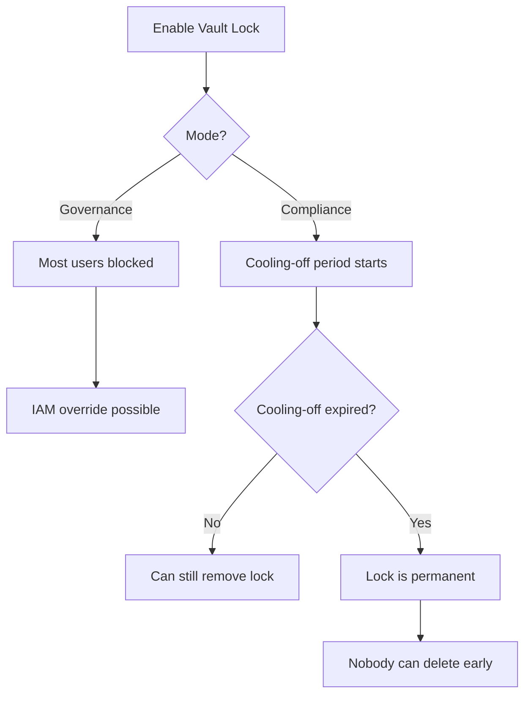

# How to Configure AWS Backup Vault Lock for Compliance

Author: [nawazdhandala](https://github.com/nawazdhandala)

Tags: AWS, Backup, Vault Lock, Compliance, WORM

Description: Enable AWS Backup Vault Lock to enforce write-once-read-many protection on your recovery points, meeting compliance requirements for data retention and immutability.

---

Compliance frameworks like SEC 17a-4, HIPAA, and SOC 2 often require that backups be immutable - meaning once created, they can't be modified or deleted before a specified retention period expires. AWS Backup Vault Lock provides exactly this capability by enforcing WORM (Write Once, Read Many) protection on your backup vault.

Once vault lock is enabled in compliance mode, nobody can delete recovery points before the minimum retention period - not your backup admins, not your account administrators, not even AWS support. It's about as airtight as it gets.

## Governance vs. Compliance Mode

AWS Backup Vault Lock offers two modes:

**Governance Mode**: Recovery points can't be deleted by most users, but users with specific IAM permissions (`backup:DeleteRecoveryPoint` with the `backup:vault-lock-governance-bypass` condition key) can override the lock. Think of it as a safety net with an emergency override.

**Compliance Mode**: Once the cooling-off period ends, nobody can delete recovery points or change the vault lock configuration. Period. There's no override, no escape hatch. This is what auditors want to see.



## Step 1: Create a Backup Vault

If you don't already have a vault, create one specifically for locked backups:

```bash
# Create a KMS key for the vault
VAULT_KEY=$(aws kms create-key \
  --description "Compliance vault encryption" \
  --query 'KeyMetadata.KeyId' --output text)

# Create the vault
aws backup create-backup-vault \
  --backup-vault-name "compliance-locked-vault" \
  --encryption-key-arn "arn:aws:kms:us-east-1:123456789012:key/$VAULT_KEY"
```

## Step 2: Enable Vault Lock in Governance Mode

Let's start with governance mode - it's reversible, so it's good for testing:

```bash
# Enable vault lock in governance mode
aws backup put-backup-vault-lock-configuration \
  --backup-vault-name "compliance-locked-vault" \
  --min-retention-days 30 \
  --max-retention-days 365
```

This sets the rules:
- **MinRetentionDays**: Recovery points can't be deleted before this many days. Any backup plan targeting this vault must have a retention of at least 30 days.
- **MaxRetentionDays**: The maximum retention allowed. Backup plans can't keep recovery points longer than 365 days in this vault.

The absence of `--changeable-for-days` means this is governance mode. You can remove it later if needed.

```bash
# Verify the vault lock configuration
aws backup describe-backup-vault \
  --backup-vault-name "compliance-locked-vault" \
  --query '{
    VaultName: BackupVaultName,
    Locked: Locked,
    MinRetention: MinRetentionDays,
    MaxRetention: MaxRetentionDays
  }'
```

## Step 3: Enable Vault Lock in Compliance Mode

For real compliance requirements, use compliance mode. This requires a cooling-off period:

```bash
# Enable vault lock in compliance mode with a 3-day cooling-off period
aws backup put-backup-vault-lock-configuration \
  --backup-vault-name "compliance-locked-vault" \
  --min-retention-days 365 \
  --max-retention-days 2555 \
  --changeable-for-days 3
```

The `changeable-for-days` parameter is the cooling-off period. During this window (3 days in our example), you can still remove the vault lock if you made a mistake. Once the cooling-off period expires, the lock becomes permanent and irreversible.

Think carefully before enabling compliance mode. Once locked:
- You can't change the retention settings
- You can't remove the vault lock
- You can't delete recovery points before `MinRetentionDays`
- You can't delete the vault until all recovery points have naturally expired
- Not even the root account can override this

```bash
# Check when the cooling-off period expires
aws backup describe-backup-vault \
  --backup-vault-name "compliance-locked-vault" \
  --query '{
    Locked: Locked,
    LockDate: LockDate,
    MinRetention: MinRetentionDays,
    MaxRetention: MaxRetentionDays
  }'
```

## Step 4: Remove Vault Lock During Cooling-Off (If Needed)

If you realize you made a mistake during the cooling-off period:

```bash
# Remove the vault lock (only works during cooling-off period)
aws backup delete-backup-vault-lock-configuration \
  --backup-vault-name "compliance-locked-vault"
```

After the cooling-off period expires, this command will fail. There's no going back.

## Step 5: Create a Backup Plan Targeting the Locked Vault

Backup plans must respect the vault's retention constraints:

```bash
# This plan works - retention is within the vault's min/max range
aws backup create-backup-plan \
  --backup-plan '{
    "BackupPlanName": "compliance-backups",
    "Rules": [
      {
        "RuleName": "MonthlyCompliance",
        "TargetBackupVaultName": "compliance-locked-vault",
        "ScheduleExpression": "cron(0 4 1 * ? *)",
        "StartWindowMinutes": 120,
        "CompletionWindowMinutes": 480,
        "Lifecycle": {
          "MoveToColdStorageAfterDays": 30,
          "DeleteAfterDays": 2555
        }
      }
    ]
  }'

# This would FAIL - retention of 7 days is below the vault's 365-day minimum
# aws backup create-backup-plan \
#   --backup-plan '{
#     "Rules": [{
#       "TargetBackupVaultName": "compliance-locked-vault",
#       "Lifecycle": {"DeleteAfterDays": 7}
#     }]
#   }'
```

## Step 6: Set Up Vault Access Policies

Combine vault lock with access policies for defense in depth:

```bash
# Restrict who can manage the vault
aws backup put-backup-vault-access-policy \
  --backup-vault-name "compliance-locked-vault" \
  --policy '{
    "Version": "2012-10-17",
    "Statement": [
      {
        "Sid": "DenyDeleteByNonAdmins",
        "Effect": "Deny",
        "Principal": "*",
        "Action": [
          "backup:DeleteBackupVault",
          "backup:DeleteRecoveryPoint",
          "backup:UpdateRecoveryPointLifecycle",
          "backup:PutBackupVaultLockConfiguration",
          "backup:DeleteBackupVaultLockConfiguration"
        ],
        "Resource": "*",
        "Condition": {
          "ArnNotLike": {
            "aws:PrincipalArn": "arn:aws:iam::123456789012:role/BackupAdminRole"
          }
        }
      },
      {
        "Sid": "DenyDeleteFromOutsideOrg",
        "Effect": "Deny",
        "Principal": "*",
        "Action": "backup:DeleteRecoveryPoint",
        "Resource": "*",
        "Condition": {
          "StringNotEquals": {
            "aws:PrincipalOrgID": "o-abc1234567"
          }
        }
      }
    ]
  }'
```

## Step 7: Use SCPs for Organization-Wide Protection

If you're using AWS Organizations, add Service Control Policies to prevent anyone from disabling vault lock:

```bash
# Create an SCP that prevents vault lock removal
aws organizations create-policy \
  --name "ProtectVaultLock" \
  --type SERVICE_CONTROL_POLICY \
  --description "Prevent removal of backup vault lock configurations" \
  --content '{
    "Version": "2012-10-17",
    "Statement": [{
      "Sid": "PreventVaultLockRemoval",
      "Effect": "Deny",
      "Action": [
        "backup:DeleteBackupVaultLockConfiguration"
      ],
      "Resource": "arn:aws:backup:*:*:backup-vault:compliance-*"
    }]
  }'

# Attach the SCP
aws organizations attach-policy \
  --policy-id p-protect123 \
  --target-id r-abc1
```

## Step 8: Monitor and Audit

Set up monitoring to detect any attempts to tamper with vault lock:

```bash
# Create a CloudWatch alarm for unauthorized delete attempts
aws events put-rule \
  --name "VaultLockTamperAlert" \
  --event-pattern '{
    "source": ["aws.backup"],
    "detail-type": ["AWS API Call via CloudTrail"],
    "detail": {
      "eventName": [
        "DeleteBackupVaultLockConfiguration",
        "DeleteRecoveryPoint",
        "DeleteBackupVault"
      ]
    }
  }'

aws events put-targets \
  --rule "VaultLockTamperAlert" \
  --targets '[{
    "Id": "security-alert",
    "Arn": "arn:aws:sns:us-east-1:123456789012:security-alerts"
  }]'
```

## Compliance Mapping

Here's how vault lock maps to common compliance requirements:

| Requirement | Vault Lock Feature |
|---|---|
| SEC 17a-4 (WORM) | Compliance mode with appropriate retention |
| HIPAA (6-year retention) | MinRetentionDays: 2190 |
| SOX (7-year retention) | MinRetentionDays: 2555 |
| PCI DSS (1-year retention) | MinRetentionDays: 365 |
| GDPR (deletion after purpose) | MaxRetentionDays limits over-retention |

## Practical Advice

A few things to keep in mind:

1. **Test with governance mode first** - Make sure your backup plans and workflows work correctly before switching to compliance mode.
2. **Use a generous cooling-off period** - 72 hours (3 days) is the minimum. Consider using 7 days for your first compliance lock.
3. **Document everything** - Record why specific retention periods were chosen and which compliance frameworks they satisfy.
4. **Plan for costs** - Locked backups can't be deleted early, so budget for the full retention period of all recovery points.
5. **Separate vaults by retention need** - Don't put everything in a single locked vault. Different data has different retention requirements.

Vault Lock is the mechanism that turns your backup strategy from "we probably have backups" to "we provably have immutable backups that meet regulatory requirements." For any organization dealing with compliance, it's not optional - it's essential.
