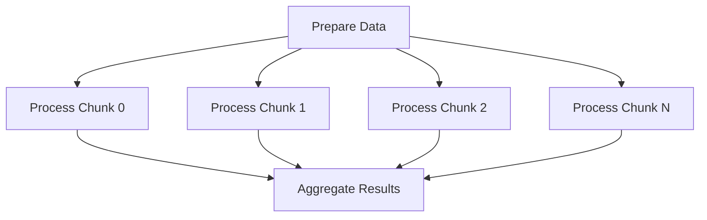
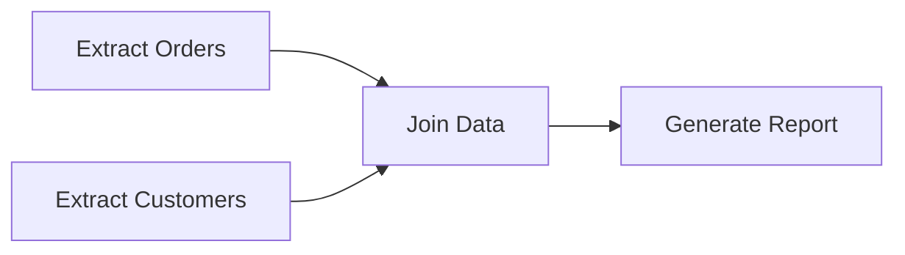

# How to Configure AWS Batch Job Dependencies

Author: [nawazdhandala](https://github.com/nawazdhandala)

Tags: AWS, Batch, Job Dependencies, Workflow Orchestration, Pipeline, Automation

Description: Learn how to configure AWS Batch job dependencies to build multi-step data processing pipelines with sequential and fan-out execution patterns.

---

Most real-world batch processing is not a single job. It is a pipeline: extract, then transform, then load. Or preprocess, then train, then evaluate. AWS Batch has built-in job dependency support that lets you chain jobs together so that one job starts only after its predecessors complete successfully. No need for an external orchestrator for simple pipelines.

This guide covers all the dependency types and shows you how to build practical multi-step workflows.

## How Job Dependencies Work

When you submit a job to AWS Batch, you can specify a list of job IDs that it depends on. The job stays in `PENDING` state until all its dependencies finish with a `SUCCEEDED` status. If any dependency fails, the dependent job moves to `FAILED` without ever running.


This is the simplest case: a linear pipeline where each step depends on the previous one.

## Dependency Types

AWS Batch supports two dependency types:

1. **SEQUENTIAL** - The dependent job runs after the dependency finishes. For array jobs, each child waits for the corresponding child in the dependency.
2. **N_TO_N** - Used with array jobs. The dependent job waits for ALL children of the dependency array to complete.

## Building a Linear Pipeline

Let us build a three-step ETL pipeline.

```bash
# Step 1: Submit the extract job
EXTRACT_JOB_ID=$(aws batch submit-job \
  --job-name etl-extract \
  --job-queue data-pipeline-queue \
  --job-definition extract-job-def \
  --container-overrides '{
    "environment": [
      {"name": "SOURCE_TABLE", "value": "orders"},
      {"name": "S3_OUTPUT", "value": "s3://pipeline-bucket/raw/orders/"}
    ]
  }' \
  --query 'jobId' --output text)

echo "Extract job: $EXTRACT_JOB_ID"

# Step 2: Submit the transform job, depends on extract
TRANSFORM_JOB_ID=$(aws batch submit-job \
  --job-name etl-transform \
  --job-queue data-pipeline-queue \
  --job-definition transform-job-def \
  --depends-on "jobId=$EXTRACT_JOB_ID" \
  --container-overrides '{
    "environment": [
      {"name": "S3_INPUT", "value": "s3://pipeline-bucket/raw/orders/"},
      {"name": "S3_OUTPUT", "value": "s3://pipeline-bucket/transformed/orders/"}
    ]
  }' \
  --query 'jobId' --output text)

echo "Transform job: $TRANSFORM_JOB_ID"

# Step 3: Submit the load job, depends on transform
LOAD_JOB_ID=$(aws batch submit-job \
  --job-name etl-load \
  --job-queue data-pipeline-queue \
  --job-definition load-job-def \
  --depends-on "jobId=$TRANSFORM_JOB_ID" \
  --container-overrides '{
    "environment": [
      {"name": "S3_INPUT", "value": "s3://pipeline-bucket/transformed/orders/"},
      {"name": "TARGET_TABLE", "value": "analytics.orders_processed"}
    ]
  }' \
  --query 'jobId' --output text)

echo "Load job: $LOAD_JOB_ID"
```

When you submit these three jobs, the execution looks like this:

- Extract runs immediately
- Transform stays PENDING until Extract is SUCCEEDED
- Load stays PENDING until Transform is SUCCEEDED

## Fan-Out / Fan-In Pattern

A common pattern is to run one job, then fan out into parallel tasks, then aggregate the results.



Here is how to implement this with array jobs and dependencies:

```bash
# Step 1: Submit the preparation job
PREP_JOB_ID=$(aws batch submit-job \
  --job-name prepare-data \
  --job-queue data-pipeline-queue \
  --job-definition prepare-job-def \
  --query 'jobId' --output text)

# Step 2: Submit an array job for parallel processing, depends on prep
PROCESS_JOB_ID=$(aws batch submit-job \
  --job-name process-chunks \
  --job-queue data-pipeline-queue \
  --job-definition process-job-def \
  --array-properties size=100 \
  --depends-on "jobId=$PREP_JOB_ID" \
  --query 'jobId' --output text)

# Step 3: Submit aggregation job, depends on ALL array children completing
AGGREGATE_JOB_ID=$(aws batch submit-job \
  --job-name aggregate-results \
  --job-queue data-pipeline-queue \
  --job-definition aggregate-job-def \
  --depends-on "jobId=$PROCESS_JOB_ID,type=N_TO_N" \
  --query 'jobId' --output text)
```

The `type=N_TO_N` on the aggregation dependency is critical. Without it, the aggregation job would only wait for the parent array job entry, not all 100 children.

## Multiple Dependencies

A job can depend on multiple upstream jobs. It will not start until all of them succeed.

```bash
# Two independent extraction jobs
EXTRACT_ORDERS_ID=$(aws batch submit-job \
  --job-name extract-orders \
  --job-queue data-pipeline-queue \
  --job-definition extract-job-def \
  --container-overrides '{"environment": [{"name": "TABLE", "value": "orders"}]}' \
  --query 'jobId' --output text)

EXTRACT_CUSTOMERS_ID=$(aws batch submit-job \
  --job-name extract-customers \
  --job-queue data-pipeline-queue \
  --job-definition extract-job-def \
  --container-overrides '{"environment": [{"name": "TABLE", "value": "customers"}]}' \
  --query 'jobId' --output text)

# Join job depends on BOTH extractions completing
JOIN_JOB_ID=$(aws batch submit-job \
  --job-name join-data \
  --job-queue data-pipeline-queue \
  --job-definition join-job-def \
  --depends-on "jobId=$EXTRACT_ORDERS_ID" "jobId=$EXTRACT_CUSTOMERS_ID" \
  --query 'jobId' --output text)
```



## Programmatic Pipeline Submission with Python

For complex pipelines, scripting the submission in Python is cleaner than bash.

```python
import boto3
import time

batch = boto3.client('batch')

def submit_job(name, definition, queue, depends_on=None, env=None, array_size=None):
    """Submit a Batch job with optional dependencies and environment overrides"""
    params = {
        'jobName': name,
        'jobQueue': queue,
        'jobDefinition': definition,
    }

    if depends_on:
        params['dependsOn'] = depends_on

    if env:
        params['containerOverrides'] = {
            'environment': [{'name': k, 'value': v} for k, v in env.items()]
        }

    if array_size:
        params['arrayProperties'] = {'size': array_size}

    response = batch.submit_job(**params)
    job_id = response['jobId']
    print(f"Submitted {name}: {job_id}")
    return job_id


def run_pipeline():
    queue = 'data-pipeline-queue'

    # Stage 1: Extract (parallel)
    extract_orders = submit_job(
        'extract-orders', 'extract-def', queue,
        env={'TABLE': 'orders', 'OUTPUT': 's3://bucket/raw/orders/'}
    )

    extract_products = submit_job(
        'extract-products', 'extract-def', queue,
        env={'TABLE': 'products', 'OUTPUT': 's3://bucket/raw/products/'}
    )

    # Stage 2: Transform (depends on both extracts)
    transform = submit_job(
        'transform', 'transform-def', queue,
        depends_on=[
            {'jobId': extract_orders},
            {'jobId': extract_products}
        ],
        env={'INPUT': 's3://bucket/raw/', 'OUTPUT': 's3://bucket/transformed/'}
    )

    # Stage 3: Load (depends on transform)
    load = submit_job(
        'load', 'load-def', queue,
        depends_on=[{'jobId': transform}],
        env={'INPUT': 's3://bucket/transformed/', 'TARGET': 'analytics_db'}
    )

    # Stage 4: Validate (depends on load)
    validate = submit_job(
        'validate', 'validate-def', queue,
        depends_on=[{'jobId': load}],
        env={'TARGET': 'analytics_db'}
    )

    return {
        'extract_orders': extract_orders,
        'extract_products': extract_products,
        'transform': transform,
        'load': load,
        'validate': validate
    }


if __name__ == '__main__':
    job_ids = run_pipeline()
    print(f"\nPipeline submitted. Final job: {job_ids['validate']}")
```

## Handling Failures in Dependency Chains

When a job in the chain fails, all downstream dependent jobs automatically fail too. You do not need to handle cancellation yourself. But you should think about retry strategies at each step.

```bash
# Submit with a retry strategy so transient failures don't kill the pipeline
aws batch submit-job \
  --job-name extract-with-retry \
  --job-queue data-pipeline-queue \
  --job-definition extract-job-def \
  --retry-strategy '{
    "attempts": 3,
    "evaluateOnExit": [
      {"onStatusReason": "Host EC2*", "action": "RETRY"},
      {"onReason": "CannotPullContainerError*", "action": "RETRY"},
      {"onExitCode": "137", "action": "RETRY"},
      {"onExitCode": "0", "action": "EXIT"}
    ]
  }'
```

Exit code 137 typically means the container was killed due to memory pressure. Retrying gives it another chance, possibly on a larger instance.

## Dependency Limits

There are some limits to be aware of:

- A job can depend on up to 20 other jobs
- Dependencies can only reference jobs in the same job queue (or any queue, as long as they are in the same region and account)
- Circular dependencies are rejected
- The maximum depth of a dependency chain is not explicitly limited, but very deep chains can be hard to manage

## When to Use Batch Dependencies vs Step Functions

AWS Batch job dependencies work well for simple, linear or fan-out pipelines. If your workflow needs:

- Conditional branching (run job B if job A succeeds, run job C if it fails)
- Human approval steps
- Wait states
- Complex retry logic with backoff

Then AWS Step Functions is a better choice. Batch dependencies are intentionally simple - that is their strength for straightforward pipelines.

## Monitoring Dependency Chains

To track a pipeline, monitor the final job in the chain. If it succeeds, everything upstream also succeeded.

```bash
# Check the status of a specific job
aws batch describe-jobs --jobs $LOAD_JOB_ID \
  --query 'jobs[0].{Status:status,Reason:statusReason,StartedAt:startedAt,StoppedAt:stoppedAt}'
```

For full pipeline visibility, see our guide on [monitoring AWS Batch jobs with CloudWatch](https://oneuptime.com/blog/post/2026-02-12-monitor-aws-batch-jobs-with-cloudwatch/view).

## Wrapping Up

AWS Batch job dependencies give you a lightweight way to build multi-step processing pipelines without an external orchestrator. Submit your jobs with dependency references, and Batch handles the execution order. For simple ETL pipelines, data processing workflows, and ML training pipelines, this is often all you need. When your workflows grow beyond what linear dependencies can express, that is when you reach for Step Functions or Airflow.
