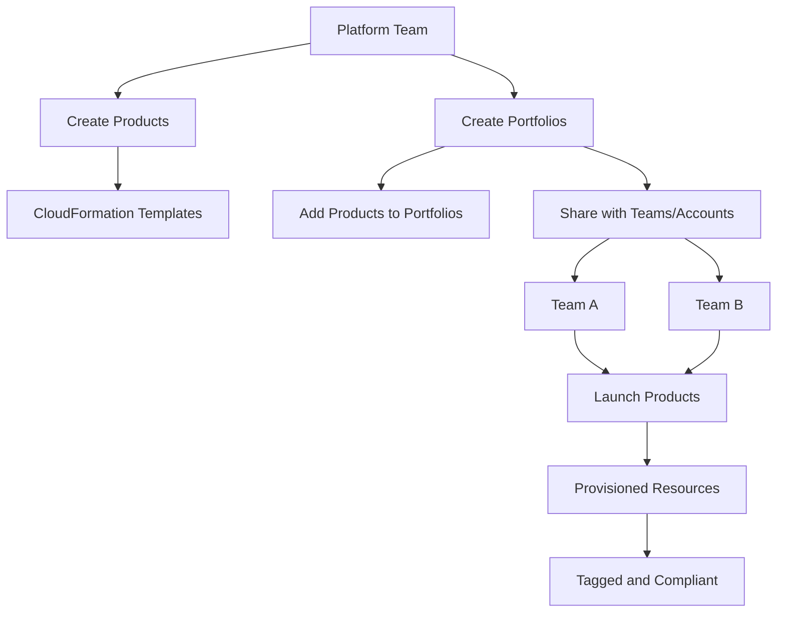

# How to Configure AWS Service Catalog Portfolios and Products

Author: [nawazdhandala](https://github.com/nawazdhandala)

Tags: AWS, Service Catalog, Governance, CloudFormation, Self-Service, IAM

Description: Configure AWS Service Catalog portfolios and products to give teams self-service access to pre-approved infrastructure while maintaining governance and compliance.

---

If you manage infrastructure for multiple teams in an organization, you know the tension between speed and governance. Teams want to move fast and provision their own resources. Leadership wants to make sure everything follows security policies, cost guidelines, and compliance requirements. AWS Service Catalog bridges this gap by letting you create a catalog of pre-approved infrastructure products that teams can deploy on their own.

Think of it like an internal IT store. You curate the products (CloudFormation templates with specific configurations), organize them into portfolios, and grant access to the right teams. Users can browse and launch products without needing deep AWS knowledge or broad IAM permissions.

## Core Concepts

Before diving in, here is how the pieces fit together:



**Products** are CloudFormation templates wrapped with metadata - name, description, version, and launch constraints. Each product can have multiple versions.

**Portfolios** are collections of products shared with specific IAM users, groups, roles, or entire AWS accounts. A portfolio also defines constraints that apply to all products within it.

**Constraints** control how products can be launched - which IAM role to use, what tag values are allowed, and notification preferences.

## Step 1: Create a Portfolio

Start by creating a portfolio for a logical grouping of infrastructure. You might organize by team, environment type, or technology area.

```bash
# Create a portfolio for data engineering team resources
aws servicecatalog create-portfolio \
  --display-name "Data Engineering Infrastructure" \
  --provider-name "Platform Team" \
  --description "Pre-approved data infrastructure components for the data engineering team"
```

Note the `Id` in the response - you will need it for all subsequent operations.

```bash
# Create another portfolio for common shared services
aws servicecatalog create-portfolio \
  --display-name "Shared Services" \
  --provider-name "Platform Team" \
  --description "Common infrastructure components available to all teams"
```

## Step 2: Create Products

Products are CloudFormation templates with metadata. Let us create a few useful products.

### Product 1: S3 Bucket with Best Practices

```yaml
# s3-bucket-product.yaml - S3 bucket with encryption, versioning, and lifecycle
AWSTemplateFormatVersion: '2010-09-09'
Description: S3 bucket configured with organization security standards

Parameters:
  BucketNameSuffix:
    Type: String
    Description: Suffix for the bucket name (will be prefixed with account ID)
    AllowedPattern: '[a-z0-9-]+'
    ConstraintDescription: Must contain only lowercase letters, numbers, and hyphens
  RetentionDays:
    Type: Number
    Default: 90
    AllowedValues: [30, 60, 90, 180, 365]
    Description: Number of days to retain objects before transitioning to Glacier
  EnableVersioning:
    Type: String
    Default: 'Enabled'
    AllowedValues: ['Enabled', 'Suspended']

Resources:
  S3Bucket:
    Type: AWS::S3::Bucket
    Properties:
      BucketName: !Sub '${AWS::AccountId}-${BucketNameSuffix}'
      BucketEncryption:
        ServerSideEncryptionConfiguration:
          - ServerSideEncryptionByDefault:
              SSEAlgorithm: aws:kms
      VersioningConfiguration:
        Status: !Ref EnableVersioning
      PublicAccessBlockConfiguration:
        BlockPublicAcls: true
        BlockPublicPolicy: true
        IgnorePublicAcls: true
        RestrictPublicBuckets: true
      LifecycleConfiguration:
        Rules:
          - Id: TransitionToGlacier
            Status: Enabled
            Transitions:
              - TransitionInDays: !Ref RetentionDays
                StorageClass: GLACIER

  BucketPolicy:
    Type: AWS::S3::BucketPolicy
    Properties:
      Bucket: !Ref S3Bucket
      PolicyDocument:
        Statement:
          - Sid: EnforceTLSOnly
            Effect: Deny
            Principal: '*'
            Action: 's3:*'
            Resource:
              - !GetAtt S3Bucket.Arn
              - !Sub '${S3Bucket.Arn}/*'
            Condition:
              Bool:
                'aws:SecureTransport': 'false'

Outputs:
  BucketName:
    Value: !Ref S3Bucket
  BucketArn:
    Value: !GetAtt S3Bucket.Arn
```

Register this as a Service Catalog product:

```bash
# Create the S3 bucket product
aws servicecatalog create-product \
  --name "Secure S3 Bucket" \
  --owner "Platform Team" \
  --description "S3 bucket with encryption, versioning, public access blocking, and lifecycle policies" \
  --product-type "CLOUD_FORMATION_TEMPLATE" \
  --provisioning-artifact-parameters '{
    "Name": "v1.0",
    "Description": "Initial version with KMS encryption and Glacier lifecycle",
    "Info": {
      "LoadTemplateFromURL": "https://s3.amazonaws.com/my-sc-templates/s3-bucket-product.yaml"
    },
    "Type": "CLOUD_FORMATION_TEMPLATE"
  }' \
  --tags '[{"Key": "CostCenter", "Value": "platform"}]'
```

### Product 2: RDS PostgreSQL Instance

```bash
# Create an RDS product (template would be similar CloudFormation)
aws servicecatalog create-product \
  --name "PostgreSQL Database" \
  --owner "Platform Team" \
  --description "RDS PostgreSQL instance with encryption, backups, and monitoring" \
  --product-type "CLOUD_FORMATION_TEMPLATE" \
  --provisioning-artifact-parameters '{
    "Name": "v1.0",
    "Description": "PostgreSQL 15 with multi-AZ option",
    "Info": {
      "LoadTemplateFromURL": "https://s3.amazonaws.com/my-sc-templates/rds-postgres-product.yaml"
    },
    "Type": "CLOUD_FORMATION_TEMPLATE"
  }'
```

## Step 3: Add Products to Portfolios

Associate your products with the appropriate portfolios:

```bash
# Add the S3 bucket product to both portfolios
aws servicecatalog associate-product-with-portfolio \
  --product-id "prod-abc123" \
  --portfolio-id "port-xyz789"

aws servicecatalog associate-product-with-portfolio \
  --product-id "prod-abc123" \
  --portfolio-id "port-shared456"

# Add the RDS product to the data engineering portfolio
aws servicecatalog associate-product-with-portfolio \
  --product-id "prod-def456" \
  --portfolio-id "port-xyz789"
```

## Step 4: Set Up Launch Constraints

Launch constraints define which IAM role is used when provisioning a product. This is critical because it means users do not need broad permissions - they just need permission to use Service Catalog, and the launch role handles the actual resource creation.

```bash
# Create a launch constraint that uses a specific IAM role
aws servicecatalog create-constraint \
  --portfolio-id "port-xyz789" \
  --product-id "prod-abc123" \
  --type "LAUNCH" \
  --parameters '{
    "RoleArn": "arn:aws:iam::123456789012:role/ServiceCatalogLaunchRole"
  }' \
  --description "Launch S3 buckets using the platform team launch role"
```

The launch role needs permissions to create the resources defined in your CloudFormation templates, plus permissions to manage CloudFormation stacks. Here is a sample policy:

```json
// Launch role policy - permissions needed to provision the S3 bucket product
{
  "Version": "2012-10-17",
  "Statement": [
    {
      "Effect": "Allow",
      "Action": [
        "s3:CreateBucket",
        "s3:PutBucketEncryption",
        "s3:PutBucketVersioning",
        "s3:PutBucketPolicy",
        "s3:PutBucketPublicAccessBlock",
        "s3:PutLifecycleConfiguration",
        "s3:DeleteBucket",
        "s3:DeleteBucketPolicy"
      ],
      "Resource": "*"
    },
    {
      "Effect": "Allow",
      "Action": [
        "cloudformation:CreateStack",
        "cloudformation:DeleteStack",
        "cloudformation:UpdateStack",
        "cloudformation:DescribeStacks",
        "cloudformation:DescribeStackEvents"
      ],
      "Resource": "*"
    }
  ]
}
```

## Step 5: Add Tag Constraints

Tag constraints enforce tagging policies on provisioned resources. This ensures cost allocation and governance:

```bash
# Require a CostCenter tag with specific allowed values
aws servicecatalog create-constraint \
  --portfolio-id "port-xyz789" \
  --product-id "prod-abc123" \
  --type "TAG_UPDATE" \
  --parameters '{
    "TagUpdateOnProvisionedProduct": {
      "TagUpdatesOnProvisionedProduct": "ALLOWED"
    }
  }'
```

You can also use tag options to restrict allowed values:

```bash
# Create tag options for environment
aws servicecatalog create-tag-option \
  --key "Environment" \
  --value "production"

aws servicecatalog create-tag-option \
  --key "Environment" \
  --value "staging"

# Associate tag options with the portfolio
aws servicecatalog associate-tag-option-with-resource \
  --resource-id "port-xyz789" \
  --tag-option-id "tag-option-id-here"
```

## Step 6: Share Portfolios with Teams

Grant access to portfolios using IAM principals:

```bash
# Share portfolio with a specific IAM role (team role)
aws servicecatalog associate-principal-with-portfolio \
  --portfolio-id "port-xyz789" \
  --principal-arn "arn:aws:iam::123456789012:role/DataEngineeringTeamRole" \
  --principal-type "IAM"

# Share portfolio with an IAM group
aws servicecatalog associate-principal-with-portfolio \
  --portfolio-id "port-shared456" \
  --principal-arn "arn:aws:iam::123456789012:group/AllDevelopers" \
  --principal-type "IAM"
```

For multi-account setups, you can share portfolios across accounts using AWS Organizations:

```bash
# Share portfolio with another AWS account
aws servicecatalog create-portfolio-share \
  --portfolio-id "port-xyz789" \
  --account-id "987654321098"

# Or share with an entire OU
aws servicecatalog create-portfolio-share \
  --portfolio-id "port-xyz789" \
  --organization-node '{
    "Type": "ORGANIZATIONAL_UNIT",
    "Value": "ou-abc1-23456789"
  }'
```

## Step 7: Launch a Product (End User Experience)

From the end user perspective, launching a product is straightforward:

```bash
# List available products
aws servicecatalog search-products

# Launch the S3 bucket product
aws servicecatalog provision-product \
  --product-id "prod-abc123" \
  --provisioning-artifact-id "pa-abc123" \
  --provisioned-product-name "my-data-bucket" \
  --provisioning-parameters '[
    {"Key": "BucketNameSuffix", "Value": "ml-training-data"},
    {"Key": "RetentionDays", "Value": "180"},
    {"Key": "EnableVersioning", "Value": "Enabled"}
  ]' \
  --tags '[
    {"Key": "Team", "Value": "data-engineering"},
    {"Key": "Project", "Value": "ml-pipeline"}
  ]'
```

The user fills in a few parameters, and Service Catalog handles the rest using the launch role. They get a provisioned product they can manage (update or terminate) without needing direct access to CloudFormation or S3.

## Wrapping Up

AWS Service Catalog is one of those services that does not get much attention but delivers real value in organizations that need to balance developer autonomy with governance. The key is investing time in building good templates that encode your organization's best practices and security requirements. Once those templates exist, Service Catalog makes them accessible to everyone while keeping your security team happy. Start with a small catalog of your most commonly requested resources and expand based on demand.
