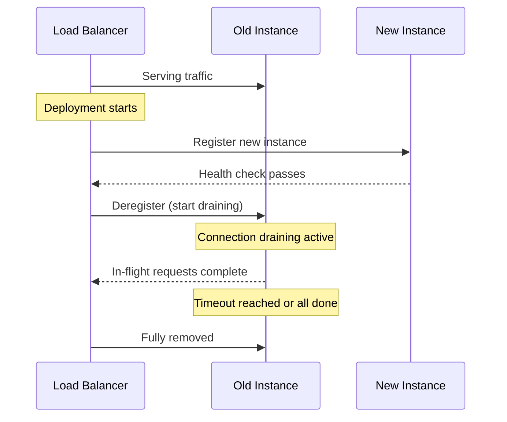

# How to Configure Connection Draining on a Load Balancer

Author: [nawazdhandala](https://github.com/nawazdhandala)

Tags: AWS, ELB, Load Balancer, Connection Draining, High Availability, Networking

Description: Learn how to configure connection draining on AWS load balancers to gracefully handle instance deregistration without dropping active connections.

---

If you've ever pulled an EC2 instance out of a load balancer and watched active requests fail with 502 errors, you already know why connection draining matters. It's one of those features that seems minor until it saves you from a production incident during a deployment.

Connection draining - also called deregistration delay on Application Load Balancers (ALBs) - gives in-flight requests time to complete before an instance is fully removed from the target group. Without it, the load balancer just cuts off connections immediately, and your users see errors.

## What Happens Without Connection Draining

When you deregister an instance or it fails a health check, the load balancer needs to stop sending traffic to it. Without connection draining, here's the sequence:

1. Instance is marked for removal
2. Load balancer immediately stops all connections
3. Any in-flight requests get dropped
4. Users see 502 or 504 errors

That's not great. With connection draining enabled, the load balancer stops sending new requests to the instance but lets existing connections finish within a configurable timeout.

## Connection Draining on Classic Load Balancers

If you're still running Classic Load Balancers (CLB), connection draining is the term you'll see in the console. Here's how to enable it.

Through the AWS CLI, you can enable connection draining with a 300-second timeout like this:

```bash
# Enable connection draining on a Classic Load Balancer with a 300-second timeout
aws elb modify-load-balancer-attributes \
  --load-balancer-name my-classic-lb \
  --load-balancer-attributes "{\"ConnectionDraining\":{\"Enabled\":true,\"Timeout\":300}}"
```

You can also do this through CloudFormation:

```yaml
# CloudFormation snippet for enabling connection draining on a CLB
Resources:
  MyClassicLB:
    Type: AWS::ElasticLoadBalancing::LoadBalancer
    Properties:
      LoadBalancerName: my-classic-lb
      ConnectionDrainingPolicy:
        Enabled: true
        Timeout: 300
      Listeners:
        - LoadBalancerPort: 80
          InstancePort: 80
          Protocol: HTTP
      AvailabilityZones:
        - us-east-1a
        - us-east-1b
```

## Deregistration Delay on ALB and NLB

On Application Load Balancers and Network Load Balancers, the same concept goes by "deregistration delay." It's configured at the target group level, not the load balancer itself.

Here's how to set it with the CLI:

```bash
# Set deregistration delay to 120 seconds on an ALB/NLB target group
aws elbv2 modify-target-group-attributes \
  --target-group-arn arn:aws:elasticloadbalancing:us-east-1:123456789:targetgroup/my-tg/abc123 \
  --attributes Key=deregistration_delay.timeout_seconds,Value=120
```

The default value is 300 seconds (5 minutes). You can set it anywhere from 0 to 3600 seconds.

For Terraform users, here's how you'd configure it:

```hcl
# Terraform resource for an ALB target group with deregistration delay
resource "aws_lb_target_group" "app" {
  name     = "app-target-group"
  port     = 80
  protocol = "HTTP"
  vpc_id   = aws_vpc.main.id

  # Set the deregistration delay to 120 seconds
  deregistration_delay = 120

  health_check {
    enabled             = true
    healthy_threshold   = 2
    unhealthy_threshold = 3
    timeout             = 5
    interval            = 10
    path                = "/health"
    matcher             = "200"
  }
}
```

## Choosing the Right Timeout Value

The default 300 seconds is often too long, and setting it to 0 defeats the purpose entirely. Here's how to think about it:

**Short-lived requests (APIs, web pages):** 30-60 seconds is usually plenty. Most HTTP requests finish in under a second, so even 30 seconds gives a generous buffer for slow queries or large file downloads.

**Long-lived connections (WebSockets, streaming):** You might need 300+ seconds. WebSocket connections can last minutes or hours, so you need enough time for the application to gracefully close them.

**Batch processing endpoints:** If your instances process long-running requests like report generation, set the timeout to match your longest expected request time.

Here's a quick reference:

| Use Case | Recommended Timeout | Why |
|----------|-------------------|-----|
| REST APIs | 30-60s | Requests are short-lived |
| Web apps | 60-120s | Allows page loads and AJAX to complete |
| WebSockets | 300-3600s | Long-lived connections need time |
| File uploads | 120-300s | Large uploads take time |
| gRPC services | 60-120s | Streaming RPCs may need extra time |

## How Connection Draining Works With Auto Scaling

Connection draining plays a critical role during Auto Scaling events. When Auto Scaling decides to terminate an instance (scale-in), it first deregisters the instance from the target group. The deregistration delay kicks in, giving connections time to complete before the instance is terminated.

But there's a catch. Auto Scaling has its own termination timeout. If your deregistration delay is longer than the Auto Scaling cooldown period, the instance might get terminated before connections finish draining.

You can configure a lifecycle hook to handle this properly:

```bash
# Add a lifecycle hook that pauses instance termination for connection draining
aws autoscaling put-lifecycle-hook \
  --auto-scaling-group-name my-asg \
  --lifecycle-hook-name drain-hook \
  --lifecycle-transition autoscaling:EC2_INSTANCE_TERMINATING \
  --heartbeat-timeout 300 \
  --default-result CONTINUE
```

This gives the instance an extra 300 seconds before Auto Scaling forcefully terminates it.

## Monitoring Connection Draining

You'll want to keep an eye on how often instances are draining and whether the timeout is sufficient. CloudWatch metrics can help here.

For ALBs, watch the `TargetResponseTime` metric to understand how long your requests typically take. If the p99 latency is 10 seconds, a 30-second deregistration delay gives you a 3x buffer.

You can also check the `UnHealthyHostCount` metric. Spikes here often correlate with draining events.

For a more comprehensive monitoring setup, consider using [OneUptime to monitor your AWS infrastructure](https://oneuptime.com/blog/post/monitor-ec2-instances-with-cloudwatch-detailed-monitoring/view). You can set up alerts that fire when draining events coincide with error rate increases.

## Connection Draining During Deployments

The most common scenario where connection draining matters is during rolling deployments. Whether you're using CodeDeploy, ECS, or just manually swapping instances, the flow looks like this:



During this period, the load balancer sends all new requests to the new instance while letting existing connections to the old instance finish naturally.

## Handling Stuck Connections

Sometimes connections don't close cleanly. Maybe a client has abandoned a connection but the server side hasn't detected it yet. For these cases, you can configure your application to help.

Add a shutdown hook that closes idle connections:

```python
# Python example: graceful shutdown handler for a Flask app
import signal
import sys
from flask import Flask

app = Flask(__name__)

def graceful_shutdown(signum, frame):
    """Handle SIGTERM by stopping new request acceptance and waiting for in-flight requests."""
    print("Received SIGTERM, starting graceful shutdown...")
    # Stop accepting new connections
    # Your framework may have its own shutdown method
    sys.exit(0)

# Register the signal handler for SIGTERM
signal.signal(signal.SIGTERM, graceful_shutdown)

@app.route('/health')
def health():
    return 'ok', 200
```

## Common Pitfalls

**Setting the timeout too low:** If you set deregistration delay to 5 seconds but your slowest queries take 30 seconds, you'll still drop connections. Check your p99 latency before choosing a value.

**Forgetting about WebSocket connections:** Standard HTTP timeout calculations don't apply to persistent connections. If your app uses WebSockets, you need a much longer timeout or application-level reconnection logic.

**Not testing draining behavior:** It's easy to configure and forget about it. Run a load test, deregister an instance, and verify that no requests fail during the drain period.

**Ignoring the interaction with health checks:** If an instance starts failing health checks, it enters draining mode. Make sure your health check thresholds and deregistration delay work well together.

## Wrapping Up

Connection draining is a small configuration that has an outsized impact on your application's reliability during deployments and scaling events. The key takeaways:

- Enable it on every load balancer and target group
- Set the timeout based on your actual request duration, not the default
- Coordinate with Auto Scaling lifecycle hooks
- Test it under load to verify it works as expected

Getting this right means your users won't notice when you're deploying new code or scaling down your fleet - and that's exactly what good infrastructure should do.
