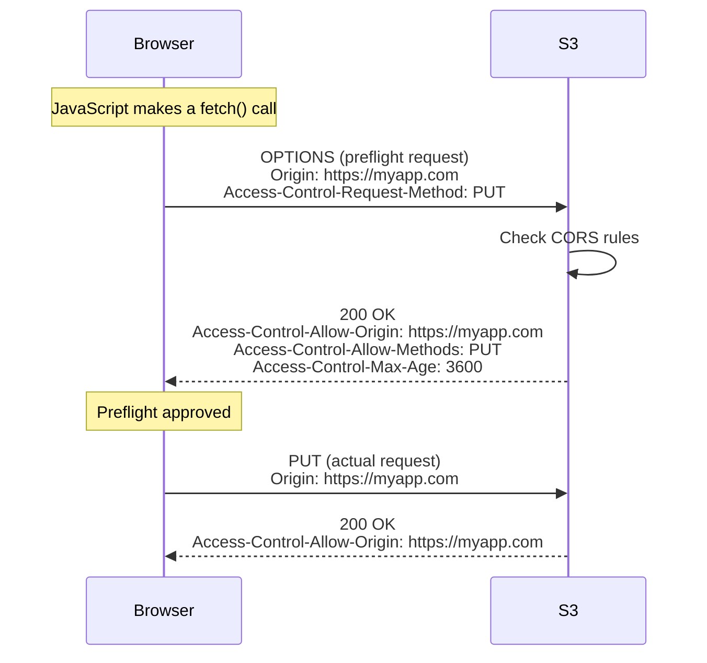

# How to Configure CORS on an S3 Bucket

Author: [nawazdhandala](https://github.com/nawazdhandala)

Tags: AWS, S3, CORS, Web Development, Security

Description: A practical guide to configuring Cross-Origin Resource Sharing (CORS) on S3 buckets for web applications that need to access S3 resources from the browser.

---

You've built a web app that fetches images, fonts, or data from S3 directly in the browser, and you're getting CORS errors. The browser is blocking the requests because S3 doesn't include the right CORS headers by default. This is the browser's security model working as intended - you just need to tell S3 which origins are allowed.

## What CORS Is and Why S3 Needs It

CORS (Cross-Origin Resource Sharing) is a browser security mechanism. When your web page at `https://myapp.com` tries to fetch a resource from `https://my-bucket.s3.amazonaws.com`, the browser considers that a cross-origin request. Unless the S3 response includes specific headers saying "yes, myapp.com is allowed to access this," the browser blocks the response.

This only affects browser requests. Server-to-server calls, CLI tools, and SDK operations don't care about CORS.

Common scenarios where you need CORS on S3:

- Loading images or videos from S3 in a web app
- Fetching JSON data files from S3 with JavaScript
- Loading web fonts hosted on S3
- Uploading files directly from the browser using presigned URLs
- Displaying S3-hosted content in a canvas element

## Step 1: Basic CORS Configuration

Here's a straightforward CORS configuration that allows GET requests from your domain.

```json
[
    {
        "AllowedHeaders": ["*"],
        "AllowedMethods": ["GET"],
        "AllowedOrigins": ["https://myapp.com"],
        "ExposeHeaders": [],
        "MaxAgeSeconds": 3600
    }
]
```

Apply it with the CLI.

```bash
aws s3api put-bucket-cors \
  --bucket my-assets-bucket \
  --cors-configuration '{
    "CORSRules": [
      {
        "AllowedHeaders": ["*"],
        "AllowedMethods": ["GET"],
        "AllowedOrigins": ["https://myapp.com"],
        "ExposeHeaders": [],
        "MaxAgeSeconds": 3600
      }
    ]
  }'
```

## Step 2: Multiple Origins and Methods

Most real-world applications need more than one origin and method. Here's a more complete configuration.

```json
[
    {
        "AllowedHeaders": ["*"],
        "AllowedMethods": ["GET", "HEAD"],
        "AllowedOrigins": [
            "https://myapp.com",
            "https://www.myapp.com",
            "https://staging.myapp.com"
        ],
        "ExposeHeaders": [
            "ETag",
            "Content-Length",
            "x-amz-meta-custom-header"
        ],
        "MaxAgeSeconds": 86400
    },
    {
        "AllowedHeaders": ["*"],
        "AllowedMethods": ["PUT", "POST"],
        "AllowedOrigins": ["https://myapp.com"],
        "ExposeHeaders": ["ETag"],
        "MaxAgeSeconds": 3600
    }
]
```

Save this as `cors-config.json` and apply it.

```bash
aws s3api put-bucket-cors \
  --bucket my-assets-bucket \
  --cors-configuration file://cors-config.json
```

## Understanding the Configuration Fields

Let me break down each field.

**AllowedOrigins**: The domains allowed to make cross-origin requests. You can use `*` to allow any origin, but that's usually too permissive for production.

**AllowedMethods**: HTTP methods allowed. Common combinations:
- Read-only: `["GET", "HEAD"]`
- Read + upload: `["GET", "HEAD", "PUT", "POST"]`
- Full access: `["GET", "HEAD", "PUT", "POST", "DELETE"]`

**AllowedHeaders**: Request headers the browser is allowed to send. `["*"]` allows all headers, which is usually fine.

**ExposeHeaders**: Response headers the browser can access. By default, the browser only exposes a few standard headers. If your JavaScript needs to read custom headers like `ETag` or `x-amz-meta-*`, list them here.

**MaxAgeSeconds**: How long the browser caches the CORS preflight response. Higher values mean fewer OPTIONS requests but slower propagation of CORS changes.

## Step 3: CORS for Direct Browser Uploads

If you're using presigned POST or presigned PUT URLs for direct uploads from the browser, you need a CORS configuration that allows those methods.

```json
[
    {
        "AllowedHeaders": ["*"],
        "AllowedMethods": ["GET", "HEAD"],
        "AllowedOrigins": ["https://myapp.com"],
        "ExposeHeaders": ["ETag", "Content-Length"],
        "MaxAgeSeconds": 86400
    },
    {
        "AllowedHeaders": [
            "Content-Type",
            "Content-Length",
            "x-amz-meta-*",
            "x-amz-server-side-encryption"
        ],
        "AllowedMethods": ["PUT", "POST"],
        "AllowedOrigins": ["https://myapp.com"],
        "ExposeHeaders": ["ETag"],
        "MaxAgeSeconds": 3600
    }
]
```

For details on presigned uploads, check out our posts on [presigned URLs](https://oneuptime.com/blog/post/generate-presigned-urls-temporary-s3-access/view) and [presigned POST requests](https://oneuptime.com/blog/post/generate-presigned-post-requests-s3-uploads/view).

## Step 4: CORS for Development

During development, you often need to allow localhost. Here's a configuration that supports both local dev and production.

```json
[
    {
        "AllowedHeaders": ["*"],
        "AllowedMethods": ["GET", "HEAD", "PUT", "POST", "DELETE"],
        "AllowedOrigins": [
            "http://localhost:3000",
            "http://localhost:5173",
            "https://myapp.com",
            "https://staging.myapp.com"
        ],
        "ExposeHeaders": ["ETag", "Content-Length", "x-amz-request-id"],
        "MaxAgeSeconds": 0
    }
]
```

Setting `MaxAgeSeconds` to 0 during development means every request triggers a preflight, which helps when you're changing the CORS config frequently.

## How CORS Preflight Works



Not all requests trigger a preflight. Simple requests (GET/HEAD/POST with standard headers and content types) skip the OPTIONS step. But PUT, DELETE, and requests with custom headers always trigger a preflight.

## Step 5: Verify Your CORS Configuration

Check the current configuration.

```bash
# Get current CORS configuration
aws s3api get-bucket-cors --bucket my-assets-bucket
```

Test it with curl to simulate a browser preflight.

```bash
# Simulate a CORS preflight request
curl -X OPTIONS \
  -H "Origin: https://myapp.com" \
  -H "Access-Control-Request-Method: GET" \
  -H "Access-Control-Request-Headers: Content-Type" \
  -v \
  https://my-assets-bucket.s3.amazonaws.com/test.json 2>&1 | grep -i "access-control"
```

You should see `Access-Control-Allow-Origin: https://myapp.com` in the response.

## Step 6: CORS with CloudFront

If you're using CloudFront in front of S3, you need additional configuration. CloudFront needs to forward the Origin header to S3 and cache the CORS headers properly.

In your CloudFront distribution, make sure to:

1. Add `Origin` to the list of forwarded headers
2. Include `Origin` in the cache key (so different origins get different cached responses)

Or use the Managed-CORS-S3Origin cache policy which handles this automatically.

```bash
# The Managed-CORS-S3Origin cache policy ID
# This forwards Origin, Access-Control-Request-Headers,
# and Access-Control-Request-Method to the origin
POLICY_ID="88a5eaf4-2fd4-4709-b370-b4c650ea3fcf"
```

## Common CORS Errors and Fixes

**"No 'Access-Control-Allow-Origin' header is present"**

Your origin isn't in the AllowedOrigins list. Check for typos, including trailing slashes and protocol mismatches (http vs https).

```javascript
// These are different origins to CORS:
// https://myapp.com
// http://myapp.com
// https://myapp.com/  (trailing slash makes it invalid)
// https://www.myapp.com
```

**"Method PUT is not allowed"**

Your CORS config doesn't include PUT in AllowedMethods. Add it to the appropriate rule.

**"Request header field x-amz-meta-custom is not allowed"**

The header isn't in your AllowedHeaders list. Either add it specifically or use `["*"]`.

**CORS works for GET but not PUT**

You probably have a rule for GET but not PUT. Add a separate rule or combine them.

**Works in Postman but not in the browser**

That's expected. Postman doesn't enforce CORS - it's a browser-only security mechanism.

## Programmatic CORS Setup

Here's a Python function that sets up CORS for common scenarios.

```python
import boto3
import json

def configure_cors(bucket_name, origins, include_upload=False):
    """
    Configure CORS for an S3 bucket.

    Args:
        bucket_name: Name of the S3 bucket
        origins: List of allowed origins
        include_upload: Whether to allow PUT/POST methods
    """
    s3 = boto3.client('s3')

    rules = [
        {
            'AllowedHeaders': ['*'],
            'AllowedMethods': ['GET', 'HEAD'],
            'AllowedOrigins': origins,
            'ExposeHeaders': ['ETag', 'Content-Length'],
            'MaxAgeSeconds': 86400,
        }
    ]

    if include_upload:
        rules.append({
            'AllowedHeaders': ['*'],
            'AllowedMethods': ['PUT', 'POST'],
            'AllowedOrigins': origins,
            'ExposeHeaders': ['ETag'],
            'MaxAgeSeconds': 3600,
        })

    s3.put_bucket_cors(
        Bucket=bucket_name,
        CORSConfiguration={'CORSRules': rules}
    )

    print(f"CORS configured for {bucket_name}")
    print(f"Allowed origins: {origins}")
    print(f"Upload enabled: {include_upload}")


# Usage
configure_cors(
    'my-assets-bucket',
    ['https://myapp.com', 'https://staging.myapp.com'],
    include_upload=True
)
```

## Wrapping Up

CORS configuration on S3 is one of those things that frustrates developers when it doesn't work and is invisible when it does. The key is being specific about your origins (avoid `*` in production), including only the methods you actually need, and remembering that CORS is a browser security feature - your servers and CLI tools are unaffected. Get the configuration right, verify it with curl, and you won't have to think about it again until you add a new domain.
