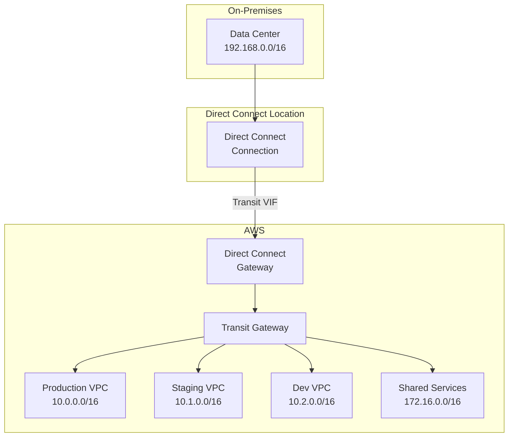

# How to Configure Direct Connect with Transit Gateway

Author: [nawazdhandala](https://github.com/nawazdhandala)

Tags: AWS, Direct Connect, Transit Gateway, Networking

Description: Integrate AWS Direct Connect with Transit Gateway for scalable hybrid connectivity to multiple VPCs across regions from a single physical connection.

---

Using Direct Connect with a virtual private gateway gives you access to one VPC per virtual interface. That's fine if you have one or two VPCs. But most organizations have dozens. Creating a separate VIF for each VPC doesn't scale - you'd run out of VIF limits fast and have a management headache.

Transit Gateway solves this. You connect Direct Connect to a transit gateway through a Direct Connect Gateway, and suddenly your on-premises network has access to every VPC attached to that transit gateway. One physical connection, one transit VIF, access to all your VPCs.

## The Architecture



The chain is: On-premises -> Direct Connect -> Transit VIF -> Direct Connect Gateway -> Transit Gateway -> VPCs.

## Prerequisites

You need these components already in place:
1. A Direct Connect connection (physical port provisioned and cross-connected)
2. A Transit Gateway with VPCs attached
3. A Direct Connect Gateway

If you haven't set these up yet, check out [setting up Direct Connect](https://oneuptime.com/blog/post/2026-02-12-set-up-aws-direct-connect-dedicated-connectivity/view) and [using Transit Gateway for multi-VPC connectivity](https://oneuptime.com/blog/post/2026-02-12-aws-transit-gateway-multi-vpc-connectivity/view).

## Step 1: Create a Direct Connect Gateway

If you don't already have one:

```bash
# Create the Direct Connect Gateway
DXGW_ID=$(aws directconnect create-direct-connect-gateway \
  --direct-connect-gateway-name "hybrid-dx-gateway" \
  --amazon-side-asn 64512 \
  --query 'directConnectGateway.directConnectGatewayId' \
  --output text)

echo "Direct Connect Gateway: $DXGW_ID"
```

The Amazon-side ASN is the BGP ASN that AWS uses for the BGP session. Choose a value in the private ASN range (64512-65534) that doesn't conflict with your on-premises ASN.

## Step 2: Associate the Direct Connect Gateway with Transit Gateway

This is the key step that links Direct Connect to your transit gateway:

```bash
# Associate DX Gateway with Transit Gateway
ASSOC_ID=$(aws directconnect create-direct-connect-gateway-association \
  --direct-connect-gateway-id $DXGW_ID \
  --gateway-id $TGW_ID \
  --add-allowed-prefixes-to-direct-connect-gateway '[
    {"cidr": "10.0.0.0/8"},
    {"cidr": "172.16.0.0/12"}
  ]' \
  --query 'directConnectGatewayAssociation.associationId' \
  --output text)

echo "Association: $ASSOC_ID"
```

The `allowed-prefixes` parameter is critical. It defines which CIDRs are advertised to your on-premises network over BGP. If you don't include a VPC's CIDR here, your on-premises network won't learn a route to it.

Wait for the association to become active:

```bash
# Check association state
aws directconnect describe-direct-connect-gateway-associations \
  --direct-connect-gateway-id $DXGW_ID \
  --query 'directConnectGatewayAssociations[].{ID:associationId,State:associationState,Gateway:associatedGateway.id}'
```

This can take several minutes. The state progresses from `associating` to `associated`.

## Step 3: Create a Transit Virtual Interface

Create a transit VIF on your Direct Connect connection. This is different from a private VIF - it connects to the Direct Connect Gateway instead of a virtual private gateway:

```bash
# Create a transit virtual interface
TVIF_ID=$(aws directconnect create-transit-virtual-interface \
  --connection-id $DX_CONN_ID \
  --new-transit-virtual-interface '{
    "virtualInterfaceName": "prod-transit-vif",
    "vlan": 300,
    "asn": 65000,
    "mtu": 8500,
    "authKey": "bgp-auth-key-here",
    "amazonAddress": "169.254.200.1/30",
    "customerAddress": "169.254.200.2/30",
    "directConnectGatewayId": "'$DXGW_ID'",
    "tags": [{"key": "Name", "value": "transit-vif"}]
  }' \
  --query 'virtualInterface.virtualInterfaceId' \
  --output text)

echo "Transit VIF: $TVIF_ID"
```

Note the `mtu` of 8500. Transit VIFs support jumbo frames, which can improve throughput for large data transfers. Your on-premises network also needs to support jumbo frames end-to-end for this to work.

## Step 4: Configure BGP on Your Router

Set up BGP peering with the transit VIF:

```
! Cisco IOS configuration
interface GigabitEthernet0/0.300
  description Transit VIF to AWS
  encapsulation dot1Q 300
  ip address 169.254.200.2 255.255.255.252
  ip mtu 8500

router bgp 65000
  neighbor 169.254.200.1 remote-as 64512
  neighbor 169.254.200.1 password bgp-auth-key-here

  address-family ipv4 unicast
    neighbor 169.254.200.1 activate
    ! Advertise on-premises networks
    network 192.168.0.0 mask 255.255.0.0
    network 172.20.0.0 mask 255.255.0.0
    ! Set maximum prefix limit as a safety measure
    neighbor 169.254.200.1 maximum-prefix 100
```

## Step 5: Configure Transit Gateway Route Tables

The transit gateway needs routes for your on-premises network. With BGP, propagated routes from the Direct Connect attachment appear automatically:

```bash
# Enable route propagation from the DX attachment to the transit gateway route table
aws ec2 enable-transit-gateway-route-table-propagation \
  --transit-gateway-route-table-id $TGW_RT_ID \
  --transit-gateway-attachment-id $DX_ATTACH_ID
```

Verify the routes:

```bash
# Check that on-premises routes appear in the transit gateway route table
aws ec2 search-transit-gateway-routes \
  --transit-gateway-route-table-id $TGW_RT_ID \
  --filters "Name=type,Values=propagated" \
  --query 'Routes[].{CIDR:DestinationCidrBlock,Type:Type,Attachment:TransitGatewayAttachments[0].TransitGatewayAttachmentId}' \
  --output table
```

You should see your on-premises CIDRs listed with the Direct Connect attachment as the next hop.

## Step 6: Update VPC Route Tables

Each VPC needs a route pointing on-premises traffic to the transit gateway:

```bash
# In each VPC's private route table, add on-premises routes
aws ec2 create-route \
  --route-table-id rtb-prod-private \
  --destination-cidr-block 192.168.0.0/16 \
  --transit-gateway-id $TGW_ID

# Or use a summary route if your on-premises space is well-defined
aws ec2 create-route \
  --route-table-id rtb-prod-private \
  --destination-cidr-block 0.0.0.0/0 \
  --transit-gateway-id $TGW_ID
```

## Redundancy with Multiple Connections

For production, always have redundant Direct Connect connections:

```bash
# Create VIFs on both connections pointing to the same DX Gateway
# Connection 1 - Primary
aws directconnect create-transit-virtual-interface \
  --connection-id $DX_CONN_1 \
  --new-transit-virtual-interface '{
    "virtualInterfaceName": "transit-vif-primary",
    "vlan": 300,
    "asn": 65000,
    "directConnectGatewayId": "'$DXGW_ID'"
  }'

# Connection 2 - Secondary
aws directconnect create-transit-virtual-interface \
  --connection-id $DX_CONN_2 \
  --new-transit-virtual-interface '{
    "virtualInterfaceName": "transit-vif-secondary",
    "vlan": 300,
    "asn": 65000,
    "directConnectGatewayId": "'$DXGW_ID'"
  }'
```

Use BGP LOCAL_PREF to prefer one connection over the other:

```
! On your router, prefer the primary connection
route-map PRIMARY-IN permit 10
  set local-preference 200

route-map SECONDARY-IN permit 10
  set local-preference 100

router bgp 65000
  neighbor 169.254.200.1 route-map PRIMARY-IN in
  neighbor 169.254.201.1 route-map SECONDARY-IN in
```

## Adding VPN as a Backup

Direct Connect can go down. Having a VPN as a backup ensures connectivity continues:

```bash
# Create a VPN connection to the same transit gateway
VPN_BACKUP=$(aws ec2 create-vpn-connection \
  --type ipsec.1 \
  --customer-gateway-id $CGW_ID \
  --transit-gateway-id $TGW_ID \
  --options '{"StaticRoutesOnly": false}' \
  --query 'VpnConnection.VpnConnectionId' \
  --output text)
```

BGP handles the failover automatically. Direct Connect routes have a shorter AS path than VPN routes, so they're preferred. If Direct Connect goes down, BGP falls back to the VPN.

## Monitoring

Monitor the health of your Direct Connect integration:

```bash
# Check Direct Connect connection state
aws directconnect describe-connections \
  --query 'connections[].{ID:connectionId,Name:connectionName,State:connectionState,Bandwidth:bandwidth}'

# Check VIF state and BGP status
aws directconnect describe-virtual-interfaces \
  --query 'virtualInterfaces[].{ID:virtualInterfaceId,State:virtualInterfaceState,BGP:bgpPeers[].bgpStatus}'

# Check transit gateway attachment state
aws ec2 describe-transit-gateway-attachments \
  --filters "Name=resource-type,Values=direct-connect-gateway" \
  --query 'TransitGatewayAttachments[].{ID:TransitGatewayAttachmentId,State:State}'
```

Set up CloudWatch alarms for connection state changes and BGP peer flaps.

## Wrapping Up

Direct Connect with Transit Gateway is the enterprise standard for hybrid connectivity. One physical connection serves all your VPCs through the transit gateway hub. The setup involves more components than a simple VPN, but the scalability is unmatched. Plan for redundancy from day one - dual connections with VPN backup gives you the resilience production workloads demand.
