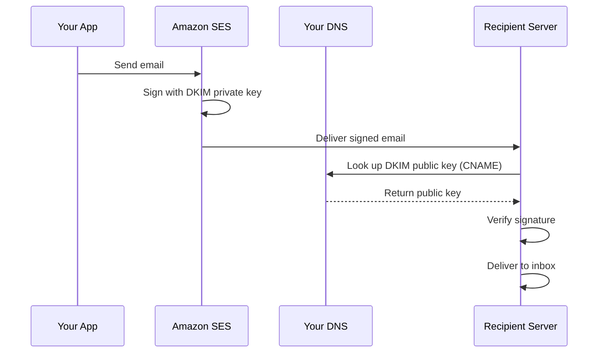

# How to Configure DKIM for Amazon SES

Author: [nawazdhandala](https://github.com/nawazdhandala)

Tags: AWS, SES, DKIM, Email Authentication, DNS

Description: Set up DomainKeys Identified Mail (DKIM) for Amazon SES to authenticate your emails with cryptographic signatures, improving deliverability and preventing spoofing.

---

DKIM (DomainKeys Identified Mail) is an email authentication standard that adds a cryptographic signature to your outgoing emails. Receiving mail servers use this signature to verify that the email actually came from your domain and wasn't modified in transit. Without DKIM, your emails are more likely to end up in spam folders or get rejected entirely.

Amazon SES offers two ways to set up DKIM: Easy DKIM (where SES manages the keys) and BYODKIM (Bring Your Own DKIM, where you provide your own keys). Easy DKIM is the recommended approach for most users.

## How DKIM Works

When you send an email through SES with DKIM enabled, SES signs the email with a private key. The corresponding public key is published in your DNS as a CNAME or TXT record. The receiving server looks up the public key, verifies the signature, and confirms the email is legitimate.



## Step 1: Enable Easy DKIM

Easy DKIM is the simplest option. SES generates and manages the DKIM keys for you:

```bash
# Enable Easy DKIM for your domain
aws ses verify-domain-dkim \
  --domain "example.com" \
  --region us-east-1
```

This returns three DKIM tokens:

```json
{
    "DkimTokens": [
        "abc1234defgh5678ijkl",
        "mno9012pqrst3456uvwx",
        "yz7890abcdef1234ghij"
    ]
}
```

## Step 2: Add DKIM CNAME Records to DNS

Each token needs a CNAME record in your DNS. The format is:

- **Name**: `<token>._domainkey.example.com`
- **Value**: `<token>.dkim.amazonses.com`

Using Route 53:

```bash
# Add the three DKIM CNAME records
aws route53 change-resource-record-sets \
  --hosted-zone-id Z1234567890 \
  --change-batch '{
    "Changes": [
      {
        "Action": "UPSERT",
        "ResourceRecordSet": {
          "Name": "abc1234defgh5678ijkl._domainkey.example.com",
          "Type": "CNAME",
          "TTL": 1800,
          "ResourceRecords": [{
            "Value": "abc1234defgh5678ijkl.dkim.amazonses.com"
          }]
        }
      },
      {
        "Action": "UPSERT",
        "ResourceRecordSet": {
          "Name": "mno9012pqrst3456uvwx._domainkey.example.com",
          "Type": "CNAME",
          "TTL": 1800,
          "ResourceRecords": [{
            "Value": "mno9012pqrst3456uvwx.dkim.amazonses.com"
          }]
        }
      },
      {
        "Action": "UPSERT",
        "ResourceRecordSet": {
          "Name": "yz7890abcdef1234ghij._domainkey.example.com",
          "Type": "CNAME",
          "TTL": 1800,
          "ResourceRecords": [{
            "Value": "yz7890abcdef1234ghij.dkim.amazonses.com"
          }]
        }
      }
    ]
  }'
```

## Step 3: Verify DKIM Status

Wait for DNS propagation and check the DKIM status:

```bash
# Check DKIM verification status
aws ses get-identity-dkim-attributes \
  --identities "example.com" \
  --region us-east-1
```

Expected output when verified:

```json
{
    "DkimAttributes": {
        "example.com": {
            "DkimEnabled": true,
            "DkimVerificationStatus": "Success",
            "DkimTokens": [
                "abc1234defgh5678ijkl",
                "mno9012pqrst3456uvwx",
                "yz7890abcdef1234ghij"
            ]
        }
    }
}
```

You can also verify the DNS records are propagated correctly:

```bash
# Check DKIM CNAME records
dig CNAME abc1234defgh5678ijkl._domainkey.example.com +short
dig CNAME mno9012pqrst3456uvwx._domainkey.example.com +short
dig CNAME yz7890abcdef1234ghij._domainkey.example.com +short
```

## Step 4: Use SES v2 for Easier DKIM Setup

The SES v2 API streamlines the process with Easy DKIM v2 (using 2048-bit keys):

```bash
# Create email identity with DKIM using SES v2
aws sesv2 create-email-identity \
  --email-identity "example.com" \
  --dkim-signing-attributes '{
    "DomainSigningSelector": "ses",
    "DomainSigningPrivateKey": ""
  }' \
  --region us-east-1

# Or more simply, just create the identity and DKIM is auto-configured
aws sesv2 create-email-identity \
  --email-identity "example.com" \
  --region us-east-1

# Get DKIM details including the CNAME records to add
aws sesv2 get-email-identity \
  --email-identity "example.com" \
  --query 'DkimAttributes.Tokens' \
  --region us-east-1
```

## Step 5: BYODKIM (Bring Your Own DKIM)

If you need to use your own DKIM keys (for key rotation control or compliance reasons):

```bash
# Generate a 2048-bit RSA key pair
openssl genrsa -out dkim-private.pem 2048
openssl rsa -in dkim-private.pem -pubout -out dkim-public.pem

# Extract the public key without headers for DNS
PUBLIC_KEY=$(cat dkim-public.pem | grep -v "PUBLIC KEY" | tr -d '\n')

# Configure BYODKIM in SES v2
aws sesv2 create-email-identity \
  --email-identity "example.com" \
  --dkim-signing-attributes '{
    "DomainSigningSelector": "mykey",
    "DomainSigningPrivateKey": "'$(cat dkim-private.pem | tr -d '\n')'"
  }' \
  --region us-east-1
```

Then add the public key as a TXT record:

```bash
# Add the BYODKIM public key TXT record
aws route53 change-resource-record-sets \
  --hosted-zone-id Z1234567890 \
  --change-batch '{
    "Changes": [{
      "Action": "UPSERT",
      "ResourceRecordSet": {
        "Name": "mykey._domainkey.example.com",
        "Type": "TXT",
        "TTL": 3600,
        "ResourceRecords": [{
          "Value": "\"v=DKIM1; k=rsa; p='$PUBLIC_KEY'\""
        }]
      }
    }]
  }'
```

## Step 6: Enable/Disable DKIM Signing

You can toggle DKIM signing on and off:

```bash
# Disable DKIM signing (not recommended unless troubleshooting)
aws ses set-identity-dkim-enabled \
  --identity "example.com" \
  --dkim-enabled false \
  --region us-east-1

# Re-enable DKIM signing
aws ses set-identity-dkim-enabled \
  --identity "example.com" \
  --dkim-enabled true \
  --region us-east-1

# Using SES v2
aws sesv2 put-email-identity-dkim-attributes \
  --email-identity "example.com" \
  --signing-enabled \
  --region us-east-1
```

## Step 7: Verify DKIM is Working

Send a test email and check the headers:

```bash
# Send a test email
aws ses send-email \
  --from "test@example.com" \
  --destination '{"ToAddresses": ["recipient@gmail.com"]}' \
  --message '{
    "Subject": {"Data": "DKIM Test"},
    "Body": {"Text": {"Data": "Testing DKIM signature."}}
  }' \
  --region us-east-1
```

In the received email, check the headers for:
- `DKIM-Signature: v=1; a=rsa-sha256; d=example.com; ...`
- Authentication results showing `dkim=pass`

Gmail users can click "Show original" to see the full headers. Look for:
```
ARC-Authentication-Results: dkim=pass header.d=example.com
```

## Step 8: Set Up DKIM for Subdomains

Each subdomain can have its own DKIM configuration:

```bash
# Set up DKIM for a subdomain
aws ses verify-domain-dkim \
  --domain "mail.example.com" \
  --region us-east-1

# Add the CNAME records for the subdomain
# The records follow the same pattern:
# <token>._domainkey.mail.example.com -> <token>.dkim.amazonses.com
```

## Troubleshooting DKIM

**DKIM verification stuck on "Pending":**
- Double-check CNAME records are correct
- Make sure you didn't accidentally add TXT records instead of CNAME records
- Verify the record names include the full path including `._domainkey.example.com`

```bash
# Diagnostic: check all DKIM-related DNS records
for token in abc1234defgh5678ijkl mno9012pqrst3456uvwx yz7890abcdef1234ghij; do
  echo "Checking $token._domainkey.example.com"
  dig CNAME "$token._domainkey.example.com" +short
done
```

**DKIM verification failed:**
- Some DNS providers add the domain automatically, causing double domain names
- For example, entering `token._domainkey.example.com` might create `token._domainkey.example.com.example.com`
- Try entering just `token._domainkey` without the domain suffix

**DKIM passes but DMARC fails:**
- Check that your DKIM domain (`d=` in the DKIM signature) matches your From domain
- SES signs with your domain when you've verified it, so this shouldn't be an issue with Easy DKIM

## Key Rotation with Easy DKIM

SES automatically rotates Easy DKIM keys periodically. When rotation happens, SES generates new CNAME values, but since the CNAME records point to SES-managed DNS, the rotation is transparent - you don't need to update your DNS records. This is one of the major advantages of Easy DKIM over BYODKIM.

With BYODKIM, you need to manage rotation yourself. A common approach is to generate new keys, add the new DNS record with a different selector, update SES to use the new key, and then remove the old DNS record after a transition period.

DKIM is a critical piece of the email authentication puzzle. Combined with [SPF and DMARC](https://oneuptime.com/blog/post/verify-domains-amazon-ses/view), it gives receiving mail servers confidence that your emails are genuine, which directly translates to better inbox placement rates.
