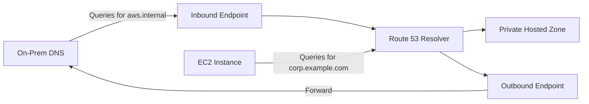

# How to Configure DNS Resolution in a VPC

Author: [nawazdhandala](https://github.com/nawazdhandala)

Tags: AWS, VPC, DNS, Networking

Description: A guide to configuring DNS resolution in AWS VPCs, covering the Amazon-provided DNS server, Route 53 Resolver, custom DNS settings, and hybrid DNS architectures.

---

DNS resolution inside a VPC can be surprisingly tricky once you move beyond the defaults. AWS provides a built-in DNS server for every VPC (the "AmazonProvidedDNS"), but there are quite a few knobs you can turn - and a few gotchas that'll waste your afternoon if you don't know about them.

Let's walk through how DNS actually works inside a VPC and how to configure it for different scenarios.

## The Amazon-Provided DNS Server

Every VPC comes with a DNS server at the VPC's base IP address plus two. So if your VPC CIDR is 10.0.0.0/16, the DNS server is at 10.0.0.2. There's also a reserved IP at 169.254.169.253 that always works regardless of your VPC CIDR.

This DNS server handles:
- Resolution of public DNS names to public IPs
- Resolution of private hosted zone records in Route 53
- Resolution of instance hostnames within the VPC (like ip-10-0-1-5.ec2.internal)

Two VPC attributes control whether DNS works at all.

```bash
# Check current DNS settings for your VPC
aws ec2 describe-vpc-attribute \
  --vpc-id vpc-0abc123def456789 \
  --attribute enableDnsSupport

aws ec2 describe-vpc-attribute \
  --vpc-id vpc-0abc123def456789 \
  --attribute enableDnsHostnames
```

**enableDnsSupport** - Must be `true` for the VPC DNS server to work. If you set this to `false`, instances won't be able to resolve any DNS names using the Amazon-provided DNS.

**enableDnsHostnames** - When `true`, instances with public IPs get public DNS hostnames (like ec2-52-1-2-3.compute-1.amazonaws.com). You need this enabled if you want to use Route 53 private hosted zones.

```bash
# Enable both DNS attributes
aws ec2 modify-vpc-attribute \
  --vpc-id vpc-0abc123def456789 \
  --enable-dns-support '{"Value": true}'

aws ec2 modify-vpc-attribute \
  --vpc-id vpc-0abc123def456789 \
  --enable-dns-hostnames '{"Value": true}'
```

Both should be `true` for most use cases. I've seen production outages caused by someone toggling `enableDnsSupport` to false during a Terraform change - suddenly nothing can resolve DNS and everything breaks.

## DHCP Option Sets

The DHCP option set controls which DNS servers your instances use. The default option set points to the Amazon-provided DNS, but you can create custom ones.

```bash
# Create a custom DHCP option set with a custom domain name
aws ec2 create-dhcp-options \
  --dhcp-configurations \
    "Key=domain-name,Values=mycompany.internal" \
    "Key=domain-name-servers,Values=10.0.0.2,10.1.0.2"

# Associate the DHCP option set with your VPC
aws ec2 associate-dhcp-options \
  --dhcp-options-id dopt-0123456789abcdef0 \
  --vpc-id vpc-0abc123def456789
```

For a deeper dive into DHCP option sets, check out https://oneuptime.com/blog/post/2026-02-12-dhcp-option-sets-in-vpc/view.

One important detail: when you use a custom domain-name-servers value instead of "AmazonProvidedDNS", you lose the ability to resolve Route 53 private hosted zones through the Amazon DNS server directly. You'd need Route 53 Resolver endpoints to bridge that gap.

## Route 53 Resolver

Route 53 Resolver is the managed DNS service that handles DNS queries within your VPC. It's what actually runs at the 10.0.0.2 address. For most setups, it works transparently. But things get interesting when you need hybrid DNS - resolving on-premises domains from AWS or vice versa.

There are two types of resolver endpoints:

**Inbound endpoints** - Allow DNS queries from your on-premises network to resolve records in your VPC (like private hosted zones).

**Outbound endpoints** - Forward DNS queries from your VPC to DNS servers on your on-premises network or elsewhere.

```bash
# Create a security group for the resolver endpoints
aws ec2 create-security-group \
  --group-name resolver-sg \
  --description "Security group for Route 53 Resolver endpoints" \
  --vpc-id vpc-0abc123def456789

# Allow DNS traffic (TCP and UDP port 53)
aws ec2 authorize-security-group-ingress \
  --group-id sg-resolver \
  --protocol tcp \
  --port 53 \
  --cidr 10.0.0.0/8

aws ec2 authorize-security-group-ingress \
  --group-id sg-resolver \
  --protocol udp \
  --port 53 \
  --cidr 10.0.0.0/8
```

Create an inbound resolver endpoint so on-premises servers can resolve AWS private hosted zone records.

```bash
# Create an inbound resolver endpoint
aws route53resolver create-resolver-endpoint \
  --name "inbound-from-onprem" \
  --direction INBOUND \
  --security-group-ids sg-resolver \
  --ip-addresses SubnetId=subnet-0abc123,Ip=10.0.1.10 SubnetId=subnet-0def456,Ip=10.0.2.10
```

Create an outbound resolver endpoint with forwarding rules to send certain domains to your on-prem DNS.

```bash
# Create an outbound resolver endpoint
aws route53resolver create-resolver-endpoint \
  --name "outbound-to-onprem" \
  --direction OUTBOUND \
  --security-group-ids sg-resolver \
  --ip-addresses SubnetId=subnet-0abc123 SubnetId=subnet-0def456

# Create a forwarding rule for your on-premises domain
aws route53resolver create-resolver-rule \
  --name "forward-to-onprem" \
  --rule-type FORWARD \
  --domain-name "corp.example.com" \
  --resolver-endpoint-id rslvr-out-0123456789abcdef0 \
  --target-ips "Ip=192.168.1.10,Port=53" "Ip=192.168.1.11,Port=53"

# Associate the rule with your VPC
aws route53resolver associate-resolver-rule \
  --resolver-rule-id rslvr-rr-0123456789abcdef0 \
  --vpc-id vpc-0abc123def456789
```

## Hybrid DNS Architecture

Here's what a typical hybrid DNS setup looks like.



The key insight is that resolver endpoints are the bridge. Without them, there's no way for on-premises DNS queries to reach Route 53 private hosted zones, and no way for VPC instances to resolve on-premises domains.

## DNS Resolution Across Peered VPCs

When you peer two VPCs, DNS resolution doesn't automatically work across the peering connection. You need to enable DNS resolution for the peering connection.

```bash
# Enable DNS resolution for a VPC peering connection
aws ec2 modify-vpc-peering-connection-options \
  --vpc-peering-connection-id pcx-0123456789abcdef0 \
  --requester-peering-connection-options '{"AllowDnsResolutionFromRemoteVpc": true}' \
  --accepter-peering-connection-options '{"AllowDnsResolutionFromRemoteVpc": true}'
```

Once enabled, instances in VPC A can resolve the private DNS hostnames of instances in VPC B to their private IPs instead of their public IPs.

## Terraform Configuration

Here's a Terraform setup that creates resolver endpoints for hybrid DNS.

```hcl
resource "aws_route53_resolver_endpoint" "inbound" {
  name      = "inbound-from-onprem"
  direction = "INBOUND"

  security_group_ids = [aws_security_group.resolver.id]

  ip_address {
    subnet_id = aws_subnet.private_a.id
    ip        = "10.0.1.10"
  }

  ip_address {
    subnet_id = aws_subnet.private_b.id
    ip        = "10.0.2.10"
  }
}

resource "aws_route53_resolver_endpoint" "outbound" {
  name      = "outbound-to-onprem"
  direction = "OUTBOUND"

  security_group_ids = [aws_security_group.resolver.id]

  ip_address {
    subnet_id = aws_subnet.private_a.id
  }

  ip_address {
    subnet_id = aws_subnet.private_b.id
  }
}

resource "aws_route53_resolver_rule" "forward_to_onprem" {
  domain_name          = "corp.example.com"
  name                 = "forward-to-onprem"
  rule_type            = "FORWARD"
  resolver_endpoint_id = aws_route53_resolver_endpoint.outbound.id

  target_ip {
    ip   = "192.168.1.10"
    port = 53
  }

  target_ip {
    ip   = "192.168.1.11"
    port = 53
  }
}
```

## Troubleshooting DNS Issues

When DNS isn't working in your VPC, check these things in order:

1. Is `enableDnsSupport` set to true on the VPC?
2. Is the security group for the instance allowing outbound UDP/TCP port 53?
3. Are the NACL rules allowing DNS traffic?
4. Is the DHCP option set pointing to the right DNS servers?
5. If using private hosted zones, is `enableDnsHostnames` set to true?

You can test DNS resolution from an EC2 instance with `dig` or `nslookup` pointed at the VPC DNS server.

```bash
# Test resolution using the VPC DNS server
dig @10.0.0.2 myservice.internal
nslookup myservice.internal 10.0.0.2
```

DNS problems are some of the most frustrating to debug because the symptoms (timeouts, connection failures) look like a dozen other issues. Getting your VPC DNS configuration right from the start saves you a lot of pain down the road.
