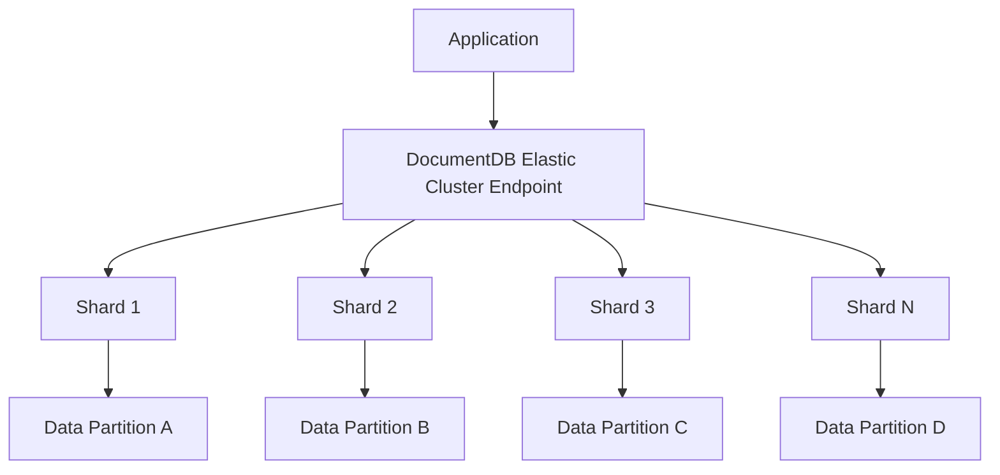

# How to Configure DocumentDB Elastic Clusters for Sharding

Author: [nawazdhandala](https://github.com/nawazdhandala)

Tags: AWS, DocumentDB, MongoDB, Sharding, Database, Scaling

Description: Set up Amazon DocumentDB Elastic Clusters to horizontally scale your document database workloads with automatic sharding and management.

---

Standard DocumentDB clusters have limits. The maximum storage is 128 TB, and writes are handled by a single primary instance. For many workloads, this is more than enough. But if you are building a multi-tenant SaaS platform, an IoT data store, or any application that generates massive volumes of document data, you will eventually hit these ceilings.

DocumentDB Elastic Clusters break through these limits by adding horizontal scaling through sharding. Your data is distributed across multiple shards, each handling a portion of the reads and writes. The best part is that DocumentDB manages the sharding infrastructure for you - no manual shard management, no config servers, no mongos routers to deal with.

## How Elastic Clusters Work



Each shard is an independent compute unit with its own storage. Data is distributed across shards based on a shard key you define on each collection. DocumentDB handles routing queries to the correct shard.

Elastic Clusters use vCPUs as the unit of compute. You can start with as few as 2 vCPUs per shard and scale up to 64 vCPUs per shard. You can have up to 32 shards, giving you massive horizontal throughput.

## Creating an Elastic Cluster

### Step 1: Create the Cluster

```bash
# Create a DocumentDB Elastic Cluster
aws docdb-elastic create-cluster \
  --cluster-name my-elastic-cluster \
  --auth-type PLAIN_TEXT \
  --admin-user-name admin \
  --admin-user-password 'YourStr0ngP@ss!' \
  --shard-capacity 4 \
  --shard-count 3 \
  --subnet-ids subnet-0abc123 subnet-0def456 \
  --vpc-security-group-ids sg-0abc123 \
  --kms-key-id arn:aws:kms:us-east-1:123456789012:key/abcd1234
```

Parameters explained:
- `shard-capacity`: vCPUs per shard (2, 4, 8, 16, 32, or 64)
- `shard-count`: number of shards (1 to 32)
- `auth-type`: PLAIN_TEXT for username/password, SECRET_ARN for Secrets Manager

### Step 2: Get the Cluster Endpoint

```bash
# Get the cluster endpoint for connections
aws docdb-elastic get-cluster \
  --cluster-arn arn:aws:docdb-elastic:us-east-1:123456789012:cluster/my-elastic-cluster \
  --query '{Endpoint:cluster.clusterEndpoint,Status:cluster.status}'
```

## Connecting to the Cluster

### Python (pymongo)

```python
# Connect to DocumentDB Elastic Cluster using pymongo
from pymongo import MongoClient

# Connection string for DocumentDB Elastic Cluster
connection_string = (
    "mongodb://admin:YourStr0ngP@ss!@"
    "my-elastic-cluster.us-east-1.docdb-elastic.amazonaws.com:27017/"
    "?tls=true&tlsCAFile=global-bundle.pem&retryWrites=false"
)

client = MongoClient(connection_string)
db = client['myapp']
```

### Node.js

```javascript
// Connect to DocumentDB Elastic Cluster from Node.js
const { MongoClient } = require('mongodb');
const fs = require('fs');

const uri = "mongodb://admin:YourStr0ngP@ss!@" +
    "my-elastic-cluster.us-east-1.docdb-elastic.amazonaws.com:27017/" +
    "?tls=true&retryWrites=false";

const client = new MongoClient(uri, {
    tlsCAFile: 'global-bundle.pem'
});

async function main() {
    await client.connect();
    const db = client.db('myapp');
    console.log('Connected to DocumentDB Elastic Cluster');
}

main();
```

## Sharding Your Collections

The most important decision is choosing the right shard key for each collection.

### Creating a Sharded Collection

```python
# Create a sharded collection with tenant_id as the shard key
db.command({
    'shardCollection': 'myapp.events',
    'key': {'tenant_id': 'hashed'}
})

# Create another collection sharded by a different key
db.command({
    'shardCollection': 'myapp.orders',
    'key': {'customer_id': 'hashed'}
})
```

### Choosing a Shard Key

Good shard key characteristics (same principles as any sharded database):

- **High cardinality**: many distinct values ensure even data distribution
- **Frequent query filter**: queries that include the shard key can be routed to a single shard
- **Even write distribution**: avoid keys that create hot spots

```python
# Example: Multi-tenant SaaS - shard by tenant_id
db.command({
    'shardCollection': 'myapp.documents',
    'key': {'tenant_id': 'hashed'}
})

# Queries that include the shard key are efficient (routed to one shard)
results = db.documents.find({
    'tenant_id': 'tenant-abc',
    'status': 'active'
})

# Queries without the shard key scatter to all shards (less efficient)
results = db.documents.find({
    'status': 'active'
})
```

### Ranged vs Hashed Shard Keys

DocumentDB Elastic Clusters support both ranged and hashed shard keys.

```python
# Hashed shard key - distributes data evenly regardless of key values
# Good for: most use cases, especially when key values are sequential
db.command({
    'shardCollection': 'myapp.logs',
    'key': {'device_id': 'hashed'}
})

# Ranged shard key - keeps similar values together on the same shard
# Good for: range queries, time-series data with compound keys
db.command({
    'shardCollection': 'myapp.metrics',
    'key': {'region': 1, 'timestamp': 1}
})
```

## Working with Sharded Data

### Inserting Data

Inserts work the same as a regular MongoDB/DocumentDB collection.

```python
# Insert documents - DocumentDB routes them to the correct shard
events = [
    {'tenant_id': 'tenant-abc', 'type': 'page_view', 'url': '/home', 'timestamp': datetime.utcnow()},
    {'tenant_id': 'tenant-xyz', 'type': 'purchase', 'amount': 99.99, 'timestamp': datetime.utcnow()},
    {'tenant_id': 'tenant-abc', 'type': 'click', 'element': 'buy-button', 'timestamp': datetime.utcnow()},
]

result = db.events.insert_many(events)
print(f"Inserted {len(result.inserted_ids)} documents")
```

### Querying with the Shard Key

```python
# Targeted query - includes shard key, routed to a single shard
tenant_events = list(db.events.find({
    'tenant_id': 'tenant-abc',
    'type': 'purchase',
    'timestamp': {'$gte': datetime(2026, 1, 1)}
}).sort('timestamp', -1).limit(100))

# Aggregation pipeline - efficient when filtering by shard key
pipeline = [
    {'$match': {
        'tenant_id': 'tenant-abc',
        'timestamp': {'$gte': datetime(2026, 1, 1)}
    }},
    {'$group': {
        '_id': '$type',
        'count': {'$sum': 1},
        'total_amount': {'$sum': '$amount'}
    }},
    {'$sort': {'count': -1}}
]

results = list(db.events.aggregate(pipeline))
```

### Creating Indexes

Indexes on sharded collections work the same way, but the shard key must be a prefix of every unique index.

```python
# Create indexes on the sharded collection
# The shard key (tenant_id) must be part of any unique index
db.events.create_index([('tenant_id', 1), ('timestamp', -1)])
db.events.create_index([('tenant_id', 1), ('type', 1)])

# Non-unique indexes can be on any fields
db.events.create_index([('type', 1)])
db.events.create_index([('timestamp', -1)])
```

## Scaling the Cluster

### Add More Shards

```bash
# Scale out by adding more shards
aws docdb-elastic update-cluster \
  --cluster-arn arn:aws:docdb-elastic:us-east-1:123456789012:cluster/my-elastic-cluster \
  --shard-count 6
```

### Increase Shard Capacity

```bash
# Scale up each shard's compute
aws docdb-elastic update-cluster \
  --cluster-arn arn:aws:docdb-elastic:us-east-1:123456789012:cluster/my-elastic-cluster \
  --shard-capacity 8
```

## Monitoring

```bash
# Monitor per-shard CPU utilization
aws cloudwatch get-metric-statistics \
  --namespace AWS/DocDB-Elastic \
  --metric-name CPUUtilization \
  --dimensions Name=ClusterName,Value=my-elastic-cluster \
  --start-time $(date -u -d '1 hour ago' +%Y-%m-%dT%H:%M:%S) \
  --end-time $(date -u +%Y-%m-%dT%H:%M:%S) \
  --period 300 \
  --statistics Average,Maximum

# Monitor read and write operations
aws cloudwatch get-metric-statistics \
  --namespace AWS/DocDB-Elastic \
  --metric-name WriteOps \
  --dimensions Name=ClusterName,Value=my-elastic-cluster \
  --start-time $(date -u -d '1 hour ago' +%Y-%m-%dT%H:%M:%S) \
  --end-time $(date -u +%Y-%m-%dT%H:%M:%S) \
  --period 300 \
  --statistics Sum
```

## Summary

DocumentDB Elastic Clusters bring horizontal scaling to AWS's managed document database. By sharding your data across multiple compute units, you break through the throughput and storage limits of standard DocumentDB. The key to success is choosing good shard keys - pick columns with high cardinality that your application frequently filters on, and you will get even data distribution and efficient query routing.

For related database topics, check out our guides on [migrating from Cassandra to Keyspaces](https://oneuptime.com/blog/post/2026-02-12-migrate-from-cassandra-to-amazon-keyspaces/view) and [setting up Timestream for IoT data](https://oneuptime.com/blog/post/2026-02-12-set-up-timestream-for-iot-data/view).
