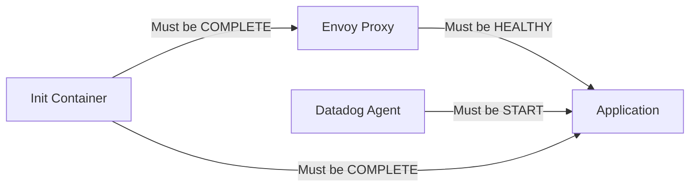

# How to Configure ECS Container Dependency Health Checks

Author: [nawazdhandala](https://github.com/nawazdhandala)

Tags: AWS, ECS, Health Checks, Container Dependencies, Docker, Microservices

Description: Learn how to configure container dependency health checks in Amazon ECS to ensure proper startup ordering and health verification for multi-container tasks.

---

When you run multi-container tasks in ECS, startup order matters. If your application container starts before the sidecar proxy is ready, or before the logging agent is initialized, you get connection errors and lost logs during the startup window. ECS container dependencies with health checks solve this by letting you define which containers must be healthy before others start.

This is different from service-level load balancer health checks. Container dependency health checks operate within a single task, controlling the startup sequence of containers that share a task definition.

## How Container Dependencies Work

An ECS task definition can have multiple containers. You can define dependencies between them, specifying that container B should only start after container A reaches a specific condition.



The conditions are:

| Condition | Meaning |
|---|---|
| START | Dependency container has started |
| COMPLETE | Dependency container has finished (exited with code 0) |
| SUCCESS | Same as COMPLETE |
| HEALTHY | Dependency container's health check is passing |

## Step 1: Define Container Health Checks

Health checks in ECS use the Docker HEALTHCHECK mechanism. You specify a command that ECS runs periodically. If the command exits with 0, the container is healthy.

```json
{
  "family": "web-app",
  "networkMode": "awsvpc",
  "containerDefinitions": [
    {
      "name": "envoy-proxy",
      "image": "envoyproxy/envoy:v1.28-latest",
      "essential": true,
      "portMappings": [
        {
          "containerPort": 8080,
          "protocol": "tcp"
        }
      ],
      "healthCheck": {
        "command": ["CMD-SHELL", "curl -f http://localhost:8001/ready || exit 1"],
        "interval": 5,
        "timeout": 3,
        "retries": 3,
        "startPeriod": 10
      },
      "logConfiguration": {
        "logDriver": "awslogs",
        "options": {
          "awslogs-group": "/ecs/web-app",
          "awslogs-region": "us-east-1",
          "awslogs-stream-prefix": "envoy"
        }
      }
    },
    {
      "name": "app",
      "image": "123456789012.dkr.ecr.us-east-1.amazonaws.com/web-app:latest",
      "essential": true,
      "dependsOn": [
        {
          "containerName": "envoy-proxy",
          "condition": "HEALTHY"
        }
      ],
      "portMappings": [
        {
          "containerPort": 3000,
          "protocol": "tcp"
        }
      ],
      "healthCheck": {
        "command": ["CMD-SHELL", "curl -f http://localhost:3000/health || exit 1"],
        "interval": 10,
        "timeout": 5,
        "retries": 3,
        "startPeriod": 30
      },
      "logConfiguration": {
        "logDriver": "awslogs",
        "options": {
          "awslogs-group": "/ecs/web-app",
          "awslogs-region": "us-east-1",
          "awslogs-stream-prefix": "app"
        }
      }
    }
  ]
}
```

Health check parameters:

- **command** - The command to run. `CMD-SHELL` runs it through the shell. `CMD` runs it directly.
- **interval** - Seconds between health checks (default 30, min 5)
- **timeout** - Seconds to wait for the health check to succeed (default 5)
- **retries** - Number of consecutive failures before marking unhealthy (default 3)
- **startPeriod** - Grace period before health checks start counting failures (default 0). This is critical for containers that take time to initialize.

## Step 2: Register the Task Definition

```bash
# Register the task definition
aws ecs register-task-definition \
  --cli-input-json file://task-definition.json
```

Or using the AWS CLI directly:

```bash
aws ecs register-task-definition \
  --family web-app \
  --network-mode awsvpc \
  --requires-compatibilities EC2 FARGATE \
  --cpu 512 \
  --memory 1024 \
  --execution-role-arn arn:aws:iam::123456789012:role/ecsTaskExecutionRole \
  --container-definitions '[
    {
      "name": "envoy-proxy",
      "image": "envoyproxy/envoy:v1.28-latest",
      "essential": true,
      "portMappings": [{"containerPort": 8080}],
      "healthCheck": {
        "command": ["CMD-SHELL", "curl -f http://localhost:8001/ready || exit 1"],
        "interval": 5,
        "timeout": 3,
        "retries": 3,
        "startPeriod": 10
      },
      "cpu": 128,
      "memory": 256
    },
    {
      "name": "app",
      "image": "123456789012.dkr.ecr.us-east-1.amazonaws.com/web-app:latest",
      "essential": true,
      "dependsOn": [{"containerName": "envoy-proxy", "condition": "HEALTHY"}],
      "portMappings": [{"containerPort": 3000}],
      "healthCheck": {
        "command": ["CMD-SHELL", "curl -f http://localhost:3000/health || exit 1"],
        "interval": 10,
        "timeout": 5,
        "retries": 3,
        "startPeriod": 30
      },
      "cpu": 384,
      "memory": 768
    }
  ]'
```

## Common Patterns

### Pattern 1: Init Container That Exits

Some tasks need a one-time initialization before the main containers start, like database migrations or config file generation.

```json
{
  "containerDefinitions": [
    {
      "name": "db-migrate",
      "image": "my-app:latest",
      "essential": false,
      "command": ["python", "manage.py", "migrate"],
      "logConfiguration": {
        "logDriver": "awslogs",
        "options": {
          "awslogs-group": "/ecs/web-app",
          "awslogs-region": "us-east-1",
          "awslogs-stream-prefix": "migrate"
        }
      }
    },
    {
      "name": "web",
      "image": "my-app:latest",
      "essential": true,
      "dependsOn": [
        {
          "containerName": "db-migrate",
          "condition": "SUCCESS"
        }
      ],
      "command": ["gunicorn", "app:app", "--bind", "0.0.0.0:8000"],
      "portMappings": [{"containerPort": 8000}],
      "healthCheck": {
        "command": ["CMD-SHELL", "curl -f http://localhost:8000/health || exit 1"],
        "interval": 10,
        "timeout": 5,
        "retries": 3,
        "startPeriod": 15
      }
    }
  ]
}
```

The `db-migrate` container is `essential: false`, meaning the task will not fail if it exits (which it will, after running the migration). The `SUCCESS` condition means the web container only starts after the migration exits successfully (exit code 0).

### Pattern 2: Sidecar Proxy (Service Mesh)

```json
{
  "containerDefinitions": [
    {
      "name": "envoy",
      "image": "envoyproxy/envoy:v1.28-latest",
      "essential": true,
      "healthCheck": {
        "command": ["CMD-SHELL", "curl -sf http://localhost:9901/ready"],
        "interval": 5,
        "timeout": 2,
        "retries": 3,
        "startPeriod": 5
      },
      "portMappings": [
        {"containerPort": 8080},
        {"containerPort": 9901}
      ]
    },
    {
      "name": "app",
      "image": "my-app:latest",
      "essential": true,
      "dependsOn": [
        {"containerName": "envoy", "condition": "HEALTHY"}
      ],
      "environment": [
        {"name": "UPSTREAM_URL", "value": "http://localhost:8080"}
      ]
    }
  ]
}
```

### Pattern 3: Application with Logging Sidecar

```json
{
  "containerDefinitions": [
    {
      "name": "fluentbit",
      "image": "public.ecr.aws/aws-observability/aws-for-fluent-bit:latest",
      "essential": true,
      "healthCheck": {
        "command": ["CMD-SHELL", "curl -f http://localhost:2020/api/v1/health || exit 1"],
        "interval": 10,
        "timeout": 5,
        "retries": 3,
        "startPeriod": 10
      }
    },
    {
      "name": "app",
      "image": "my-app:latest",
      "essential": true,
      "dependsOn": [
        {"containerName": "fluentbit", "condition": "HEALTHY"}
      ],
      "logConfiguration": {
        "logDriver": "fluentd",
        "options": {
          "fluentd-address": "localhost:24224"
        }
      }
    }
  ]
}
```

This ensures the Fluent Bit agent is healthy before the application starts, so no logs are lost during startup.

### Pattern 4: Multiple Dependencies

A container can depend on multiple other containers.

```json
{
  "name": "app",
  "dependsOn": [
    {"containerName": "envoy", "condition": "HEALTHY"},
    {"containerName": "datadog-agent", "condition": "HEALTHY"},
    {"containerName": "config-init", "condition": "SUCCESS"}
  ]
}
```

The app container only starts after envoy is healthy, the Datadog agent is healthy, and the config initializer has completed.

## Writing Good Health Check Commands

### HTTP Endpoint Check

```json
{
  "command": ["CMD-SHELL", "curl -f http://localhost:8080/health || exit 1"]
}
```

Make sure `curl` is installed in your container image. If it is not, use alternatives:

### wget Alternative

```json
{
  "command": ["CMD-SHELL", "wget -q --spider http://localhost:8080/health || exit 1"]
}
```

### Python Alternative (No curl/wget Needed)

```json
{
  "command": ["CMD-SHELL", "python3 -c \"import urllib.request; urllib.request.urlopen('http://localhost:8080/health')\" || exit 1"]
}
```

### TCP Port Check

```json
{
  "command": ["CMD-SHELL", "nc -z localhost 5432 || exit 1"]
}
```

### File-Based Check

```json
{
  "command": ["CMD-SHELL", "test -f /tmp/ready || exit 1"]
}
```

Your application writes `/tmp/ready` when it is done initializing.

## Tuning Health Check Parameters

### Fast Startup (Short startPeriod)

For containers that boot in seconds:
```json
{
  "interval": 5,
  "timeout": 3,
  "retries": 2,
  "startPeriod": 5
}
```

### Slow Startup (Long startPeriod)

For Java applications or containers that need to load large models:
```json
{
  "interval": 10,
  "timeout": 5,
  "retries": 5,
  "startPeriod": 120
}
```

The `startPeriod` is crucial. During this period, failed health checks do not count toward the retry limit. Set it long enough for your slowest cold start.

## Monitoring Container Health

```bash
# Check health status of containers in a task
aws ecs describe-tasks \
  --cluster my-cluster \
  --tasks <task-id> \
  --query 'tasks[0].containers[*].{Name:name,Health:healthStatus,LastStatus:lastStatus}'
```

Possible health statuses:
- **UNKNOWN** - No health check defined or not yet checked
- **HEALTHY** - Health check passing
- **UNHEALTHY** - Health check failing

## Troubleshooting

### Container Never Becomes HEALTHY

1. Check if the health check command works by running it manually inside the container:
```bash
docker exec -it <container-id> curl -f http://localhost:8080/health
```

2. Verify the `startPeriod` is long enough for your container to initialize

3. Check container logs for startup errors:
```bash
aws logs get-log-events \
  --log-group-name /ecs/web-app \
  --log-stream-name "envoy/<task-id>"
```

### Dependent Container Never Starts

If container B depends on container A being HEALTHY, but A never reaches HEALTHY status, B will never start. Check A's health check configuration and logs.

## Wrapping Up

Container dependency health checks give you reliable startup ordering in multi-container ECS tasks. The pattern is simple: define health checks on your infrastructure containers (proxies, agents, init containers), then make your application containers depend on them with the HEALTHY or SUCCESS condition. This eliminates race conditions during startup and ensures your application only begins serving traffic when all supporting infrastructure is ready. Get the `startPeriod` right for each container, and your multi-container tasks will start reliably every time.
