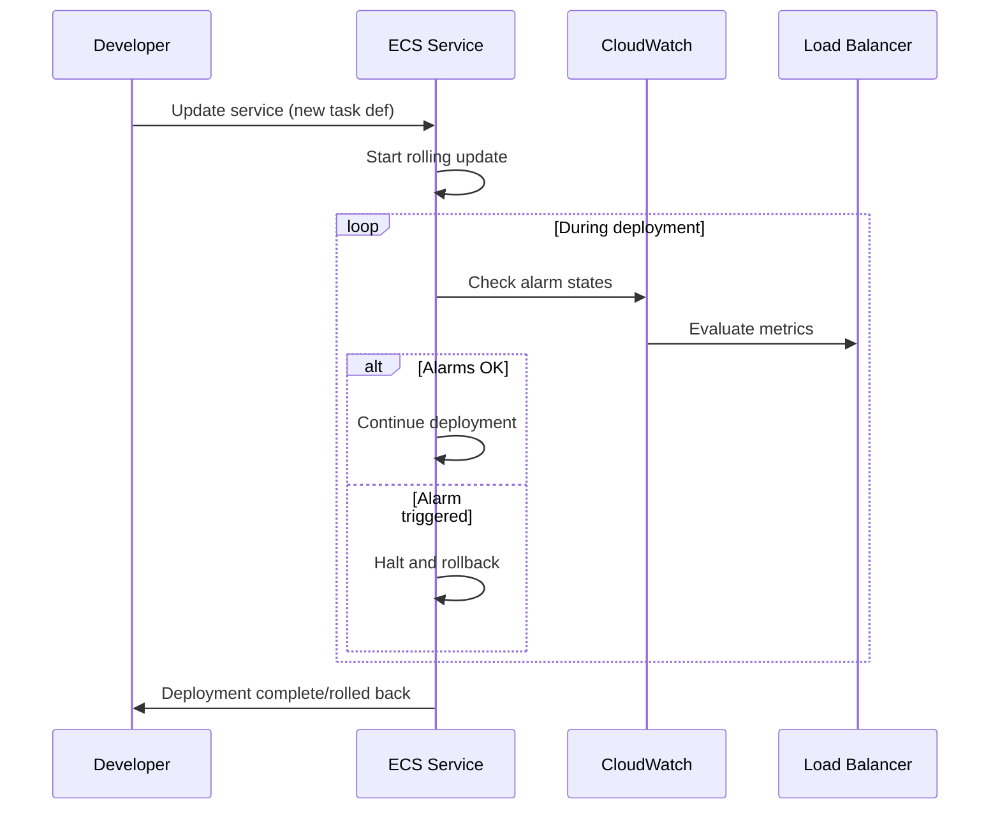

# How to Configure ECS Service Deployment Alarms

Author: [nawazdhandala](https://github.com/nawazdhandala)

Tags: AWS, ECS, CloudWatch, Alarms, Deployments, Monitoring

Description: Configure Amazon ECS service deployment alarms to automatically detect failed deployments and trigger rollbacks based on CloudWatch alarm states

---

ECS deployments can fail silently. New tasks might start, pass initial health checks, and then begin throwing errors, leaking memory, or responding slowly. Without deployment alarms, you might not notice the problem until customers start complaining. ECS service deployment alarms let you tie CloudWatch alarms to your deployment process, automatically rolling back if something goes wrong.

This feature, introduced as a complement to the deployment circuit breaker, gives you fine-grained control over what "healthy" means for your deployment. Let us set it up.

## How Deployment Alarms Work

When you configure deployment alarms on an ECS service, ECS monitors specified CloudWatch alarms during and after a deployment. If any of the alarms enter the ALARM state during the deployment, ECS considers the deployment failed and can automatically roll back.



## Step 1: Create CloudWatch Alarms

First, create the alarms that will monitor your deployment health. Common metrics to watch include HTTP error rates, response latency, and ECS task health.

### HTTP 5xx Error Rate Alarm

This alarm fires if your application starts returning too many server errors.

```bash
# Alarm for high HTTP 5xx error rate on ALB
aws cloudwatch put-metric-alarm \
  --alarm-name my-service-5xx-rate \
  --alarm-description "HTTP 5xx error rate exceeds 5% during deployment" \
  --namespace AWS/ApplicationELB \
  --metric-name HTTPCode_Target_5XX_Count \
  --dimensions \
    Name=TargetGroup,Value=targetgroup/my-service-tg/abc123 \
    Name=LoadBalancer,Value=app/my-alb/def456 \
  --statistic Sum \
  --period 60 \
  --threshold 10 \
  --comparison-operator GreaterThanThreshold \
  --evaluation-periods 2 \
  --datapoints-to-alarm 2 \
  --treat-missing-data notBreaching
```

### Response Latency Alarm

This alarm catches deployments that cause response time degradation.

```bash
# Alarm for high p99 latency
aws cloudwatch put-metric-alarm \
  --alarm-name my-service-high-latency \
  --alarm-description "P99 latency exceeds 2 seconds during deployment" \
  --namespace AWS/ApplicationELB \
  --metric-name TargetResponseTime \
  --dimensions \
    Name=TargetGroup,Value=targetgroup/my-service-tg/abc123 \
    Name=LoadBalancer,Value=app/my-alb/def456 \
  --extended-statistic p99 \
  --period 60 \
  --threshold 2.0 \
  --comparison-operator GreaterThanThreshold \
  --evaluation-periods 3 \
  --datapoints-to-alarm 2 \
  --treat-missing-data notBreaching
```

### Unhealthy Host Count Alarm

This catches scenarios where new tasks fail health checks.

```bash
# Alarm for unhealthy targets in the target group
aws cloudwatch put-metric-alarm \
  --alarm-name my-service-unhealthy-hosts \
  --alarm-description "Unhealthy host count exceeds threshold" \
  --namespace AWS/ApplicationELB \
  --metric-name UnHealthyHostCount \
  --dimensions \
    Name=TargetGroup,Value=targetgroup/my-service-tg/abc123 \
    Name=LoadBalancer,Value=app/my-alb/def456 \
  --statistic Maximum \
  --period 60 \
  --threshold 2 \
  --comparison-operator GreaterThanThreshold \
  --evaluation-periods 2 \
  --datapoints-to-alarm 2 \
  --treat-missing-data notBreaching
```

### Custom Application Metric Alarm

If your application pushes custom metrics, you can alarm on those too.

```bash
# Alarm for custom business metric - e.g., order failure rate
aws cloudwatch put-metric-alarm \
  --alarm-name my-service-order-failures \
  --alarm-description "Order processing failure rate too high" \
  --namespace MyApp \
  --metric-name OrderFailureRate \
  --statistic Average \
  --period 60 \
  --threshold 5.0 \
  --comparison-operator GreaterThanThreshold \
  --evaluation-periods 3 \
  --datapoints-to-alarm 2 \
  --treat-missing-data notBreaching
```

## Step 2: Configure Deployment Alarms on the ECS Service

Now attach these alarms to your ECS service deployment configuration.

```bash
# Update the service with deployment alarms
aws ecs update-service \
  --cluster my-cluster \
  --service my-service \
  --deployment-configuration '{
    "minimumHealthyPercent": 100,
    "maximumPercent": 200,
    "alarms": {
      "alarmNames": [
        "my-service-5xx-rate",
        "my-service-high-latency",
        "my-service-unhealthy-hosts"
      ],
      "enable": true,
      "rollback": true
    }
  }'
```

The `rollback: true` setting tells ECS to automatically roll back to the previous deployment if any alarm triggers. If you set it to `false`, the deployment is marked as failed but no rollback happens.

## Step 3: Create a Service with Deployment Alarms (New Service)

If you are creating a new service, include the alarms in the initial configuration.

```bash
# Create a new service with deployment alarms from the start
aws ecs create-service \
  --cluster my-cluster \
  --service-name my-service \
  --task-definition my-app:10 \
  --desired-count 4 \
  --launch-type FARGATE \
  --network-configuration "awsvpcConfiguration={subnets=[subnet-aaa,subnet-bbb],securityGroups=[sg-123]}" \
  --load-balancers "targetGroupArn=arn:aws:elasticloadbalancing:us-east-1:123456789:targetgroup/my-service-tg/abc123,containerName=app,containerPort=3000" \
  --deployment-configuration '{
    "minimumHealthyPercent": 100,
    "maximumPercent": 200,
    "deploymentCircuitBreaker": {
      "enable": true,
      "rollback": true
    },
    "alarms": {
      "alarmNames": [
        "my-service-5xx-rate",
        "my-service-high-latency",
        "my-service-unhealthy-hosts"
      ],
      "enable": true,
      "rollback": true
    }
  }'
```

Notice you can use both the deployment circuit breaker and deployment alarms together. The circuit breaker catches task-level failures (tasks that cannot start or keep crashing), while deployment alarms catch application-level issues (high error rates, slow responses).

## CloudFormation Configuration

```yaml
MyService:
  Type: AWS::ECS::Service
  Properties:
    Cluster: !Ref MyCluster
    ServiceName: my-service
    TaskDefinition: !Ref MyTaskDef
    DesiredCount: 4
    LaunchType: FARGATE
    NetworkConfiguration:
      AwsvpcConfiguration:
        Subnets:
          - !Ref SubnetA
          - !Ref SubnetB
        SecurityGroups:
          - !Ref ServiceSG
    LoadBalancers:
      - TargetGroupArn: !Ref TargetGroup
        ContainerName: app
        ContainerPort: 3000
    DeploymentConfiguration:
      MinimumHealthyPercent: 100
      MaximumPercent: 200
      DeploymentCircuitBreaker:
        Enable: true
        Rollback: true
      Alarms:
        AlarmNames:
          - !Ref ErrorRateAlarm
          - !Ref LatencyAlarm
          - !Ref UnhealthyHostAlarm
        Enable: true
        Rollback: true
```

## CDK Configuration

```typescript
import * as ecs from 'aws-cdk-lib/aws-ecs';
import * as cloudwatch from 'aws-cdk-lib/aws-cloudwatch';

// Create the alarms
const errorAlarm = new cloudwatch.Alarm(this, 'ErrorAlarm', {
  metric: targetGroup.metrics.httpCodeTarget(
    elbv2.HttpCodeTarget.TARGET_5XX_COUNT,
    { period: cdk.Duration.minutes(1) }
  ),
  threshold: 10,
  evaluationPeriods: 2,
  alarmName: 'my-service-5xx-rate',
  treatMissingData: cloudwatch.TreatMissingData.NOT_BREACHING,
});

const latencyAlarm = new cloudwatch.Alarm(this, 'LatencyAlarm', {
  metric: targetGroup.metrics.targetResponseTime({
    period: cdk.Duration.minutes(1),
    statistic: 'p99',
  }),
  threshold: 2.0,
  evaluationPeriods: 3,
  alarmName: 'my-service-high-latency',
  treatMissingData: cloudwatch.TreatMissingData.NOT_BREACHING,
});

// Create the service with deployment alarms
const service = new ecs.FargateService(this, 'Service', {
  cluster,
  taskDefinition: taskDef,
  desiredCount: 4,
  circuitBreaker: { rollback: true },
  deploymentAlarms: {
    alarmNames: [errorAlarm.alarmName, latencyAlarm.alarmName],
    behavior: ecs.AlarmBehavior.ROLLBACK_ON_ALARM,
  },
});
```

## Best Practices for Deployment Alarms

### Use treat-missing-data wisely

Set `treatMissingData` to `notBreaching` for deployment alarms. During deployment, there might be brief periods with no data (especially for new services), and you do not want that to trigger a rollback.

### Set appropriate evaluation periods

Do not make alarms too sensitive. A single data point above the threshold should not trigger a rollback. Use 2-3 evaluation periods with 2 datapoints-to-alarm to filter out transient spikes.

### Combine circuit breaker and deployment alarms

The circuit breaker catches fast failures (container crashes, health check failures). Deployment alarms catch slow-burn issues (performance degradation, increased error rates). Use both.

### Use composite alarms for complex conditions

If you want to roll back only when multiple metrics are bad simultaneously, create a composite alarm.

```bash
# Composite alarm: roll back only when BOTH 5xx errors AND latency are high
aws cloudwatch put-composite-alarm \
  --alarm-name my-service-deployment-health \
  --alarm-rule 'ALARM("my-service-5xx-rate") AND ALARM("my-service-high-latency")'
```

Then reference the composite alarm in your deployment configuration.

### Test your alarms before relying on them

Deliberately deploy a broken version to a staging environment and verify that:

1. The alarm triggers within your expected timeframe
2. The rollback actually happens
3. The service returns to a healthy state

## Monitoring Deployment Status

Track deployment progress and alarm states.

```bash
# Check the current deployment status
aws ecs describe-services \
  --cluster my-cluster \
  --services my-service \
  --query 'services[0].deployments[].{Id:id,Status:status,RolloutState:rolloutState,TaskDef:taskDefinition,Running:runningCount,Desired:desiredCount}'
```

The `rolloutState` will show `IN_PROGRESS`, `COMPLETED`, or `FAILED`. If a deployment alarm triggered a rollback, you will see the failed deployment and a new deployment rolling back to the previous task definition.

## Wrapping Up

Deployment alarms close the gap between "the container started" and "the application is actually working correctly." By connecting CloudWatch alarms to your ECS deployment process, you get automatic rollbacks when your application's actual behavior degrades, not just when containers crash. Combined with the deployment circuit breaker, this gives you a robust safety net for every deployment.

For more on ECS deployment strategies, see our guides on [rolling deployments for ECS](https://oneuptime.com/blog/post/rolling-deployments-ecs/view) and [ECS blue/green deployments with CodeDeploy](https://oneuptime.com/blog/post/ecs-blue-green-deployments-codedeploy/view).
