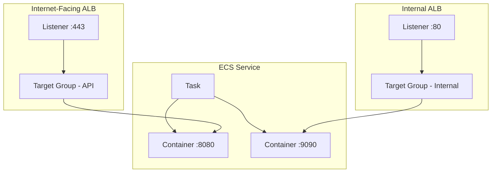

# How to Configure ECS Services with Multiple Load Balancer Target Groups

Author: [nawazdhandala](https://github.com/nawazdhandala)

Tags: AWS, ECS, Load Balancing, ALB, Target Groups, Networking

Description: Configure Amazon ECS services with multiple load balancer target groups to expose different ports and paths through separate listeners

---

Sometimes a single target group is not enough. Maybe your container exposes both an HTTP API on port 8080 and a gRPC endpoint on port 9090. Or maybe you need to register the same container with both an internal and an external load balancer. ECS supports attaching a service to multiple target groups, and once you understand how to set it up, it opens the door to some powerful networking patterns.

Let us walk through how to configure ECS services with multiple target groups, including real-world use cases and the gotchas you need to avoid.

## Why Multiple Target Groups?

Here are the most common scenarios where multiple target groups come in handy:

- **Multiple ports on one container**: Your app serves HTTP traffic on one port and health/metrics on another
- **Internal and external access**: Route public traffic through an internet-facing ALB and internal traffic through a private ALB
- **Blue/green deployments**: CodeDeploy uses two target groups to shift traffic between old and new task sets
- **Different routing rules**: Serve different path patterns to different target groups for independent scaling

## Architecture Overview



## Setting Up Multiple Target Groups with the AWS CLI

First, create your target groups. Each target group should point to the appropriate port on your container.

```bash
# Create the first target group for the API (port 8080)
aws elbv2 create-target-group \
  --name api-targets \
  --protocol HTTP \
  --port 8080 \
  --vpc-id vpc-abc123 \
  --target-type ip \
  --health-check-path /health \
  --health-check-interval-seconds 30

# Create the second target group for metrics (port 9090)
aws elbv2 create-target-group \
  --name metrics-targets \
  --protocol HTTP \
  --port 9090 \
  --vpc-id vpc-abc123 \
  --target-type ip \
  --health-check-path /metrics \
  --health-check-interval-seconds 30
```

Now create your ECS service with both target groups. The key is the `loadBalancers` array in the service definition - you can specify multiple entries.

```bash
# Create ECS service attached to both target groups
aws ecs create-service \
  --cluster my-cluster \
  --service-name my-multi-tg-service \
  --task-definition my-app:3 \
  --desired-count 2 \
  --launch-type FARGATE \
  --network-configuration "awsvpcConfiguration={subnets=[subnet-aaa,subnet-bbb],securityGroups=[sg-123],assignPublicIp=ENABLED}" \
  --load-balancers \
    "targetGroupArn=arn:aws:elasticloadbalancing:us-east-1:123456789:targetgroup/api-targets/abc123,containerName=app,containerPort=8080" \
    "targetGroupArn=arn:aws:elasticloadbalancing:us-east-1:123456789:targetgroup/metrics-targets/def456,containerName=app,containerPort=9090"
```

## Task Definition with Multiple Port Mappings

Your task definition needs to expose all the ports that your target groups will route to.

```json
{
  "family": "my-app",
  "networkMode": "awsvpc",
  "requiresCompatibilities": ["FARGATE"],
  "cpu": "512",
  "memory": "1024",
  "containerDefinitions": [
    {
      "name": "app",
      "image": "123456789.dkr.ecr.us-east-1.amazonaws.com/my-app:latest",
      "essential": true,
      "portMappings": [
        {
          "containerPort": 8080,
          "protocol": "tcp",
          "name": "api"
        },
        {
          "containerPort": 9090,
          "protocol": "tcp",
          "name": "metrics"
        }
      ],
      "logConfiguration": {
        "logDriver": "awslogs",
        "options": {
          "awslogs-group": "/ecs/my-app",
          "awslogs-region": "us-east-1",
          "awslogs-stream-prefix": "ecs"
        }
      }
    }
  ]
}
```

## CloudFormation Configuration

In CloudFormation, specify multiple entries in the `LoadBalancers` property of the ECS service.

```yaml
# Task definition with multiple port mappings
MyTaskDef:
  Type: AWS::ECS::TaskDefinition
  Properties:
    Family: my-app
    NetworkMode: awsvpc
    RequiresCompatibilities:
      - FARGATE
    Cpu: '512'
    Memory: '1024'
    ContainerDefinitions:
      - Name: app
        Image: !Sub '${AWS::AccountId}.dkr.ecr.${AWS::Region}.amazonaws.com/my-app:latest'
        Essential: true
        PortMappings:
          - ContainerPort: 8080
            Name: api
          - ContainerPort: 9090
            Name: metrics

# ECS service referencing both target groups
MyService:
  Type: AWS::ECS::Service
  DependsOn:
    - ApiListener
    - MetricsListener
  Properties:
    Cluster: !Ref MyCluster
    ServiceName: my-multi-tg-service
    TaskDefinition: !Ref MyTaskDef
    DesiredCount: 2
    LaunchType: FARGATE
    NetworkConfiguration:
      AwsvpcConfiguration:
        Subnets:
          - !Ref SubnetA
          - !Ref SubnetB
        SecurityGroups:
          - !Ref ServiceSG
    LoadBalancers:
      - TargetGroupArn: !Ref ApiTargetGroup
        ContainerName: app
        ContainerPort: 8080
      - TargetGroupArn: !Ref MetricsTargetGroup
        ContainerName: app
        ContainerPort: 9090
```

## CDK Configuration

CDK makes it cleaner with method chaining.

```typescript
// Create the ECS service
const service = new ecs.FargateService(this, 'Service', {
  cluster,
  taskDefinition: taskDef,
  desiredCount: 2,
});

// Register with the first target group (API on port 8080)
const apiListener = externalAlb.addListener('ApiListener', { port: 443 });
apiListener.addTargets('ApiTarget', {
  port: 8080,
  targets: [
    service.loadBalancerTarget({
      containerName: 'app',
      containerPort: 8080,
    }),
  ],
  healthCheck: {
    path: '/health',
  },
});

// Register with the second target group (metrics on port 9090)
const metricsListener = internalAlb.addListener('MetricsListener', { port: 80 });
metricsListener.addTargets('MetricsTarget', {
  port: 9090,
  targets: [
    service.loadBalancerTarget({
      containerName: 'app',
      containerPort: 9090,
    }),
  ],
  healthCheck: {
    path: '/metrics',
  },
});
```

## Use Case: Internal and External Load Balancers

A common pattern is exposing your API publicly while keeping admin or internal endpoints private.

```typescript
// Internet-facing ALB for public API
const publicAlb = new elbv2.ApplicationLoadBalancer(this, 'PublicALB', {
  vpc,
  internetFacing: true,
});

// Internal ALB for admin/internal traffic
const internalAlb = new elbv2.ApplicationLoadBalancer(this, 'InternalALB', {
  vpc,
  internetFacing: false,
});

// Both ALBs point to the same ECS service, different ports
const service = new ecs.FargateService(this, 'Service', {
  cluster,
  taskDefinition: taskDef,
  desiredCount: 3,
});

// Public traffic goes to port 8080
publicAlb.addListener('Public', { port: 443 }).addTargets('PublicTarget', {
  port: 8080,
  targets: [service.loadBalancerTarget({ containerName: 'app', containerPort: 8080 })],
});

// Internal traffic goes to port 8081 (admin endpoints)
internalAlb.addListener('Internal', { port: 80 }).addTargets('InternalTarget', {
  port: 8081,
  targets: [service.loadBalancerTarget({ containerName: 'app', containerPort: 8081 })],
});
```

## Important Limits and Gotchas

**Maximum target groups**: An ECS service can be associated with up to 5 target groups. If you need more, you will need to split into separate services.

**Cannot modify after creation**: You cannot change the load balancer configuration of an existing ECS service. To change target groups, you must delete and recreate the service. Plan your target group setup carefully.

**Health checks matter**: Each target group has its own health check. If any target group marks a task as unhealthy, ECS may stop that task and launch a replacement. Make sure all your health check paths actually work on their respective ports.

**Security group rules**: Your ECS task security group needs to allow inbound traffic on ALL ports that your target groups route to. Forgetting to open port 9090 for metrics while only opening 8080 is a common mistake.

## Monitoring Multiple Target Groups

When you have multiple target groups, monitoring becomes more important. Track the `HealthyHostCount` and `UnhealthyHostCount` for each target group independently. A health issue on one port should not necessarily take down traffic on another.

For comprehensive ECS monitoring, refer to our guide on [setting up CloudWatch Container Insights for ECS](https://oneuptime.com/blog/post/2026-02-12-cloudwatch-container-insights-ecs/view).

## Wrapping Up

Multiple target groups on an ECS service give you flexibility in how traffic reaches your containers. Whether you need to expose multiple ports, support both internal and external access, or set up blue/green deployments, the pattern is the same: define multiple port mappings in your task definition, create separate target groups, and attach them all to your ECS service. Just remember the 5 target group limit and the fact that you cannot change them after service creation.
