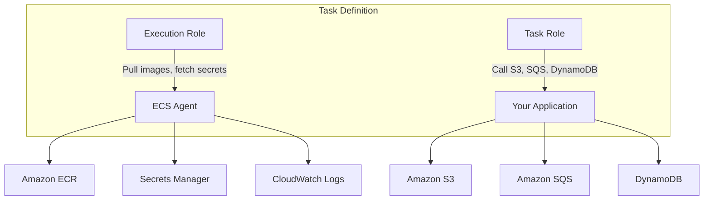

# How to Configure ECS Task IAM Roles

Author: [nawazdhandala](https://github.com/nawazdhandala)

Tags: AWS, ECS, IAM, Security, Containers

Description: Learn how to configure ECS task IAM roles to give your containers the exact AWS permissions they need, following the principle of least privilege.

---

Every ECS task needs to interact with AWS services at some point. Maybe it reads from an S3 bucket, publishes to an SNS topic, or queries DynamoDB. The question is: how does the container get permission to do that? The answer is the ECS task IAM role.

If you're coming from EC2, you might think of instance profiles. Task roles are the container equivalent - they provide temporary AWS credentials to your application without you having to manage access keys. But unlike instance profiles where every container on the host shares the same role, task roles are scoped per task definition. Your API service can have different permissions than your worker service, even when they run on the same EC2 host.

## Task Role vs. Execution Role

This distinction confuses almost everyone at first, so let's be clear:

- **Task Role** (`taskRoleArn`) - Permissions for your application code. If your app needs to call S3, SQS, DynamoDB, etc., those permissions go here.
- **Execution Role** (`executionRoleArn`) - Permissions for the ECS agent to set up the task. Pulling images from ECR, fetching secrets, writing logs. Your application code never uses this role directly.



For a focused look at execution roles, see our guide on [configuring ECS task execution roles](https://oneuptime.com/blog/post/2026-02-12-configure-ecs-task-execution-roles/view).

## Creating a Task Role

Start by creating an IAM role with a trust policy that allows ECS tasks to assume it.

```hcl
# Terraform - Create the task role
resource "aws_iam_role" "api_task_role" {
  name = "api-task-role"

  # Trust policy - allows ECS tasks to assume this role
  assume_role_policy = jsonencode({
    Version = "2012-10-17"
    Statement = [
      {
        Effect = "Allow"
        Principal = {
          Service = "ecs-tasks.amazonaws.com"
        }
        Action = "sts:AssumeRole"
      }
    ]
  })
}
```

The trust policy is critical. Without the `ecs-tasks.amazonaws.com` service principal, ECS can't assign this role to your tasks.

## Adding Permissions

Now attach policies that grant the specific permissions your application needs. Always follow least privilege - only grant what's needed.

```hcl
# Policy for an API service that reads from S3 and writes to SQS
resource "aws_iam_role_policy" "api_permissions" {
  name = "api-permissions"
  role = aws_iam_role.api_task_role.id

  policy = jsonencode({
    Version = "2012-10-17"
    Statement = [
      {
        Sid    = "ReadS3Assets"
        Effect = "Allow"
        Action = [
          "s3:GetObject",
          "s3:ListBucket"
        ]
        Resource = [
          "arn:aws:s3:::my-assets-bucket",
          "arn:aws:s3:::my-assets-bucket/*"
        ]
      },
      {
        Sid    = "PublishToQueue"
        Effect = "Allow"
        Action = [
          "sqs:SendMessage",
          "sqs:GetQueueUrl"
        ]
        Resource = "arn:aws:sqs:us-east-1:123456789:order-processing-queue"
      },
      {
        Sid    = "ReadWriteDynamoDB"
        Effect = "Allow"
        Action = [
          "dynamodb:GetItem",
          "dynamodb:PutItem",
          "dynamodb:UpdateItem",
          "dynamodb:Query"
        ]
        Resource = [
          "arn:aws:dynamodb:us-east-1:123456789:table/users",
          "arn:aws:dynamodb:us-east-1:123456789:table/users/index/*"
        ]
      }
    ]
  })
}
```

## Attaching the Role to a Task Definition

Reference the task role in your task definition using the `taskRoleArn` field.

```json
{
  "family": "api-service",
  "taskRoleArn": "arn:aws:iam::123456789:role/api-task-role",
  "executionRoleArn": "arn:aws:iam::123456789:role/ecsTaskExecutionRole",
  "networkMode": "awsvpc",
  "requiresCompatibilities": ["FARGATE"],
  "cpu": "512",
  "memory": "1024",
  "containerDefinitions": [
    {
      "name": "api",
      "image": "123456789.dkr.ecr.us-east-1.amazonaws.com/api:latest",
      "essential": true,
      "portMappings": [
        { "containerPort": 8080, "protocol": "tcp" }
      ]
    }
  ]
}
```

In Terraform:

```hcl
resource "aws_ecs_task_definition" "api" {
  family                   = "api-service"
  network_mode             = "awsvpc"
  requires_compatibilities = ["FARGATE"]
  cpu                      = 512
  memory                   = 1024

  # This is the role your application uses
  task_role_arn = aws_iam_role.api_task_role.arn

  # This is the role ECS uses to set up the task
  execution_role_arn = aws_iam_role.ecs_execution_role.arn

  container_definitions = jsonencode([
    {
      name      = "api"
      image     = "${var.ecr_repo_url}:latest"
      essential = true
      portMappings = [
        { containerPort = 8080, protocol = "tcp" }
      ]
    }
  ])
}
```

## How the SDK Picks Up Credentials

Your application code doesn't need to do anything special. The AWS SDK automatically discovers the task role credentials through the container metadata endpoint. Just use the SDK without specifying credentials.

```python
# Python - SDK automatically uses the task role
import boto3

# No credentials specified - SDK uses the task role
s3 = boto3.client('s3')
response = s3.get_object(Bucket='my-assets-bucket', Key='config.json')

sqs = boto3.client('sqs')
sqs.send_message(
    QueueUrl='https://sqs.us-east-1.amazonaws.com/123456789/order-processing-queue',
    MessageBody='{"orderId": "12345"}'
)
```

```javascript
// Node.js - Same idea, no credential configuration needed
const { S3Client, GetObjectCommand } = require('@aws-sdk/client-s3');

// Credentials come from the task role automatically
const s3 = new S3Client({ region: 'us-east-1' });
const result = await s3.send(new GetObjectCommand({
  Bucket: 'my-assets-bucket',
  Key: 'config.json'
}));
```

```go
// Go - Default credential chain includes ECS task role
cfg, err := config.LoadDefaultConfig(context.TODO(),
    config.WithRegion("us-east-1"),
)
if err != nil {
    log.Fatal(err)
}

client := s3.NewFromConfig(cfg)
output, err := client.GetObject(context.TODO(), &s3.GetObjectInput{
    Bucket: aws.String("my-assets-bucket"),
    Key:    aws.String("config.json"),
})
```

## Different Roles for Different Services

A big advantage of task roles is that each service gets its own permissions. Here's how you'd set up different roles for different services.

```hcl
# API service role - can read S3 and write to SQS
resource "aws_iam_role" "api_role" {
  name               = "api-task-role"
  assume_role_policy = data.aws_iam_policy_document.ecs_assume_role.json
}

resource "aws_iam_role_policy_attachment" "api_s3_read" {
  role       = aws_iam_role.api_role.name
  policy_arn = aws_iam_policy.s3_read.arn
}

# Worker service role - can read from SQS and write to S3
resource "aws_iam_role" "worker_role" {
  name               = "worker-task-role"
  assume_role_policy = data.aws_iam_policy_document.ecs_assume_role.json
}

resource "aws_iam_role_policy_attachment" "worker_sqs_read" {
  role       = aws_iam_role.worker_role.name
  policy_arn = aws_iam_policy.sqs_read.arn
}

resource "aws_iam_role_policy_attachment" "worker_s3_write" {
  role       = aws_iam_role.worker_role.name
  policy_arn = aws_iam_policy.s3_write.arn
}

# Shared trust policy
data "aws_iam_policy_document" "ecs_assume_role" {
  statement {
    effect  = "Allow"
    actions = ["sts:AssumeRole"]
    principals {
      type        = "Service"
      identifiers = ["ecs-tasks.amazonaws.com"]
    }
  }
}
```

## Restricting Role Assumption by Condition

For extra security, you can add conditions to the trust policy that restrict which ECS clusters or accounts can assume the role.

```hcl
resource "aws_iam_role" "restricted_task_role" {
  name = "restricted-task-role"

  assume_role_policy = jsonencode({
    Version = "2012-10-17"
    Statement = [
      {
        Effect = "Allow"
        Principal = {
          Service = "ecs-tasks.amazonaws.com"
        }
        Action = "sts:AssumeRole"
        Condition = {
          ArnLike = {
            "aws:SourceArn" = "arn:aws:ecs:us-east-1:123456789:*"
          }
          StringEquals = {
            "aws:SourceAccount" = "123456789"
          }
        }
      }
    ]
  })
}
```

## Debugging Permission Issues

When your application gets an "Access Denied" error, here's how to troubleshoot.

```bash
# Check what role the task is using
aws ecs describe-tasks \
  --cluster my-cluster \
  --tasks TASK_ID \
  --query 'tasks[0].taskDefinitionArn'

# Then check the task definition's role
aws ecs describe-task-definition \
  --task-definition TASK_DEF_ARN \
  --query 'taskDefinition.taskRoleArn'

# List the policies on that role
aws iam list-role-policies --role-name api-task-role
aws iam list-attached-role-policies --role-name api-task-role

# Simulate the permission to check if it would be allowed
aws iam simulate-principal-policy \
  --policy-source-arn arn:aws:iam::123456789:role/api-task-role \
  --action-names s3:GetObject \
  --resource-arns arn:aws:s3:::my-bucket/key.json
```

## Common Mistakes

**Using the EC2 instance role instead of a task role**: On EC2 launch type, if you don't set a task role, containers fall back to the EC2 instance role. This means every container on that host has the same permissions. Always set an explicit task role.

**Overly broad permissions**: Don't use `"Resource": "*"` unless you genuinely need access to all resources. Scope permissions to specific ARNs.

**Mixing up task role and execution role**: If you put S3 permissions on the execution role, your application won't be able to use them. Execution role is for ECS agent operations only.

**Forgetting the trust policy**: If the assume role policy doesn't include `ecs-tasks.amazonaws.com`, the task can't assume the role and will start without AWS credentials.

Task roles are fundamental to running secure ECS workloads. Take the time to craft specific policies for each service, and you'll have a much better security posture than throwing everything into a single broad role.
