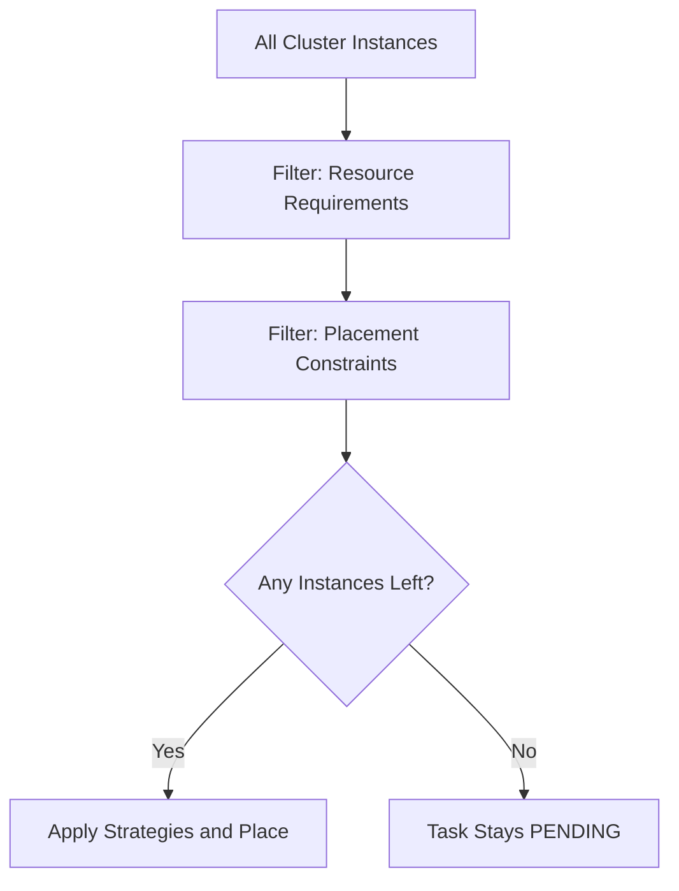

# How to Configure ECS Task Placement Constraints

Author: [nawazdhandala](https://github.com/nawazdhandala)

Tags: AWS, ECS, Task Placement, Constraints, Container Orchestration, EC2

Description: Learn how to use Amazon ECS task placement constraints to control which EC2 instances your containers run on based on instance attributes and custom metadata.

---

While placement strategies determine how ECS ranks instances, placement constraints are hard filters that determine which instances are even eligible to run your task. If an instance does not meet the constraint, it is excluded entirely. No exceptions.

This is useful when certain tasks need specific instance types, must run in particular availability zones, need GPU support, or should avoid running on the same instance as another task.

## How Constraints Work

Constraints are evaluated before strategies. When ECS needs to place a task, it:

1. Gets all instances in the cluster
2. Filters out instances that do not meet resource requirements (CPU, memory, ports)
3. Applies placement constraints to further filter instances
4. Applies placement strategies to rank remaining instances
5. Places the task

If no instances pass the constraints, the task stays in PENDING state.



## Constraint Types

ECS supports two constraint types:

### 1. distinctInstance

Ensures each task runs on a different container instance. No two tasks from the same service share an instance.

```bash
# Each task runs on its own instance
aws ecs create-service \
  --cluster my-cluster \
  --service-name isolated-service \
  --task-definition my-task:1 \
  --desired-count 4 \
  --placement-constraints '[
    {
      "type": "distinctInstance"
    }
  ]'
```

Use cases:
- Services where you need fault isolation (losing one instance loses one task max)
- Tasks that use all resources on an instance
- Licensing that requires one instance per application

### 2. memberOf

Uses a Cluster Query Language expression to filter instances based on attributes. This is the more powerful and flexible constraint type.

```bash
# Only place tasks on instances in us-east-1a
aws ecs create-service \
  --cluster my-cluster \
  --service-name zone-locked-service \
  --task-definition my-task:1 \
  --desired-count 3 \
  --placement-constraints '[
    {
      "type": "memberOf",
      "expression": "attribute:ecs.availability-zone == us-east-1a"
    }
  ]'
```

## Built-In Attributes

ECS provides several built-in attributes you can use in memberOf expressions:

| Attribute | Description | Example Values |
|---|---|---|
| ecs.availability-zone | AZ of the instance | us-east-1a, us-east-1b |
| ecs.instance-type | EC2 instance type | m5.xlarge, c5.2xlarge |
| ecs.os-type | Operating system | linux, windows |
| ecs.os-family | OS family | LINUX, WINDOWS_SERVER_2019_FULL |
| ecs.cpu-architecture | CPU architecture | x86_64, arm64 |
| ecs.ami-id | AMI ID of the instance | ami-0abc123 |

## Common Constraint Patterns

### Run Only on Specific Instance Types

```bash
# Only use GPU instances
aws ecs create-service \
  --cluster my-cluster \
  --service-name gpu-service \
  --task-definition ml-inference:1 \
  --desired-count 4 \
  --placement-constraints '[
    {
      "type": "memberOf",
      "expression": "attribute:ecs.instance-type =~ g5.*"
    }
  ]'
```

The `=~` operator supports pattern matching. `g5.*` matches g5.xlarge, g5.2xlarge, etc.

### Run Only on ARM (Graviton) Instances

```bash
# Target Graviton instances
aws ecs create-service \
  --cluster my-cluster \
  --service-name arm-service \
  --task-definition arm-app:1 \
  --desired-count 6 \
  --placement-constraints '[
    {
      "type": "memberOf",
      "expression": "attribute:ecs.cpu-architecture == arm64"
    }
  ]'
```

### Avoid a Specific AZ

```bash
# Run anywhere except us-east-1c (maybe it has capacity issues)
aws ecs create-service \
  --cluster my-cluster \
  --service-name avoid-az-service \
  --task-definition my-task:1 \
  --desired-count 4 \
  --placement-constraints '[
    {
      "type": "memberOf",
      "expression": "attribute:ecs.availability-zone != us-east-1c"
    }
  ]'
```

## Custom Attributes

You can define custom attributes on container instances and use them in constraints. This is powerful for tagging instances with your own metadata.

### Set Custom Attributes

```bash
# Add a custom attribute to an instance
aws ecs put-attributes \
  --cluster my-cluster \
  --attributes '[
    {
      "name": "environment",
      "value": "production",
      "targetType": "container-instance",
      "targetId": "arn:aws:ecs:us-east-1:123456789012:container-instance/my-cluster/abc123"
    }
  ]'

# Add multiple attributes
aws ecs put-attributes \
  --cluster my-cluster \
  --attributes '[
    {
      "name": "team",
      "value": "data-engineering",
      "targetType": "container-instance",
      "targetId": "arn:aws:ecs:us-east-1:123456789012:container-instance/my-cluster/abc123"
    },
    {
      "name": "has-local-ssd",
      "value": "true",
      "targetType": "container-instance",
      "targetId": "arn:aws:ecs:us-east-1:123456789012:container-instance/my-cluster/abc123"
    }
  ]'
```

### Use Custom Attributes in Constraints

```bash
# Only place on production instances
aws ecs create-service \
  --cluster my-cluster \
  --service-name prod-service \
  --task-definition prod-app:1 \
  --desired-count 4 \
  --placement-constraints '[
    {
      "type": "memberOf",
      "expression": "attribute:environment == production"
    }
  ]'

# Only place on instances with local SSD storage
aws ecs create-service \
  --cluster my-cluster \
  --service-name data-processor \
  --task-definition data-proc:1 \
  --desired-count 8 \
  --placement-constraints '[
    {
      "type": "memberOf",
      "expression": "attribute:has-local-ssd == true"
    }
  ]'
```

### Auto-Set Custom Attributes at Instance Launch

Use user data to set custom attributes when instances join the cluster.

```bash
#!/bin/bash
# User data script for ECS instances
echo ECS_CLUSTER=my-cluster >> /etc/ecs/ecs.config
echo ECS_INSTANCE_ATTRIBUTES='{"environment":"production","team":"platform","gpu":"true"}' >> /etc/ecs/ecs.config
```

## Combining Constraints

You can use multiple constraints together. All must be satisfied.

```bash
# Must be on GPU instances in production environment, one task per instance
aws ecs create-service \
  --cluster my-cluster \
  --service-name ml-inference \
  --task-definition inference:1 \
  --desired-count 4 \
  --placement-constraints '[
    {
      "type": "distinctInstance"
    },
    {
      "type": "memberOf",
      "expression": "attribute:ecs.instance-type =~ g5.*"
    },
    {
      "type": "memberOf",
      "expression": "attribute:environment == production"
    }
  ]'
```

## Combining Constraints with Strategies

Constraints filter first, then strategies rank the remaining options.

```bash
# Constraint: only GPU instances
# Strategy: spread across AZs, then binpack by memory
aws ecs create-service \
  --cluster my-cluster \
  --service-name gpu-workload \
  --task-definition gpu-app:1 \
  --desired-count 8 \
  --placement-constraints '[
    {
      "type": "memberOf",
      "expression": "attribute:ecs.instance-type =~ g5.*"
    }
  ]' \
  --placement-strategy '[
    {"type": "spread", "field": "attribute:ecs.availability-zone"},
    {"type": "binpack", "field": "memory"}
  ]'
```

For a detailed guide on strategies, see [configuring ECS task placement strategies](https://oneuptime.com/blog/post/configure-ecs-task-placement-strategies/view).

## Cluster Query Language Reference

The expression syntax for memberOf constraints supports:

| Operator | Meaning | Example |
|---|---|---|
| == | Equals | `attribute:ecs.os-type == linux` |
| != | Not equals | `attribute:ecs.availability-zone != us-east-1c` |
| > | Greater than | `attribute:custom-priority > 5` |
| >= | Greater than or equal | `attribute:custom-priority >= 5` |
| < | Less than | `attribute:custom-priority < 10` |
| <= | Less than or equal | `attribute:custom-priority <= 10` |
| =~ | Pattern match | `attribute:ecs.instance-type =~ m5.*` |
| in | Set membership | `attribute:ecs.availability-zone in [us-east-1a, us-east-1b]` |
| not | Negation | `not(attribute:environment == staging)` |
| and | Logical AND | `attribute:team == ml and attribute:gpu == true` |
| or | Logical OR | `attribute:ecs.instance-type == g5.xlarge or attribute:ecs.instance-type == g5.2xlarge` |
| exists | Attribute exists | `attribute:gpu exists` |

## Complex Expression Examples

```bash
# GPU instances in production, in specific AZs
aws ecs create-service \
  --cluster my-cluster \
  --service-name complex-constraint \
  --task-definition my-task:1 \
  --desired-count 4 \
  --placement-constraints '[
    {
      "type": "memberOf",
      "expression": "attribute:ecs.instance-type =~ g5.* and attribute:environment == production and attribute:ecs.availability-zone in [us-east-1a, us-east-1b]"
    }
  ]'
```

## Terraform Configuration

```hcl
resource "aws_ecs_service" "gpu_service" {
  name            = "gpu-service"
  cluster         = aws_ecs_cluster.main.id
  task_definition = aws_ecs_task_definition.gpu_app.arn
  desired_count   = 4

  placement_constraints {
    type       = "distinctInstance"
  }

  placement_constraints {
    type       = "memberOf"
    expression = "attribute:ecs.instance-type =~ g5.*"
  }

  ordered_placement_strategy {
    type  = "spread"
    field = "attribute:ecs.availability-zone"
  }
}
```

## Troubleshooting Constraint Issues

If tasks are stuck in PENDING, constraints might be too restrictive.

```bash
# List all instances and their attributes
aws ecs list-container-instances --cluster my-cluster --query 'containerInstanceArns'

# Get details of each instance including attributes
aws ecs describe-container-instances \
  --cluster my-cluster \
  --container-instances arn:aws:ecs:us-east-1:123456789012:container-instance/my-cluster/abc123 \
  --query 'containerInstances[0].{
    InstanceType: attributes[?name==`ecs.instance-type`].value | [0],
    AZ: attributes[?name==`ecs.availability-zone`].value | [0],
    CustomAttrs: attributes[?!starts_with(name, `ecs.`)].{Name:name,Value:value}
  }'
```

## Wrapping Up

Placement constraints give you hard control over where ECS tasks run. Use `distinctInstance` when tasks need isolation, and `memberOf` with the Cluster Query Language for everything else. Custom attributes are particularly powerful because they let you tag instances with your own business logic (team ownership, environment, capabilities) and then use those tags in placement decisions. Just be careful not to over-constrain your service, because if no instances match all your constraints, tasks will never be placed.
