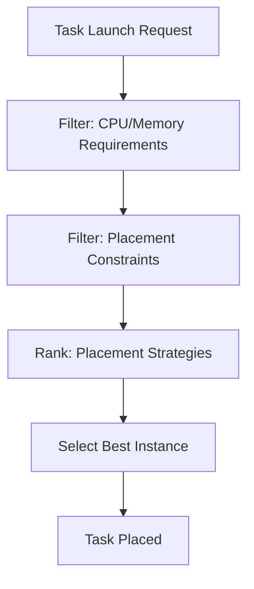

# How to Configure ECS Task Placement Strategies

Author: [nawazdhandala](https://github.com/nawazdhandala)

Tags: AWS, ECS, Task Placement, Container Orchestration, EC2, Cluster Management

Description: Learn how to configure Amazon ECS task placement strategies to optimize resource utilization, availability, and cost across your container cluster.

---

When you run ECS tasks on EC2 instances (not Fargate), you have control over where tasks get placed in your cluster. By default, ECS spreads tasks across instances, but that might not be what you want. Maybe you want to pack tasks tightly to minimize the number of instances, or spread them across availability zones for high availability, or place specific tasks on instances with certain attributes.

ECS task placement strategies give you this control. They tell the scheduler how to select instances for your tasks.

## How Task Placement Works

When you run a task or create a service, ECS goes through these steps:

1. Identifies instances that meet the task's CPU, memory, and port requirements
2. Applies placement constraints to filter out ineligible instances
3. Applies placement strategies to rank the remaining instances
4. Places the task on the highest-ranked instance



Placement strategies are about ranking and selection. Placement constraints are about hard filtering. This post focuses on strategies. For constraints, see our guide on [configuring ECS task placement constraints](https://oneuptime.com/blog/post/configure-ecs-task-placement-constraints/view).

## The Three Placement Strategy Types

### 1. spread - Distribute Tasks Evenly

The `spread` strategy distributes tasks evenly across a specified field. The most common fields are `attribute:ecs.availability-zone` and `instanceId`.

```bash
# Create a service that spreads tasks across AZs
aws ecs create-service \
  --cluster my-cluster \
  --service-name web-api \
  --task-definition web-api:5 \
  --desired-count 6 \
  --placement-strategy '[
    {
      "type": "spread",
      "field": "attribute:ecs.availability-zone"
    }
  ]'
```

With 6 tasks and 3 AZs, this places 2 tasks in each AZ. If one AZ goes down, you lose only 2 of 6 tasks instead of potentially all of them.

You can also spread across instances:

```bash
# Spread tasks across individual instances (one task per instance)
aws ecs create-service \
  --cluster my-cluster \
  --service-name worker \
  --task-definition worker:3 \
  --desired-count 10 \
  --placement-strategy '[
    {
      "type": "spread",
      "field": "instanceId"
    }
  ]'
```

### 2. binpack - Pack Tasks Tightly

The `binpack` strategy places tasks on instances with the least available amount of the specified resource (CPU or memory). This fills up instances before using new ones, minimizing the number of active instances and reducing costs.

```bash
# Pack tasks tightly by memory
aws ecs create-service \
  --cluster my-cluster \
  --service-name batch-processor \
  --task-definition batch-processor:2 \
  --desired-count 20 \
  --placement-strategy '[
    {
      "type": "binpack",
      "field": "memory"
    }
  ]'
```

With binpack, if you have 10 instances and your tasks are small, ECS might fit all 20 tasks on 3-4 instances, leaving the rest idle. With cluster auto-scaling, those idle instances would eventually be terminated, saving money.

```bash
# Pack by CPU utilization
aws ecs create-service \
  --cluster my-cluster \
  --service-name cpu-intensive-service \
  --task-definition cpu-worker:1 \
  --desired-count 15 \
  --placement-strategy '[
    {
      "type": "binpack",
      "field": "cpu"
    }
  ]'
```

### 3. random - Place Randomly

The `random` strategy picks an instance at random from the eligible ones. It is simple but does not optimize for anything.

```bash
# Place tasks randomly
aws ecs create-service \
  --cluster my-cluster \
  --service-name dev-service \
  --task-definition dev-app:1 \
  --desired-count 5 \
  --placement-strategy '[
    {
      "type": "random"
    }
  ]'
```

Random is useful when you have no particular preference and just want tasks distributed without any specific pattern.

## Combining Multiple Strategies

You can chain up to 5 strategies. They are evaluated in order - the first strategy is the primary sorting criterion, and subsequent strategies break ties.

### Spread Across AZs, Then Binpack Within Each AZ

This is the most common production pattern. It gives you high availability (tasks spread across AZs) while still being cost-efficient (tasks packed tightly within each AZ).

```bash
# Best practice: spread across AZs, then binpack by memory
aws ecs create-service \
  --cluster my-cluster \
  --service-name production-api \
  --task-definition api:10 \
  --desired-count 12 \
  --placement-strategy '[
    {
      "type": "spread",
      "field": "attribute:ecs.availability-zone"
    },
    {
      "type": "binpack",
      "field": "memory"
    }
  ]'
```

Here is what happens: ECS first sorts instances by AZ to spread tasks evenly. When multiple instances are in the same AZ (tied on the first strategy), it uses binpack to pick the fullest instance. The result is even distribution across AZs with tight packing within each AZ.

### Spread Across AZs, Then Spread Across Instances

This maximizes availability by distributing tasks across both AZs and instances.

```bash
# Maximum availability: spread across AZs and instances
aws ecs create-service \
  --cluster my-cluster \
  --service-name critical-service \
  --task-definition critical:3 \
  --desired-count 6 \
  --placement-strategy '[
    {
      "type": "spread",
      "field": "attribute:ecs.availability-zone"
    },
    {
      "type": "spread",
      "field": "instanceId"
    }
  ]'
```

## Strategy Comparison

| Strategy | Availability | Cost Efficiency | Use Case |
|---|---|---|---|
| spread (AZ) | High | Medium | Production services |
| spread (instance) | Very High | Low | Critical services |
| binpack (memory) | Low | High | Batch processing, dev environments |
| binpack (cpu) | Low | High | CPU-intensive batch jobs |
| spread + binpack | High | High | Best general-purpose option |
| random | Medium | Medium | Testing, non-critical services |

## Applying Strategies to Run Tasks

Placement strategies work for both services (long-running) and run-task (one-off).

```bash
# Run a one-off task with placement strategy
aws ecs run-task \
  --cluster my-cluster \
  --task-definition data-migration:1 \
  --count 4 \
  --placement-strategy '[
    {
      "type": "spread",
      "field": "attribute:ecs.availability-zone"
    }
  ]'
```

## Updating Placement Strategy on Existing Services

You cannot change the placement strategy of an existing service directly. You need to create a new service with the desired strategy or use the force-new-deployment option (which reapplies the strategy to new task placements, but does not move existing tasks).

```bash
# Create a new version of the service with updated strategy
aws ecs update-service \
  --cluster my-cluster \
  --service production-api \
  --placement-strategy '[
    {
      "type": "spread",
      "field": "attribute:ecs.availability-zone"
    },
    {
      "type": "binpack",
      "field": "memory"
    }
  ]' \
  --force-new-deployment
```

## Terraform Configuration

For infrastructure-as-code, here is how to define placement strategies in Terraform:

```hcl
resource "aws_ecs_service" "production_api" {
  name            = "production-api"
  cluster         = aws_ecs_cluster.main.id
  task_definition = aws_ecs_task_definition.api.arn
  desired_count   = 12

  ordered_placement_strategy {
    type  = "spread"
    field = "attribute:ecs.availability-zone"
  }

  ordered_placement_strategy {
    type  = "binpack"
    field = "memory"
  }
}
```

The `ordered_placement_strategy` blocks are evaluated in the order they appear.

## Real-World Patterns

### Web Application (High Availability + Cost Efficiency)

```bash
# Spread across AZs, binpack by memory within AZ
aws ecs create-service \
  --cluster production \
  --service-name web-app \
  --task-definition web-app:latest \
  --desired-count 8 \
  --placement-strategy '[
    {"type": "spread", "field": "attribute:ecs.availability-zone"},
    {"type": "binpack", "field": "memory"}
  ]'
```

### Background Workers (Cost Efficiency Priority)

```bash
# Binpack aggressively to minimize instance count
aws ecs create-service \
  --cluster production \
  --service-name background-worker \
  --task-definition worker:latest \
  --desired-count 20 \
  --placement-strategy '[
    {"type": "binpack", "field": "memory"}
  ]'
```

### Stateful Service (Instance Isolation)

```bash
# Spread across instances so each task runs alone
aws ecs create-service \
  --cluster production \
  --service-name cache-node \
  --task-definition cache:latest \
  --desired-count 3 \
  --placement-strategy '[
    {"type": "spread", "field": "instanceId"}
  ]'
```

## How Strategies Interact with Auto-Scaling

When using binpack, cluster auto-scaling becomes more efficient. Tasks pack onto fewer instances, so idle instances are detected and terminated faster. With spread, auto-scaling needs to maintain instances across all AZs even if some are underutilized.

For more on auto-scaling, see our guide on [using ECS capacity provider auto-scaling](https://oneuptime.com/blog/post/use-ecs-capacity-provider-auto-scaling/view).

## Wrapping Up

Task placement strategies are a simple but powerful lever for optimizing your ECS cluster. The spread-then-binpack pattern is the right default for most production workloads because it balances availability and cost. Use pure binpack for cost-sensitive batch workloads, and pure spread for maximum availability on critical services. The key is to be intentional about placement rather than relying on the default, because the default may not align with your priorities.
