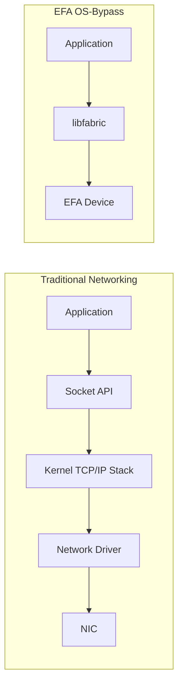

# How to Configure EFA (Elastic Fabric Adapter) for HPC

Author: [nawazdhandala](https://github.com/nawazdhandala)

Tags: AWS, EFA, HPC, MPI, Networking, EC2, High Performance Computing

Description: Complete guide to configuring AWS Elastic Fabric Adapter for low-latency inter-node communication in HPC and machine learning workloads on EC2.

---

When you are running tightly coupled HPC workloads on AWS - think MPI-based simulations, distributed deep learning, or anything where nodes need to exchange data at high speed - standard TCP networking introduces too much latency. Elastic Fabric Adapter (EFA) is an AWS network interface that provides OS-bypass capabilities, letting your applications communicate directly with the network hardware without going through the kernel networking stack.

This means latency drops from microseconds to single-digit microseconds, and bandwidth gets close to the theoretical maximum of the instance type. For MPI workloads, the difference can be night and day.

## What Is EFA?

EFA is a network device you attach to an EC2 instance. It supports two modes:

1. **Standard networking** - Works like any Elastic Network Interface (ENI) for regular TCP/IP traffic
2. **EFA mode** - Provides OS-bypass using the libfabric API, similar to how InfiniBand works in traditional HPC clusters

The OS-bypass mode is what makes EFA special. Applications using libfabric (or libraries built on top of it, like OpenMPI) can send and receive data without going through the kernel's TCP/IP stack, cutting latency dramatically.



## EFA-Supported Instance Types

Not every EC2 instance supports EFA. Here are the key ones for HPC:

| Instance | EFA Bandwidth | GPUs | Best For |
|---|---|---|---|
| hpc6a.48xlarge | 100 Gbps | None | CPU-bound HPC |
| hpc7g.16xlarge | 200 Gbps | None | ARM-based HPC |
| c5n.18xlarge | 100 Gbps | None | Network-intensive compute |
| p4d.24xlarge | 400 Gbps | 8x A100 | Distributed ML training |
| p5.48xlarge | 3200 Gbps | 8x H100 | Large-scale ML training |
| trn1.32xlarge | 800 Gbps | 16 Trainium | ML training |
| g5.48xlarge | 100 Gbps | 8x A10G | ML inference/training |

## Step 1: Create a Security Group for EFA

EFA requires a security group that allows all traffic between instances in the group. This is because EFA uses its own protocol that does not fit neatly into standard TCP/UDP rules.

```bash
# Create a security group for EFA
EFA_SG=$(aws ec2 create-security-group \
  --group-name efa-hpc-sg \
  --description "Security group for EFA-enabled HPC instances" \
  --vpc-id vpc-0abc123 \
  --query 'GroupId' --output text)

# Allow all traffic from instances in the same security group
aws ec2 authorize-security-group-ingress \
  --group-id $EFA_SG \
  --protocol -1 \
  --source-group $EFA_SG

# Allow SSH from your IP
aws ec2 authorize-security-group-ingress \
  --group-id $EFA_SG \
  --protocol tcp \
  --port 22 \
  --cidr $(curl -s https://checkip.amazonaws.com)/32

echo "EFA Security Group: $EFA_SG"
```

The key rule is `--protocol -1 --source-group $EFA_SG` which allows all traffic between members of the security group. Without this, EFA communication between instances will fail.

## Step 2: Create a Placement Group

For minimum latency, instances should be in a cluster placement group, which puts them on physically close hardware.

```bash
# Create a cluster placement group
aws ec2 create-placement-group \
  --group-name hpc-cluster-pg \
  --strategy cluster
```

## Step 3: Launch EFA-Enabled Instances

```bash
# Launch an EFA-enabled instance
aws ec2 run-instances \
  --image-id ami-0abc123 \
  --instance-type hpc6a.48xlarge \
  --count 4 \
  --key-name my-hpc-key \
  --placement "GroupName=hpc-cluster-pg" \
  --network-interfaces '[
    {
      "DeviceIndex": 0,
      "SubnetId": "subnet-0abc123",
      "Groups": ["'$EFA_SG'"],
      "InterfaceType": "efa"
    }
  ]' \
  --tag-specifications 'ResourceType=instance,Tags=[{Key=Name,Value=hpc-node}]'
```

The critical part is `"InterfaceType": "efa"` in the network interface configuration. This tells AWS to attach an EFA device instead of a standard ENI.

## Step 4: Install EFA Software

SSH into each instance and install the EFA driver and supporting libraries.

```bash
# Download and install the EFA installer
curl -O https://efa-installer.amazonaws.com/aws-efa-installer-latest.tar.gz
tar -xf aws-efa-installer-latest.tar.gz
cd aws-efa-installer

# Install EFA with MPI support
sudo ./efa_installer.sh -y

# Verify the installation
fi_info -p efa
# Should show: provider: efa
# If it shows only "sockets" or "tcp", EFA is not working

# Check EFA device is present
/opt/amazon/efa/bin/fi_info -p efa -t FI_EP_RDM
```

The installer sets up:
- EFA kernel driver
- libfabric with the EFA provider
- Open MPI compiled with EFA support
- AWS OFI NCCL (for GPU workloads using NCCL)

## Step 5: Configure OpenMPI for EFA

The EFA installer includes a pre-built OpenMPI. Use it instead of a system-installed version.

```bash
# Add EFA OpenMPI to your environment
export PATH=/opt/amazon/openmpi/bin:$PATH
export LD_LIBRARY_PATH=/opt/amazon/openmpi/lib:$LD_LIBRARY_PATH

# Verify MPI is using EFA
ompi_info --parsable --all | grep mtl
# Should show: mtl:ofi (the OFI module that uses libfabric/EFA)

# Verify MPI can see EFA
ompi_info --parsable --all | grep btl
```

## Step 6: Run an EFA Benchmark

Test that EFA is working correctly with a latency and bandwidth test.

```bash
# Create a hostfile with your instance IPs
cat > hostfile << EOF
10.0.1.10 slots=96
10.0.1.11 slots=96
10.0.1.12 slots=96
10.0.1.13 slots=96
EOF

# Run the OSU MPI latency benchmark
mpirun --hostfile hostfile \
  -np 2 \
  --map-by ppr:1:node \
  -x FI_PROVIDER=efa \
  -x FI_EFA_USE_DEVICE_RDMA=1 \
  /opt/amazon/openmpi/tests/osu-micro-benchmarks/mpi/pt2pt/osu_latency

# Run the bandwidth benchmark
mpirun --hostfile hostfile \
  -np 2 \
  --map-by ppr:1:node \
  -x FI_PROVIDER=efa \
  -x FI_EFA_USE_DEVICE_RDMA=1 \
  /opt/amazon/openmpi/tests/osu-micro-benchmarks/mpi/pt2pt/osu_bw
```

Expected results for hpc6a.48xlarge:
- Latency: ~15-20 microseconds for small messages
- Bandwidth: ~12 GB/s (close to the 100 Gbps theoretical maximum)

Without EFA (using TCP), you would see:
- Latency: ~50-80 microseconds
- Bandwidth: ~3-5 GB/s

## Step 7: Run Your HPC Application with EFA

```bash
# Run a real MPI application across 4 nodes
mpirun --hostfile hostfile \
  -np 384 \
  --map-by ppr:96:node \
  --bind-to core \
  -x FI_PROVIDER=efa \
  -x FI_EFA_USE_DEVICE_RDMA=1 \
  -x LD_LIBRARY_PATH \
  /path/to/your/mpi_application --input simulation.dat
```

Key MPI flags for EFA:

- `-x FI_PROVIDER=efa` - Tells libfabric to use the EFA provider
- `-x FI_EFA_USE_DEVICE_RDMA=1` - Enables RDMA for better performance on supported instances
- `--map-by ppr:96:node` - Places 96 processes per node (matching vCPU count)
- `--bind-to core` - Pins each process to a CPU core to prevent migration

## EFA with NCCL for GPU Workloads

For distributed deep learning with NVIDIA GPUs, you need the AWS OFI NCCL plugin to route NCCL communication through EFA.

```bash
# The EFA installer includes the NCCL plugin
# Set these environment variables in your training script
export FI_PROVIDER=efa
export FI_EFA_USE_DEVICE_RDMA=1
export NCCL_ALGO=Ring
export NCCL_PROTO=simple

# For PyTorch distributed training
torchrun --nproc_per_node=8 --nnodes=4 --node_rank=0 \
  --master_addr=10.0.1.10 --master_port=29500 \
  train.py --distributed
```

For more on GPU workloads, see our guide on [using EC2 P5 instances for AI/ML training](https://oneuptime.com/blog/post/use-amazon-ec2-p5-instances-for-aiml-training/view).

## EFA with AWS ParallelCluster

If you use ParallelCluster, enabling EFA is simple. See our [ParallelCluster setup guide](https://oneuptime.com/blog/post/set-up-aws-parallelcluster-for-hpc/view) for the full setup, and add EFA support to your queue:

```yaml
SlurmQueues:
  - Name: efa-compute
    ComputeResources:
      - Name: hpc6a
        InstanceType: hpc6a.48xlarge
        MinCount: 0
        MaxCount: 32
        Efa:
          Enabled: true
    Networking:
      SubnetIds:
        - subnet-0abc123
      PlacementGroup:
        Enabled: true
```

ParallelCluster handles all the EFA driver installation and MPI configuration automatically.

## Troubleshooting

- **fi_info shows no EFA provider** - The EFA kernel module might not be loaded. Run `sudo modprobe efa` and check `dmesg` for errors.
- **MPI hangs on inter-node communication** - Check the security group allows all traffic between instances.
- **Performance lower than expected** - Make sure instances are in a cluster placement group and in the same AZ.
- **NCCL errors with GPUs** - Verify the AWS OFI NCCL plugin is installed and `FI_PROVIDER=efa` is set.

## Wrapping Up

EFA brings HPC-grade networking to AWS. The OS-bypass capability cuts latency to single-digit microseconds and pushes bandwidth close to the theoretical maximum. For any workload where nodes need to communicate frequently - MPI simulations, distributed training, coupled multi-physics codes - EFA is not optional, it is essential. The setup is straightforward: use the right instance types, install the EFA software, set the right environment variables, and your MPI application just works faster.
