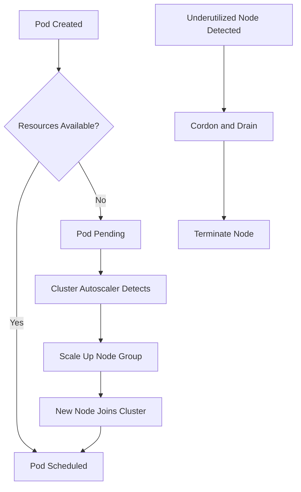

# How to Configure EKS Cluster Autoscaler

Author: [nawazdhandala](https://github.com/nawazdhandala)

Tags: AWS, EKS, Kubernetes, Autoscaling, DevOps

Description: Step-by-step guide to configuring the Kubernetes Cluster Autoscaler on Amazon EKS for automatic node scaling based on workload demands.

---

Running a fixed number of nodes in your EKS cluster is wasteful. During peak hours, you don't have enough capacity. During off-hours, you're paying for nodes sitting idle. The Cluster Autoscaler solves this by automatically adjusting the number of nodes based on pending pods and resource utilization.

This guide walks through setting up the Cluster Autoscaler on EKS, tuning it for your workloads, and avoiding the common pitfalls that trip people up.

## How the Cluster Autoscaler Works

The Cluster Autoscaler watches for pods that can't be scheduled due to insufficient resources. When it finds unschedulable pods, it calculates which node group can accommodate them and triggers a scale-up. For scale-down, it identifies nodes that are underutilized (below 50% resource usage by default) and safely drains and terminates them.



## Prerequisites

Before setting up the Cluster Autoscaler, you'll need:

- An EKS cluster with managed node groups (see our [cluster creation guide](https://oneuptime.com/blog/post/2026-02-12-create-eks-cluster-with-eksctl/view))
- kubectl configured for your cluster
- Node groups with Auto Scaling Groups that have appropriate min/max settings

## Step 1: Create the IAM Policy

The Cluster Autoscaler needs permissions to describe and modify Auto Scaling Groups. Create a policy with these permissions.

```json
{
  "Version": "2012-10-17",
  "Statement": [
    {
      "Effect": "Allow",
      "Action": [
        "autoscaling:DescribeAutoScalingGroups",
        "autoscaling:DescribeAutoScalingInstances",
        "autoscaling:DescribeLaunchConfigurations",
        "autoscaling:DescribeScalingActivities",
        "autoscaling:DescribeTags",
        "autoscaling:SetDesiredCapacity",
        "autoscaling:TerminateInstanceInAutoScalingGroup",
        "ec2:DescribeLaunchTemplateVersions",
        "ec2:DescribeInstanceTypes",
        "ec2:DescribeImages",
        "ec2:GetInstanceTypesFromInstanceRequirements",
        "eks:DescribeNodegroup"
      ],
      "Resource": "*"
    }
  ]
}
```

Save this as `cluster-autoscaler-policy.json` and create the IAM policy:

```bash
# Create the IAM policy for Cluster Autoscaler
aws iam create-policy \
  --policy-name ClusterAutoscalerPolicy \
  --policy-document file://cluster-autoscaler-policy.json
```

## Step 2: Create an IAM Role for Service Account (IRSA)

The recommended approach is to use IRSA to grant the Cluster Autoscaler pod the necessary permissions. This avoids attaching broad permissions to all nodes.

```bash
# Create the IRSA role for Cluster Autoscaler
eksctl create iamserviceaccount \
  --cluster=my-cluster \
  --namespace=kube-system \
  --name=cluster-autoscaler \
  --attach-policy-arn=arn:aws:iam::123456789012:policy/ClusterAutoscalerPolicy \
  --approve \
  --override-existing-serviceaccounts
```

For more details on IRSA, check out our [IRSA setup guide](https://oneuptime.com/blog/post/2026-02-12-set-up-iam-roles-for-eks-service-accounts-irsa/view).

## Step 3: Deploy the Cluster Autoscaler

Deploy the Cluster Autoscaler using the official manifest. Make sure to match the version to your Kubernetes cluster version.

```bash
# Download the Cluster Autoscaler manifest
curl -o cluster-autoscaler-autodiscover.yaml \
  https://raw.githubusercontent.com/kubernetes/autoscaler/master/cluster-autoscaler/cloudprovider/aws/examples/cluster-autoscaler-autodiscover.yaml
```

Before applying, you need to edit the manifest. Update the cluster name and add recommended annotations.

Here's the key deployment section you should modify:

```yaml
# Cluster Autoscaler deployment configuration
apiVersion: apps/v1
kind: Deployment
metadata:
  name: cluster-autoscaler
  namespace: kube-system
  labels:
    app: cluster-autoscaler
spec:
  replicas: 1
  selector:
    matchLabels:
      app: cluster-autoscaler
  template:
    metadata:
      labels:
        app: cluster-autoscaler
      annotations:
        cluster-autoscaler.kubernetes.io/safe-to-evict: "false"
    spec:
      serviceAccountName: cluster-autoscaler
      containers:
        - image: registry.k8s.io/autoscaling/cluster-autoscaler:v1.29.0
          name: cluster-autoscaler
          resources:
            limits:
              cpu: 100m
              memory: 600Mi
            requests:
              cpu: 100m
              memory: 600Mi
          command:
            - ./cluster-autoscaler
            - --v=4
            - --stderrthreshold=info
            - --cloud-provider=aws
            - --skip-nodes-with-local-storage=false
            - --expander=least-waste
            - --node-group-auto-discovery=asg:tag=k8s.io/cluster-autoscaler/enabled,k8s.io/cluster-autoscaler/my-cluster
            - --balance-similar-node-groups
            - --skip-nodes-with-system-pods=false
```

Apply the manifest:

```bash
# Deploy the Cluster Autoscaler
kubectl apply -f cluster-autoscaler-autodiscover.yaml
```

## Step 4: Verify the Deployment

Check that the autoscaler pod is running and look at its logs:

```bash
# Verify the Cluster Autoscaler is running
kubectl get pods -n kube-system -l app=cluster-autoscaler

# Check the autoscaler logs
kubectl logs -n kube-system -l app=cluster-autoscaler --tail=50
```

You should see log entries about the autoscaler discovering your node groups and performing its scaling checks.

## Tuning the Autoscaler

The default settings work for most cases, but you'll likely want to tune a few parameters.

**Scale-down delay** controls how long a node must be underutilized before it's removed:

```yaml
# Add these flags to the container command
- --scale-down-delay-after-add=10m      # Wait 10 min after a scale-up
- --scale-down-delay-after-delete=10s   # Wait 10s after a node deletion
- --scale-down-unneeded-time=10m        # Node must be unneeded for 10 min
```

**Scale-down utilization threshold** determines what counts as "underutilized":

```yaml
# Node is eligible for scale-down if utilization is below 50%
- --scale-down-utilization-threshold=0.5
```

**Expander strategy** controls how the autoscaler chooses which node group to scale:

- `least-waste` - picks the group that would have the least idle resources after scaling (good default)
- `random` - picks randomly (good for testing)
- `most-pods` - picks the group that can schedule the most pending pods
- `priority` - uses a priority-based config map

## Ensuring Proper ASG Tags

Your Auto Scaling Groups must have the right tags for auto-discovery to work. If you created your cluster with eksctl, these should already be set:

```
k8s.io/cluster-autoscaler/enabled = true
k8s.io/cluster-autoscaler/my-cluster = owned
```

If they're missing, add them:

```bash
# Tag your ASG for Cluster Autoscaler discovery
aws autoscaling create-or-update-tags --tags \
  ResourceId=eks-my-nodegroup-abc123,ResourceType=auto-scaling-group,Key=k8s.io/cluster-autoscaler/enabled,Value=true,PropagateAtLaunch=true \
  ResourceId=eks-my-nodegroup-abc123,ResourceType=auto-scaling-group,Key=k8s.io/cluster-autoscaler/my-cluster,Value=owned,PropagateAtLaunch=true
```

## Testing the Autoscaler

Deploy a workload that requests more resources than currently available to trigger a scale-up:

```yaml
# test-scale-up.yaml - Deploy pods to test autoscaling
apiVersion: apps/v1
kind: Deployment
metadata:
  name: scale-test
spec:
  replicas: 50
  selector:
    matchLabels:
      app: scale-test
  template:
    metadata:
      labels:
        app: scale-test
    spec:
      containers:
        - name: pause
          image: registry.k8s.io/pause:3.9
          resources:
            requests:
              cpu: "500m"
              memory: "512Mi"
```

```bash
# Apply the test deployment and watch the autoscaler respond
kubectl apply -f test-scale-up.yaml
kubectl get pods -w
```

Watch the autoscaler logs to see it detect the pending pods and scale up your node groups. After you delete the deployment, it should eventually scale back down.

## Cluster Autoscaler vs. Karpenter

The Cluster Autoscaler has been the standard for years, but AWS now recommends [Karpenter](https://oneuptime.com/blog/post/2026-02-12-use-karpenter-for-eks-node-provisioning/view) for new clusters. Karpenter is generally faster at provisioning nodes and more flexible with instance type selection. However, the Cluster Autoscaler is still a solid choice - it's battle-tested, well-documented, and works with any Kubernetes cluster, not just EKS.

If you're setting up a new cluster from scratch, consider Karpenter. If you have existing infrastructure built around Auto Scaling Groups, the Cluster Autoscaler is the simpler path.

## Monitoring the Autoscaler

You should monitor the autoscaler to make sure it's working correctly. It exposes Prometheus metrics that you can scrape with your [monitoring stack](https://oneuptime.com/blog/post/2026-02-12-set-up-prometheus-and-grafana-on-eks/view):

```bash
# Check autoscaler status via the configmap it updates
kubectl get configmap cluster-autoscaler-status -n kube-system -o yaml
```

Key metrics to watch include `cluster_autoscaler_scaled_up_nodes_total`, `cluster_autoscaler_scaled_down_nodes_total`, and `cluster_autoscaler_unschedulable_pods_count`. These tell you how actively the autoscaler is working and whether there are pods stuck in pending.

Getting the Cluster Autoscaler right means your cluster responds to demand automatically, saving money during quiet periods and ensuring capacity when you need it most.
